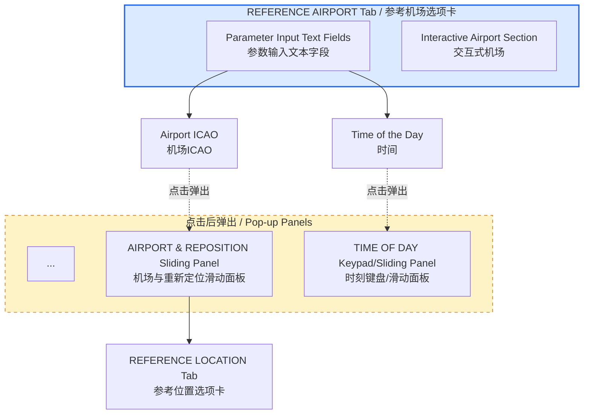

# HTML 生成规范与转换规则

> 基于 1.2.1 ~ 1.2.5（LESSON PLAN / DOCS / CURRENT CONDITIONS / AIRCRAFT / REFERENCE AIRPORT Tab）的生成实践与踩坑复盘整理。
> 目标：确保后续所有章节的 HTML 输出在结构、风格、准确性上保持一致。
> 整理时间：2026-05-30，最后更新：2026-06-10（V3.0 — 全局 CSS 剥离重构）

---

## 1. 文件输出路径规则

| 文件类型 | 输出路径 | 说明 |
|---------|---------|------|
| HTML 页面 | `output/html/ch{章}_{节}_{小节}_{english_title}.html` | 最终交付物，直接输出至此 |
| 配图资源 | `output/html/images/` | 所有配图统一归集到此处，HTML 内引用 `./images/xxx.jpg` |

**章节编号映射规则：**
- HTML 文件名与导航树中的章号**保持一致**，而非直接照搬 `A320.md` 的原始章号
- 当前项目中 `A320.md` 的「第 2 章 软件操作」在 HTML 导航树中显示为「第 1 章 软件操作」，因此对应文件名前缀为 `ch1_2_x`，而非 `ch2_2_x`
- 后续若补充生成「第 1 章 教员台系统组成」的 HTML，需统一回溯调整所有已生成文件的章号前缀

**禁止事项：**
- 禁止在根目录创建分散的图片或缓存目录

---

## 2. HTML 构建架构（Template + Python）

> ⚠️ **重大变更（2026-06-10）**：导航 sidebar 已从「每个 HTML 内联硬编码」重构为「Template + Python 脚本动态生成」。
> 旧模式（每新增一页需回溯修改所有历史文件的 sidebar）已彻底废弃。

### 2.1 文件职责边界

| 文件/目录 | 职责 | 是否手动编辑 | 说明 |
|----------|------|------------|------|
| `output/html/pages/*.html` | **页面片段（源文件）** | ✅ 是 | 只包含该页面的 **特有** `style` + `正文` + `script`。严禁包含全局样式（如 `:root`、`.sidebar`、`.content` 基础排版等） |
| `output/html/template.html` | **公共骨架模板** | ⚠️ 仅调整占位符 | 由 `build.py` 读取，定义页面骨架与占位符（`{{GLOBAL_STYLES}}`、`{{PAGE_STYLES}}`、`{{SIDEBAR}}` 等） |
| `output/html/static/global.css` | **全局公共样式** | ⚠️ 仅调整主题/布局 | 定义 `:root` 变量、布局骨架（`.sidebar`、`.nav-*`、`.breadcrumb`）、基础排版（`.content h1~h4`、表格、页脚导航）、响应式媒体查询。由 `build.py` 统一注入所有页面 |
| `output/html/build.py` | **构建脚本** | ⚠️ 仅配置 | 自动扫描 `pages/` 目录，读取 `global.css`，批量生成完整 HTML |
| `output/html/ch*.html` | **生成产物** | ❌ 否 | 运行 `python build.py` 后自动生成/覆盖，**禁止手动修改** |

### 2.2 新增页面的标准流程

```bash
# 1. 在 pages/ 下新建页面片段（文件名决定章节层级）
#    ch1_9_new_feature.html  → 一级条目：1.9
#    ch1_2_8_new_sub.html    → 二级条目：1.2.8（自动归入 1.2 分组）

# 2. 页面片段内容格式
<style>
  /* 该页面特有的样式（可选） */
</style>

<h1>1.X 章节标题</h1>
<p class="subtitle">副标题...</p>

<!-- 正文内容 -->

<script>
  /* 该页面特有的脚本（可选） */
</script>

# 3. 运行构建脚本（自动完成导航注入、active 高亮、面包屑、分组折叠）
python output/html/build.py

# 4. 验证生成的 output/html/ch1_9_new_feature.html
```

### 2.3 新增分组的配置方法

若新增二级分组（如未来出现 `2.1 系统配置` 且包含多个子页面），在 `build.py` 顶部的 `NAV_GROUPS` 字典中添加一行：

```python
NAV_GROUPS = {
    "ch1_2": "1.2 控制面板工作区",
    "ch2_1": "2.1 系统配置",  # ← 新增分组
}
```

**叶子节点永远零配置**，自动扫描 `pages/` 目录并按文件名排序。

### 2.4 构建脚本的标题提取优先级

`build.py` 按以下顺序提取页面标题：
1. **优先**：正文中的 `<h1>` 标签文本
2. **兜底**：`build.py` 中 `PAGE_TITLE_FALLBACKS` 字典的硬编码映射
3. **最终回退**：文件名（不带扩展名）

### 2.5 旧模式遗留注意事项

- 现有 `output/html/ch*.html` 已全部由 `build.py` 重新生成
- 若发现某页面内容异常，**应修改 `pages/` 下的源文件后重新运行 `build.py`**，而非直接修改 `output/html/` 下的生成文件（修改会被下次构建覆盖）

### 2.6 全局 CSS 与页面特有样式的职责边界（V3.0 新增）

**全局样式（`static/global.css`）已包含以下内容，页面片段中严禁重复定义：**

| 类别 | 包含的选择器 | 说明 |
|------|-------------|------|
| CSS 变量 | `:root` | 主题色、阴影、圆角、布局尺寸等全部变量 |
| 基础重置 | `*`, `html`, `body`, `a` | 盒模型、字体、背景色、链接色 |
| 布局骨架 | `.layout`, `.sidebar`, `.sidebar-header`, `.nav-*`, `.main`, `.breadcrumb` | 侧边栏、导航树、面包屑的全部样式 |
| 基础排版 | `.content`, `.content h1~h4`, `.content p`, `.content ul/ol`, `.content li`, `.content blockquote`, `.content code/pre` | 内容区域的基础字体、边距、颜色 |
| 表格基础 | `table`, `th,td`, `tr:hover`, `tr:last-child` | 表格宽度、边框、表头渐变、悬停效果 |
| 页脚导航 | `.footer-nav`, `.footer-nav a`, `.footer-nav .prev/.next` | 页面底部上一页/下一页导航 |
| 滚动条 | `::-webkit-scrollbar*` | 自定义滚动条样式 |
| 响应式 | `@media print`, `@media (max-width:768px)` | 打印适配与移动端适配（仅限全局布局） |

**页面片段 `<style>` 中只应保留以下特有样式：**

- 该页面**独有**的组件（如 ch1_1 的 `.arch-block`、`.arch-grid`、`.highlight-box`）
- 该页面使用的**可选组件**（如 `.img-block`、`.img-row`、`.img-zoom-overlay`、`.mermaid`、`.collapsible`、`.tag-*`）
- 该页面**特有**的 @media 规则（如 ch1_2_4 的 `.img-grid` 响应式断点）
- 对全局样式的**合理覆盖**（但应使用更具体的选择器，避免直接覆盖全局选择器）

**反面示例（❌ 不要这样做）：**

```html
<style>
  /* 错误：这些全局样式已存在于 static/global.css，不需要重复 */
  :root{ --primary:#2563eb; }
  .sidebar{ width:280px; }
  .content h1{ font-size:32px; }
  .nav-link{ color:var(--text-secondary); }

  /* 正确：只保留页面特有的样式 */
  .my-custom-component{ ... }
</style>
```

**新建页面时的样式决策流程：**

1. 检查 `static/global.css` — 确认你需要的选择器是否已存在
2. 如果已存在，**不要**在页面片段中重复定义
3. 如果不存在，判断它是"全局通用"还是"页面特有"
   - 如果是全局通用（如新增了一种按钮样式 `.btn-primary`），应添加到 `static/global.css`
   - 如果是页面特有（如 ch1_X 的专属图表样式），保留在页面片段的 `<style>` 中

### 2.7 build.py 配置项说明

| 配置项 | 位置 | 用途 | 修改频率 |
|--------|------|------|----------|
| `NAV_GROUPS` | `build.py` 顶部 | 定义无独立页面的二级分组标题 | 新增二级分组时 |
| `CHAPTER_TITLES` | `build.py` 顶部 | 定义章节号与导航顶层标题映射 | 新增章节时 |
| `PAGE_TITLE_FALLBACKS` | `build.py` 顶部 | 无 `<h1>` 页面的标题兜底 | 极少使用（建议所有页面都写 `<h1>`） |

---

## 3. 图片处理规则

### 2.1 自动查找，禁止手动占位
- HTML 中**不允许**出现 `[图片占位]` 提示
- 自动从以下两个来源查找配图：
  1. 版面分析 MD（`reference/CAE IOS使用手册.md`）中的图片引用
  2. 图片库（`reference/images/`）
- 找到后自动复制到 `output/html/images/`，并生成正确的相对路径引用

### 2.2 格式与命名
- **保留原始扩展名**（通常是 `.jpg`），不要强行改为 `.png`
- HTML 中引用格式：``
- 图片命名规范：`ch{章}_{节}_{小节}_{描述}.jpg`

### 2.3 图片显示尺寸与点击放大交互
- **默认显示限制**：`.img-block img` 必须设置 `max-height: 360px` + `width: auto`，避免大尺寸原始图直接撑满屏幕
- **点击放大**：点击图片后弹出全屏遮罩（`position: fixed` overlay），以原始尺寸展示，最大不超过视口 90%（`max-width: 90vw; max-height: 90vh`）
- **滚轮缩放**：放大状态下支持鼠标滚轮缩放，缩放范围 **0.5x ~ 5x**
- **拖拽平移**：放大状态下支持按住鼠标左键拖拽平移图片
- **关闭方式**：点击遮罩背景关闭；**拖拽过程中不触发关闭**（需通过 `mousedown`/`mousemove`/`mouseup` 区分点击与拖拽，移动像素阈值 ≥ 3px）
- **悬停反馈**：鼠标移入时图片轻微放大（`scale(1.02)`），光标变为 `zoom-in`，提示可点击
- **实现方案**：纯 CSS + JS 事件委托，不创建新 DOM 节点复制图片，直接复用 `src` 生成 `` 放入遮罩层；遮罩层底部显示提示文案「滚轮缩放 / 拖拽平移 / 点击关闭」

#### 2.3.1 图片放大 JS 实现约束（踩坑记录）

| 维度 | 错误写法 | 正确写法 | 说明 |
|------|---------|---------|------|
| 关闭事件判断 | `e.target.classList.contains('img-zoom-overlay')` | `e.target.closest('.img-zoom-overlay')` 或给 overlay 绑定 `click` 事件 | 点击图片时事件目标是遮罩层内部的 ``，不是 overlay div 本身，导致 `classList.contains` 判断失败，用户点击图片本体无法关闭 |
| 事件绑定方式 | 逐个 `img` 元素绑定 `onclick` | `document.addEventListener('click', ...)` 事件委托 | 避免异步加载或动态插入图片时遗漏绑定 |
| 滚轮缩放 | ❌ 缺失 `wheel` 事件监听 | 必须为 `.img-zoom-overlay` 绑定 `wheel` 事件，调整 `dataset.scale` 并同步更新 `transform: translate(...) scale(...)` | 缺少滚轮缩放时，用户无法进一步查看图片细节 |
| 拖拽平移 | ❌ 缺失 `mousedown`/`mousemove`/`mouseup` 监听 | 记录起始坐标与当前偏移，通过 `transform: translate(x,y) scale(s)` 实现 Pan | 缺少拖拽时，大图超出视口的部分无法浏览 |
| 点击 vs 拖拽 | ❌ 点击 overlay 即关闭，未区分拖拽 | 拖拽位移超过 3px 时设置 `imgIsDragging = true`，`mouseup` 时若处于拖拽状态则不关闭 | 拖拽结束后立即关闭遮罩会造成极差的交互体验 |

**参考实现**（已验证通过）：请直接查阅 `output/html/ch1_6_map_workspace.html` 中的 `<script>` 图片放大区块（该文件为当前项目内唯一完整实现滚轮缩放 + 拖拽平移 + 点击关闭的标杆）。

### 2.4 onerror 占位处理
- 生成 HTML 时直接写入本地图片路径
- 删除所有 `onerror="this.parentElement.innerHTML='...'"` 的占位回退代码

---

## 3. HTML 页面结构模板

每个 HTML 页面按**「静态认知层 → 动态推导层 → 验证层」**的顺序组织，章节数根据内容取舍：

```
一、功能层级与界面总览          ← 静态架构层
  ├─ 1.1 功能层级结构（Mermaid graph TD）
  │   └─ 用 subgraph 区分 Main（直接可见）与 Popups（点击弹出）
  │   └─ 实线箭头表示包含关系，虚线箭头表示触发关系
  └─ 1.2 界面结构（表格：区域/控件 | 位置 | 功能说明）

二、核心功能详解                ← 静态属性层（方案A：复杂面板自带子流程图）
  ├─ 2.N 主界面参数字段速览
  │   └─ 只写"这是什么、点击后弹出什么"，详见 2.M
  ├─ 2.M 滑动面板/键盘详述
  │   ├─ 文字属性表格（输入范围 | 边界行为 | 联动）
  │   └─ 子流程图/状态机（复杂面板必须内嵌，见下方判定标准）
  └─ ...

三、全局操作流程与推导          ← 动态推导层（连续动线）
  ├─ 3.1 [章节名]中教员核心操作流程（flowchart LR）
  │   └─ 原 1.2 后移至此，避免与静态架构层穿插
  ├─ 3.2 通用状态机/流程图
  ├─ 3.3 关联依赖与异常边界
  │   ├─ 3.3.1 关联依赖表格
  │   └─ 3.3.2 异常边界表格
  └─ 3.4 数据流与开发流程推导
      ├─ 3.4.1 数据流（代码块或流程图）
      └─ 3.4.2 API 接口契约建议表格

四、测试要点
  └─ 测试场景表格

五、变更记录
  └─ 日期 | 版本 | 变更内容
```

### 3.1 页面框架（head + nav + main + footer）
- 标题：`<title>章节号 中文标题（英文标题）— CAE IOS 教员台</title>`
- 面包屑：首页 / 第 X 章 / X.X 节 / 当前小节
- 侧边栏导航：完整第2章层级树，当前页面 `active`
- 页脚导航：`prev` ← 上一小节 | 下一小节 → `next`

---

### 3.2 功能层级图 Mermaid 画法规范

功能层级图位于「一、1.1 功能层级结构」，用于表达软件界面的**可见层级**与**触发关系**。

#### 3.2.1 核心原则：区分"直接包含"与"点击弹出"

| 关系类型 | 语义 | Mermaid 表达方式 | 线型 |
|---------|------|-----------------|------|
| **直接包含** | 模块直接存在于父界面上，无需点击即可见 | 实线箭头 `-->` | 实线 |
| **触发弹出** | 点击主界面字段后弹出滑动面板/键盘 | 虚线箭头 `-.->` + 标注 `点击弹出` | 虚线 |

**常见错误**：把原始手册的**文档章节结构**（9.1、9.2、9.3 平级）直接套成**界面层级结构**。原始手册从文档编写角度将每个功能模块独立成章，但功能层级图应表达**软件界面的实际层级**——滑动面板/键盘不是 Tab 的直接子节点，而是点击参数字段后的弹出层。

#### 3.2.2 正确的图结构（subgraph 分组法）

使用 `subgraph` 将界面分为两个区域：

```
┌─────────────────────────────────────────┐
│  Main（主界面直接可见）                  │
│  ├── Parameter Input Text Fields         │
│  └── Interactive Airport Section         │
│                                          │
│  ┌─────────────────────────────────┐    │
│  │ Popups（点击后弹出）             │    │  ← 虚线边框
│  │  ├── AIRPORT & REPOSITION       │    │
│  │  ├── SURFACE WIND               │    │
│  │  └── ...                        │    │
│  └─────────────────────────────────┘    │
└─────────────────────────────────────────┘
```

**Mermaid 参考写法**：



**规范要点**：
1. **根节点只指向直接可见模块**：`Tab` → `Parameter Input Text Fields` + `Interactive Airport Section`
2. **弹出层用 subgraph 包裹**：命名为 `点击后弹出 / Pop-up Panels`，并设置虚线边框 `stroke-dasharray: 5 5`
3. **弹出层节点不再有实线父节点**：面板节点仅通过虚线箭头与参数字段关联
4. **面板内部结构保留实线**：面板内部的选项卡/子功能仍用实线表示包含关系

#### 3.2.3 中英对照标注规范

所有 Mermaid 节点统一采用 **English 在上、中文在下** 的双行格式，便于与原始手册对照：

```mermaid
C[AIRPORT & REPOSITION Sliding Panel<br>机场与重新定位滑动面板]
C1[REFERENCE LOCATION Tab<br>参考位置选项卡]
```

---

### 3.3 功能点详述的分层解耦规则（防重复）

当某个功能存在**主界面入口字段**与**点击后弹出的详细面板/键盘**两层界面时，必须按以下分层组织，禁止同一属性在多处分述：

| 层级 | 职责 | 允许写入的内容 | 禁止写入的内容 |
|------|------|--------------|--------------|
| **主界面字段速览**（如 3.x 参数字段） | 说明"这是什么、在哪里、点击后弹出什么" | 功能定义、位置、交互方式（点击弹出 XX 面板/键盘） | 输入范围、边界条件、状态反馈、联动关系 |
| **面板/键盘详述**（如 3.xx 滑动面板/键盘） | 完整描述弹出后的属性、边界、流转 | 输入范围、边界行为、状态流转、联动、截图 | 重复描述主界面字段的"点击后弹出"逻辑 |

**跨层引用方式**：
- 主界面字段表格中通过 `（详见 3.xx）` 指向下级详述
- 面板/键盘详述表格首行必须写明触发方式：`点击主界面 XX 参数字段弹出`

**复杂面板判定标准**（满足以下任一条件即必须内嵌子流程图/状态机）：

| 条件类型 | 说明 | 案例 |
|---------|------|------|
| 存在状态流转 | 面板内部有明确的状态变化路径 | ICING：预位黄 → 激活红 |
| 存在多步骤操作流程 | 操作涉及多个步骤、条件判断或分支 | SLEW：选选项卡 → 改参数 → 校验边界 → 执行/放弃 → 冻结判断 |
| 存在多组互斥逻辑 | 多组按钮/选项各自内部互斥，且组间可组合 | TURBULENCE：三种类型 × 轻/中/重度，外加 Clear All |

**示例（正确 vs 错误）**：

```
❌ 错误（重复）：
  2.9 A/C Wind 表格中写"风向范围 1°~360°、飞行冻结渐变"
  2.16 飞机风键盘 表格中又写一遍"风向范围 1°~360°、飞行冻结渐变"

✅ 正确（分层）：
  2.9 A/C Wind 表格只写：
    - 功能定义：主界面字段，显示当前飞机位置的风向和风速
    - 交互方式：点击字段 → 弹出飞机风键盘（详见 2.16）

  2.16 飞机风键盘 表格写：
    - 触发方式：点击主界面"A/C Wind"参数字段弹出
    - 风向范围：1° ~ 360°
    - 边界行为：飞行冻结未激活时立即渐变...
```

---

### 3.4 核心功能面板操作流程图规范

每个主要滑动面板（Sliding Panel）或复杂键盘（Keypad）在完成属性表格详述后，**必须**附带一个横向操作流程图（`flowchart LR`），以直观呈现用户从打开面板到完成操作的完整动线。

#### 强制配图判定标准

满足以下条件之一的模块，必须在文末补充流程图：

| 条件 | 说明 | 案例 |
|------|------|------|
| 存在多步骤操作流程 | 操作涉及多个步骤、条件判断或分支 | SLEW：选选项卡 → 改参数 → 校验边界 → 执行/放弃 → 冻结判断 |
| 存在状态流转 | 面板内部有明确的状态变化路径 | ICING：预位黄 → 激活红 |
| 存在多组互斥逻辑 | 多组按钮/选项各自内部互斥，且组间可组合 | TURBULENCE：三种类型 × 轻/中/重度 |
| 存在多种操作入口 | 同一面板内包含多个并列功能入口 | Data Link：Log / Connection Control 两个选项卡 |

#### 图表规范

| 维度 | 要求 |
|------|------|
| **图表类型** | 操作流程图统一使用 `flowchart LR`（横向布局），**禁止**使用 `flowchart TD`（纵向布局）描述操作动线；<br>层级结构图（如父子节点树形关系）允许使用 `flowchart TB`（自上而下），但不得用于描述连续操作流程 |
| **命名格式** | `N.N 中文名（英文名 Flow）`，如 `2.3.3 数据链操作流程（Data Link Flow）` |
| **插入位置** | 紧跟在该面板最后一个属性表格或子章节之后、下一个同级 h3 之前 |
| **复杂度控制** | 只描述"用户从打开面板到完成操作"的主干路径，不展开底层数据流；数据流推导统一归至「三、全局操作流程与推导」章节 |
| **样式规范** | 沿用 2_2_4 配色：`Start` 节点 `#dbeafe` / `#2563eb`，`End` 节点 `#d1fae5` / `#059669`，异常分支 `#fee2e2` / `#dc2626`，可选分支 `#fef3c7` / `#d97706` |

#### 例外与豁免

| 类型 | 说明 |
|------|------|
| **主界面参数字段速览** | 如 2.1 参数输入文本字段总览，仅做入口索引，不单独配图 |
| **简单键盘（无复杂分支）** | 如 GW Keyboard、A/C Wind Keypad，若只有「输入 → 确认」单一路径，可省略 |
| **纯状态机面板** | 如已内嵌 `stateDiagram-v2` 的面板，可同时保留状态图和流程图（两者职责不同：状态机描述状态跃迁，流程图描述操作动线） |

---

### 3.5 1.1 功能层级结构与第三章全局操作流程的职责边界与绘制规范

本节明确「一、1.1 功能层级结构」与「三、全局操作流程与推导」的**职责边界**、**图类型强制要求**及**常见反模式**，确保静态架构层与动态推导层严格解耦。

#### 3.5.1 职责边界：静态架构 vs 动态流程

| 维度 | 1.1 功能层级结构 | 第三章 全局操作流程与推导 |
|------|------------------|---------------------------|
| **本质** | 静态架构图（What） | 动态流程图（How） |
| **视角** | 空间/组成视角：「这个选项卡由哪些模块构成」 | 时间/动作视角：「教员如何一步步完成操作」 |
| **图类型** | `graph TD`（自上而下树状层级） | 3.1 用 `flowchart LR`（从左到右动作流）；3.2 用 `stateDiagram-v2` |
| **核心内容** | 模块分组、参数隶属关系、点击后弹出的面板映射 | 入口 → 决策分支 → 子流程展开 → 生效/异常处理 |
| **是否含边界/异常** | 否，只展示「有什么」 | 是，包含校验、飞行冻结、超出范围等状态流转 |

#### 3.5.2 1.1 功能层级图绘制红线

**虚线箭头语义规范**：

1.1 中的虚线箭头（`-.->`）**只能**描述「参数/视图 → 面板」的**静态映射关系**，禁止携带动作后果语义：

| 允许 | 禁止 | 说明 |
|------|------|------|
| `点击弹出` | `点击执行` | 「点击执行」描述用户动作后果，属于动态流程 |
| `点击切换` | `点击结束` | 「点击结束」同样是动作后果 |
| `选中显示` | — | 描述步骤类型与显示区域的静态关联 |

**常见错误**：在 1.1 中画 `D5 -.->|点击执行| B1b` 或 `D6 -.->|点击结束| A`，这是**动作语义越界**，必须移至第三章。

#### 3.5.3 第三章 3.1 全局操作流程图绘制规范

**强制要求：连贯主干路径**

第三章 3.1 必须使用**「单主干 + 决策分支」**结构，禁止「多入口并列发散」：

| 结构类型 | 说明 | 正确示例 | 错误示例 |
|---------|------|---------|---------|
| 单主干 + 决策分支 | 从 Start 出发，经过至少一个顶层决策点，再分流到各子流程 | `Start → Select{决策点} → 分支A/分支B → 子流程 → End` | — |
| 多入口并列发散 | Start 同时分叉到多个入口子图，各自独立走向 End | — | `Start → 入口区（多个按钮并列）→ 多个子流程并列 → End` |

**各文件标杆结构参考**：

| 文件 | 主干路径 |
|------|---------|
| ch1_2_1 | `Start → PHASE_FLOW → S1 → STEP_TYPE → D1 → DETAIL_FLOW → C_MODE → CONTROL_FLOW → End` |
| ch1_2_2 | `Start → VIEW_MODE{选择浏览方式} → 各入口 → 子流程 → End` |
| ch1_2_3 | `Start → View → Select{选择修改项} → State/Env → Panel → 子流程 → Apply → End` |
| ch1_2_4 | `Start → OP_TYPE{选择操作类型} → 各入口 → 子流程 → Apply → End` |
| ch1_2_5 | `Start → A{选择操作类型} → B/C/D/E/F → 分支步骤 → End` |

**绘制要素检查清单**：

| 要素 | 要求 | 说明 |
|------|------|------|
| **Start 节点** | 必须有 | `Start([进入 XXX Tab])` |
| **End 节点** | 必须有 | `End([训练就绪/完成])` |
| **顶层决策点** | 必须有 | 如 `选择操作类型{...}`、`选择浏览方式{...}`、`选择修改项{...}` |
| **子流程内部决策** | 视功能而定 | 如 `校验边界{通过/不通过}`、`课程完成?{是/否}` |
| **循环/重复** | 视功能而定 | 如 Autorun 的自循环、Step-by-Step 的逐次执行 |
| **异常/回退** | 建议有 | 如 `SLEW_ERR → View`、`C_ABORT → End`、`Discard → End` |
| **汇聚点** | 必须有 | 各子流程最终统一汇聚到 `Apply` 或 `End` |
| **子流程标题** | 必须标注章节归属 | 如 `Data Link 面板流程 — 2.3`、`搜索流程 — 2.4` |

#### 3.5.4 第三章 3.2 状态机规范

**强制要求**：每个 HTML 的第三章**必须**包含一个 `stateDiagram-v2` 状态机（3.2 节），描述该选项卡核心操作的通用状态流转。

| 文件 | 状态机主题 |
|------|-----------|
| ch1_2_1 | 课程执行通用状态机 |
| ch1_2_2 | 文档浏览通用状态机 |
| ch1_2_3 | 参数修改通用状态机 |
| ch1_2_4 | 故障生命周期通用状态机 |
| ch1_2_5 | 参数修改通用状态机 |

**状态机核心状态模板**：

```
[*] → 空闲状态 → 面板打开中 → 值已修改 → 参数生效中 → 生效完成 → [*]
```

必须包含：
- **正常流转路径**：空闲 → 打开 → 修改 → 生效 → 完成
- **取消/回退分支**：打开中 → 空闲、修改 → 空闲
- **特殊状态**（视功能而定）：如联动覆盖中、飞行冻结中、重新定位执行中

#### 3.5.5 第三章整体结构模板

```markdown
## 三、全局操作流程与推导

### 3.1 [Tab名] 教员核心操作流程全景图
- `flowchart LR`，单主干 + 决策分支
- 纵向 subgraph 展开，标题标注对应 2.X 子章节

### 3.2 [主题] 通用状态机
- `stateDiagram-v2`
- 包含正常流转 + 取消回退 + 特殊状态
- 必须附带「状态说明」表格

### 3.3 关联依赖与异常边界
- 3.3.1 关联依赖表格
- 3.3.2 异常边界表格

### 3.4 数据流与开发流程推导（可选）
- 3.4.1 数据流
- 3.4.2 API 接口契约建议
```

---

## 4. 内容准确性红线

### 4.1 禁止编造
- **严禁**在表格中写入原始文档（A320.md / CAE IOS使用手册.md）没有明确提及的信息
- 例如：界面分区位置、按钮的具体像素坐标、未在原文中出现的控件名称
- 如果原始文档没有描述某个信息，**宁可写"待确认"或删除该行，也不要猜测**

### 4.2 位置描述必须基于截图
- "一、1.2 界面结构"表格中的**位置列**必须基于实际截图分析
- 生成前先用浏览器打开 HTML 或原图，**逐按钮核对后再填写位置**
- 禁止凭"通用文档阅读器布局"脑补位置（如"底部导航栏""右下角缩放"）

### 4.3 互斥功能不要独立成章
- 如果两个功能只是按钮互斥（如缩略图视图 vs 列表视图），**不要为"切换逻辑"单独创建章节**
- 互斥关系在各自功能的属性表格中用一句话说明即可：
  - `与列表视图**互斥**，两者只能激活其一`
- 不要画独立的 Mermaid 图来讲"切换逻辑"

### 4.4 Mermaid 图禁用 Emoji 图标
- Mermaid 节点内**只使用纯文字**，禁止放入 Emoji（如 🔍、🖼️、⛶）
- Emoji 容易与实际 UI 图标不一致，造成误导
- 允许使用文字描述 + 颜色填充（`style`）来区分节点类型

### 4.5 逐句覆盖原则（核心铁律）

**问题定义**：生成 HTML 时，容易将原文的多句描述"概括"为一句，导致关键细节、限定条件、警告/注意信息丢失。此类缺失具有**系统性**和**隐蔽性**——单看 HTML 似乎通顺，但与原文逐句比对时会发现大量漏洞。

**强制要求**：
1. **原文中任何带有具体数值、操作步骤、条件判断、例外条款、警告/注意/注释的句子，必须在 HTML 中有对应呈现**，禁止以"概括性描述"替代。
2. **禁止省略原文中的"注意""例外""当…时""除非""无论…"等限定从句**，这些往往是系统安全边界的核心信息。
3. **禁止将原文的并列枚举合并为概括性短语**。例如原文列举"干燥跑道、跑道上有橡胶、跑道粗糙度 2"，禁止概括为"跑道参数重置"。
4. **生成后必须执行"逐句回溯"**：以段落为单位，将原文与 HTML 并排比对，确保原文的每个信息点在 HTML 中都有落点。

**典型错误案例**（来自 ch1_2_7 的踩坑记录）：

| 原文（11.1 飞行冻结） | 错误写法 | 缺失信息 |
|----------------------|---------|---------|
| 重要的是要理解，当飞行冻结激活时，点击飞行冻结切换按钮以停用飞行冻结模式不会导致剧烈的操纵或运动变化：**无论自动驾驶是否激活，且与解冻时的操纵位置无关。** | 解冻时不会导致剧烈控制或运动变化 | 遗漏两个关键安全限定条件 |
| **注意：**在飞行冻结期间，大多数模拟飞机系统不受影响，并继续响应机组操作和故障插入，但冻结的高度和位置参数的影响除外。 | （完全缺失） | 缺失系统行为边界说明 |
| 当碰撞抑制激活时，**着陆时下降率过大的触发阈值会提高**，以允许更硬的着陆，同时仍保持上述保护功能。 | （完全缺失） | 缺失碰撞抑制激活时的动态阈值调整机制 |

**正确做法**：原文中的每个句子都视为一个"信息原子"，不允许在翻译/转换过程中发生"核裂变"（一句变多句可以，多句变一句禁止）。

---

## 5. 导航与层级规范

### 5.1 侧边栏结构
- 有子章节的父节点必须用 `nav-group` + `nav-toggle` + `nav-children` 包裹
- 确保同级子章节（如 2.1.1 和 2.2.1）的缩进层级完全一致
- 默认状态：当前章节展开，其他同级章节折叠（`collapsed`）

### 5.2 当前页面标记
- 当前页面对应的 `nav-link` 必须有 `class="nav-link active"`
- 面包屑最后一项为纯文本（不加链接）

### 5.3 页脚导航
- `prev`：指向上一小节 HTML（如 2.2.2 的 prev 是 2.2.1）
- `next`：指向下一小节 HTML（如 2.2.2 的 next 是 2.2.3，若未生成为 `#` 占位）

### 5.4 导航生成机制（已自动化）

> **重要变更（2026-06-10）**：导航 sidebar 已由 `build.py` 脚本**全自动生成**，不再需手动回溯修改历史 HTML 文件。

**旧模式（已废弃）**：每新增一页需手动修改所有已有 HTML 的 sidebar，维护成本 O(N)。
**新模式**：新增页面只需丢进 `pages/` 目录，运行 `python build.py`，脚本自动：
1. 扫描 `pages/` 目录下所有页面片段
2. 按文件名推导章节层级与分组关系
3. 为**每个**页面生成完整的 sidebar HTML
4. **自动设置当前页 `active` 高亮**
5. **自动展开当前页所在分组**，折叠其他分组
6. **自动生成面包屑导航**

**唯一需要手动配置的场景**：新增虚拟分组（如 `2.1 系统配置` 下有多个子页面但无独立 HTML）。此时在 `build.py` 顶部的 `NAV_GROUPS` 字典中添加分组标题即可，叶子节点零配置。

**父节点展开状态一致性**：
- 当前页面所在的父级节点（如 1.2 控制面板工作区）**禁止**添加 `collapsed` 类，其子级 `nav-children` 也**禁止**添加 `collapsed` 类，确保用户进入页面时当前章节默认展开
- 其他同级父节点（如 1.1 组成部分）**应**添加 `collapsed` 类，其子级 `nav-children` 也**应**添加 `collapsed` 类，确保默认折叠
- 所有已生成文件在同一章节的展开/折叠状态必须**完全一致**（由 `build.py` 保证）

---

## 6. 表格样式规范

### 6.1 "一、1.2 界面结构"表格
| 列 | 要求 |
|----|------|
| 区域/控件 | 中文名称 + 英文名称（br换行） |
| 位置 | 必须基于截图，如"顶部工具栏（最左侧）" |
| 功能说明 | 简明扼要，一句话概括 |

### 6.2 "核心功能详解"属性表格
| 属性 | 说明 |
|------|------|
| 功能定义 | 一句话定义 |
| 呈现方式/交互方式 | 如何展示、如何操作 |
| 边界行为/边界条件 | 极限状态下的行为 |
| 与其他功能关系 | **互斥/依赖/联动关系一句话说明** |

---

## 7. Mermaid 图表交互规范（点击放大 / 滚轮缩放 / 拖拽平移）

### 7.1 需求背景

Mermaid.js 在 HTML 中渲染的 SVG 流程图尺寸受限于正文容器宽度，复杂结构图在页面上显示过小。因此所有 HTML 页面的 Mermaid 图表必须支持**点击放大、滚轮缩放、按住拖拽**的交互能力。

**核心约束**：本项目 HTML 文件通常在 `file://` 协议下直接双击打开（本地离线浏览），**严禁触发浏览器的同源安全（CORS）错误**。

### 7.2 方案演进与结论

| 轮次 | 方案 | 结果 | 失败原因 |
|------|------|------|----------|
| 1 | 模态框 + `innerHTML` 复制 SVG | ❌ 报错 | `file://` 协议下，`innerHTML` 序列化含 `<foreignObject>` 的 SVG 会触发 `Unsafe attempt to load URL` frame 同源阻断 |
| 2 | 模态框 + `cloneNode(true)` 克隆 SVG | ❌ 报错 | 同上，DOM 克隆后仍触发 frame 安全限制 |
| 3 | 模态框 + `Blob URL` + `` 加载 | ❌ 显示小方块 | `file://` 协议下 blob URL 被浏览器阻止加载 |
| **4** | **CSS 直接放大原始 `.mermaid` 元素** | ✅ 通过 | **不创建新 DOM 节点、不克隆 SVG、不生成任何 URL**，仅给现有元素添加 CSS 类切换 `position: fixed` + `transform` |

**结论**：在 `file://` 协议下，任何涉及"创建新 DOM 节点并复制/引用 SVG 内容"的方案都会踩到同源安全限制。**唯一可行路线是纯粹 CSS 状态切换**。

### 7.3 交互行为与参考实现

1. **点击图表** → 原始 `.mermaid` 元素切换为 `position: fixed`，居中放大至 `90vw × 90vh`
2. **滚轮滚动** → SVG 通过 `transform: scale()` 平滑缩放（范围 `0.3x ~ 5x`）
3. **按住鼠标左键拖动** → SVG 通过 `transform: translate()` 平移，实现 Pan 浏览
4. **点击黑色遮罩层** 或按 **ESC** → 移除放大状态，恢复原状

**参考实现**：请直接查阅以下已验证通过的 HTML 文件中的 `<style>` 与 `<script>` 区块：
- `output/html/ch1_2_1_lesson_plan_tab.html`
- `output/html/ch1_2_2_doc_tab.html`
- `output/html/ch1_2_3_current_conditions_tab.html`
- `output/html/ch1_6_map_workspace.html`（含最新的图片放大交互：滚轮缩放 + 拖拽平移 + 点击关闭）

**关键实现要点**：
- **事件委托**：使用 `document.addEventListener('click', ...)` 而非逐个元素绑定，规避 Mermaid 异步渲染时机问题
- **passive: false**：滚轮事件必须显式声明，否则 `preventDefault()` 无效，页面会随滚轮一起滚动
- **不创建新节点**：全程只操作现有 `.mermaid` 元素和遮罩层 `div`，不触碰 SVG 内部结构
- **transform 叠加**：通过 `translate(x,y) scale(s)` 矩阵实现 Pan + Zoom 的组合变换

### 7.4 Mermaid 语法禁忌与踩坑记录

| 图表类型 | 禁忌字符 | 失败表现 | 正确写法 | 案例来源 |
|---------|---------|---------|---------|---------|
| `stateDiagram-v2` | 冒号 `:`（位于 transition label 内部） | `Syntax error in text` | 用"时""则"等连词替代 | 2.2.3 中 `冻结未激活:立即生效` → `冻结未激活时立即生效` |
| `stateDiagram-v2` | 斜杠 `/`（位于 transition label 内部） | 可能解析异常或显示截断 | 用"或""与"替代 | 2.2.3 中 `点击确认/Slew` → `点击确认或Slew` |
| `stateDiagram-v2` | Emoji 图标 | 部分渲染器直接报错或显示为方框 | 纯文字描述 | 2.2.1 中 `📋 LESSON PLAN Tab` → `LESSON PLAN Tab` |
| `graph TD` / `flowchart` | Emoji 图标 | 同上报错 | 纯文字描述 | 2.2.1 功能层级结构图 |

**核心原则**：Mermaid 的 transition label（`状态A --> 状态B : label`）中，冒号 `:` 是**语法分隔符**，label 内部一旦出现第二个冒号，解析器会误判边界。斜杠 `/` 虽非严格语法字符，但在不同 Mermaid 版本中存在兼容风险，统一禁用。

---

## 8. 生成后复审规范（Redline Review）

### 8.1 复审触发条件
每次生成或修改 HTML 后，必须执行一次红线条目复审，不可跳过。

### 8.2 复审范围（必查项）

| 复审维度 | 检查方法 | 合格标准 |
|---------|---------|---------|
| **数值型参数** | 对照 `A320.md` 与原始手册，逐条核对表格中的默认值、范围、单位 | 所有百分比、阈值、动态范围必须与原文一致，不得遗漏 |
| **按钮/控件状态** | 检查每个功能点的"呈现方式/交互方式"与"边界行为" | 必须明确：正常态 → 激活态 → 结果态的完整流转 |
| **互斥关系** | 检查所有标为"互斥"的功能是否在属性表格中说明 | 必须写明互斥对象与切换条件 |
| **图片完整性** | 打开 HTML 用浏览器逐张检查 | 无 `[图片占位]`，无 `onerror` 回退，路径为 `./images/xxx.jpg` |
| **层级结构一致性** | 检查 Mermaid 图与正文功能点数量是否一一对应 | Mermaid 节点数 ≥ 正文功能点数 |
| **逐句覆盖检查** | 逐段并排比对 `A320.md` / `CAE IOS使用手册.md` 原文与 HTML 正文，以"信息原子"粒度核对 | 原文中每个句子都必须在 HTML 中有对应落点；禁止将多句原文合并为一句概括；"注意/例外/当…时/除非/无论…"等限定从句必须完整保留 |

### 8.3 缺陷处理优先级

| 优先级 | 缺陷类型 | 处理方式 |
|-------|---------|---------|
| P0（阻断） | 核心功能数值/默认值丢失；图片缺失；按钮状态流转缺失 | 必须立即修正并重新生成 |
| P1（严重） | 互斥关系未说明；边界条件缺失；层级节点遗漏 | 必须补充 |
| P2（一般） | 措辞不准确；格式不统一；非核心描述省略 | 可在批量优化时统一修正 |

### 8.4 复盘模板（示例）

```
【复审发现】2.2.3 当前条件选项卡 — 晴空湍流（CLEAR AIR）
- 缺失项：
  1. 轻度/中度/重度按钮的默认设置值（33% / 66% / 100%）未在属性表格中体现
  2. 对应截图未复制到 output/html/images/，导致 HTML 中图片丢失
- 根因：生成时 LLM 对二级菜单表格中的参数进行了概括性省略
- 修正：补充「边界行为」行：轻度=33%，中度=66%，重度=100%；补充图片引用
```

---

## 9. 测试要点定位

- 测试要点是**给后续开发和测试验收准备的验收标准（Acceptance Criteria）**
- 包含：正向路径、异常路径、边界条件、联动测试、性能测试
- 如果用户希望更"纯粹"（只保留面向教员的内容），可折叠或移至独立测试文档

---

## 10. Git 提交规范

```
[新增]: 生成2.2.x xxx HTML，自动匹配图片资源
[修正]: 对照图1实际截图校正2.2.x界面结构位置描述
[修复]: 修正侧边栏导航层级对齐问题
```

- Commit 使用中文
- 正文列出具体变更点
- 结尾固定格式：`Co-Authored-By: Claude Opus 4.8 <noreply@anthropic.com>`

---

## 11. 执行 Checklist（每次生成前自检）

- [ ] 已读取 A320.md 对应章节原始内容
- [ ] 已读取 `CAE IOS使用手册.md` 对应章节的图片引用
- [ ] 图片已自动从图片库复制到 `output/html/images/`
- [ ] HTML 中无 `[图片占位]`，图片路径为 `./images/xxx.jpg`
- [ ] 图片默认显示已限制尺寸（`max-height: 360px`），点击放大交互已添加（**必须包含滚轮缩放 + 拖拽平移**，参考实现见 `ch1_6_map_workspace.html`）
- [ ] "一、1.2 界面结构"的位置描述基于实际截图，非脑补
- [ ] Mermaid 图中无 Emoji 图标
- [ ] 互斥功能未独立成章，仅在表格中一句话说明
- [ ] 侧边栏层级对齐，当前页面 `active`
- [ ] 当前页面所在父级节点（如 1.2）**无** `collapsed` 类，默认展开；其他同级父节点有 `collapsed` 类，默认折叠
- [ ] 页脚 prev/next 链接正确
- [ ] **运行 `python build.py` 重新生成所有页面**：新增页面片段放入 `pages/` 后，必须运行构建脚本，确保所有历史页面的 sidebar 自动同步更新
- [ ] **已执行生成后复审（Redline Review）**，数值型参数、按钮状态流转、图片完整性已逐条核对
- [ ] **已执行逐句覆盖检查**：将原文与 HTML 并排逐段比对，确保原文的每个信息点（数值、步骤、条件、例外、警告/注意/注释）在 HTML 中均有对应落点，无概括性省略

---

## 12. 变更记录

| 日期 | 版本 | 变更内容 |
|------|------|----------|
| 2026-05-30 | V1.0 | 基于 2.2.1、2.2.2 生成实践，整理 HTML 生成规范与转换规则 |
| 2026-06-01 | V1.1 | 新增第 7 章：Mermaid 图表交互规范（点击放大 / 滚轮缩放 / 拖拽平移），记录方案演进与踩坑指南 |
| 2026-06-02 | V1.2 | 精简第 7 章：将大段 CSS/JS 代码替换为参考实现指引，降低文档冗余；新增第 8 章「生成后复审规范（Redline Review）」；Checklist 追加复审项 |
| 2026-06-02 | V1.3 | 新增第 3.3 节「功能点详述的分层解耦规则（防重复）」，基于 2.2.3 去重实践经验，明确主界面字段速览与面板/键盘详述的职责边界与跨层引用方式 |
| 2026-06-02 | V1.4 | 新增第 7.4 节「Mermaid 语法禁忌与踩坑记录」，记录 stateDiagram-v2 transition label 中禁止使用冒号 `:`、斜杠 `/` 及 Emoji 的规范，附案例来源 |
| 2026-06-02 | V1.5 | 重构第 3 章 HTML 页面结构模板：<br>1. 由「九大章节」改为「静态认知层 → 动态推导层 → 验证层」三层架构；<br>2. 功能层级图必须标注触发关系（点击后弹出 XX 面板）；<br>3. 1.2 核心操作流程图后移至第三章，避免静态/动态穿插；<br>4. 复杂面板必须内嵌子流程图/状态机；<br>5. 统一规范章节编号为阿拉伯数字 |
| 2026-06-02 | V1.6 | 文档结构重组：删除「部分」标题，改为完全连续的章节编号（1~12），核心规范（1~6、7~8）在前，配套工具（9~11）与文档管理（12）在后，消除编号跳跃 |
| 2026-06-02 | V1.7 | 新增第 3.4 节「核心功能面板操作流程图规范」，基于 2.2.4 实践总结：强制判定标准（多步骤/状态流转/互斥逻辑/多入口）、统一 `flowchart LR` 横向布局、命名格式与配色样式、例外豁免条款（主界面速览/简单键盘/纯状态机面板） |
| 2026-06-02 | V1.8 | 1. 补充第 1 章「章节编号映射规则」：明确 HTML 文件名与导航树章号一致（`ch1_2_x`），而非直接照搬 A320.md 原始章号；<br>2. 新增第 2.3 节「图片显示尺寸与点击放大交互」：默认 `max-height: 360px`、点击全屏放大、`ESC` 关闭、悬停反馈；<br>3. 修正第 3.4 节图表类型说明：操作流程图必须用 `flowchart LR`，层级结构图允许用 `flowchart TB`；<br>4. 更新第 7.2 节参考文件路径：`ch2_2_x` → `ch1_2_x`；<br>5. 第 11 章 Checklist 追加「图片默认尺寸限制 + 点击放大交互」检查项 |
| 2026-06-03 | V1.9 | 新增第 2.3.1 节「图片放大 JS 实现约束（踩坑记录）」：明确关闭事件判断禁止使用 `e.target.classList.contains('img-zoom-overlay')`（点击图片本体无法关闭），必须使用 `e.target.closest('.img-zoom-overlay')` 或给 overlay 绑定 `click` 事件；同步修复 ch1_2_1 ~ ch1_2_4 四个历史文件 |
| 2026-06-03 | V2.0 | 1. 新增第 5.4 节「导航链接回溯更新规则（防遗漏）」：明确每生成新章节后必须回溯更新所有历史 HTML 的侧边栏导航链接，禁止遗留 `#` 占位符；明确父节点 `collapsed` 类的展开/折叠一致性规则；<br>2. 第 11 章 Checklist 追加两项：「父级节点无 collapsed 类默认展开」与「导航链接回溯更新」 |
| 2026-06-03 | V2.1 | 1. 文档头部描述更新为「基于 1.2.1 ~ 1.2.5 生成实践与踩坑复盘整理」；<br>2. 重构第 3 章结构：将「页面框架」明确为 3.1 节，**新增 3.2 节「功能层级图 Mermaid 画法规范」**，系统阐述 subgraph 分组法、实线与虚线的语义区分、中英对照标注规范；<br>3. 修正第 7.3 节参考实现文件列表，追加 `ch1_2_5_reference_airport_tab.html` 作为最新参考实现 |
| 2026-06-04 | V2.2 | 1. **新增 3.5 节「1.1 功能层级结构与第三章全局操作流程的职责边界与绘制规范」**：明确 1.1（graph TD 静态架构）与第三章（flowchart LR 动态流程 + stateDiagram-v2 状态机）的职责边界、虚线箭头语义红线、连贯主干路径强制要求、状态机规范及整体结构模板；<br>2. 同步修正 ch1_2_1 / ch1_2_2 / ch1_2_4 / ch1_2_5 四个历史文件，消除 1.1 动作语义越界、补齐缺失状态机、统一主干路径风格 |
| 2026-06-05 | V2.3 | 1. **新增 4.5 节「逐句覆盖原则（核心铁律）」**：针对 ch1_2_7 中 2.1/2.2 出现的系统性概括省略问题，明确禁止将多句原文合并为一句概括，要求原文中每个信息原子（数值、步骤、条件、例外、警告/注意/注释）在 HTML 中均有对应落点；附典型错误案例（飞行冻结安全限定条件、碰撞抑制动态阈值等）；<br>2. **强化 8.2 复审范围**：将"重要细节不缺失"升级为"逐句覆盖检查"，要求以"信息原子"粒度核对；<br>3. **Checklist 追加"逐句覆盖检查"独立勾选项**；<br>4. **同步修复 ch1_2_7 中 2.2 Resets 描述缺失问题**：补充 Environment 重置的跑道粗糙度 2/无雷声/无风暴云/时间加速因子重置/CAVOK 警告、ISA 中间与上层温度、Systems 温度不重置的例外条件、Session 重置的 RAAS/地面摩擦/GATES/地图和航迹轨迹/飞行情景捕获/快照、Crash Inhibit 的未激活行为与动态阈值、Crash 的咨询性/常规碰撞分类行为与 30 秒豁免规则等大量原文细节 |
| 2026-06-08 | V2.4 | 1. **强化第 2.3 节「图片显示尺寸与点击放大交互」**：明确放大后必须支持滚轮缩放（0.5x~5x）、拖拽平移、点击关闭且需区分点击与拖拽（阈值 ≥ 3px），遮罩层底部必须显示提示文案「滚轮缩放 / 拖拽平移 / 点击关闭」；<br>2. **扩展第 2.3.1 节「图片放大 JS 实现约束」**：新增滚轮缩放、拖拽平移、点击 vs 拖拽三条约束，补充错误/正确写法与说明；<br>3. **修正参考实现**：将图片放大参考实现从 `ch1_2_5_reference_airport_tab.html` 更正为 `ch1_6_map_workspace.html`（后者为唯一完整实现滚轮 + 拖拽 + 关闭的标杆）；<br>4. **Checklist 强化**：图片放大检查项追加「必须包含滚轮缩放 + 拖拽平移」；<br>5. **批量修复 11 个历史文件**：ch1_2_1 ~ ch1_2_7、ch1_3、ch1_4、ch1_5、ch1_7 统一补齐完整图片放大交互，消除简化版实现 |
| 2026-06-10 | V2.5 | 1. **重构 HTML 构建架构（Template + Python）**：废弃「每页内联硬编码 sidebar」模式，改为「`pages/` 页面片段 + `template.html` 骨架 + `build.py` 自动构建」；新增第 2 章完整阐述构建架构、文件职责边界、新增页面标准流程、新增分组配置方法、标题提取优先级；<br>2. **重写第 5.4 节**：将「导航链接回溯更新规则（防遗漏）」改为「导航生成机制（已自动化）」，明确旧模式已废弃，导航由 `build.py` 全自动生成；<br>3. **更新 Checklist**：将「导航链接回溯更新」替换为「运行 `python build.py` 重新生成所有页面」；<br>4. **批量重构 13 个历史文件**：提取正文到 `pages/` 目录，统一由 `build.py` 重新生成，彻底解决 O(N) 维护噩梦 |
