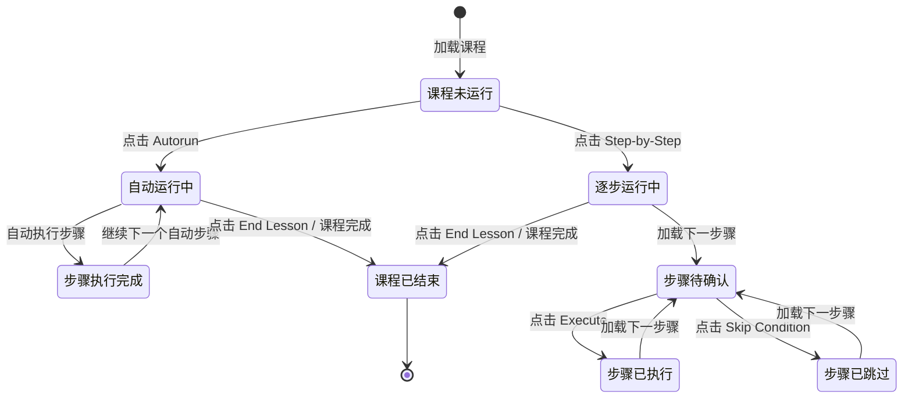

# 2.2.1 课程计划选项卡（LESSON PLAN Tab）细化整理

> 原始手册对应章节：## 5. LESSON PLAN Tab（第 451~570 行）
> 整理时间：2026-05-30
> 整理目标：将功能点拆解到三级粒度，明确触发方式、状态流转、关联依赖、异常边界

---

## 一、功能总览

| 属性 | 说明 |
|------|------|
| **选项卡名称** | 课程计划（LESSON PLAN Tab） |
| **所在工作区** | 控制面板工作区（Control Board Workspace） |
| **核心目的** | 让教员查看、管理和执行训练课程（Lesson），支持自动运行和逐步运行两种模式 |
| **课程来源** | 所有课程均通过 **CAE Slick 基于网页的课程计划编辑器** 创建（详见 TPD 19709 Slick 用户指南） |
| **界面分区** | 左侧「课程大纲」+ 右侧「课程步骤详情」+ 顶部「控制按钮栏」 |

### 1.1 教员可执行的核心操作

1. **查看** IOS 上所有可用的课程
2. **查看** 某课程的所有训练阶段（Training Phases）
3. **查看** 某课程阶段内的所有步骤（Lesson Steps）
4. **自动运行（Autorun）** 已设置为自动运行的课程步骤
5. **逐步运行（Step-by-Step）** 课程步骤，每步需教员确认后执行
6. **执行（Execute）** 当前选中的单个课程步骤
7. **跳过条件（Skip Condition）** 跳过与特定步骤关联的条件
8. **结束课程（End Lesson）** 终止当前正在运行的课程

---

## 二、界面结构

```
┌─────────────────────────────────────────────────────────────┐
│  LESSON PLAN Tab                                            │
├──────────────────────────┬──────────────────────────────────┤
│                          │                                  │
│  【课程大纲】             │  【课程步骤详情】                 │
│  Lesson Outline          │  Lesson Step Details             │
│                          │                                  │
│  ├─ 训练阶段 1           │  （可滚动区域，显示当前选中步骤   │
│  │   ├─ 步骤 A (NOTE)    │   的详细参数和说明）              │
│  │   ├─ 步骤 B (SIM)     │                                  │
│  │   └─ 步骤 C (MALF)    │                                  │
│  ├─ 训练阶段 2           │                                  │
│  │   ├─ 步骤 D (Freeplay)│                                  │
│  │   └─ 步骤 E (Nested)  │                                  │
│  └─ ...                  │                                  │
│                          │                                  │
├──────────────────────────┴──────────────────────────────────┤
│  【控制按钮栏】                                              │
│  [Autorun] [Step-by-Step] [Go to Current] [Skip Condition]   │
│  [Execute] [End Lesson]                                      │
└─────────────────────────────────────────────────────────────┘
```

---

## 三、课程大纲（Lesson Outline）

### 3.1 训练阶段（Training Phases）

| 属性 | 说明 |
|------|------|
| **定义** | 课程可按阶段结构化组织，以匹配飞行的各个阶段或培训任务 |
| **创建方式** | 由教员在 CAE Slick 编辑器中定义 |
| **示例** | 地面操作阶段 → 起飞阶段 → 爬升阶段 → 巡航阶段 → 进近阶段 → 着陆阶段 |
| **层级关系** | 一个课程包含多个训练阶段，每个训练阶段包含多个课程步骤 |

### 3.2 课程步骤（Lesson Steps）

插入到训练阶段中的步骤可分为以下 **5 种类型**：

| 步骤类型 | 英文标识 | 图标颜色 | 功能说明 | 交互性质 |
|----------|----------|----------|----------|----------|
| **注释** | NOTE | 灰色/白色 | 只读步骤，向教员提供信息或提示 | 只读，无需执行 |
| **模拟条件** | SIM | 绿色 | 执行单条或多条指令，改变模拟器状态 | 可执行 |
| **故障** | MALF | 红色 | 插入一个故障及所有故障触发条件 | 可执行（触发故障） |
| **自由操作按钮** | Freeplay | 蓝色 | 触发预编程的操作或一组操作，可在课程任意时间触发 | 可执行 |
| **嵌套课程** | Nested Lesson | 紫色 | 连接或链接到另一个课程 | 可执行（跳转） |

#### 3.2.1 步骤标识规则

- 在课程大纲中，每个步骤左侧显示对应类型的 **图标标识**（如 NOTE、SIM、MALF）
- 自由操作按钮和嵌套课程没有固定的阶段序号，因为它们可在课程中的任意时间触发

---

## 四、课程步骤详情（Lesson Step Details）

| 属性 | 说明 |
|------|------|
| **显示区域** | 选项卡右侧的可滚动区域 |
| **内容** | 显示当前选中步骤的详细参数、说明、触发条件等 |
| **交互** | 教员可上下滚动查看每个步骤的详细信息 |
| **联动** | 点击课程大纲中的某个步骤 → 右侧详情区自动显示该步骤详情 |

---

## 五、控制按钮栏（Lesson Plan Tab Buttons）

### 5.1 按钮总览

| 按钮 | 英文名称 | 按钮类型 | 功能说明 | 触发方式 | 前置条件 | 异常/边界 |
|------|----------|----------|----------|----------|----------|-----------|
| **自动运行** | Autorun | Action Button（瞬时动作） | 运行已设置为自动运行的课程步骤 | 单击触发 | 课程已加载且存在可自动运行的步骤 | 无自动运行步骤时按钮状态？（待确认） |
| **逐步运行** | Step-by-step | Action Button（瞬时动作） | 按逐步方式运行课程步骤，每步需教员确认 | 单击触发 | 课程已加载 | 课程未运行时首次点击进入逐步模式 |
| **调到当前** | Go to Current | Action Button（瞬时动作） | 在课程步骤详情部分显示当前课程步骤 | 单击触发 | 课程正在运行 | 无当前步骤时可能禁用 |
| **跳过条件** | Skip Condition | Action Button（瞬时动作） | 跳过与特定课程步骤关联的条件 | 单击触发 | 当前步骤有关联条件 | 无条件时禁用或无效 |
| **执行** | Execute | Action Button（瞬时动作） | 执行当前课程步骤 | 单击触发 | 已选中某个步骤 | 未选中步骤时禁用 |
| **结束课程** | End Lesson | Action Button（瞬时动作） | 结束当前课程 | 单击触发 | 课程正在运行 | 课程未运行时禁用 |

### 5.2 状态流转图（逐步运行模式）



### 5.3 自动运行 vs 逐步运行对比

| 对比维度 | 自动运行（Autorun） | 逐步运行（Step-by-Step） |
|----------|---------------------|--------------------------|
| **执行方式** | 系统自动依次执行 | 每步需教员手动点击 Execute |
| **教员干预** | 无需干预 | 必须确认后才能执行下一步 |
| **适用场景** | 标准化流程、重复性训练 | 需要教员评估或调整的场景 |
| **步骤类型限制** | 仅执行标记为自动运行的步骤 | 执行所有步骤 |
| **异常处理** | 按预设逻辑自动处理 | 教员可决定跳过或修改 |

---

## 六、课程创建与编辑（背景说明）

### 6.1 编辑器工具

- **工具名称**：CAE Slick 基于网页的课程计划编辑器
- **参考文档**：TPD 19709 Slick 用户指南
- **访问方式**：基于网页（Web-based）

### 6.2 可添加的课程元素

| 元素类型 | 说明 |
|----------|------|
| **注释（Notes）** | 向教员提供信息的只读文本 |
| **模拟器条件（Simulator Conditions）** | 改变模拟器状态的指令集 |
| **故障（Malfunctions）** | 定义故障类型、触发条件、参数值 |
| **自由操作按钮（Freeplay Button）** | 预编程的操作或操作集，可随时触发 |

### 6.3 与 IOS 的关系

- 编辑器创建的课程保存后，自动出现在 IOS 控制面板的课程计划选项卡中
- 教员在 IOS 上只能**执行**课程，不能**编辑**课程（编辑需在 Slick 编辑器中完成）

---

## 七、关联依赖与异常边界

### 7.1 关联依赖

| 功能点 | 依赖项 | 依赖说明 |
|--------|--------|----------|
| 课程计划选项卡 | CAE Slick 编辑器 | 课程数据源，无课程则选项卡为空 |
| 执行步骤（SIM） | 模拟器核心系统 | 步骤指令需模拟器响应才能生效 |
| 执行步骤（MALF） | 故障系统（8.12） | 触发故障需与故障滑动面板联动 |
| 结束课程 | 课程计划剖面工作区（2.5） | 结束课程后，课程计划剖面工作区同步更新状态 |
| 课程执行状态 | 控制面板底部 Footer（2.2.7） | 课程运行状态可能在 Footer 有指示 |

### 7.2 异常边界

| 场景 | 预期行为 |
|------|----------|
| IOS 上无可用课程 | 课程大纲区域显示为空，控制按钮禁用或隐藏 |
| 课程执行过程中模拟器冻结 | 课程执行暂停，解冻后恢复或需重新执行 |
| 教员点击 End Lesson | 立即停止课程执行，返回课程选择状态或主界面 |
| 步骤执行失败（模拟器未响应） | 可能显示错误提示，教员可重试或跳过 |

---

## 八、数据流与开发流程推导

### 8.1 数据流（课程执行）

```
教员点击 Execute
    ↓
IOS 发送课程步骤执行请求（步骤ID + 参数）
    ↓
模拟器核心系统解析步骤指令
    ↓
根据步骤类型执行不同操作：
    ├─ NOTE → 仅显示信息，无状态变更
    ├─ SIM → 修改模拟器参数（高度/速度/环境等）
    ├─ MALF → 调用故障系统，激活/预位故障
    ├─ Freeplay → 触发预编程操作集
    └─ Nested → 加载并跳转至子课程
    ↓
模拟器返回执行结果
    ↓
IOS 更新界面状态（步骤标记为已完成、加载下一步骤）
```

### 8.2 状态机设计建议

| 状态 | 说明 | 转换条件 |
|------|------|----------|
| **IDLE** | 空闲状态，课程未运行 | 加载课程 → READY |
| **READY** | 课程已加载，等待启动 | 点击 Autorun → AUTO_RUNNING；点击 Step-by-Step → STEP_RUNNING |
| **AUTO_RUNNING** | 自动运行中 | 自动步骤执行完成 → AUTO_RUNNING（下一步）或 COMPLETED |
| **STEP_RUNNING** | 逐步运行中，等待教员确认 | 点击 Execute → STEP_EXECUTING |
| **STEP_EXECUTING** | 正在执行当前步骤 | 执行成功 → STEP_RUNNING（下一步）；执行失败 → STEP_ERROR |
| **STEP_ERROR** | 步骤执行失败 | 点击重试 → STEP_EXECUTING；点击 Skip → STEP_RUNNING（下一步） |
| **COMPLETED** | 课程执行完成 | 自动返回 IDLE 或等待教员操作 |
| **ABORTED** | 课程被中断（End Lesson） | 返回 IDLE |

### 8.3 API 接口契约建议

| 接口 | 方法 | 请求字段 | 响应字段 |
|------|------|----------|----------|
| `getAvailableLessons` | GET | - | `lessonList: [{id, name, phases[]}]` |
| `getLessonDetail` | GET | `lessonId` | `phases: [{phaseId, name, steps: [{stepId, type, params}]}]` |
| `executeStep` | POST | `lessonId, stepId, mode(auto/step)` | `status, message, nextStepId?` |
| `skipCondition` | POST | `lessonId, stepId` | `status, nextStepId` |
| `endLesson` | POST | `lessonId` | `status` |

---

## 九、测试要点

| 测试类型 | 测试场景 |
|----------|----------|
| **正向路径** | 加载课程 → 自动运行 → 所有步骤正常执行 → 课程完成 |
| **正向路径** | 加载课程 → 逐步运行 → 逐一点击 Execute → 课程完成 |
| **异常路径** | 无课程时，确认所有控制按钮禁用 |
| **异常路径** | 执行过程中点击 End Lesson，确认课程立即终止 |
| **边界条件** | 课程仅包含 NOTE 步骤，确认无需要执行的指令 |
| **边界条件** | 课程包含嵌套课程，确认嵌套课程正常加载和返回 |
| **联动测试** | 执行 MALF 步骤后，确认故障滑动面板显示对应故障状态 |

---

## 十、变更记录

| 日期 | 版本 | 变更内容 |
|------|------|----------|
| 2026-05-30 | V0.1 | 完成课程计划选项卡的细化整理，包含功能总览、界面结构、步骤类型、控制按钮、状态流转、数据流推导、API建议、测试要点 |
