A320 Neo

XR Product

Instructor Operating Station

Instructor User Guide

PROPRIETARY NOTICE: This document, including the information contained herein, is confidential and/or proprietary to CAE Inc., and shall not be reproduced or disclosed in whole or in part, or used for any purpose whatsoever without the prior written authorization of CAE Inc.

## Contact Information

CAE Inc., 8585 Cote de Liesse, Montreal, Quebec, Canada, H4T 1G6

CAE Inc.

www.cae.com

## Customer Services

caextranet.cae.com

Trademarks and/or registered trademarks of CAE Inc. and/or its affiliates include but are not limited to CAE, CAE & Design, CAE Atmos, Atmos, CAE Exos, Exos, CAE Ionos, Ionos, CAE Lithos, Lithos, CAE Mesos, Mesos, CAE Stratos, Stratos, CAE Tropos, Tropos, CAE ROSE, ROSE, CAELIB, CAE Medallion, Medallion, CAE Medallion-S, Medallion-S,CAE Simfinity, Simfinity, CAE ITEMS, ITEMS, CAE RAVE, RAVE, CAE STRIVE, STRIVE, CAE TIGERS, TIGERS, and ROTORSIM. All other brands and product names are trademarks or registered trademarks of their respective owners. All logos, tradenames and trademarks referred to and used herein remain the property of their respective owners and may not be used, changed, copied, altered, or quoted without the written consent of the respective owner. All rights reserved.

CAE Inc. Confidential and/or Proprietary Information – see title page

## List of Tables

1. Intro Board Workspace
2. Table 1 Control Board Interface Elements . . 18
3. LESSON PLAN Tab
4. DOCS Tab
5. CURRENT CONDITIONS Tab
6. AIRCRAFT Tab
7. REFERENCE AIRPORT Tab
   10.INSTRUCTOR STATION Sliding Panel
   11.Control Board Footer
   12.Maintenance Pages
   13.INSTRUMENT REPEATER Workspace
   14.Lesson Plan Profile Workspace
   15.Map Workspace
   16.Advanced
   Table 2 Parameters Recalled. . 294

## 1. Introduction

The Instructor Operating Station (IOS) includes all the tools necessary to control the simulator training environment and monitor all aspects of crew performance in the simulator.

This user guide provides information on the standard product instructor station configuration and IOS System. Features of any particular device may have differences from the details provided herein.

Before browsing through this guide, please refer to the Simulator Safety Equipment Manual for all safety related information.

## 2. On-board Instructor Station Configuration

The IOS consists of two touch-sensitive color displays, simulator controls and accessories, all integrated into a comfortable ergonomic seat, referred to as the Forward-Facing Instructor Operator Station (FFIOS).

The strategically positioned FFIOS allows for unobstructed visibility on the cockpit, and easy access to all simulator controls while maintaining optimal ergonomics.

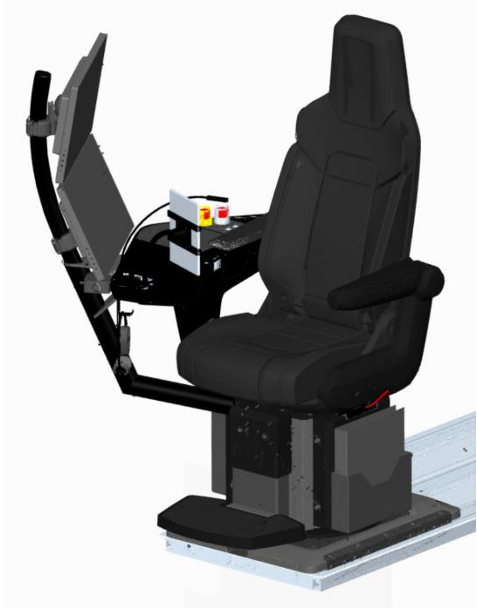
Figure 1 On-Board Instructor Station (Typical)

## 3. IOS Software Interface

This user centric designed IOS has a task centric interface that can adapt quickly to the user’s intended goal, present relevant functionality and required procedures.

This IOS is used to control and monitor training sessions. It provides the instructor with the tools to:

Monitor and assess crew performance.

• Monitor and modify aircraft and environment properties and parameters.

Control the simulator and exercises.

## 3.1 IOS Workspaces

The IOS Software Interface consists of the following IOS Workspaces:

Control Board

o Includes all parameters relating to the ownship.

o Is the main access to ownship parameters.

o Allows values to be changed directly on a panel.

▪ For example, adjusting fuel weights.

o Includes sliding panels

▪ For example, to activate and arm malfunctions.

o Includes a common footer

▪ Providing quick access to common commands.

## Map

o Includes elements relating to the environment.

o Features 2D/3D Map viewable modes.

o Includes environment features such as storms, Navaids stations and simulated intruders or traffic.

o Displays takeoff/approach/runway and aircraft trail and FMS route.

## • Lesson Plan Profile

o Includes all elements relating to a lesson.

o Monitors and controls lesson execution.

o Shows the lessons created in the lesson plan editor.

o Allows the instructor to automatically execute a step instead of entering individual commands.

• Instruments Repeaters

o Allows the instructor to choose which cockpit instrument(s) will be repeated or displayed on an IOS display screen.

Maintenance

o Offers pages that allows maintenance personnel to perform various simulator maintenance tasks.

• Advanced

o Features quick access buttons allowing the instructor to:

▪ Modify Aircraft, Position and Environment parameters.

▪ Perform various types of freeze and resets.

Trigger failures.

▪ Access additional pages

Changing the current IOS workspace is performed through a Workspace button on the Control Board footer. Tapping this button displays a Workspace rollup menu that shows all available workspaces.

## 3.2 User Interface (UI) Controls

The IOS Software Interface includes sliding panels and basic controls that are common to various workspaces, controls such as:

Text field

• Read only field

Indicator

• Button

• Roll-up menu

Wheel Picker

## 3.2.1 Sliding Panel

A Sliding Panel is the main type subpage that:

Is accessible from most workspaces.

Slides into view from the left-hand side of the screen.

Slides back out of view by:

o Exercising a left swipe movement, or

o Tapping outside of the sliding panel area.

13 Oct 2017

Page 6

In a sliding panel, data entry in the text fields are immediately active except in special instances. Exceptions are noticeable by an action button that will glow to get user’s attention.

## 3.2.2 Text Field

To activate a text field:

Tap or left mouse click on the text field.

• This action displays the appropriate keyboard required for data entry.

## 3.2.3 Read Only Field

A read-only field provides status and requires no action on the part of the user.

## 3.2.4 Indicators

Indicators show the state of a component.

## 3.2.5 Button

To activate a button:

Tap or left mouse click to activate button.

Once selected, button illuminates light blue.

## 3.2.6 Roll-up menu

To activate a roll-up menu:

Tap or left mouse click to activate.

Select desired option.

Tap anywhere to cancel.

## 3.2.7 Wheel Picker

The Wheel Picker allows the instructor to adjust a parameter on the Control Board.
Refer to paragraph 3.3.9 for details.

## 3.3 Selecting Parameters and Entering Data

Selecting parameters and entering data on the Control Board or other workspaces is done by:

Tapping on a parameter text field

Quick Access Buttons

Dropdown Buttons

Selection Buttons

Expandable Buttons

Radio Buttons

Checkbox

Sliders

Wheel Picker

• Keypad

Interactive Graphs

## 3.3.1 Tapping on a Parameter Text Field

Tapping on a parameter text field displays either the respective sliding panel or a keypad.

## 3.3.2 Quick Access Buttons

Tapping on a Quick Access button displays the respective sliding panel.

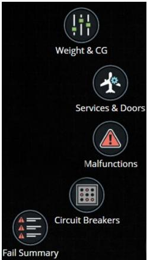
Figure 2 Quick Access Buttons (Typical)

## 3.3.3 Dropdown Buttons

Tapping on a Dropdown button expands the selection for a particular item.

Figure 3 Dropdown Button

## 3.3.4 Selection Buttons

There are three types of selections buttons:

Toggle Normal

• Toggle Fail

• Action

## 3.3.4.1 Toggle Normal Button

A Toggle Normal button has the following states:

Button Name

Normal State

Button Name

Activated State

Disabled State

## 3.3.4.2 Toggle Fail Button

A Toggle Fail button has the following states:

Button Name

Normal State

Button Name

Activated State

Once a Toggle Fail button is triggered, the fault is recorded by the Control Board and displayed in Malfunctions sections, Control Board Footer and in the MALFUNCTIONS sliding panel.

From the red activated state, tap the toggle fail button again to deactivate the malfunction.

## 3.3.4.3 Action Button

An Action button has the following states:

Normal State

Activated State (for a few seconds)

Disabled State

The sequence of states of an Action button is as follows:

Starts in the Normal State.

• Once the instructor taps on the button, button illuminates for a few seconds.

Then, the Action button returns to either:

o Normal state, or

o Disabled state.

The return to either the Normal state or Disabled state depends on various conditions.

## 3.3.5 Expandable Buttons

Tapping on an Expandable button displays the associated sliding panel.

Figure 4 Expandable Button

Page 10

## 3.3.6 Radio Buttons

Tapping on a Radio button allows the instructor to select only one of the predefined set of options. These buttons are mutually exclusive.

Figure 5 Radio Button

## 3.3.7 Checkbox

A checkbox is a toggle feature that selects or deselects a particular item.

Figure 6 Checkbox

## 3.3.8 Sliders

Sliders can also be referred to as slider controls or scroll bars. These can come in various forms but they all allow the adjustment of a particular item from a minimum to a maximum value.

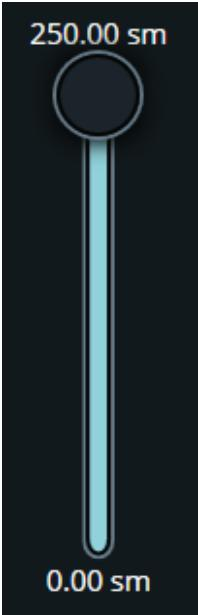
Figure 7 Slider

## 3.3.9 Wheel Picker

Depending on the configuration of the IOS Control Board, some parameters can be adjusted with a Wheel Picker. To activate the Wheel Picker for a specific item, proceed as follows:

• Choose a specific parameter.

Press and hold on this parameter until the Wheel Picker is displayed or slide this parameter up or down to display the Wheel Picker.

Scroll through the selection and select:

o The green checkmark to confirm your selection.

o The red X to cancel your selection.

Depending on the IOS configuration, the following lists some of the parameters that can be adjusted with the wheel picker are:

Weight

• Time of day

Reference airport

Runway

• Runway conditions

Surface wind

Precipitation

Temperature

QNH

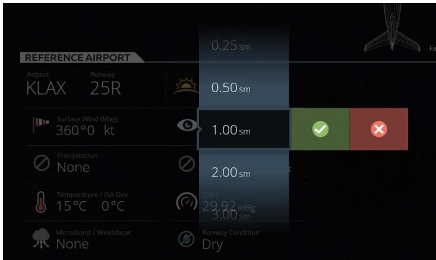
Figure 8 Wheel Picker (Typical)

13 Oct 2017

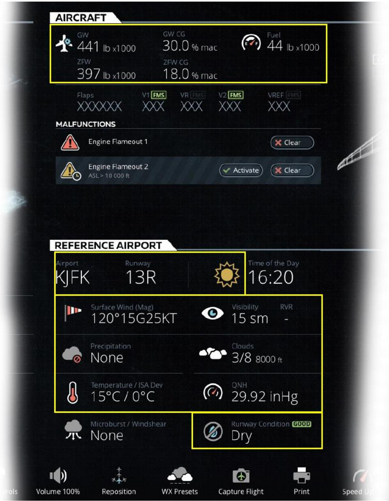
Figure 9 Wheel Picker – Adjustable Parameters (Typical)

## 3.3.10 Keypad

Numerous parameters can be adjusted with a keypad. Entering a value in the keypad can be done either with the slider or with the keypad keys.

The green checkmark confirms the entry and the red X cancels the entry.

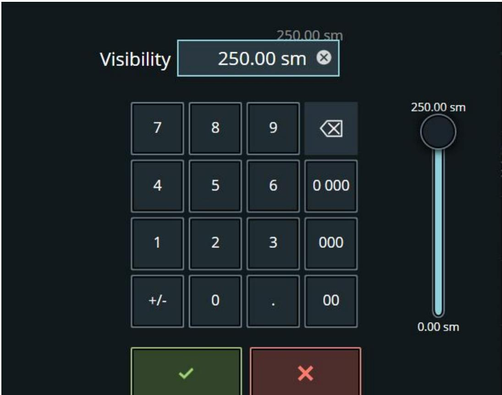
Figure 10 Keypad

## 3.3.11 Interactive Graphs

Some graphs are interactive and allow the instructor to alter values by simply touching elements on the graph.

In the Slew graph below for example, the instructor can move the $+$ on the graph which will cause the sliders and text fields to be updated according to the new + position on the graph.

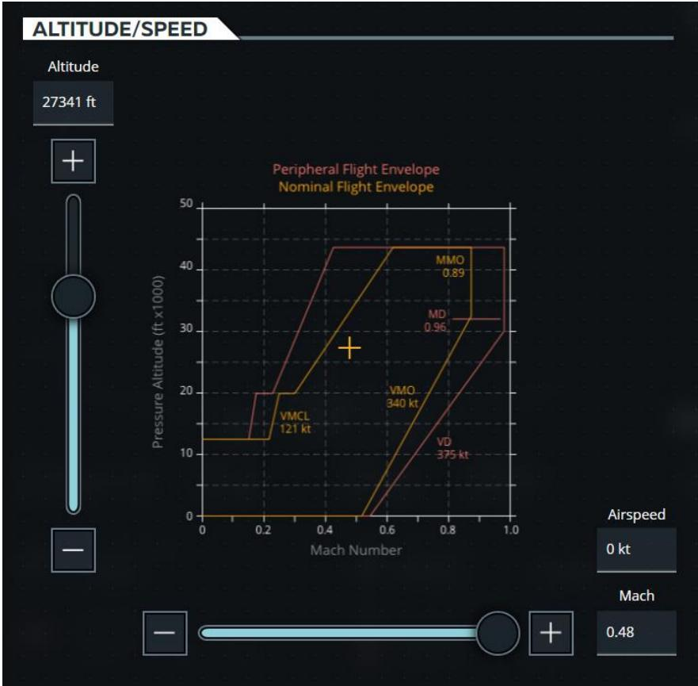
Figure 11 Interactive Graphs (Typical)

## 4. Control Board Workspace

The Control Board workspace consolidates all the ownship parameters required to control and monitor various aspects of a training session. It features a set of tabs that groups all required ownship and environmental parameters by type.

In this IOS configuration the Control Board workspace includes the following tabs:

LESSON PLAN

DOCS

CURRENT CONDITIONS

• AIRCRAFT

REFERENCE AIRPORT

The Control Board also includes an INSTRUCTOR STATION sliding panel accessible by the expand button located at the right side of the Control Board. This sliding panel allows the instructor to set various Unit of Measures.

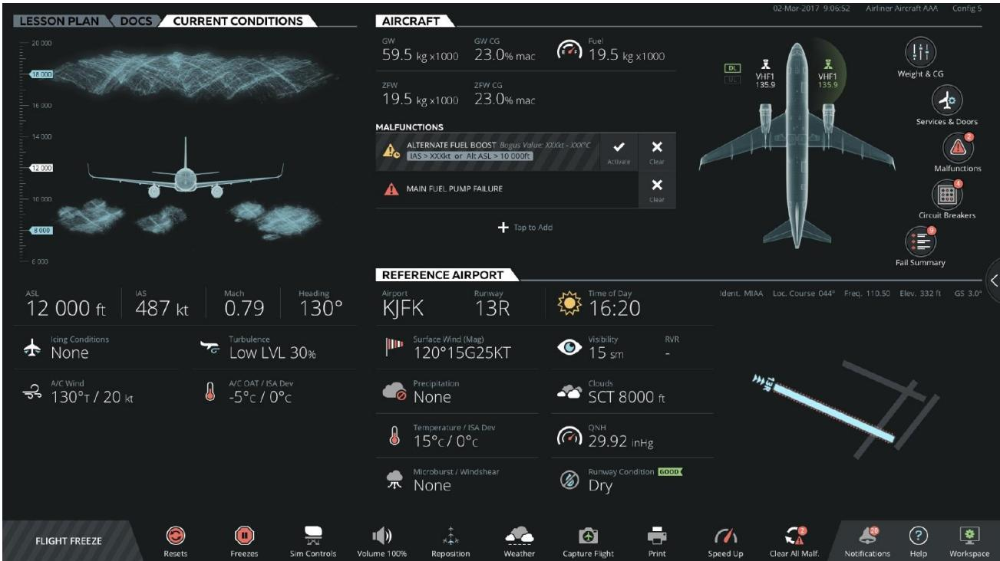
Figure 12 Control Board – Main View

## 4.1 Tabs and Interface Elements

The interface elements included in each tab of the Control Board are included in this table.

Table 1 Control Board Interface Elements

<table><tr><td rowspan=1 colspan=1>Tabs</td><td rowspan=1 colspan=1>Section</td><td rowspan=1 colspan=1>Wheel Picker</td><td rowspan=1 colspan=1>Interface Element</td></tr><tr><td rowspan=1 colspan=1>CurrentConditions</td><td rowspan=1 colspan=1></td><td rowspan=1 colspan=1></td><td rowspan=1 colspan=1></td></tr><tr><td rowspan=1 colspan=1></td><td rowspan=1 colspan=1>Clouds</td><td rowspan=1 colspan=1></td><td rowspan=1 colspan=1>Tap to open sliding panel</td></tr><tr><td rowspan=1 colspan=1></td><td rowspan=1 colspan=1>Attitude Indicators</td><td rowspan=1 colspan=1></td><td rowspan=1 colspan=1>Tap to open sliding panel</td></tr><tr><td rowspan=1 colspan=1></td><td rowspan=1 colspan=1>Icing Conditions</td><td rowspan=1 colspan=1>Yes</td><td rowspan=1 colspan=1>Tap to open sliding panel</td></tr><tr><td rowspan=1 colspan=1></td><td rowspan=1 colspan=1>Turbulence</td><td rowspan=1 colspan=1></td><td rowspan=1 colspan=1>Tap to open sliding panel</td></tr><tr><td rowspan=1 colspan=1></td><td rowspan=1 colspan=1>A/C Wind</td><td rowspan=1 colspan=1></td><td rowspan=1 colspan=1>Text field</td></tr><tr><td rowspan=1 colspan=1></td><td rowspan=1 colspan=1>A/C OAT/ ISA Dev</td><td rowspan=1 colspan=1></td><td rowspan=1 colspan=1>Text field</td></tr><tr><td rowspan=1 colspan=1>Aircraft</td><td rowspan=1 colspan=1></td><td rowspan=1 colspan=1></td><td rowspan=1 colspan=1></td></tr><tr><td rowspan=1 colspan=1></td><td rowspan=1 colspan=1>GW</td><td rowspan=1 colspan=1>Yes</td><td rowspan=1 colspan=1>Text field</td></tr><tr><td rowspan=1 colspan=1></td><td rowspan=1 colspan=1>GW CG</td><td rowspan=1 colspan=1>Yes</td><td rowspan=1 colspan=1>Text field</td></tr><tr><td rowspan=1 colspan=1></td><td rowspan=1 colspan=1>Fuel</td><td rowspan=1 colspan=1>Yes</td><td rowspan=1 colspan=1>Text field</td></tr><tr><td rowspan=1 colspan=1></td><td rowspan=1 colspan=1>ZFW</td><td rowspan=1 colspan=1>Yes</td><td rowspan=1 colspan=1>Text field</td></tr><tr><td rowspan=1 colspan=1></td><td rowspan=1 colspan=1>ZFW CG</td><td rowspan=1 colspan=1>Yes</td><td rowspan=1 colspan=1>Text field</td></tr><tr><td rowspan=1 colspan=1></td><td rowspan=1 colspan=1>Malfunctions</td><td rowspan=1 colspan=1></td><td rowspan=1 colspan=1>Section showing number of active/armed malfunctions</td></tr><tr><td rowspan=1 colspan=1></td><td rowspan=1 colspan=1>Data Link (DL)</td><td rowspan=1 colspan=1></td><td rowspan=1 colspan=1>Tap to open sliding panel</td></tr><tr><td rowspan=1 colspan=1></td><td rowspan=1 colspan=1>Communications (VHF)</td><td rowspan=1 colspan=1></td><td rowspan=1 colspan=1>Tap to open sliding panel</td></tr><tr><td rowspan=1 colspan=1></td><td rowspan=1 colspan=1>Weight& CG</td><td rowspan=1 colspan=1></td><td rowspan=1 colspan=1>Tap to open sliding panel</td></tr><tr><td rowspan=1 colspan=1></td><td rowspan=1 colspan=1>Services &Doors</td><td rowspan=1 colspan=1></td><td rowspan=1 colspan=1>Tap to open sliding panel</td></tr><tr><td rowspan=1 colspan=1></td><td rowspan=1 colspan=1>Malfunctions</td><td rowspan=1 colspan=1></td><td rowspan=1 colspan=1>Tap to open sliding panel</td></tr><tr><td rowspan=1 colspan=1></td><td rowspan=1 colspan=1>Circuit Breakers</td><td rowspan=1 colspan=1></td><td rowspan=1 colspan=1>Tap to open sliding panel</td></tr><tr><td rowspan=1 colspan=1></td><td rowspan=1 colspan=1>Fail Summary</td><td rowspan=1 colspan=1></td><td rowspan=1 colspan=1>Tap to open sliding panel</td></tr><tr><td rowspan=1 colspan=1>ReferenceAirport</td><td rowspan=1 colspan=1></td><td rowspan=1 colspan=1></td><td rowspan=1 colspan=1></td></tr><tr><td rowspan=1 colspan=1></td><td rowspan=1 colspan=1>Airport & Runway</td><td rowspan=1 colspan=1>Yes</td><td rowspan=1 colspan=1> Tap to open sliding panel</td></tr><tr><td rowspan=1 colspan=1></td><td rowspan=1 colspan=1>Time of Day</td><td rowspan=1 colspan=1>Yes</td><td rowspan=1 colspan=1>Text field</td></tr><tr><td rowspan=1 colspan=1></td><td rowspan=1 colspan=1>Surface Wind</td><td rowspan=1 colspan=1>Yes</td><td rowspan=1 colspan=1>Tap to open sliding panel</td></tr><tr><td rowspan=1 colspan=1></td><td rowspan=1 colspan=1>Visibility</td><td rowspan=1 colspan=1>Yes</td><td rowspan=1 colspan=1>Text field</td></tr><tr><td rowspan=1 colspan=1></td><td rowspan=1 colspan=1>RVR</td><td rowspan=1 colspan=1>Yes</td><td rowspan=1 colspan=1>Tap to open sliding panel</td></tr><tr><td rowspan=1 colspan=1></td><td rowspan=1 colspan=1>Precipitation</td><td rowspan=1 colspan=1>Yes</td><td rowspan=1 colspan=1>Tap to open sliding panel</td></tr><tr><td rowspan=1 colspan=1></td><td rowspan=1 colspan=1>Clouds</td><td rowspan=1 colspan=1>Yes</td><td rowspan=1 colspan=1>Tap to open sliding panel</td></tr><tr><td rowspan=1 colspan=1></td><td rowspan=1 colspan=1>Temperature / ISA Dev</td><td rowspan=1 colspan=1>Yes</td><td rowspan=1 colspan=1>Text field</td></tr><tr><td rowspan=1 colspan=1></td><td rowspan=1 colspan=1>QNH</td><td rowspan=1 colspan=1>Yes</td><td rowspan=1 colspan=1>Text field</td></tr><tr><td rowspan=1 colspan=1></td><td rowspan=1 colspan=1>Microburst/Windshear</td><td rowspan=1 colspan=1>Yes</td><td rowspan=1 colspan=1> Tap to open sliding panel</td></tr><tr><td rowspan=1 colspan=1></td><td rowspan=1 colspan=1>Runway condition</td><td rowspan=1 colspan=1>Yes</td><td rowspan=1 colspan=1>Tap to open sliding panel</td></tr></table>

Control Board Workspace
13 Oct 2017

<table><tr><td rowspan=1 colspan=1>Footer</td><td rowspan=1 colspan=1></td><td rowspan=1 colspan=1></td><td rowspan=1 colspan=1></td></tr><tr><td rowspan=1 colspan=1></td><td rowspan=1 colspan=1>Flight Freeze</td><td rowspan=1 colspan=1></td><td rowspan=1 colspan=1>Button</td></tr><tr><td rowspan=1 colspan=1></td><td rowspan=1 colspan=1>Resets</td><td rowspan=1 colspan=1></td><td rowspan=1 colspan=1>Button with roll up menu</td></tr><tr><td rowspan=1 colspan=1></td><td rowspan=1 colspan=1>Freezes</td><td rowspan=1 colspan=1></td><td rowspan=1 colspan=1>Button with roll up menu</td></tr><tr><td rowspan=1 colspan=1></td><td rowspan=1 colspan=1>Sim Controls</td><td rowspan=1 colspan=1></td><td rowspan=1 colspan=1>Button with roll up menu</td></tr><tr><td rowspan=1 colspan=1></td><td rowspan=1 colspan=1>Volume 100%</td><td rowspan=1 colspan=1></td><td rowspan=1 colspan=1>Button with roll up menu</td></tr><tr><td rowspan=1 colspan=1></td><td rowspan=1 colspan=1>Reposition</td><td rowspan=1 colspan=1></td><td rowspan=1 colspan=1>Button with roll up menu</td></tr><tr><td rowspan=1 colspan=1></td><td rowspan=1 colspan=1>WX Presets</td><td rowspan=1 colspan=1></td><td rowspan=1 colspan=1>Button with roll up menu</td></tr><tr><td rowspan=1 colspan=1></td><td rowspan=1 colspan=1>Capture Flight</td><td rowspan=1 colspan=1></td><td rowspan=1 colspan=1>Button</td></tr><tr><td rowspan=1 colspan=1></td><td rowspan=1 colspan=1>Print</td><td rowspan=1 colspan=1></td><td rowspan=1 colspan=1>Button with roll up menu</td></tr><tr><td rowspan=1 colspan=1></td><td rowspan=1 colspan=1>Clear All Malfunctions</td><td rowspan=1 colspan=1></td><td rowspan=1 colspan=1>Button confirmation - disabledwhen no active malfunction, badgeshows number of malfunctions</td></tr><tr><td rowspan=1 colspan=1></td><td rowspan=1 colspan=1>Notifications</td><td rowspan=1 colspan=1></td><td rowspan=1 colspan=1>Button activates notification view</td></tr><tr><td rowspan=1 colspan=1></td><td rowspan=1 colspan=1>Help</td><td rowspan=1 colspan=1></td><td rowspan=1 colspan=1>Button with roll up menu</td></tr><tr><td rowspan=1 colspan=1></td><td rowspan=1 colspan=1>Workspace</td><td rowspan=1 colspan=1></td><td rowspan=1 colspan=1>Button with roll up menu</td></tr></table>

## 5. LESSON PLAN Tab

The LESSON PLAN Tab allows the instructor to:

• View all available lessons on the IOS

View all the training phases of a lesson

• View all the lesson steps included in a lesson

Run a lesson automatically or step-by-step

The LESSON PLAN Tab includes:

Two main sections:

o Lesson Outline (Left side of tab)

o Lesson Step Details (Right side of tab)

Buttons to control the execution of the lesson

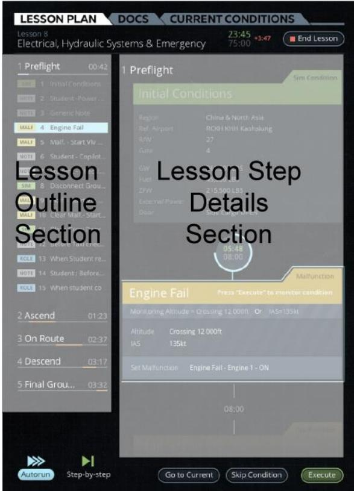
Figure 13 LESSON PLAN Outline and Details

All lessons available on the IOS Control Board are created with the CAE Slick webbased lesson plan editor (Refer to TPD 19709 Slick User Guide for more details). This application editor provides all necessary controls to allow an instructor to:

Create a lesson by adding all the necessary lesson elements:

o Notes

o Simulator condition

o Malfunctions

o Freeplay button

• Modify a lesson

This application editor allows the instructor to add all necessary elements available on the IOS to create a fully automated training environment lesson.

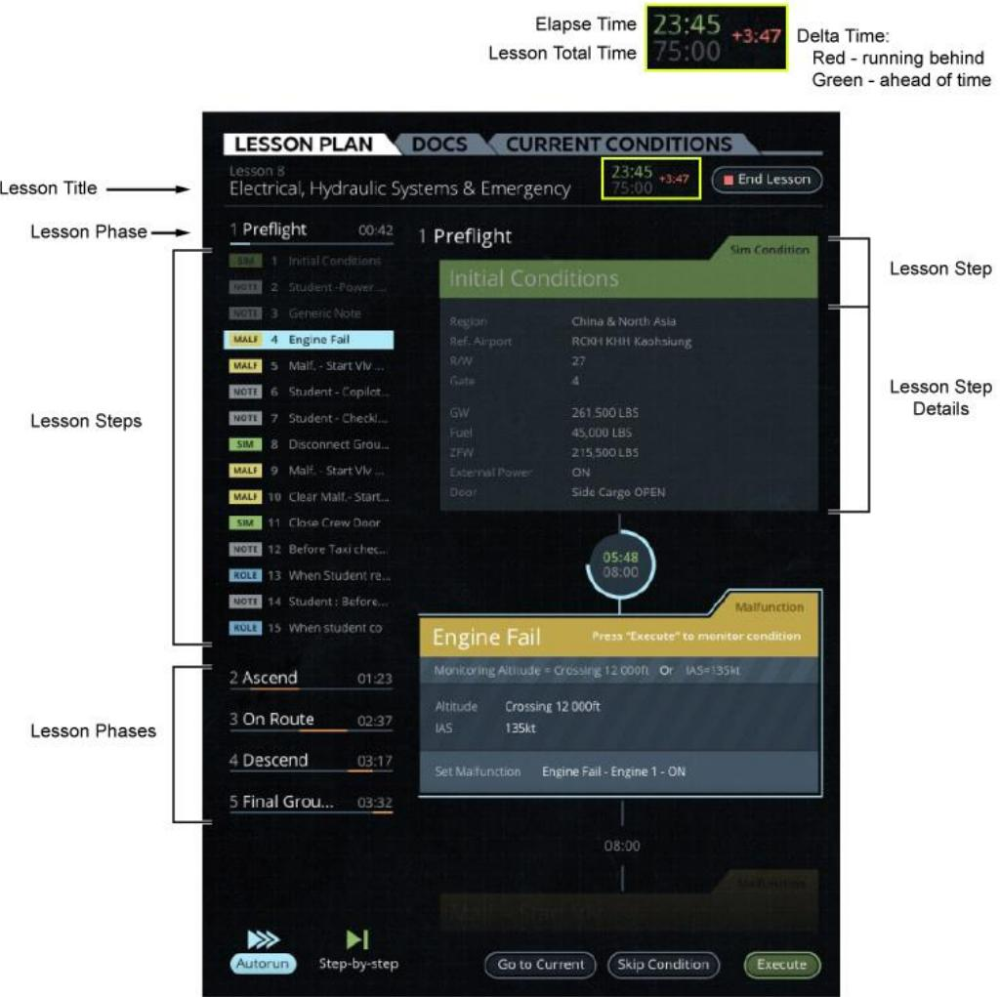
Figure 14 LESSON PLAN Tab

## 5.1 Lesson Outline Section

For a selected lesson, the Lesson Outline section lists all:

Training phases of the lesson.

All the steps included in each training phase.

## 5.2 Lesson Step Details Section

The Lesson Step Details section is scrollable; it allows the instructor to scroll up and down and visualize the details of each lesson step.

## 5.3 Lesson Training Phases

A lesson plan may be structured and organized in phases that will allow the training session to meet the training lesson objective(s). Lesson training phases defined by the instructor can be structured to match the various phases of flight or training tasks.

## 5.4 Lesson Steps

Lesson steps inserted in a lesson training phase can be categorized as:

• Note

o This a read-only step providing information to the instructor.

Sim Condition

o This step allows the instructor to execute a single instruction or several instructions to alter the state of the simulation.

## Malfunction

o This step allows the instructor to insert a malfunction in the lesson plan along with all the malfunction trigger criteria.

## • Freeplay button

o This button allows the instructor to trigger a pre-program action or set of actions that can be triggered at any time during the lesson plan.

## • Nested Lesson

o This step allows the instructor to connect or link to another lesson.

In a lesson plan, these are identified with the following flags:

NOTE

SIM

Figure 15 Lesson Step Flags

## 5.5 LESSON PLAN Tab Buttons

The LESSON PLAN tab includes the following buttons.

## 5.5.1 Autorun

Tap this button to run lesson steps that have been set to run automatically.

## 5.5.2 Step-by-step

Tap this button to run the lesson steps in a step-by-step fashion. For each step to be issued, requires a confirmation from the instructor which is done by tapping the Execute button.

## 5.5.3 Go to Current

Tap this button to display the current lesson step in the Lesson Step Details Section.

## 5.5.4 Skip Condition

Tap this button to skip a condition associated to specific lesson step.

## 5.5.5 Execute

Tap this button to execute the current lesson step.

## 5.5.6 End Lesson

Tap this button to end the current lesson.

## 6. DOCS Tab

The DOCS Tab allows the instructor to view reference documentation. The DOCS Tab includes the following controls.

## 6.1 Thumbnail View

Provides a list of small graphic representation of each larger page.

## 6.2 List View

Provides a list of all the page titles.

## 6.3 Scroll Up and Down

Scrolls up and down through the document in a Next page, Previous page fashion.

## 6.4 Search Function

Allows the instructor to search for a word or a string of characters.

## 6.5 View Expansion

Expands the view of the viewable document.

## 6.6 Zoom

Zoom-in and out controls.

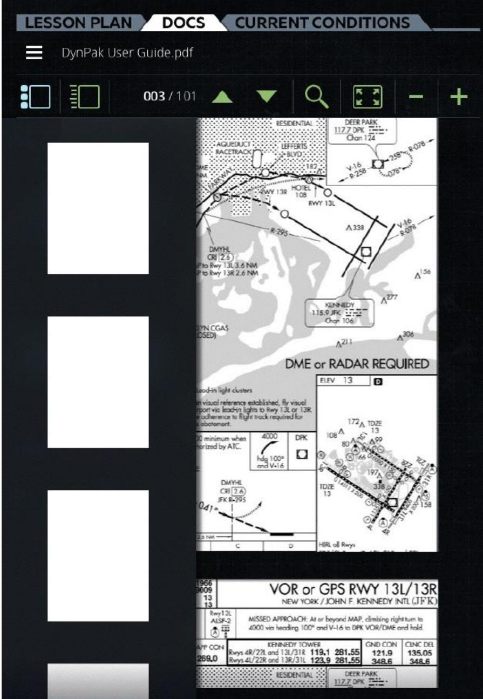
Figure 16 DOCS Tab

## 7. CURRENT CONDITIONS Tab

The CURRENT CONDITIONS tab provides an overall status of the aircraft ownship situation and the environmental conditions at the ownship.

This tab includes all the necessary controls to allow the instructor to view and change:

Ownship situation parameters such as:

o Altitude

o Airspeed

o Heading

Environmental conditions at the ownship such as:

o Clouds, fog and visibility

o Icing conditions

o Turbulence

o Winds

o Outside Air Temperature

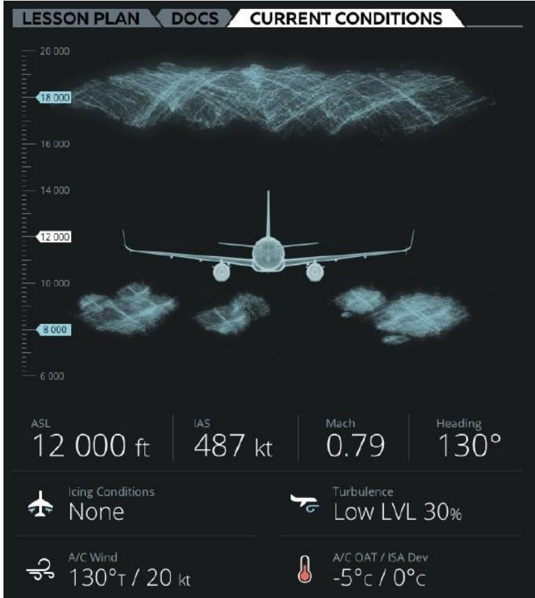
Figure 17 CURRENT CONDITIONS Tab

## 7.1 Parameter Input Text Fields

The CURRENT CONDITIONS tab includes parameter input text fields that upon tapping will display the associated sliding panel or keypad.

Some parameters in this tab can also be adjusted using the Wheel Picker. To use the wheel picker:

Press and hold on a parameter until the Wheel Picker is displayed or swipe this parameter up or down to display the Wheel Picker.

Scroll through the selection and select:

o The green checkmark to confirm your selection.

o The red X to cancel your selection.

## 7.1.1 Clouds and Visibility Section

This section of the CURRENT CONDITIONS tab displays the current cloud settings at a geographic region where the aircraft is flying. Tap on this section to display the CLOUDS at the aircraft sliding panel.

## 7.1.2 ASL

This input text field displays the current Above Sea Level (ASL) aircraft altitude. Tap on this input text field to display the SLEW sliding panel and change the aircraft altitude.

## 7.1.3 IAS

This input text field displays the current Indicated Airspeed (IAS). Tap on this input text field to display the SLEW sliding panel and change the IAS.

## 7.1.4 Mach

This input text field displays the current Mach speed. Tap on this input text field to display the SLEW sliding panel and change the Mach speed.

## 7.1.5 Heading

This input text field displays the current aircraft heading. Tap on this input text field to display the SLEW sliding panel and change the aircraft heading.

## 7.1.6 Icing Conditions

This input text field displays the current aircraft icing conditions.

To modify the icing conditions either:

Tap on this input text field to display the ICING sliding panel, or

• Use the Wheel Picker.

## 7.1.7 Turbulence

This input text field displays the current turbulence condition at the aircraft. Tap on this input text field to display the TURBULENCE sliding panel and change the turbulence condition at the aircraft.

## 7.1.8 A/C Wind

This input text field displays the current wind direction and speed at the aircraft (A/C). Tap on the A/C Wind input text field to display the A/C Wind Direction Speed keypad. Use the keypad to change the wind direction and speed.

## 7.1.9 A/C OAT

This input text field displays the current Outside Air Temperature (OAT) at the aircraft (A/C).

To modify the OAT at the aircraft either:

Tap on A/C OAT to display the A/C OAT keypad.

• Use this keypad to change the temperature or use the Wheel Picker.

## 7.1.10 A/C ISA Dev

This input text field displays the current International Standard Atmosphere (ISA) Deviation (ISA Dev).

To modify the ISA Deviation at the aircraft either:

Tap on ISA Dev to display the ISA Dev keypad.

• Use this keypad to change the ISA deviation or use the Wheel Picker.

## 7.2 CLOUDS AT AIRCRAFT Sliding Panel

The CLOUDS AT AIRCRAFT sliding panel allows the instructor to modify cloud and visibility parameters at the region around the ownship by choosing:

The types of clouds at various levels

Cloud thickness

• Visibility

• Type of fog, and

Weather presets visual conditions

This panel includes:

• Dropdown buttons to select the types of clouds and cloud density

• Input text fields to enter the upper and lower limits of the cloud layer

The following sections:

o Visibility

o Cloud levels

o Fog

o Weather presets

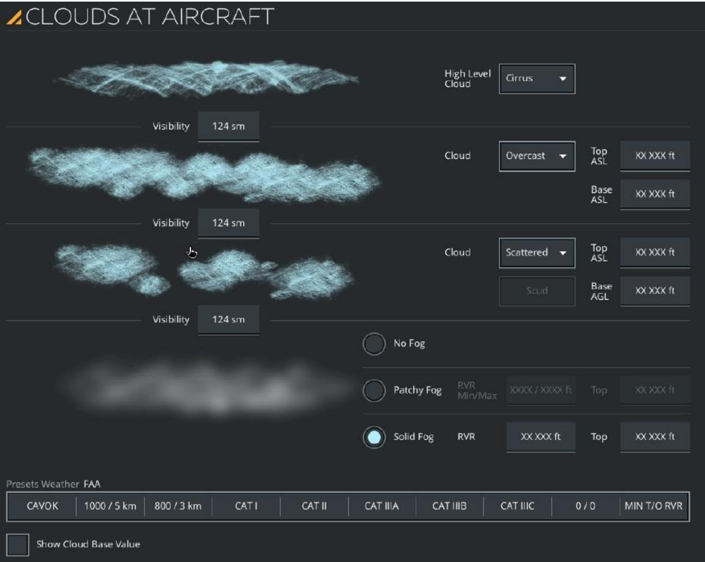
Figure 18 CLOUDS AT AIRCRAFT Sliding Panel (Typical)

CURRENT CONDITIONS Tab

13 Oct 2017

Page 30

## 7.2.1 Visibility Section

This section includes visibility input text fields that display the visibility between cloud layers.

Maximum visibility is limited if rain is activated:

• 15 nm for light rain

• 5 nm for moderate rain

• 1 nm for heavy rain

To adjust the visibility, tap on the input text field and use the keypad to enter new value (Min = 0, Max = Dynamic). Can also be displayed in Statute Mile (sm).

## 7.2.2 Cloud Level Section

## 7.2.2.1 High Level Cloud

Tap on this dropdown button to expand selection and view the full cloud selection, then make your selection.

Selection of high clouds includes:

None

Cirrocumulus

Cirrus

• Cirrostratus

## 7.2.2.2 Medium Level Cloud

Tap on this dropdown button to expand selection and view the full cloud selection, then make your selection.

Selection of medium clouds includes:

• Clear

Scattered

• Broken

• Overcast

## 7.2.2.3 Low Level Cloud

Tap on this dropdown button to expand selection and view the full cloud selection, then make your selection.

Selection of low level clouds includes:

• Clear

Scattered

• Broken

• Overcast

## 7.2.2.4 Medium Level Cloud Thickness

The cloud thickness of the medium level clouds is set by two input text field that establish the upper and lower limits of the cloud layer.

Tap on the Top ASL input text field to set the cloud top limit and then tap on the Base ASL input text field to set the lower limit.

Values are displayed in feet. The minimum and maximum cloud layer thickness depends on the type of coverage.

Note: The input text fields can sometimes be defined as MSL.

## 7.2.2.5 Low Level Cloud Thickness

The cloud thickness of the low-level clouds is set by two input text field that establish the upper and lower limits of the cloud layer.

Tap on the Top ASL input text field to set the cloud top limit and then tap on the Base AGL input text field to set the lower limit.

Values are displayed in feet. The minimum and maximum cloud layer thickness depends on the type of coverage.

Note: The input text fields can sometimes be defined as MSL and AGL.

## 7.2.3 Fog Section

The Fog section includes three radio buttons that are mutually exclusive.

## 7.2.3.1 No Fog

Tap this radio button to remove the fog.

## 7.2.3.2 Patchy Fog and Thickness

Tap this radio button to activate patchy fog conditions.

When patchy fog is activated, the fog thickness varies randomly between the preset minimum and maximum Runway Visual Range (RVR) and the altitude set by the Patchy Fog Top value in ft.

## 7.2.3.3 Solid Fog and Thickness

Tap this radio button to activate solid fog conditions.

When solid fog is activated, the fog thickness varies between the given minimum and maximum RVRs. Selection allows inputs ranges of RVR and Top (feet) in the text field.

## 7.2.3.4 RVR Min/Max

Tap each input text field to enter the minimum/maximum Runway Visual Range (RVR) (meters/feet). This button is only available when patchy fog is active.

RVR MIN

$$
( \mathrm { M i n } = 0 , \mathrm { M a x } = \mathrm { R V R \ m a x } )
$$

RVR MAX

$$
( \mathrm { M i n } = \mathrm { R V R \ m i n } , \mathrm { M a x } = 3 0 4 5 \mathrm { m e t e r s } )
$$

$$
( \mathrm { M i n } = \mathrm { R V R \ m i n } , \mathrm { M a x } = 9 9 9 0 \ \mathrm { f e e t } )
$$

## 7.2.4 Weather Presets Section

This section includes buttons that change the cloud and visibility conditions according to FAA, EASA, TCA or EUR standards (As applicable).

## 7.2.4.1 CAVOK

Tap this button to activate CAVOK conditions on the visual display.

Conditions are:

No cloud base below 5000 feet; no cumulonimbus.

• Visibility 6 statute miles/10 kilometers or more.

• No precipitation, thunderstorms, shallow fog, or low drifting snow.

## 7.2.4.2 1000/5km

Tap this button to activate CIRCLING with 1000/5km conditions on the visual display.

## 7.2.4.3 800/2km

Tap this button to activate CIRCLING with 800/2km conditions on the visual display.

## 7.2.4.4 CAT I

Tap this button to activate CAT I conditions on the visual display.

## 7.2.4.5 CAT II

Tap this button to activate CAT II conditions on the visual display.

## 7.2.4.6 CAT IIIA

Tap this button to activate CAT IIIA conditions on the visual display.

## 7.2.4.7 CAT IIIB

Tap this button to activate CAT IIIB conditions on the visual display.

## 7.2.4.8 CAT IIIC

Tap this button to activate CAT IIIC conditions on the visual display.

## 7.2.4.9 0/0

Tap this button to activate 0/0 conditions on the visual display.

## 7.2.4.10 MIN T/O RVR

Tap to activate MIN T/O RVR conditions on the visual display.

## 7.3 SLEW Sliding Panel

The SLEW sliding panel allows the instructor to view and change the aircraft:

• Altitude

Indicated airspeed

• Heading and position

Position slew is possible when position freeze is activated. Below 100 feet above ground level, the aircraft height above ground will be maintained as the position is slewed. Altitude and speed slew are inhibited while the aircraft is on ground.

This sliding panel includes two main tabs:

• ALTITUDE/SPEED

HEADING/POSITION

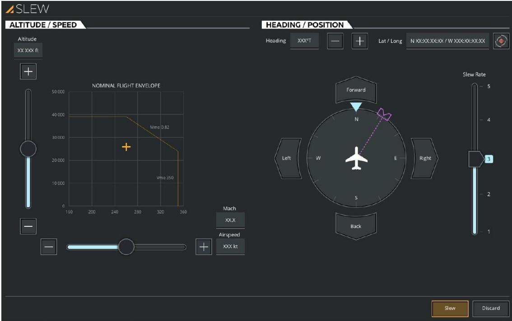
Figure 19 Aircraft SLEW Sliding Panel

## 7.3.1 ALTITUDE / SPEED Tab

This tab includes the necessary controls to modify the altitude and airspeed of the aircraft.

## 7.3.1.1 Altitude

Tap this input text field to display a keypad that will allow you to enter a new altitude (meters/feet).

Modifying the altitude can be done either through the altitude input text field or with the Altitude slider. (Dynamic Min/Max).

## 7.3.1.2 Altitude Slider

Swipe the Altitude slider up (+) or down (-) to increase or decrease the aircraft altitude (Dynamic Min/Max).

The + button slews the aircraft upwards at a fixed rate and the – button slews the aircraft downwards at a fixed rate.

## 7.3.1.3 Airspeed

Tap this input text field to display a keypad that will allow you to enter a new Indicated Airspeed (IAS) in knots.

Modifying the IAS can be done either through the airspeed input text field or with the Airspeed slider. (Dynamic Min/Max).

The aircraft is trimmed at the requested speed. Flap and gear position will be driven as required in order not to create an overspeed condition. Flight freeze is set once complete. (Dynamic Min/Max).

## 7.3.1.4 Airspeed Slider

Swipe the Airspeed slider right (+) or left (-) to increase or decrease the aircraft speed.

The aircraft is trimmed at the requested speed. Flap and gear position will be driven as required in order not to create an overspeed condition. Flight freeze is set once complete (Dynamic Min/Max).

The + button slews the aircraft indicated airspeed up at a fixed rate and the – button slews the aircraft indicated airspeed down at a fixed rate.

## 7.3.1.5 Mach

Tap this input text field to display a keypad that will allow you to enter a new aircraft Mach speed.

The aircraft is trimmed at the requested Mach speed. Flap and gear position will be driven as required in order not to create an overspeed condition. Flight freeze is set once complete (Dynamic Min/Max).

## 7.3.1.6 Graph

This graph is interactive as it allows the instructor to alter values by simply touching elements on the graph.

In this Slew graph, the instructor can move the + on the graph which will cause the sliders and text fields to be updated according to the new + position on the graph.

## 7.3.2 HEADING / POSITION Tab

This tab includes the necessary controls to modify the heading and position of the aircraft.

## 7.3.2.1 Heading

Tap this input text field to display a keypad that will allow you to enter a new aircraft heading. No other parameters are affected.

## 7.3.2.2 Heading Slew Increase (+) / Decrease (-)

The heading (+) button or (–) button slew the aircraft magnetic heading either by increasing or decreasing it a fixed rate. These buttons are disabled when the magnetic aircraft heading slew function is not available.

CURRENT CONDITIONS Tab

13 Oct 2017

Page 36

## 7.3.2.3 Forward

Tap this button to slew the aircraft forward. This button is disabled during speed up.

## 7.3.2.4 Back

Tap this button to slew the aircraft backwards. This button is disabled during speed up.

## 7.3.2.5 Left

Tap this button to slew the aircraft to the left. This button is disabled during speed up.

## 7.3.2.6 Right

Tap this button to slew the aircraft to the right. This button is disabled during speed up.

## 7.3.2.7 Lat / Long

Tap this input text field to display a keypad that will allow you to enter new latitude and longitude coordinates for the aircraft (ownship). This input text field allows the instructor to reposition the aircraft at a new location.

## 7.3.2.8 Hook (Optional)

Tap the Hook button to position the aircraft to the preset Hook geo coordinates as set by the instructor on the Map workspace. This geographic point has Latitude and longitude coordinates on the map but it does not have an altitude.

## 7.3.2.9 Position Slew Rate Slider

Swipe the Position Slew Rate Slider between 1 to 5 to change the rate at which the slews will function (Min = 1, Max = 5).

## 7.3.3 Slew

Tap this button to immediately slew the aircraft in accordance with the newly changed parameters (altitude, speed, heading and position).

This button is disabled when no slew parameters have been selected for change or while one of the associated slews is active.

## 7.3.4 Discard

Tap this button to immediately cancel the slew selected parameter changes.

This button is disabled when no slew parameters have been selected for change or while one of the associated slews is active.

## 7.4 ICING Sliding Panel

The ICING sliding panel allows the instructor to control the icing conditions on the aircraft. The selection of icing conditions on the aircraft is done by selecting either one of the Light, Moderate or Severe buttons which are mutually exclusive.

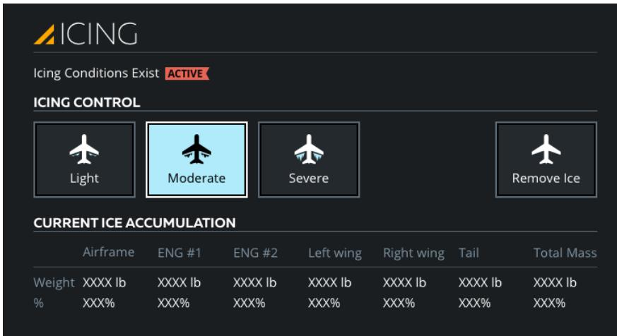
Figure 20 ICING Sliding Panel

## 7.4.1 Icing Conditions Exist

There are two flags to indicate the selection of an icing condition.

An Armed Yellow flag indicates:

That an icing condition is selected

The aircraft is not in the icing condition location (not in cloud)

• TAT <6 and >-20 degree Celsius

An Active Red flag indicates:

That an icing condition is selected

The aircraft is in the icing condition location (in cloud)

• TAT <6 and >-20 degree Celsius

## 7.4.2 Light

From the Normal state, tap this button to set the rate and quantity of ice buildup on the airframe/wing/probe to the light setting (33%).

## 7.4.3 Moderate

From the Normal state, tap this button to set the rate and quantity of ice buildup on the airframe/wing/probe to the moderate setting (67%).

CURRENT CONDITIONS Tab

13 Oct 2017

Page 38

## 7.4.4 Severe

From the Normal state, tap this button to set the rate and quantity of ice buildup on the airframe/wing/probe to the severe setting (100%).

## 7.4.5 Remove Ice

Tap this button to gradually remove the existing ice buildup condition. Once completed the icing rate and quantity is set to 0.

## 7.4.6 ICE ACCUMULATION Section

This section includes read-only text fields that display ice accumulation in weight or % for certain aircraft components.

## 7.4.6.1 Weight

The weight read-only text fields display the actual ice accumulation weight in the selected unit of measure (kilograms/pounds) for the following aircraft components:

Airframe

ENG #1

ENG #2

• Left Wing

• Right Wing

Tail

Total Mass

## 7.4.6.2 %

The % read-only text fields display the actual ice accumulation percentage for the following aircraft components:

Airframe

ENG #1

ENG #2

• Left Wing

• Right Wing

Tail

Total Mass

## 7.5 TURBULENCE Sliding Panel

The TURBULENCE sliding panel allows the instructor to select various types of turbulence that can be induced on the aircraft.

This sliding panel offers buttons that are mutually exclusive and allow the instructor to manually change various turbulence parameters such as:

• Type and,

Intensity level

It includes the following sections:

CLEAR AIR

THUNDERSTORM

• LOW LEVEL

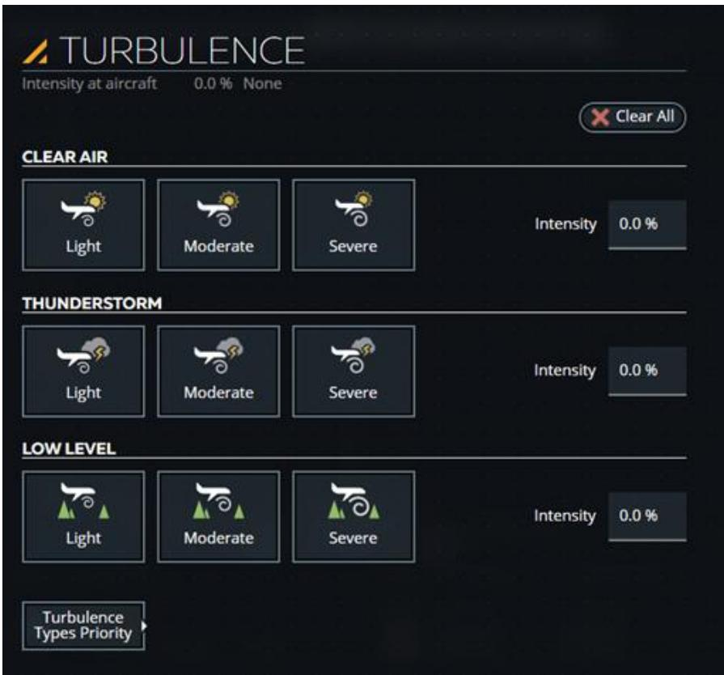
Figure 21 TURBULENCE Sliding Panel

## 7.5.1 CLEAR AIR Turbulence

Clear air turbulence can be felt at all altitudes, except while on ground.

At altitudes below 50 ft AGL, the nominal turbulence intensity is faded linearly as a function of altitude AGL.

At altitudes above 50 ft AGL, 100% of the nominal turbulence intensity is felt.

<table><tr><td rowspan=1 colspan=1>Altitude ft</td><td rowspan=1 colspan=1>Clear Air</td></tr><tr><td rowspan=1 colspan=1>>10,000</td><td rowspan=1 colspan=1>100%</td></tr><tr><td rowspan=1 colspan=1>5,000-10,000</td><td rowspan=1 colspan=1>100%</td></tr><tr><td rowspan=1 colspan=1>500-5,000</td><td rowspan=1 colspan=1>100%</td></tr><tr><td rowspan=1 colspan=1><50</td><td rowspan=1 colspan=1>Fades linear</td></tr></table>

## 7.5.1.1 CLEAR AIR - Light

Tap this button to set the clear air turbulence intensity to light (33%).

## 7.5.1.2 CLEAR AIR - Moderate

Tap this button to set the clear air turbulence intensity to moderate (66%).

## 7.5.1.3 CLEAR AIR - Severe

Tap this button to set the clear air turbulence intensity to severe (100%).

## 7.5.1.4 Intensity

Tap this input text field to display a keypad that will allow you to modify the intensity level of the clear air turbulence (Min = 0, Max = 100%).

## 7.5.2 THUNDERSTORM Turbulence

Thunderstorm turbulence can be felt at all altitudes, except while on ground.

At altitudes below 50 ft AGL, the nominal turbulence intensity is faded linearly as a function of altitude AGL.

At altitudes above 50 ft AGL, 100% of the nominal turbulence intensity is felt.

<table><tr><td rowspan=1 colspan=1>Altitude ft</td><td rowspan=1 colspan=1>Thunderstorm</td></tr><tr><td rowspan=1 colspan=1>>10,000</td><td rowspan=1 colspan=1>100%</td></tr><tr><td rowspan=1 colspan=1>5,000-10,000</td><td rowspan=1 colspan=1>100%</td></tr><tr><td rowspan=1 colspan=1>500-5,000</td><td rowspan=1 colspan=1>100%</td></tr><tr><td rowspan=1 colspan=1><50</td><td rowspan=1 colspan=1>Fades linear</td></tr></table>

## 7.5.2.1 THUNDERSTORM - Light

Tap this button to set the thunderstorm turbulence intensity to light (33%).

## 7.5.2.2 THUNDERSTORM - Moderate

Tap this button to set the thunderstorm turbulence intensity to moderate (66%).

## 7.5.2.3 THUNDERSTORM - Severe

Tap this button to set the thunderstorm turbulence intensity to severe (100%).

## 7.5.2.4 Intensity

Tap this input text field to display a keypad that will allow you to modify the intensity level of the thunderstorm turbulence (Min = 0, Max = 100%).

## 7.5.3 LOW LEVEL Turbulence

Low level turbulence is only felt at certain altitudes.

At altitudes above 500 ft AGL and below 5000 ft AGL, 100% of the nominal low level turbulence intensity is felt.

At altitudes above 10,000 ft AGL, low level turbulence is not felt.

At altitudes between 5,000 ft AGL and 10000 ft AGL, the nominal turbulence intensity is linearly faded as a function of altitude AGL.

At altitudes above 50 ft AGL and below 500 ft AGL, the nominal turbulence intensity is exponentially faded as a function of altitude AGL.

At altitudes below 50 ft AGL, the nominal turbulence intensity is linearly faded as a function of altitude AGL. Low level turbulence is not felt while on the ground.

<table><tr><td rowspan=1 colspan=1>Altitude ft</td><td rowspan=1 colspan=1>Low Level</td></tr><tr><td rowspan=1 colspan=1>>10,000</td><td rowspan=1 colspan=1>None</td></tr><tr><td rowspan=1 colspan=1>5000-10,000</td><td rowspan=1 colspan=1>Fades linear</td></tr><tr><td rowspan=1 colspan=1>500-5,000</td><td rowspan=1 colspan=1>Fadesexponentially</td></tr><tr><td rowspan=1 colspan=1><50</td><td rowspan=1 colspan=1>Ground</td></tr></table>

## 7.5.3.1 LOW LEVEL Turbulence - Light

Tap this button to set the low-level turbulence intensity to light (33%).

## 7.5.3.2 LOW LEVEL Turbulence – Moderate

Tap this button to set the low-level turbulence intensity to moderate (66%).

## 7.5.3.3 LOW LEVEL Turbulence – Severe

Tap this button to set the low-level turbulence intensity to severe (100%).

## 7.5.3.4 Intensity

Tap this input text field to display a keypad that will allow you to modify the intensity level of the low-level turbulence (Min = 0, Max = 100%).

## 7.5.4 Clear All

Tap this button to clear all active turbulence types from the environment.

## 7.5.5 Turbulence Types Priority

Tap this expandable button to display the TURBULENCE TYPES PRIORITY Sliding Panel.

## 7.6 A/C Wind Keypad

The A/C Wind keypad displays the current wind direction and speed at the aircraft location.

To change the A/C wind direction and speed at the aircraft location:

1) Use the keypad or the slider control to enter a new magnetic wind direction and speed at the aircraft.
2) Tap on the green checkmark to confirm your selection or the red X to cancel the entry.

The wind direction varies between $1 ^ { \circ }$ to $3 6 0 ^ { \circ }$

If flight freeze is not active, a change to A/C wind direction and speed is immediately ramped, at a pre-determined rate, to the requested value.

If flight freeze is active, a change to the A/C wind direction and speed is delayed until flight freeze is released.

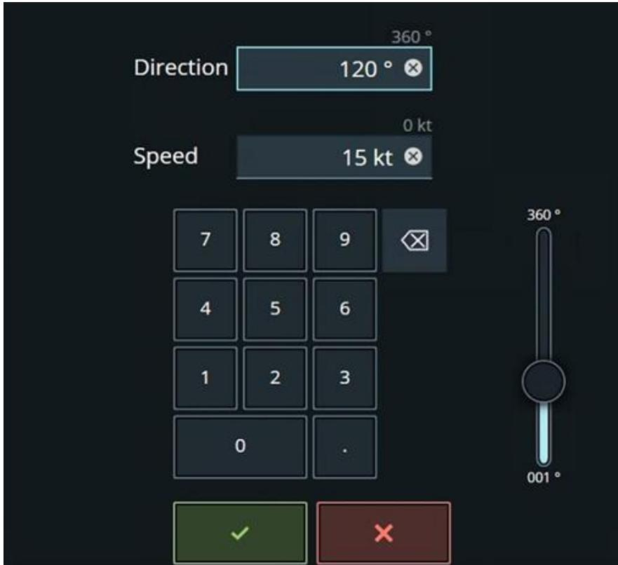
Figure 22 A/C Wind Direction Keypad

## 7.7 A/C OAT Keypad

The A/C OAT keypad displays the current Outside Air Temperature (OAT) at the aircraft location.

To change the A/C OAT at the aircraft location:

1) Use the keypad or the slider control to enter a new OAT at the aircraft.
2) Tap on the green checkmark to confirm your selection or the red X to cancel the entry.

The entire temperature profile will be offset by the change in the OAT (Dynamic Min/Max).

If the aircraft is on the ground, the OAT change is instantaneous regardless of flight freeze.

If the aircraft is in the air and flight freeze is not active, a change to OAT is immediately ramped, at a pre-determined rate, to the requested value.

If the aircraft is in the air and flight freeze is active, a change to OAT is delayed until flight freeze is released.

The advisory message, Temperature is Changing, will appear in the warning footer area of the IOS until the change is completed. The ramped OAT reading will be indicated on the IOS while the new value is reached.

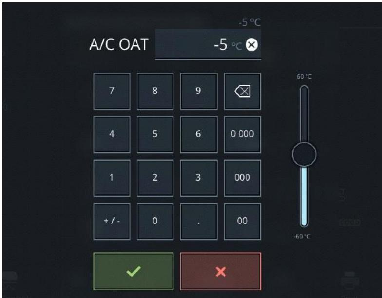
Figure 23 A/C OAT Keypad

## 7.8 A/C ISA Dev Keypad

The A/C ISA Dev keypad displays the current ISA temperature deviation at the aircraft location.

To change the ISA temperature deviation at the aircraft location:

1) Use the keypad to enter a new ISA deviation at the aircraft.
2) Tap on the green checkmark to confirm your selection or the red X to cancel the entry.

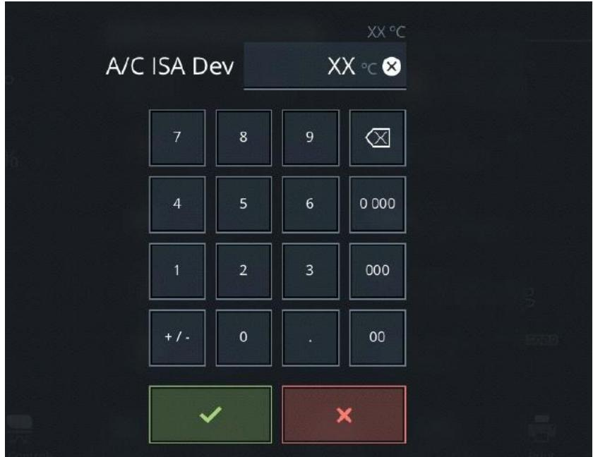
Figure 24 ISA Dev Keypad

## 8. AIRCRAFT Tab

The AIRCRAFT Tab allows the instructor to:

Quickly set aircraft initial conditions

Control and monitor aircraft parameters such as:

o Weight and balance

o Fuel Tank quantities

o Data Link (DL)

Control and monitor communication and navigation radios

Open and close aircraft doors and access service panels

Carry out certain ground service operations

Monitor aircraft conditions

Trigger malfunctions

Trip/pop circuit breakers

This tab features input text fields and quick access buttons to quickly access sliding panels and keypads and change aircraft parameters.

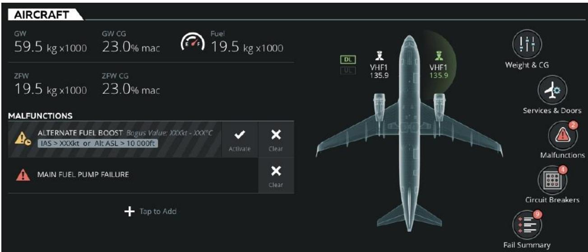
Figure 25 AIRCRAFT Tab

## 8.1 Parameter Input Text Fields

The AIRCRAFT tab includes parameter input text fields that upon tapping will display the associated keypad.

Some parameters in this tab can also be adjusted using the Wheel Picker. To use the wheel picker:

Press and hold on a parameter until the Wheel Picker is displayed or swipe this parameter up or down to display the Wheel Picker.

Scroll through the selection and select:

o The green checkmark to confirm your selection.

o The red X to cancel your selection.

## 8.1.1 GW

This input text field displays the aircraft Gross Weight (GW) in the selected unit (kilograms/pounds x1000).

To modify the aircraft GW either:

Tap on this input text field to display the GW keypad.

• Use this keypad to change the aircraft Gross Weight or use the Wheel Picker.

Selection of a new Gross Weight is achieved with appropriate change in Zero Fuel Weight (ZFW). If new Zero Fuel Weight is outside limits identified by approved data, then fuel weight is also adjusted as required. (Dynamic Min/Max).

## 8.1.2 GW CG

This input text field displays the Gross Weight Center of Gravity (GW CG) in % MAC.

To modify the aircraft GW CG either:

Tap on this input text field to display the GW CG keypad.

• Use this keypad to change the GW CG or use the Wheel Picker:

Selection of a new aircraft Center of Gravity is achieved with appropriate change in Zero Fuel Weight Center of Gravity.

If new Zero Fuel Weight Center of Gravity is outside limits identified by approved data, then the fuel weight is reduced and the Zero Fuel Weight is increased as required. (Dynamic Min/Max).

## 8.1.3 ZFW

This input text field displays the aircraft Zero Fuel Weight (ZFW) in the selected unit (kilograms/pounds x1000).

To modify the aircraft ZFW either:

Tap on this input text field to display the ZFW keypad.

• Use this keypad to change the ZFW or use the Wheel Picker.

Selection of a new Zero Fuel Weight is achieved with appropriate change in Gross Weight.

If a new gross weight is outside limits identified by approved data, then fuel weight is also adjusted as required. (Dynamic Min/Max).

## 8.1.4 ZFW CG

This input text field displays the Zero Fuel Weight Center of Gravity (ZFW CG) in % MAC.

To modify the aircraft ZFW CG either:

• Tap on this input text field to display the ZFW CG keypad.

• Use this keypad to change the ZFW CG or use the Wheel Picker.

Selection of a new Zero Fuel Weight Center of Gravity is achieved with appropriate change in aircraft center of gravity.

## 8.1.5 Fuel

This input text field displays the aircraft total fuel in the selected unit (kilograms/pounds x1000).

To modify the aircraft total fuel weight either:

Tap on this input text field to display the Fuel keypad.

• Use this keypad to change the aircraft total fuel quantity or use the Wheel Picker.

Fuel is distributed in accordance with the aircraft fuel distribution schedule.

Selection of a new fuel weight is achieved with appropriate change in Gross Weight.

If a new Gross Weight is outside limits identified by approved data, then Zero Fuel Weight is also adjusted as required. (Dynamic Min/Max).

## 8.2 GW Keypad

The GW keypad displays the current Gross Weight and allows the instructor to enter another GW value either through the keypad or the slider.

Figure 26 GW Keypad

## 8.3 GW CG Keypad

The GW CG keypad displays the current Gross Weight Center of Gravity (GW CG) and allows the instructor to enter another GW CG value either through the keypad or the slider.

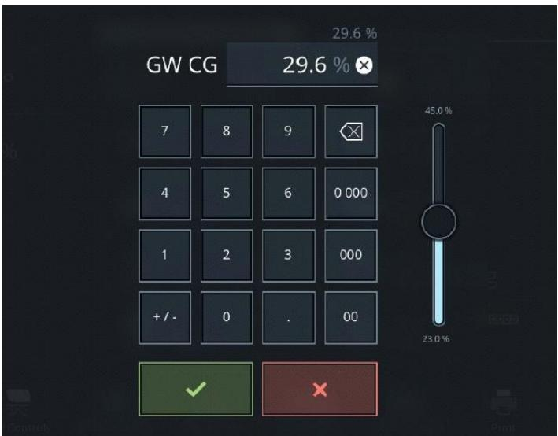
Figure 27 GW CG Keypad

## 8.4 ZFW Keypad

The ZFW keypad displays the current Zero Fuel Weight (ZFW) and allows the instructor to enter another ZFW value either through the keypad or the slider.

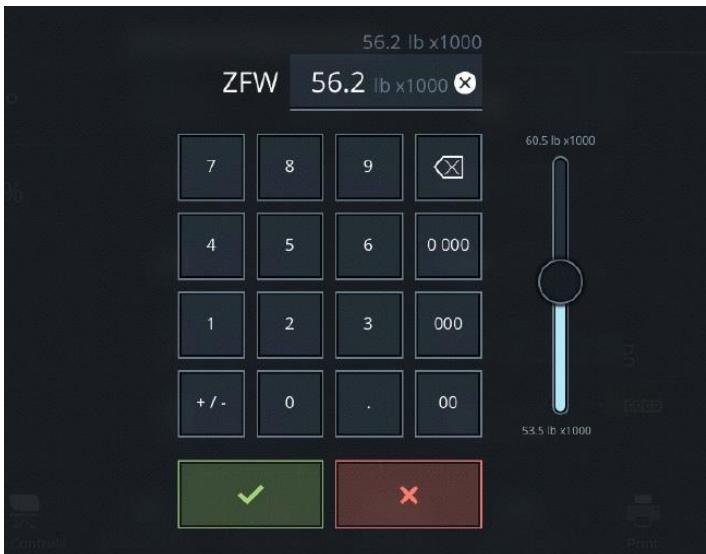
Figure 28 ZFW Keypad

## 8.5 ZFW CG Keypad

The ZFW CG keypad displays the current Zero Fuel Weight Center of Gravity (ZFW CG) and allows the instructor to enter another ZFW CG value either through the keypad or the slider.

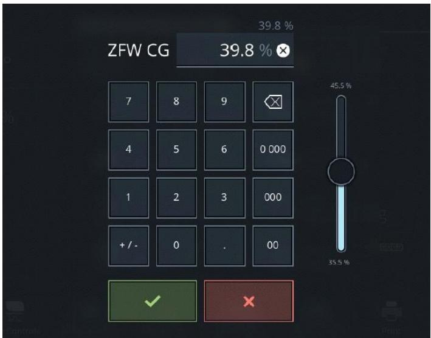
Figure 29 ZFW CG Keypad

## 8.6 Fuel Keypad

The Fuel keypad displays the current fuel weight and allows the instructor to enter another fuel weight value either through the keypad or the slider.

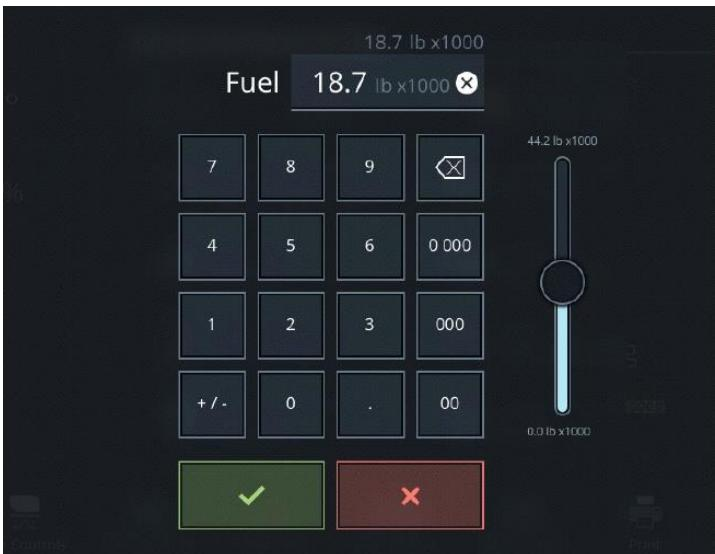
Figure 30 Fuel Keypad

## 8.7 Quick Access Buttons

The AIRCRAFT tab includes quick access buttons that upon tapping will display the associated sliding panel.

## 8.7.1 DL

This button displays the Datalink (DL) status. When the datalink log has incoming downlink messages from the crew, this button illuminates green.

Tap this button to display the DATALINK sliding panel.

## 8.7.2 UL

This button displays the Uplink (UL) status. When the datalink log has uplink messages sent from instructor ground operation roleplay to crew, this button illuminates orange.

Tap this button to display the DATALINK sliding panel.

## 8.7.3 VHF

This button displays:

• The status of the pilot and copilot radio communication.

• The radio transmission frequencies tuned by the pilot and copilot.

When a crew member speaks, green emitting waves are displayed next to pilot/copilot icons.

Tap this button to display the COMMUNICATIONS sliding panel.

## 8.7.4 Weight &CG

Tap this button to display the WEIGHT & BALANCE sliding panel.

## 8.7.5 Services & Doors

Tap this button to display the SERVICES & DOORS sliding panel.

## 8.7.6 Malfunctions

Tap this button to display the MALFUNCTIONS sliding panel. A red badge on this quick access button indicates the number of active and armed malfunctions.

## 8.7.7 Circuit Breakers

Tap this button to display the CIRCUIT BREAKERS sliding panel. A red badge on this quick access button indicates the number of circuit breakers that are tripped/popped.

## 8.7.8 Fail Summary

Tap this button to display the FAIL SUMMARY sliding panel. A red badge on this quick access button indicates the number failures included in the FAIL SUMMARY sliding panel.

## 8.8 DATALINK (DL/UL) Sliding Panel

The DATALINK sliding panel allows the instructor to:

Uplink messages to the simulated aircraft

• Show communication between the simulated aircraft and the simulated ground station

Review and reply to messages from the simulated aircraft

• Control connections of:

o Air Traffic Controller (ATC)

o Automatic Dependent Surveillance (ADS)

Trigger various ground station datalink failures

This sliding panel includes two tabs:

• LOG

• CONNECTIVITY CONTROL

Figure 31 DATALINK (DL/UL) Sliding Panel

AIRCRAFT Tab 13 Oct 2017 Page 54

## 8.8.1 LOG Tab

The LOG tab displays a history of communication between the simulated aircraft and the simulated ground station, where the latest message is always displayed at the top of the page.

This Tab includes the following buttons:

Clear One Tap this button to clear the oldest message from the log. The oldest message is located at the bottom of the history log.

Clear All Tap this button to clear all logged messages in the DATALINK LOG Tab.

Send Uplink Tap this message box to display the NEW UPLINK tab.

## 8.8.2 NEW UPLINK Tab

The NEW UPLINK Tab allows the instructor to send uplink messages. This tab includes the following sections:

GROUPS

SCENARIOS

SCENARIOS

Message Editor

## 8.8.2.1 GROUPS Section

This section lists all the various groups of scenarios for which uplink messages exist.
Tap on one of the GROUPS button to make your selection.

## 8.8.2.2 SCENARIOS Section

This section lists all the various uplink message categories within a selected group. Tap on one of the scenarios button to view the available uplink messages for the selected category.

## 8.8.2.3 SCENARIOS (Uplink Messages) Section

This section lists all the available uplink messages for the selected scenario (category)

## 8.8.2.3.1 Add Button

Tap the Add button next to an uplink message to add this uplink message into the Message editor section.

## 8.8.2.4 Message Editor Section

This section shows the selected uplink messages and includes the controls to allow the instructor to set parameters such as time and altitude as well as control the order in which messages are sent to the crew.

## 8.8.2.4.1 Remove

Tap the Remove button within an uplink message, removes the uplink message from the Message editor section.

## 8.8.2.4.2 ▲ and ▼ Buttons

Tap the ▲ and ▼ buttons to change the message priority within the Message Editor section. The message priority within this box is the order in which messages will be sent the crew.

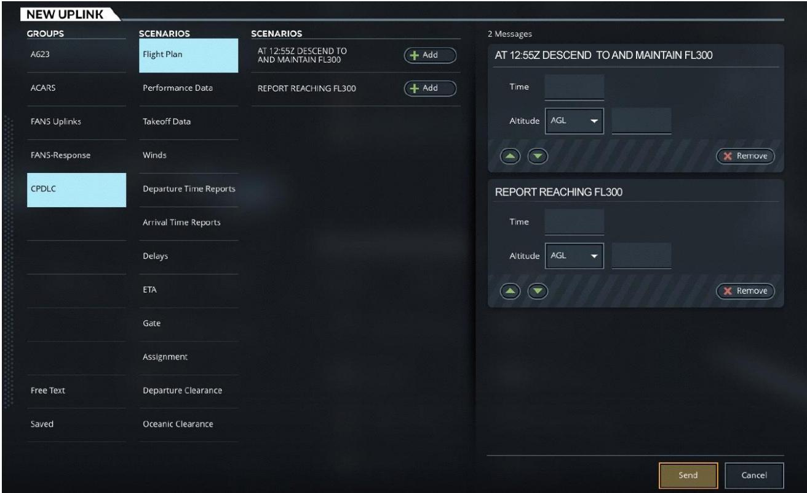
Figure 32 NEW UPLINK Tab

## 8.8.3 CONNECTIVITY CONTROL Tab

The CONNECTIVITY CONTROL Tab provides the controls to connect/disconnect to ATC and ADS centers and displays Ground Communication status.

This tab includes the following sections:

ATC

• ADS

GROUND

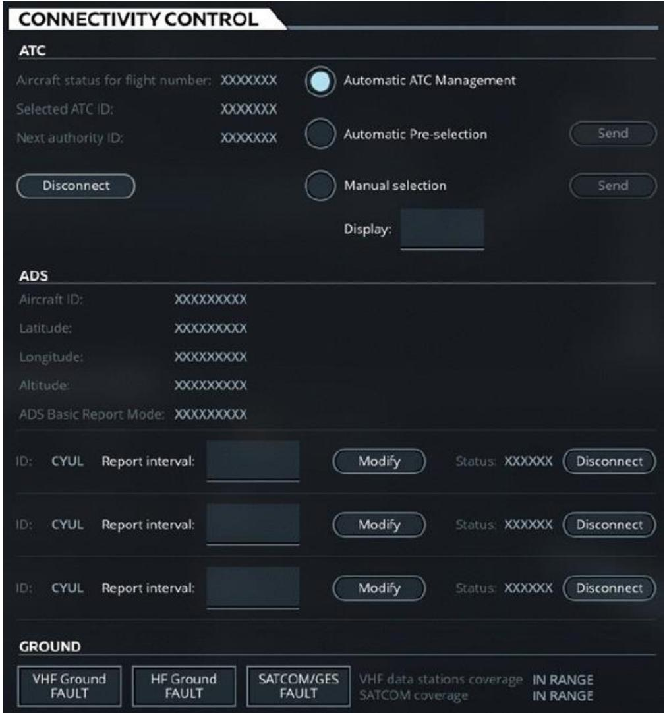
Figure 33 CONNECTIVITY Control Tab

## 8.8.3.1 ATC Section

This section mainly consists of ready only fields and radio buttons.

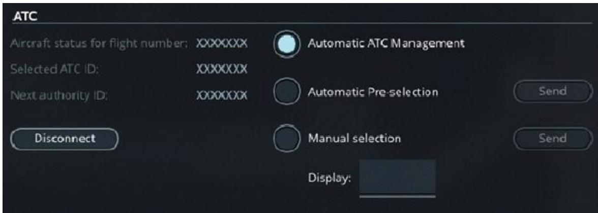
Figure 34 ATC Section

## 8.8.3.1.1 Read-Only Fields

The read-only fields display the current ATC connection flight number, active ATC ID and Next authority ID.

## 8.8.3.1.2 Radio Buttons

There are three mutually exclusive radio buttons to select the next data authority.

Automatic ATC Management

Tap this radio button to activate the Automatic ATC Management mode. In this mode, the data authority transfer is handled by the ground station simulation which requires no action from the instructor.

Automatic Pre-selection

Tap this button to activate the Automatic Pre-Selection mode. In this mode, the next data authority is suggested by the software but the transfer must be initiated by the instructor by taping the Send button.

Manual Selection

Tap this button to activate the Manual Selection mode. In this mode, the next data authority must be selected by the instructor through the Display input text field. Once the next data authority selected, tap on the Send button to initiate the transfer.

## 8.8.3.1.3 Disconnect

Tap this button to disconnect the current active ATC connection. Tapping this button displays a pop menu to confirm the disconnect.

## 8.8.3.2 ADS Section

The Automatic Dependent Surveillance (ADS) section displays ADS information and controls the ADS connections. This section includes read-only fields and a list of ADS center IDs.

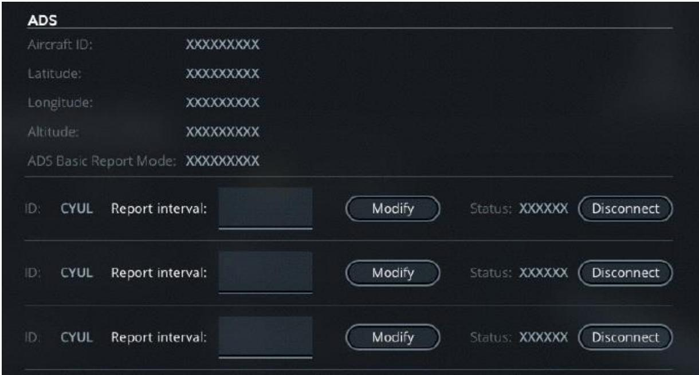
Figure 35 ADS Tab

## 8.8.3.2.1 Read-Only Fields

The read-only fields display the partial content of the last received ADS report.

Aircraft ID

Latitude

• Longitude

• Altitude

ADS Basic Report Mode

## 8.8.3.2.2 List of ADS Center IDs

This portion of the ADS section lists all the ADS Center IDs with associated controls.

<table><tr><td>ID</td><td>Displays the ADS Center ID.</td></tr><tr><td>Report Interval</td><td>Displays the ADS reporting interval.</td></tr><tr><td>Modify</td><td>Tap this button to modify the ADS reporting interval.</td></tr><tr><td> Status</td><td>Displays the status of the ADS connection.</td></tr><tr><td>Connect/Disconnect</td><td>Tap this button to initiate the ADS connection or the ADS disconnect.</td></tr></table>

## 8.8.3.3 GROUND Section

This section provides a status of ground communication and allows the instructor to trigger communication failures. This section includes the following buttons.

## 8.8.3.3.1 VHF Ground FAULT

From the Normal state, tap this toggle fail button to trigger a datalink communication failure with the VHF ground station.

From the Activated state, tap this toggle fail button to clear the failure and return to the Normal state.

## 8.8.3.3.2 HF Ground FAULT

From the Normal state, tap this toggle fail button to trigger a datalink communication failure with the HF ground station.

From the Activated state, tap this toggle fail button to clear the failure and return to the Normal state.

## 8.8.3.3.3 SATCOM/GES FAULT

From the Normal state, tap this toggle fail button to trigger a datalink communication failure with the SATCOM ground station.

From the Activated state, tap this toggle fail button to clear the failure and return to the Normal state.

## 8.9 COMMUNICATIONS Sliding Panel

The COMMUNICATIONS sliding panel allows the instructor to:

Establish:

o VHF and HF radio communications

o Communication with Inter Communication Systems (ICS)

Listen to radio navigation signals

Select various communication modes

This sliding panel provides controls to change any audio monitor, instructor transmit, crew transmit or calls controls. It includes the following tabs:

VOLUME

RADIO

INTERCOM

• NAVIGATION

SPECIAL FEATURES

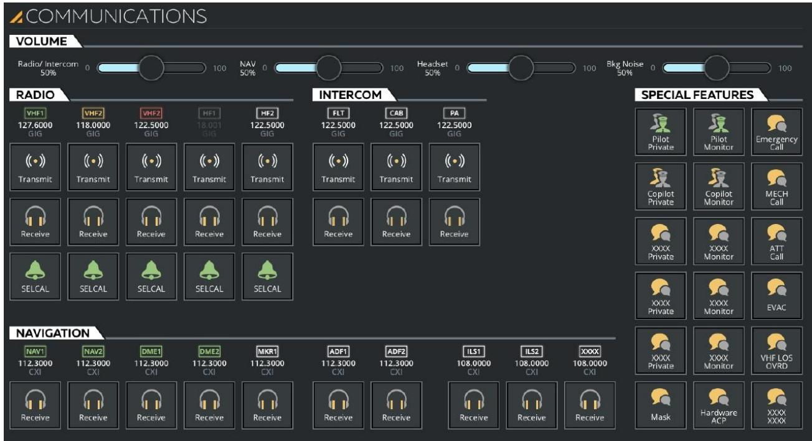
Figure 36 COMMUNICATIONS Sliding Panel (Typical)

## 8.9.1 VOLUME Tab

The VOLUME tab allows the instructor to control the volume level of audio signals through slider controls. There are several sliders to control:

Radio/Intercom headphone audio

Navigation audio signal

Headset audio

Bkg Noise

Each volume sliding control can vary the volume from a minimum value to a maximum value.

## Figure 37 VOLUME Tab (Typical)

## 8.9.2 RADIO Tab

The RADIO tab allows the instructor to transmit on a selected VHF/HF radio, listen to channels/receivers or initiate a selective call (SELCAL) to simulate a ground radio station wishing to communicate the flight crew.

This tab displays all available VHF and HF radios.

Each of these radios is assigned a radio name and displays:

The selected frequency and,

The name of the tuned GND Station type

Each radio includes three buttons:

Transmit

Tap this button to transmit on the selected radio.

Receive

Tap this button to listen to selected channels or receivers.

SELCAL Tap this button to initiate a SELCAL on the selected transceiver or a call in the cockpit.

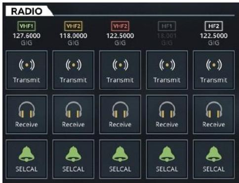
Figure 38 RADIO Tab

## 8.9.3 INTERCOM Tab

The INTERCOM tab allows the instructor to communicate with Inter Communication Systems (ICS) such as:

Flight Deck (FLT)

• Cabin (CAB)

• Passenger Address (PA)

Each of the ICS includes:

Intercom Call Incoming Info
Intercom Name
Transmit

Tap this button to allow the instructor to transmit on the selected ICS. This button is disabled if there is no power on a specific radio transmitter.

Receive

Tap this button to allow the instructor to listen on the selected ICS.

## 8.9.4 NAVIGATION Tab

The NAVIGATION tab allows the instructor to listen to the signal of navigation systems such as:

Navigation (NAV)

Distance Measuring Equipment (DME)

• Marker Beacon

Automatic Direction Finder (ADF)

Instrument Landing System (ILS)

Listening to a navigation receiver consists of selecting the relevant Receive button.

Each navigation receiver includes Navigation:

Receiver name

• Tuned-in frequency

• Receiver station name

## 8.9.4.1 Receive

Tap the Receive button of the desired navigation radio to listen to the radio signal and monitor the navigation receiver.

## 8.9.5 SPECIAL FEATURES Tab

The SPECIAL FEATURES tab allows the instructor to select various communication modes such as private communication and communication monitoring as well as other various types of calls.

## 8.9.5.1 Pilot Private

Tap this button to establish a private communication between the instructor and the Pilot.

## 8.9.5.2 Copilot Private

Tap this button to establish a private communication between the instructor and the Copilot.

## 8.9.5.3 Pilot Monitoring

Tap this button to monitor Pilot communications.

## 8.9.5.4 Copilot Monitor

Tap this button to monitor Co-pilot communications.

## 8.9.5.5 Emergency Call

Tap this button to simulate the instructor placing an emergency call in the cockpit.

## 8.9.5.6 MECH Call

Tap this button to simulate the instructor making a call from a mechanic (MECH) to the cockpit crew.

AIRCRAFT Tab 13 Oct 2017 Page 64

## 8.9.5.7 ATT Call

Tap this button to simulate the instructor making a call from an attendant (ATT) to the cockpit crew.

## 8.9.5.8 EVAC

Tap this button to have the instructor trigger an EVACuation attention getter in the cockpit.

## 8.9.5.9 Mask

Tap this button to activate the microphone in the instructor mask during cockpit smoke simulation.

## 8.9.5.10 Hardware ACP

Tap this toggle button to activate/deactivate the Instructor Station Audio Control Panel (ACP).

## 8.9.5.11 VHF LOS OVRD

Tap this button to allow communication irrespective of the aircraft LOS to the tuned ground station or propagation degradation.

When selected, the instructor VHF radios are considered on-board as per the cockpit crew’s VHF radios.

When deselected, the distance and elevation of the simulated aircraft with respect to the tuned ground station are computed to realistically simulate air-to-ground communication.

## 8.10 WEIGHT & BALANCE Sliding Panel

The WEIGHT & BALANCE sliding panel allows the instructor to quickly configure the weight of the aircraft. It includes all the necessary controls to quickly:

Set the aircraft to predefined weights

Adjust the Zero Fuel Weight

Adjust the fuel weight

Manage the fuel weight of each fuel tank

This sliding panel includes three main tabs:

QUICKSETS

PERFORMANCE DATA

WEIGHT & CG

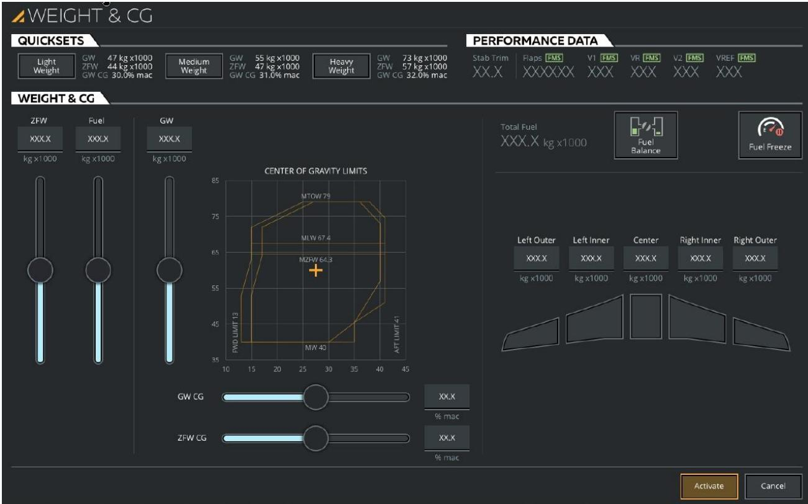
Figure 39 WEIGHT & BALANCE Sliding Panel

## 8.10.1 QUICKSETS Tab

The QUICKSETS Tab allows the instructor to set the aircraft to pre-defined aircraft weights. Each setting includes a Gross Weight (GW) value, Zero Fuel Weight (ZFW) and GW CG. This tab features three mutually exclusive buttons.

## 8.10.1.1 Light Weight

From the Normal state, tap this button to set the aircraft to the pre-defined aircraft light weight.

## 8.10.1.2 Medium Weight

From the Normal state, tap this button to set the aircraft to the pre-defined aircraft medium weight.

## 8.10.1.3 Heavy Weight

From the Normal state, tap this button to set the aircraft to the pre-defined aircraft heavy weight.

## 8.10.2 PERFORMANCE DATA Tab

The PERFORMANCE DATA tab includes read-only fields that provide the status of various flight control settings and aircraft speeds.

## 8.10.2.1 Stab Trim

This read-only field displays the Stab Trim adjustment setting.

## 8.10.2.2 Flaps

This read-only field displays the Flap Lever position in the cockpit.

## 8.10.2.3 V1

This read-only field displays the V1 speed. An FMS flag displayed next to the speed indicates that the V1 speed originates from the FMS.

## 8.10.2.4 VR

This read-only field displays the VR speed. An FMS flag displayed next to the speed indicates that the VR speed originates from the FMS.

## 8.10.2.5 V2

This read-only field displays the V2 speed. An FMS flag displayed next to the speed indicates that the V2 speed originates from the FMS.

## 8.10.2.6 VREF

This read-only field displays the VREF speed. An FMS flag displayed next to the speed indicates that the VREF speed originates from the FMS.

## 8.10.3 WEIGHT & CG Tab

The WEIGHT & CG Tab allows the instructor to:

Adjust the ZFW of the aircraft

Set the total fuel weight on the aircraft

• Carry out fuel management functions such as:

o Individually adjust the fuel weight of each tank

o Balance the fuel in all tanks

o Freeze the fuel consumption during a training session.

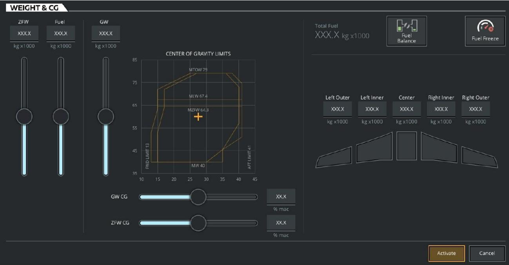
Figure 40 Weight & CG Tab

## 8.10.3.1 ZFW

The Zero Fuel Weight (ZFW) of the aircraft can be changed instantly in either one of two ways:

Input text field (kilograms/pounds x1000)

Slider Control

To change the ZFW:

1) Tap on the ZFW input text field, this will display a keypad.
2) Use the keypad to manually enter a specific value. Or,
3) Use the slider control to change the ZFW.

Adjusting the ZFW to a new value automatically results in a new Gross Weight value. If the new gross weight value is outside limits as identified by approved data, then fuel weight is also adjusted as required. (Dynamic Min/Max).

## 8.10.3.2 Fuel

The Fuel weight of the aircraft can be changed instantly in either one of two ways:

Input text field (kilograms/pounds x1000)

Slider Control

To change the Fuel weight:

1) Tap on the Fuel input text field, this will display a keypad.
2) Use the keypad to manually enter a specific value.
3) Use the slider control to change the Fuel weight.

Adjusting the Fuel weight to a new value automatically results in a new Gross Weight value. If the new gross weight value is outside limits as identified by approved data, then Zero Fuel Weight is also adjusted as required. (Dynamic Min/Max).

Note: Fuel onboard the aircraft is distributed in accordance with the aircraft fuel distribution schedule.

## 8.10.3.3 GW

The Gross Weight (GW) of the aircraft can be changed instantly in either one of two ways:

Input text field (kilograms/pounds x1000)

Slider Control

To change the aircraft GW:

1) Tap on the GW input text field, this will display a keypad.
2) Use the keypad to manually enter a specific value. Or,
3) Use the slider control to change the GW.

Adjusting the GW of the aircraft to a new value automatically results in a new ZFW value. If the new ZFW value is outside limits as identified by approved data, then the Fuel weight will also be adjusted as required. (Dynamic Min/Max).

## 8.10.3.4 GW CG

The aircraft Gross Weight Center of Gravity (GW CG) can be changed instantly in either one of two ways:

Input text field (% MAC)

Slider Control

To change the aircraft GW CG:

1) Tap on the GW CG input text field, this will display a keypad.
2) Use the keypad to manually enter a specific value.
3) Use the slider control to change the GW CG.

Adjusting the GW CG of the aircraft to a new value automatically results in a new Zero Fuel Weight Center of Gravity (ZFW CG) value. If the new ZFW CG value is outside limits as identified by approved data, then the Fuel weight is reduced and the Zero Fuel Weight (ZFW) is increased as required. (Dynamic Min/Max).

## 8.10.3.5 ZFW CG

The aircraft Zero Fuel Weight Center of Gravity (ZFW CG) can be changed instantly in either one of two ways:

Input text field (% MAC)

Slider Control

To change the aircraft ZFW CG:

1) Tap on the ZFW CG input text field, this will display a keypad.
2) Use the keypad to manually enter a specific value. Or,
3) Use the slider control to change the ZFW CG.

Adjusting the ZFW CG of the aircraft to a new value automatically results in a new aircraft GW CG value. If the new aircraft GW CG value is outside limits as identified by approved data, then the Fuel weight is reduced and the Zero Fuel Weight (ZFW) is increased as required. (Dynamic Min/Max).

## 8.10.3.6 Center of Gravity Limits Graph

This graph displays the Aircraft Weight vs Aircraft CG operating envelope of the aircraft with the current weight and CG indicated by a cursor within the envelope.

As this is an interactive graph, the instructor can modify the current aircraft weight and CG by simply touching and moving the cursor (+) inside the envelop on the graph.

## 8.10.3.7 Left Outer Fuel Tank

The fuel weight of the Left Outer Fuel Tank can be changed instantly in either one of two ways:

Input text field (kilograms/pounds x1000)

Slider Control

To change the Left Outer Fuel Tank weight:

1) Tap on the Left Outer input text field, this will display a keypad.
2) Use the keypad to manually enter a specific value.
3) Use the slider control to change the fuel weight.

Adjusting the fuel weight of the Left Outer Fuel Tank to a new value automatically results in a new Gross Weight (GW) value. If the new Gross Weight (GW) value is outside limits as identified by approved data, then Zero Fuel Weight (ZFW) is also adjusted as required. (Dynamic Min/Max).

## 8.10.3.8 Left Inner Fuel Tank

The fuel weight of the Left Inner Fuel Tank can be changed instantly in either one of two ways:

Input text field (kilograms/pounds x1000)

Slider Control

To change the Left Inner Fuel Tank weight:

1) Tap on the Left Inner input text field, this will display a keypad.
2) Use the keypad to manually enter a specific value.
3) Use the slider control to change the fuel weight.

Adjusting the fuel weight of the Left Outer Fuel Tank to a new value automatically results in a new Gross Weight (GW) value. If the new Gross Weight (GW) value is outside limits as identified by approved data, then Zero Fuel Weight (ZFW) is also adjusted as required. (Dynamic Min/Max).

## 8.10.3.9 Right Outer Fuel Tank

The fuel weight of the Right Outer Fuel Tank can be changed instantly in either one of two ways:

Input text field (kilograms/pounds x1000)

Slider Control

To change the Right Outer Fuel Tank weight:

1) Tap on the Right Outer input text field, this will display a keypad.
2) Use the keypad to manually enter a specific value.

Or,

3) Use the slider control to change the fuel weight.

Adjusting the fuel weight of the Right Outer Fuel Tank to a new value automatically results in a new Gross Weight (GW) value. If the new Gross Weight (GW) value is outside limits as identified by approved data, then Zero Fuel Weight (ZFW) is also adjusted as required. (Dynamic Min/Max).

AIRCRAFT Tab 13 Oct 2017 Page 72

## 8.10.3.10 Right Inner Fuel Tank

The fuel weight of the Right Inner Fuel Tank can be changed instantly in either one of two ways:

Input text field (kilograms/pounds x1000)

Slider Control

To change the Right Inner Fuel Tank weight:

1) Tap on the Right Inner input text field, this will display a keypad.
2) Use the keypad to manually enter a specific value. Or,
3) Use the slider control to change the fuel weight.

Adjusting the fuel weight of the Right Inner Fuel Tank to a new value automatically results in a new Gross Weight (GW) value. If the new Gross Weight (GW) value is outside limits as identified by approved data, then Zero Fuel Weight (ZFW) is also adjusted as required. (Dynamic Min/Max).

## 8.10.3.11 Center Fuel Tank

The fuel weight of the Center Fuel Tank can be changed instantly in either one of two ways:

Input text field (kilograms/pounds x1000)

Slider Control

To change the Center Fuel Tank weight:

1) Tap on the Center input text field, this will display a keypad.
2) Use the keypad to manually enter a specific value.
3) Use the slider control to change the fuel weight of the center fuel tank.

Adjusting the fuel weight of the center fuel tank to a new value automatically results in a new Gross Weight (GW) value. If the new Gross Weight (GW) value is outside limits as identified by approved data, then Zero Fuel Weight (ZFW) is also adjusted as required. (Dynamic Min/Max).

## 8.10.3.12 Fuel Balance

From the Normal state, tap this action button to balance the fuel tank quantities.

This button illuminates while fuel balance is in progress, then this button returns to the Normal state.

## 8.10.3.13 Fuel Freeze

From the Normal state, tap this toggle button to activate the fuel freeze function. From the Activated state, tap this toggle button to return to the Normal state and deactivate the fuel freeze function.

When Fuel Freeze is activated:

• All aircraft instruments continue to indicate normally

o Except the fuel quantity indicators, as these remain inactive because no fuel is consumed by the aircraft during Fuel Freeze.

• All other aircraft systems remain unaffected except for the effects of fuel freeze.

Refuel remains possible.

During a reposition, the Fuel Freeze button is disabled until the reposition or flight trim is completed.

## 8.10.3.14 Activate

Tap this button to execute the new weight and CG selection. This button is disabled if no weight and CG changes have been selected.

## 8.10.3.15 Cancel

Tap this button to cancel the selected weight and CG values. This button is disabled if no weight and CG changes have been selected.

## 8.11 SERVICES & DOORS Sliding Panel

The SERVICES & DOOR sliding panel allows the instructor to:

Carry out certain ground service operations.

Open and close various aircraft access doors.

Emulate various Flight Deck door access requests

This sliding panel includes the following tabs:

SERVICES

• DOORS

AIRCRAFT Tab 13 Oct 2017 Page 74

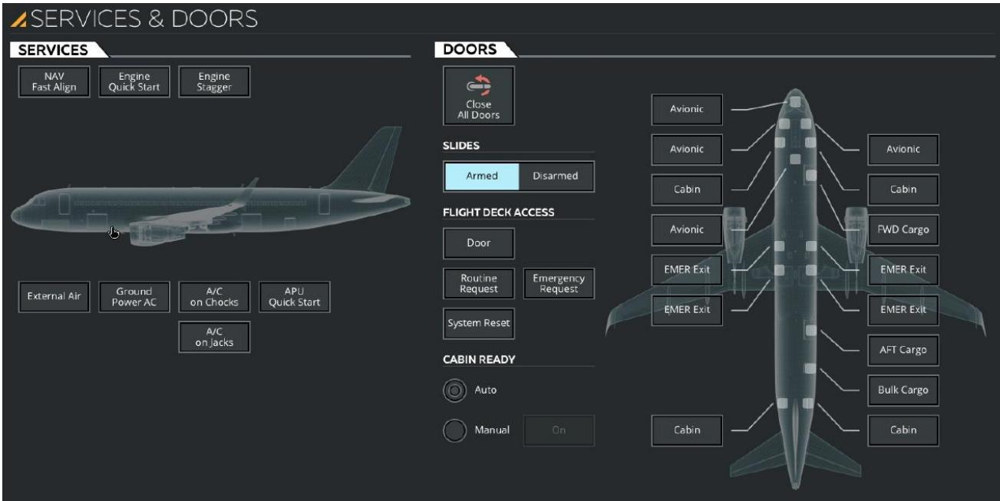
Figure 41 SERVICES & DOORS Sliding Panel

## 8.11.1 SERVICES Tab

The SERVICES tab includes all the necessary buttons to allow the instructor to quickly carry out certain ground service operations.

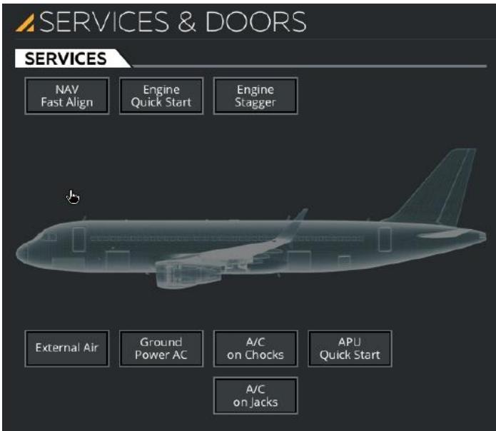
Figure 42 SERVICES Tab

## 8.11.1.1 Nav Fast Align

From the Normal state, tap this action button to align the reference system. This bypasses the systems normal alignment period (IRS, INS, AHRS, ADIRS).

This button:

Illuminates active for two seconds.

• Is disabled when the reference system is aligned or the reference system is off.

## 8.11.1.2 Engine Quick Start

From the Normal state, tap this action button to start the dead engine. This only occurs if the correct conditions are met (e.g. fuel available, fuel levers at idle).

This button:

Illuminates until the engine is started.

• Is disabled when all engines are running.

## 8.11.1.3 Engine Stagger

Tap this toggle button to enable/disable the engine stagger effect. This effect when enabled ensures that some of the engines readout values are not exactly the same, in order to add realism to the simulation, e.g. EGT.

## 8.11.1.4 External Air

From the Normal state, tap this toggle button to connect external pneumatic ground air.

From the Activated state, tap this toggle button to disconnect external pneumatic ground air.

External pneumatic air is automatically disconnected if the aircraft starts moving.

This button is disabled when the aircraft starts moving.

## 8.11.1.5 Ground Power AC

From the Normal state, tap this toggle button to activate external AC electric power. From the Activated state, tap this toggle button to deactivate external AC electric power.

External AC electric power is automatically disconnected if the aircraft starts moving.

This button is disabled when the aircraft is moving.

AIRCRAFT Tab 13 Oct 2017 Page 76

## 8.11.1.6 A/C on Chocks

From the Normal state, tap this toggle button to apply chocks to the aircraft wheels.
In this condition, the aircraft does not move.

From the Activated state, tap this toggle button to remove chocks from the aircraft wheels.

This button is disabled when the aircraft is moving.

The A/C On Jacks and the A/C On Chocks buttons are mutually exclusive.

## 8.11.1.7 A/C on Jacks

From the Normal state, tap this toggle button to set the aircraft on jacks.

When the aircraft is on jacks condition, the aircraft is raised in such a way that the landing gear strut is fully extended. It is then possible to:

Raise and lower the landing gear

Apply thrust without falling off or rotating around the jacks.

From the Activated state, tap this toggle button to remove the aircraft from the jacks condition.

This button is disabled when the aircraft is moving. The A/C On Jacks and the A/C On Chocks buttons are mutually exclusive.

## 8.11.1.8 APU Quick Start

From the Normal state, tap this action button to start the APU. Electrical and pneumatic outputs are available within five seconds.

This button is disabled when:

• The APU is running or,

• If correct conditions for operating are not met

o Master switch on, CB in, fuel available.

## 8.11.2 DOORS Tab

The DOORS tab includes all the necessary buttons to allow the instructor to:

Open and close various aircraft doors

Emulate various Flight Deck door access requests

Control the emergency evacuation slides

By opening various aircraft doors, the instructor can train the flight crew to deal with various door annunciations inside the cockpit.

This tab includes:

Aircraft access door buttons

SLIDES Section

FLIGHT DECK ACCESS section

CABIN READY section

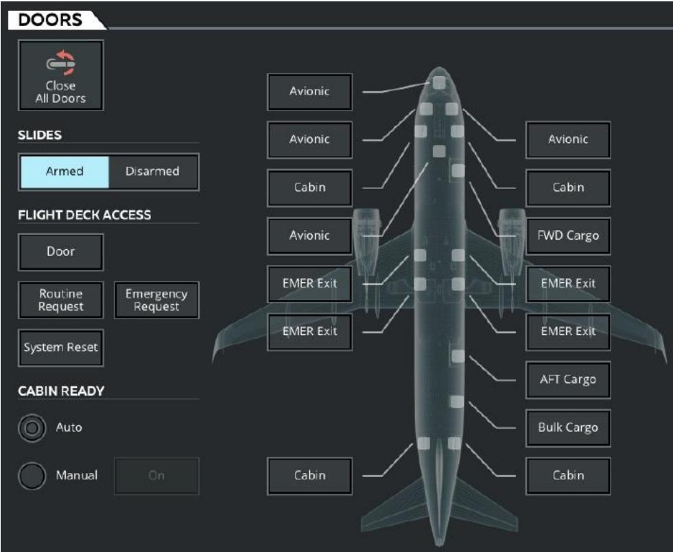
Figure 43 DOORS Tab

AIRCRAFT Tab 13 Oct 2017 Page 78

## 8.11.2.1 Aircraft Access Door Buttons

The Aircraft Access Door Buttons allows the instructor to open/close various aircraft access doors.

## 8.11.2.1.1 Close All Doors

From the Normal state, tap this toggle button to open all aircraft doors.

From the Activated state (light blue), tap this toggle button to close all aircraft doors.

## 8.11.2.1.2 Avionic Doors

From the Normal state, tap an Avionic toggle button to open the associated avionic equipment access door.

From the Activated state (light blue), tap the Avionic button again to close the avionic equipment access door.

## 8.11.2.1.3 Cabin (Forward Left Side)

From the Normal state, tap this toggle button to open the forward passenger/crew LH cabin door.

From the Activated state (light blue), tap this toggle button to close the forward passenger/crew LH cabin door.

## 8.11.2.1.4 Cabin (Forward Right Side)

From the Normal state, tap this toggle button to open the forward passenger/crew RH cabin door.

From the Activated state (light blue), tap this toggle button to close the forward passenger/crew RH cabin door.

## 8.11.2.1.5 Cabin (Aft Left Side)

From the Normal state, tap this toggle button to open the aft passenger/crew LH cabin door.

From the Activated state (light blue), tap this toggle button to close the aft passenger/crew LH cabin door.

## 8.11.2.1.6 Cabin (Aft Right Side)

From the Normal state, tap this toggle button to open the aft passenger/crew RH cabin door.

From the Activated state (light blue), tap this toggle button to close the aft passenger/crew RH cabin door.

## 8.11.2.1.7 EMER Exit (Left Side)

From the Normal state, tap on a left side EMER Exit toggle button to open the associated LH overwing emergency exit door.

From the Activated state (light blue), tap the EMER Exit toggle button again to close the associated LH overwing emergency exit door.

## 8.11.2.1.8 EMER Exit (Right Side)

From the Normal state, tap on a right side EMER Exit toggle button to open the associated RH overwing emergency exit door.

From the Activated state (light blue), tap the EMER Exit toggle button again to close the associated RH overwing emergency exit door.

## 8.11.2.1.9 FWD Cargo

From the Normal state, tap this toggle button to open the forward cargo compartment door.

From the Activated state (light blue), tap this toggle button to close the forward cargo compartment door.

## 8.11.2.1.10 AFT Cargo

From the Normal state, tap this toggle button to open the aft cargo compartment door. From the Activated state (light blue), tap this toggle button to close the aft cargo compartment door.

## 8.11.2.1.11 Bulk Cargo

From the Normal state, tap this toggle button to open the bulk cargo compartment door.

From the Activated state (light blue), tap this toggle button to close the bulk cargo compartment door.

## 8.11.2.2 SLIDES Section

The SLIDES section includes two mutually exclusive buttons to arm or disarm all emergency evacuation slides.

Arm All Slides (Light Blue) indicates that all emergency evacuation slides are armed. Disarm All Slides (Light blue) indicates that all emergency evacuation slides are disarmed.

## 8.11.2.3 FLIGHT DECK ACCESS Section

This section includes buttons allowing the instructor to train a pilot on how to use the avionics instruments or equipment as it relates to the flight deck access door. In this section the instructor can simulate:

• The locking of the flight deck access door

• An attendant trying to get access to the flight deck

## 8.11.2.3.1 Door

From the Normal state, tap this toggle button to open the flight deck access door. From the Activated state (light blue), tap this toggle button to close the flight deck access door.

AIRCRAFT Tab

13 Oct 2017

Page 80

## 8.11.2.3.2 Routine Request

Tap this button to emulate a routine access request at the flight deck access door. This button is disabled if the flight deck door access keypad is deactivated because an access request has been denied or if the system controller is unpowered. When selected, the button stays active for 2 seconds.

## 8.11.2.3.3 Emergency Request

Tap this button to emulate an emergency access request at the flight deck access door. This button is disabled if the flight deck door access keypad is deactivated because an access request has been denied or if the system controller is unpowered. When selected, the button remains active for 2 seconds.

## 8.11.2.3.4 System Reset

Tap this button to reset the flight deck door RESET access system. This button is disabled if the flight deck door access keypad is deactivated because an access request has been denied or if the system controller is unpowered. When selected, the button remains active for 2 seconds.

## 8.11.2.4 CABIN READY Section

The CABIN READY Section includes two mutually exclusive radio buttons to activate the Cabin Ready Auto or Manual mode. Auto is usually the default mode but when Manual mode is selected, this allows the the instructor to display a CABIN READY indication on the ECAM/EICAS Display Unit (DU).

## 8.12 MALFUNCTIONS Sliding Panel

The MALFUNCTIONS sliding panel allows the instructor to preselect and activate malfunctions into the simulation. There can be two types of malfunctions: Active or Armed. An Active malfunction is indicated with a red flag and an Armed malfunction to be triggered in accordance with selected criteria is indicated with a yellow flag.

Active and Armed malfunctions are displayed on the:

• Control Board MALFUNCTIONS section

Control Board Footer

Map Workspace Header

MALFUNCTIONS sliding panel

Malfunctions can be removed from the simulation by tapping:

The Control Board Clear button to clear single malfunction

• The Clear All Malfunctions button on the Control Board Footer

• The Clear Active and Clear Armed buttons on the sliding panel

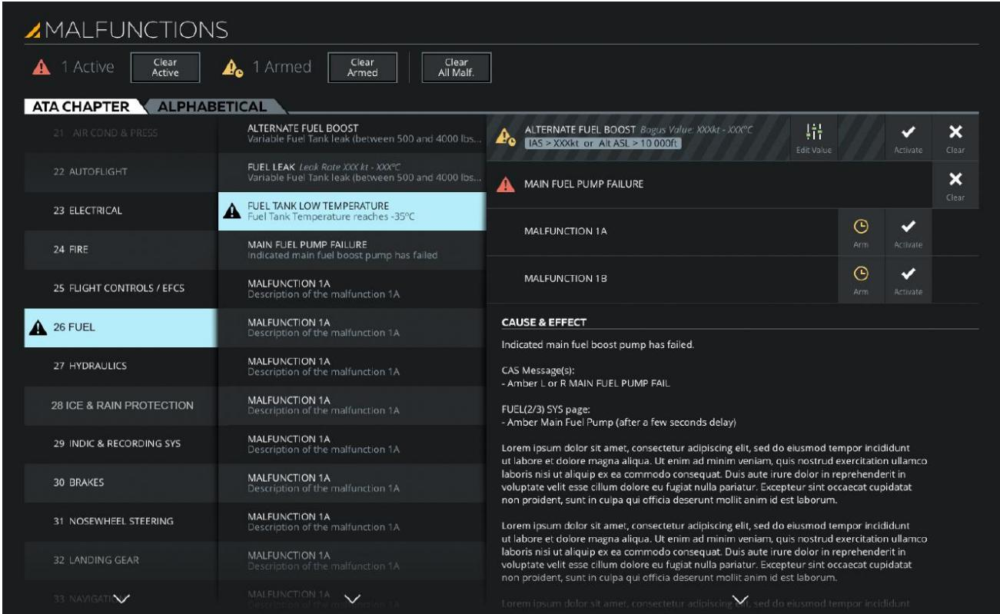
Figure 44 MALFUNCTIONS Sliding Panel

AIRCRAFT Tab

13 Oct 2017

Page 82

The MALFUNCTIONS sliding panel includes:

Status Section

• ATA CHAPTER Tab

• ALPHABETICAL Tab

PHASE OF FLIGHT Tab

## 8.12.1 Status Section

The Status section provides a summary of Active and Armed malfunctions in the simulation. It also offers the possibility to clear active and/or armed malfunctions or clear all malfunctions.

Figure 45 Malfunctions Status Section

## 8.12.2 ATA CHAPTER Tab

The ATA CHAPTER tab provides a list of aircraft systems sorted by the ATA Chapter number. The instructor can then view all available malfunctions on the IOS for a specific ATA Chapter.

A warning flag next to an ATA Chapter indicates malfunctions that are Armed and/or Active for a specific system.

If the flag is yellow, it indicates that the ATA system only has armed malfunctions.

If the flag is red, it indicates that the ATA system has Active malfunctions or has a combination of multiple Armed and at least one Active malfunction.

## 8.12.3 ALPHABETICAL Tab

The ALPHABETICAL tab provides a list of aircraft systems sorted alphabetically. The instructor can then view all available malfunctions on the IOS for a specific aircraft system.

A warning flag next to an ATA Chapter indicates malfunctions that are Armed and/or Active for a specific system.

If the flag is yellow, it indicates that the ATA system only has armed malfunctions.

If the flag is red, it indicates that the ATA system has Active malfunctions or has a combination of multiple Armed and at least one Active malfunction.

## 8.12.4 PHASE OF FLIGHT Tab (Optional)

The PHASE OF FLIGHT Tab is an option that provides a listing of malfunctions grouped by phases of flight.

## 8.12.5 Activating/Arming a Malfunction

To activate/arm a Malfunction proceed as follows:

1) Select an aircraft system either by ATA chapter or alphabetically.
2) Select the desired malfunction for the selected aircraft system.
3) A malfunctions pane is displayed which includes the necessary controls to allow the instructor to:

a) Immediately activate a malfunction

b) Arm a malfunction

c) Clear a single malfunction

d) View the description of the Malfunction Cause & Effect

e) Enter a parameter value

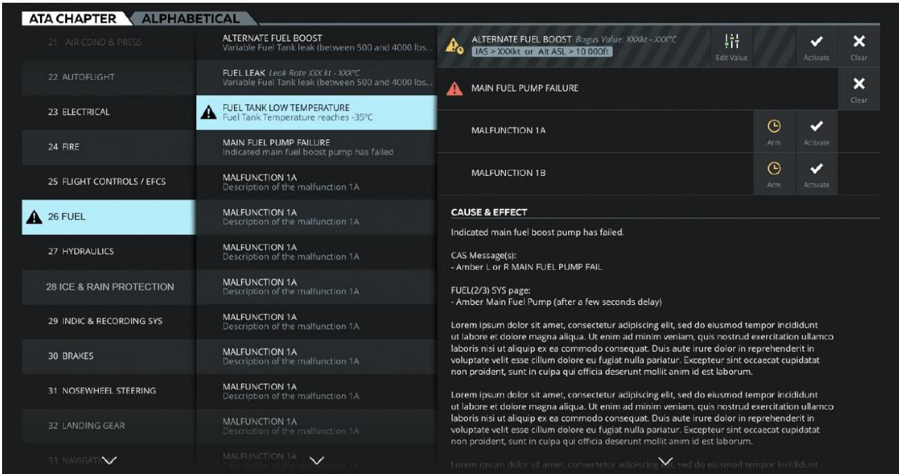
Figure 46 Malfunction Selection

AIRCRAFT Tab 13 Oct 2017 Page 84

## 8.12.5.1 Activate

Tap this button to immediately trigger the selected malfunction.

## 8.12.5.2 Clear

Tap this button to deactivate and clear the selected malfunction.

## 8.12.5.3 Edit Value

Tap this button to display a keypad that will allow the user to change the value of a malfunction criteria.

## 8.12.5.4 Arm

Tap the Arm button to display the ARMING CRITERIA sliding panel.

## 8.12.5.5 CAUSE & EFFECT Section

This section provides a description of the Cause & Effect of the malfunction.

## 8.12.6 ARMING CRITERIA Sliding Panel

This sliding panel offers a list of criteria or conditions associated to the selected malfunction. It allows the instructor select which criteria will serve to arm the malfunction. When the criteria are met, the malfunction is triggered in the simulation session.

The summary of the selected criteria is repeated next to the Arm button.

## 8.12.6.1 Arm

Tap this button to arm the malfunction which will be triggered in accordance with the input criteria.

The Arm button is active when the instructor selects malfunction trigger Criteria.

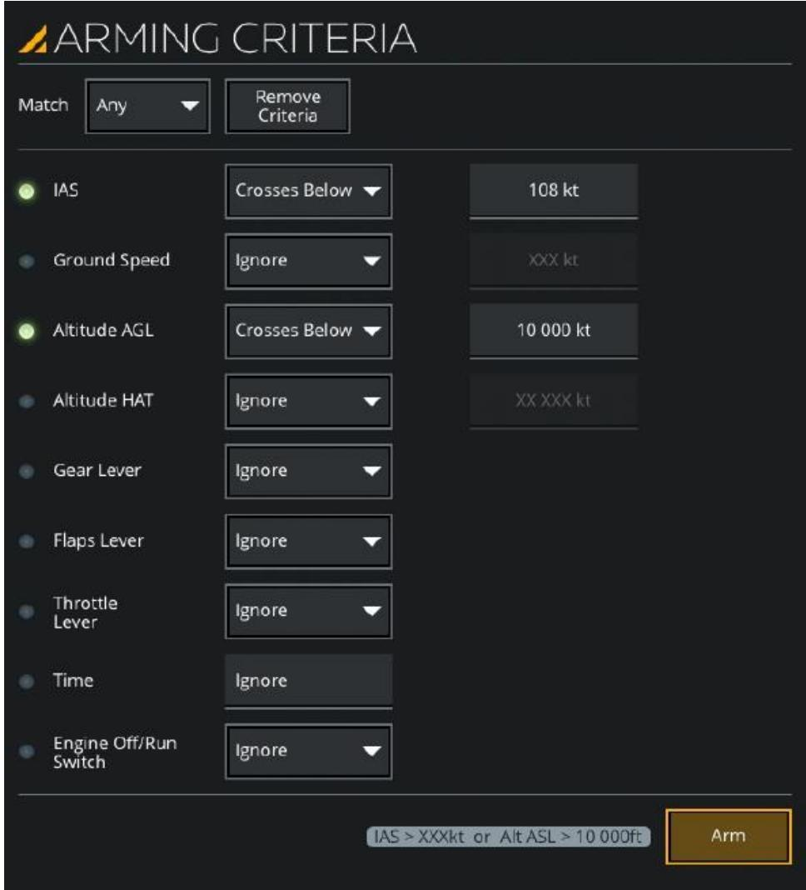
Figure 47 ARMING CRITERIA Sliding Panel

## 8.13 CIRCUIT BREAKERS Sliding Panel

The CIRCUIT BREAKERS sliding panel allows the instructor to trip and pop various hardware and software Circuit Breakers (CBs) on a per aircraft system basis.

This sliding panel includes these tabs:

ATA CHAPTER

• ALPHABETICAL (A – Z)

CIRCUIT BREAKERS

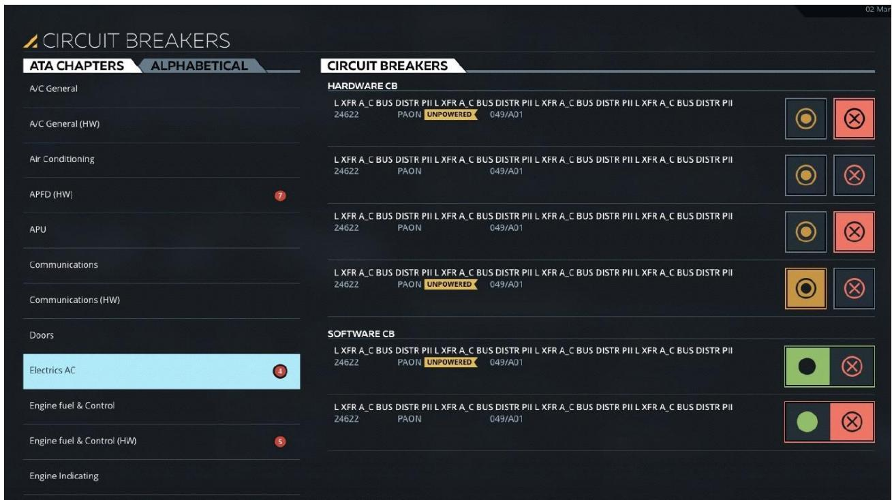
Figure 48 CIRCUIT BREAKERS Sliding Panel

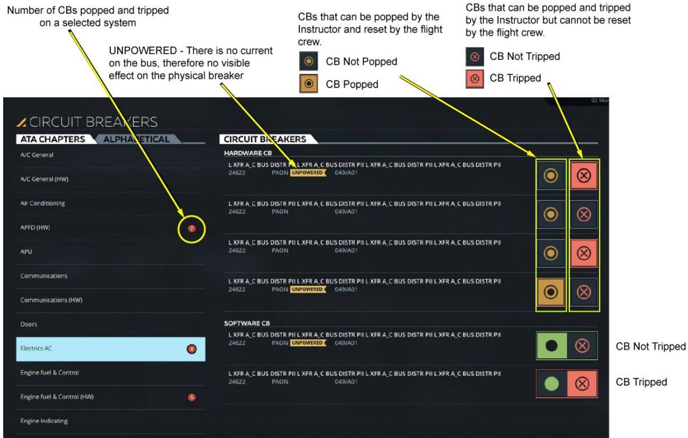
Figure 49 Circuit Breakers - Definitions

## 8.13.1 ATA CHAPTER Tab

The ATA CHAPTER tab provides a list of aircraft systems sorted by the ATA Chapter number. The instructor can then, from this tab view all available Circuit Breakers (CBs) on the IOS on a per system basis.

A red badge displayed next to a system indicates the number of circuit breakers that are tripped/popped on that system.

## 8.13.2 ALPHABETICAL (A - Z) Tab

The ALPHABETICAL (A - Z) tab provides a list of aircraft systems sorted alphabetically. The instructor can then, from this tab view all available Circuit Breakers (CBs) on the IOS on a per system basis.

A red badge displayed next to a system indicates the number of circuit breakers that are tripped/popped on that system.

AIRCRAFT Tab 13 Oct 2017 Page 88

## 8.13.3 CIRCUIT BREAKERS Tab

This CIRCUIT BREAKERS tab displays the status of all hardware and software CBs. This tab is subdivided into two sections:

HARDWARE CB

SOFTWARE CB

Note: Software CBs cannot be reset by the flight crew.

## 8.13.3.1 HARDWARE CB

There are two kinds of hardware circuit breakers:

• Those that can be popped by the instructor and reset by the flight crew.

• Those that can be popped and tripped by the instructor but cannot be reset by the flight crew.

Hardware CBs have the following statuses:

Indicates a circuit breaker that is not popped.

Indicates a circuit breaker that is popped by the instructor.
This CB can be reset by the flight crew.

Indicates a circuit breaker that is not popped/tripped.

Indicates a circuit breaker that is popped/tripped by the instructor.
This CB cannot be reset by the flight crew.

## 8.13.3.2 SOFTWARE CB

Software CBs have the following statuses:

Indicates a circuit breaker that is not tripped.

Indicates a circuit breaker that is tripped.

## 8.13.3.3 UNPOWERED Flag

UNPOWERED

Indicates that there is no electrical current on the bus.

## 8.14 FAIL SUMMARY Sliding Panel

The FAIL SUMMARY sliding panel provides an overall status of:

Armed and active malfunctions

• Popped/tripped circuit breakers

Failed radio stations

As this sliding panel combines all types of active or armed failures, it allows the instructor to easily manage and control all failures in the training session.

This sliding panel includes three tabs:

• MALFUNCTIONS

• CIRCUIT BREAKERS

• RADIO STATIONS

## 8.14.1 MALFUNCTIONS Tab

The MALFUNCTIONS tab displays a summary of all the active and armed malfunctions. From this tab the instructor has the possibility to clear all active or armed malfunctions or clear a single active or armed malfunction.

Listed malfunctions have the following statuses:

Indicates that the malfunction is armed and ready to be triggered in the training session

Indicates that the malfunction is active in the training session.

## 8.14.2 CIRCUIT BREAKERS Tab

This CIRCUIT BREAKERS tab lists all the pulled, popped and tripped hardware and software circuit breakers in the training session. The instructor has the possibility to reset:

• A single CB

• All CBs in the training session.

## 8.14.3 RADIO STATIONS Tab

The RADIO STATIONS Tab provides a list of all the failed radio stations in the training session.

The instructor has the possibility to reset:

• A single radio station

• All radio stations in the training session.

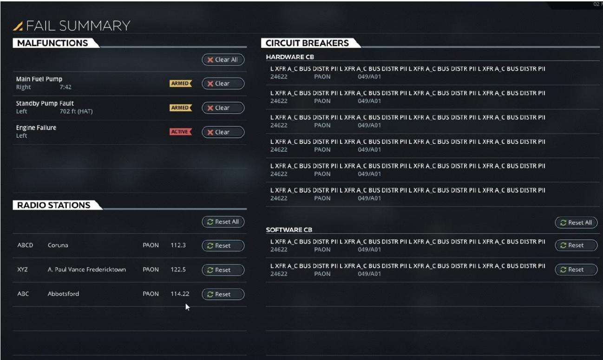
Figure 50 FAILURE SUMMARY Sliding Panel

## 8.15 MALFUNCTIONS Section

The MALFUNCTIONS Section provides a summary of all active and/or armed malfunctions.

In this section, the instructor can:

• Clear an active or armed malfunction as well as activate an armed malfunction.

• Scroll through when there are more than four malfunctions active or armed.

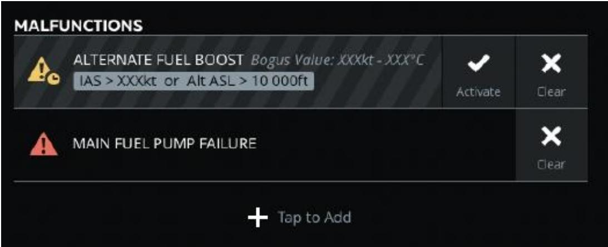
Figure 51 AIRCRAFT Tab – MALFUNCTIONS Section

## 8.15.1 Activate

Tap this button to activate the armed malfunction.

## 8.15.2 Clear

Tap this button to deactivate and clear the selected malfunction.

## 8.15.3 Clear All

Tap this button to deactivate and clear all armed or active malfunctions.

## 8.15.4 Tap to Add

Tap this button to open the MALFUNCTIONS sliding panel and add a new malfunction to the simulation.

## 9. REFERENCE AIRPORT Tab

The REFERENCE AIRPORT tab allows the instructor to monitor and change:

Ownship situation such as:

o Changing the reference airport and runway

o Repositioning aircraft at different preset locations

Environmental conditions at the ownship such as:

o Runway conditions and lighting

o Clouds and visibility

o Wind speed and direction

o Precipitations and temperature

This tab also allows the instructor to introduce various takeoff/landing microburst and windshear profiles to the training session.

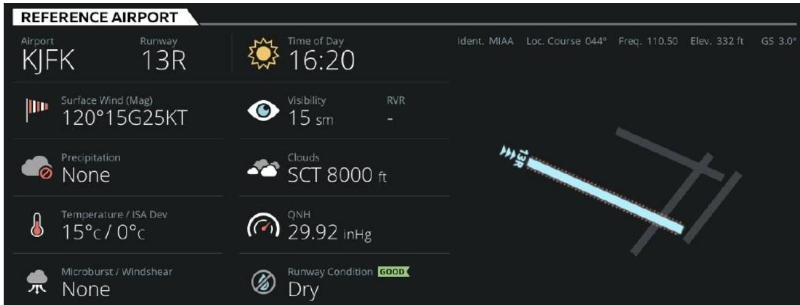
Figure 52 REFERENCE AIRPORT Tab

## 9.1 Parameter Input Text Fields

The REFERENCE AIRPORT tab includes parameter input text fields that upon tapping will display the associated sliding panel or keypad.

Some parameters in this tab can also be adjusted using the Wheel Picker. To use the wheel picker:

Press and hold on a parameter until the Wheel Picker is displayed or swipe this parameter up or down to display the Wheel Picker.

• Scroll through the selection and select:

o The green checkmark to confirm your selection.

o The red X to cancel your selection.

## 9.1.1 Airport

This input text field displays the ICAO code of current reference airport.

To change the reference airport either:

• Tap on this input text field to display the AIRFIELD & REPOSITION sliding panel, or

• Use the Wheel Picker.

## 9.1.2 Runway

This input text field displays the current runway at the reference airport.

To change the current runway at the reference airport either:

• Tap on this input text field to display the AIRFIELD & REPOSITION sliding panel, or

Use the Wheel Picker.

## 9.1.3 Time of the Day

This input text field displays the current time of the day.

To change the current time of the day either:

Tap on this input text field to display a keypad, or

• Use the Wheel Picker to change the general time of day: Dawn, Day, Dusk Night.

## 9.1.4 Surface Wind (Mag)

This input text field displays the current wind condition at the reference airport and runway.

To change the current wind condition at the reference airport either:

• Tap on this input text field to display the SURFACE WIND sliding panel, or

• Press and hold the wind direction field and then use the Wheel Picker to change the wind direction.

• Press and hold the wind speed field and then use the Wheel Picker to change the wind speed.

## 9.1.5 Visibility

This input text field displays the current below cloud visibility.

To modify the below cloud visibility either:

Tap on this input text field to display the Visibility keypad.

• Use this keypad to change the below cloud visibility or use the Wheel Picker.

## 9.1.6 RVR

This input text field displays the current Runway Visual Range (RVR).

To change the RVR either:

• Tap on this input text field to display the VISIBILITY / RVR sliding panel, or

• Use the Wheel Picker.

## 9.1.7 Precipitation

This input text field displays the current precipitation at the reference airport.

To change the precipitation either:

• Tap on this input text field to display the PRECIPITATION sliding panel, or

• Use the Wheel Picker.

## 9.1.8 Clouds

This input text field displays the current clouds condition at the reference airport/airfield.

To change the clouds condition either:

• Tap on this input text field to display the CLOUDS at the reference airport sliding panel, or

• Use the Wheel Picker

## 9.1.9 Temperature

This input text field displays the current temperature at the refence airport/airfield.

To change the temperature at the refence airport/airfield either:

• Tap on this input text field to display the Reference Temperature keypad.

• Use this keypad to change the temperature or use the Wheel Picker.

## 9.1.10 ISA Dev

This input text field displays the current International Standard Atmosphere (ISA) Deviation (ISA Dev) at the reference airport/airfield.

To change the ISA deviation at the refence airport/airfield either:

• Tap on this input text field to display the Reference Airfield ISA Dev keypad.

• Use this keypad to change the ISA Dev or use the Wheel Picker.

## 9.1.11 QNH

This input text field displays the current QNH.

To change the QNH at the refence airport/airfield either:

Tap on this input text field to display the QNH keypad.

• Use this keypad to change the airport sea level barometric pressure or use the Wheel Picker.

## 9.1.12 Microburst/Windshear

This input text field displays the current microburst/windshear profile active in the training session. Tap on this input text field to display the WINDSHEAR & MICROBURST sliding panel and the microburst/windshear condition.

13 Oct 2017

Page 98

## 9.1.13 Runway Condition

This input text field displays the current runway condition at the reference airport.

To change the runway contamination at the reference airport either:

• Tap on this input text field to display the RUNWAY CONDITIONS sliding panel, or

• Use the Wheel Picker.

## 9.1.14 Interactive Airport Section

The interactive airport section of the REFERENCE AIRPORT tab allows the instructor to change the runway at the reference airport by simply tapping on the desired runway. A change in runway automatically updates the Control Board Runway text field.

## 9.2 AIRPORT & REPOSITION Sliding Panel

The AIRPORT & REPOSITION sliding panel allows the instructor to:

• View and select a reference airport and runway

View and select a destination airport and runway

Reposition the aircraft to preset positions

Perform various types of ground operations

Adjust the intensity of runway lighting

This sliding panel includes the following tabs:

REFERENCE LOCATION

• AIRPORT REPOSITION

GROUND OPERATIONS

• FMS QUICKSET

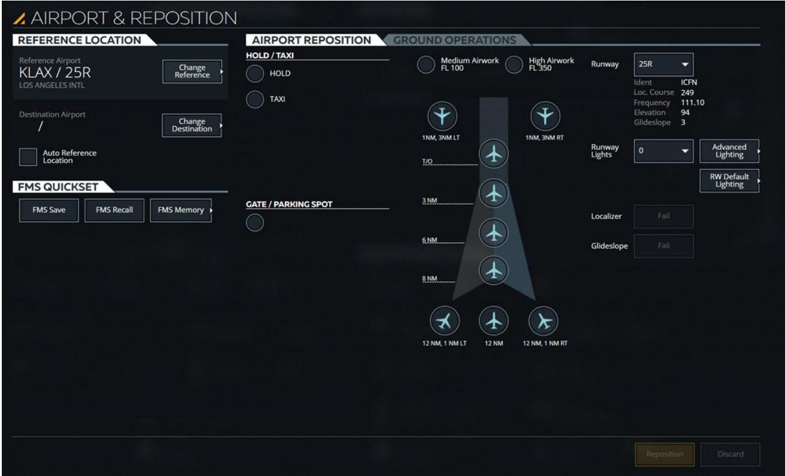
Figure 53 AIRPORT & REPOSITION Sliding Panel

REFERENCE AIRPORT Tab

13 Oct 2017

Page 100

## 9.2.1 REFERENCE LOCATION Tab

The REFERENCE LOCATION tab allows the instructor to change the:

Reference airport and active runway

• Destination airport and active runway

This tab consists of read-only text fields, expandable buttons and an Auto Reference Location checkbox.

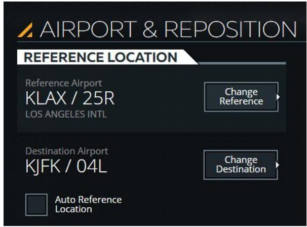
Figure 54 REFERENCE LOCATION Tab (Typical)

## 9.2.1.1 Reference Airport

This read-only text field displays the ICAO code of the reference airport and the number of the active reference runway.

## 9.2.1.2 Destination Airport

This read-only text field displays the ICAO code of the destination airport and the number of the active reference runway.

## 9.2.1.3 Change Reference Button

The Change Reference button allows the instructor to change the Reference Airport and runway by selecting another airport ICAO code and associated runway.

Tap this expandable button to display the REFERENCE AIRPORT (LOCATION) sliding panel. This panel shows a list of available airport ICAO codes along with available runways for each airport.

## 9.2.1.4 Change Destination Button

The Change Destination button allows the instructor to change the Destination Airport and runway by selecting another airport ICAO code and associated runway.

Tap this expandable button to display the DESTINATION AIRPORT (LOCATION) sliding panel. This panel shows a list of available airport ICAO codes along with available runways for each airport.

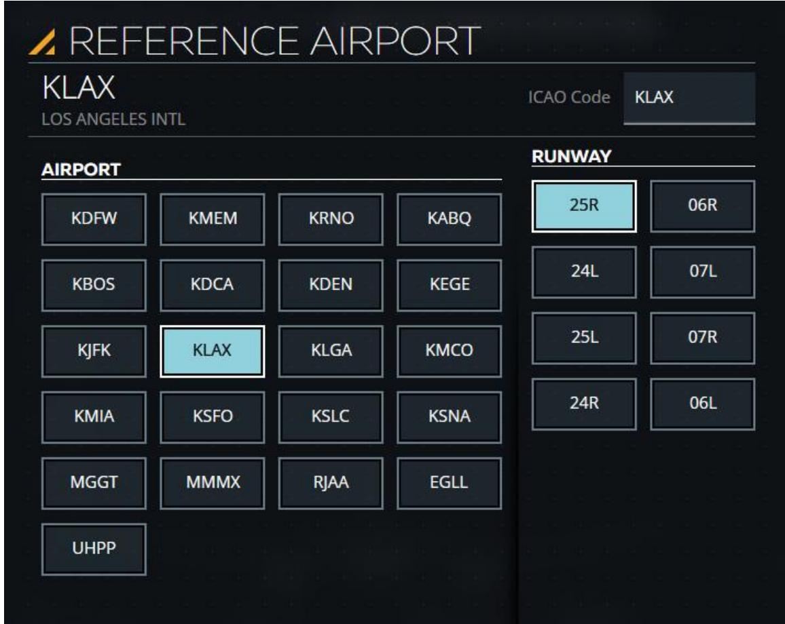
Figure 55 REFERENCE AIRPORT List (Typical)

## 9.2.1.5 Auto Reference Location

The Auto Reference Location checkbox allows the instructor to control how the reference airfield is updated. This checkbox toggles between two modes: Auto and Manual.

## 9.2.1.5.1 Auto Mode

Auto Mode allows automatic updates of the reference airfield to the nearest available runway until the nearest is the arrival airfield (then the reference airfield locks to the arrival airfield and runway). Selection unlocks if manual mode is selected or the arrival airfield is changed.

## 9.2.1.5.2 Manual Mode

In Manual mode, the reference airfield and runway do not change unless there is a new input from the instructor or the lesson plan.

## 9.2.2 AIRPORT REPOSITION Tab

The AIRPORT REPOSITION tab includes all the necessary controls to allow the instructor to:

Reposition the aircraft to preset positions.

Adjust the lighting intensity of various runway sections.

Adjust the intensity of the runway lights.

• Trigger failures of reference runway localizer and glideslope transmitters.

This tab includes the following sections:

HOLD / TAXI

• GATE / PARKING SPOT

• Reposition Presets

• Runway Lighting

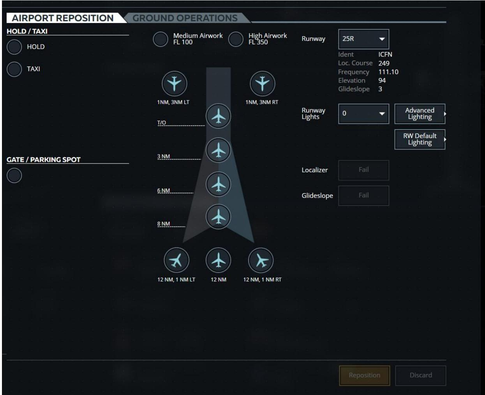
Figure 56 AIRPORT REPOSITION Tab (Typical)

## 9.2.2.1 HOLD / TAXI Section

This section includes mutually exclusive radio buttons that allow the instructor to reposition the aircraft to various Hold and Taxi positions.

To reposition the aircraft to a Hold and Taxi position:

1) Tap on one of the position preset radio buttons.
2) Tap on the Reposition button to execute the repositioning.

Flight freeze is set at the end of the reposition and Speed Up is deactivated.

## 9.2.2.1.1 HOLD

Tap this radio button to reposition the aircraft to the corresponding Hold position.

In this reposition preset, the aircraft is configured as follows:

Gear: Down
Flap: Flaps as is if the current flap lever position is valid for TAKEOFF; otherwise, Flaps 5.
Doors: Closed

## 9.2.2.1.2 TAXI

Tap this radio button to reposition the aircraft to the corresponding Taxi position.

In this reposition preset, the aircraft is configured as follows:

Gear: Down
Flap: Flaps as is if the current flap lever position is valid for TAKEOFF; otherwise, Flaps 5.
Doors: Closed

## 9.2.2.2 GATE / PARKING SPOT Section

This section includes mutually exclusive radio buttons that allow the instructor to reposition the aircraft to various Gate and Parking Spot positions.

To reposition the aircraft to a Gate and Parking Spot position:

1) Tap on one of the position preset radio buttons.
2) Tap on the Reposition button to execute the repositioning.

Flight freeze is set at the end of the reposition and Speed Up is deactivated.

## 9.2.2.2.1 Gate or Parking Spot Number

Tap the desired radio button to reposition the aircraft to the desired Gate/Parking Spot position.

In this reposition preset, the aircraft is configured as follows:

Gear: Down

Flap: Flaps up

Speed brake: Stowed

Doors 1L, right fwd and aft cargo doors open.

## 9.2.2.3 Reposition Presets Section

This section includes mutually exclusive radio buttons that allow the instructor to reposition the aircraft to various airborne positions in relation to the current reference runway.

Note: This section also includes a takeoff position preset.

To reposition the aircraft to various airborne positions:

1) Tap on one of the position preset radio buttons.
2) Tap on the Reposition button to execute the repositioning.

Flight freeze is set at the end of the reposition.

## 9.2.2.3.1 Medium Airwork

Tap this radio button to reposition the aircraft to 10,000 ft (baro) relative to the current reference runway if the transition altitude is higher than 10,000 ft for the current location. If the transition altitude for the current location is less than or equal to 10,000 ft, then the reposition will be to FL100.

In this reposition preset, the aircraft is configured as follows:

<table><tr><td>Gear :</td><td>Up</td></tr><tr><td>Flap :</td><td>Up</td></tr><tr><td>Speed:</td><td>250 KCAS</td></tr><tr><td>Altitude:</td><td>10000 feet ASL or FL100 as appropriate</td></tr><tr><td>Localizer Deviation:</td><td>Centered</td></tr><tr><td>Profile :</td><td>Level</td></tr><tr><td>Distance:</td><td>30 NM from reference runway</td></tr></table>

Note: Preset values are subject to change depending on the aircraft.

## 9.2.2.3.2 High Airwork

Tap this radio button to reposition the aircraft to FL350 relative to the current reference runway.

In this reposition preset, the aircraft is configured as follows:

<table><tr><td>Gear :</td><td>Up</td></tr><tr><td>Flap :</td><td>Up</td></tr><tr><td>Speed:</td><td>Mach 0.78</td></tr><tr><td>Altitude:</td><td>FL350</td></tr><tr><td>Localizer Deviation:</td><td>Centered</td></tr><tr><td>Profile :</td><td>Level</td></tr><tr><td>Distance:</td><td>100 NM from reference runway</td></tr></table>

Note: Preset values are subject to change depending on the aircraft.

## 9.2.2.3.3 1NM, 3NM LT

Tap this radio button to reposition the aircraft to LH downwind, 3 nm abeam and 1 nm prior to touchdown point, relative to the current reference runway.

In this reposition preset, the aircraft is configured as follows:

<table><tr><td>Gear:</td><td>Up</td></tr><tr><td>Flap:</td><td>Flaps 1</td></tr><tr><td>Speed:</td><td>200KCAS</td></tr><tr><td>Localizer Deviation:</td><td>3 NM left</td></tr><tr><td>Altitude:</td><td>1500 feet AGL (*)</td></tr><tr><td>Profile:</td><td>Level</td></tr><tr><td>Distance:</td><td>1NM</td></tr></table>

Note: Preset values are subject to change depending on the aircraft.

## 9.2.2.3.4 1NM, 3NM RT

Tap this radio button to reposition the aircraft to RH downwind, 3 nm abeam and 1 nm prior to touchdown point, relative to the current reference runway.

In this reposition preset, the aircraft is configured as follows:

<table><tr><td>Gear:</td><td>Up Flaps 1</td></tr><tr><td>Flap: Speed:</td><td>200KCAS</td></tr><tr><td>Localizer Deviation</td><td>3 NM Right</td></tr><tr><td>Altitude:</td><td>1500 feet AGL (*)</td></tr><tr><td>Profile:</td><td>Level</td></tr><tr><td>Distance:</td><td></td></tr><tr><td></td><td>1 NM</td></tr></table>

(\*) AGL is with respect to reference runway threshold altitude.

Note: Preset values are subject to change depending on the aircraft.

## 9.2.2.3.5 T/O

Tap this radio button to reposition the aircraft to the takeoff (T/O) position on the current reference runway.

In this reposition preset, the aircraft is configured as follows:

Gear : Down

Flap : Flaps 1+F

Speed: Stationary

Altitude: On ground

Doors: Closed

Note: Preset values are subject to change depending on the aircraft.

## 9.2.2.3.6 3 NM Short Final

Tap this radio button to reposition the aircraft to 3 nm relative to the current reference runway.

In this reposition preset, the aircraft is configured as follows:

<table><tr><td>Gear : Flap :</td><td>Down Full</td></tr><tr><td>Speed: Localizer Deviation :</td><td>Vref +5 (*) Centered</td></tr><tr><td>Glideslope Deviation:</td><td>Centered</td></tr><tr><td>Profile :</td><td>Descent</td></tr><tr><td>Distance:</td><td></td></tr><tr><td></td><td>3 NM</td></tr></table>

(\*) Vref is for the selected flaps, not full flaps.

Note: Preset values are subject to change depending on the aircraft.

## 9.2.2.3.7 6NM

Tap this radio button to reposition the aircraft to 6 nm relative to the current reference runway.

In this reposition preset, the aircraft is configured as follows:

Gear : Down

Flap : Flaps 3

Speed: F Speed

Localizer Deviation : Centered

Glideslope Deviation: Centered

Profile : Descent

Distance: 6 NM

Note: Preset values are subject to change depending on the aircraft.

## 9.2.2.3.8 8NM

Tap this radio button to reposition the aircraft to 8 nm relative to the current reference runway.

In this reposition preset, the aircraft is configured as follows:

<table><tr><td>Gear:</td><td>Up</td></tr><tr><td>Flap:</td><td>Flaps 2 F Speed</td></tr><tr><td>Speed:</td><td>Centered</td></tr><tr><td>Localizer Deviation:</td><td></td></tr><tr><td>Altitude:</td><td>2000 feet AGL (*)</td></tr><tr><td>Profile:</td><td>Level</td></tr><tr><td>Distance:</td><td>8 NM</td></tr></table>

(\*) AGL is with respect to reference runway threshold altitude.

Note: Preset values are subject to change depending on the aircraft.

## 9.2.2.3.9 12NM, 1 NM LT

Tap this radio button to reposition the aircraft to 12 nm, 1 nm left relative to the current reference runway.

In this reposition preset, the aircraft is configured as follows:

<table><tr><td>Gear:</td><td>Up</td></tr><tr><td>Flap:</td><td>Flaps 1</td></tr><tr><td>Speed:</td><td>200KCAS 1 NMleft</td></tr><tr><td>Localizer Deviation:</td><td></td></tr><tr><td>Altitude:</td><td>3000 feet AGL (*)</td></tr><tr><td>Profile:</td><td>Level</td></tr><tr><td>Distance:</td><td>12 NM</td></tr><tr><td>Intercept Angle:</td><td>30 degrees</td></tr></table>

(\*) AGL is with respect to reference runway threshold altitude.

Note: Preset values are subject to change depending on the aircraft.

## 9.2.2.3.10 12NM

Tap this radio button to reposition the aircraft to 12 nm relative to the current reference runway.

In this reposition preset, the aircraft is configured as follows:

<table><tr><td>Gear:</td><td>Up</td></tr><tr><td>Flap:</td><td>Flaps 1 200KCAS</td></tr><tr><td>Speed:</td><td>Centered</td></tr><tr><td>Localizer Deviation:</td><td>3000 feet AGL (*)</td></tr><tr><td>Altitude:</td><td></td></tr><tr><td>Profile:</td><td>Level</td></tr><tr><td>Distance:</td><td>12 NM</td></tr></table>

(\*) AGL is with respect to reference runway threshold altitude.

## 9.2.2.3.11 12NM, 1NM RT

Tap this radio button to reposition the aircraft to 12 nm, 1 nm right relative to the current reference runway.

In this reposition preset, the aircraft is configured as follows:

<table><tr><td>Gear:</td><td>Up</td></tr><tr><td>Flap:</td><td>Flaps 1</td></tr><tr><td>Speed:</td><td>200KCAS</td></tr><tr><td>Localizer Deviation:</td><td>1 NM right</td></tr><tr><td>Altitude:</td><td>3000 feet AGL (*)</td></tr><tr><td>Profile:</td><td>Level</td></tr><tr><td>Distance:</td><td>12 NM</td></tr><tr><td>Intercept Angle:</td><td>30 degrees</td></tr></table>

Note: Preset values are subject to change depending on the aircraft.

## 9.2.2.4 Runway Lighting Section

This section includes all the necessary controls to adjust the lighting intensity of various sections of the active runway at the reference airport.

## 9.2.2.4.1 Runway

This button displays the active runway. Tap on the dropdown button to display additional runways.

## 9.2.2.4.2 Runway Lights

The system automatically sets the runway lights at their optimal intensity for the time of day and weather conditions. The user can however override that value.

This button displays the default lighting. Tap this dropdown button to expand selection, then select to set default lighting on more than one runway.

An "\*" indicates that the lights for a particular runway have different intensities. (Min = 0, Max = 5)

## 9.2.2.4.3 Advanced Lighting

Tap this expandable button to display the RUNWAY LIGHTING sliding panel.

## 9.2.2.4.4 RUNWAY LIGHTING Sliding Panel

The RUNWAY LIGHTING sliding panel offers all the necessary controls to alter the intensity of various runway sections and type of lighting.

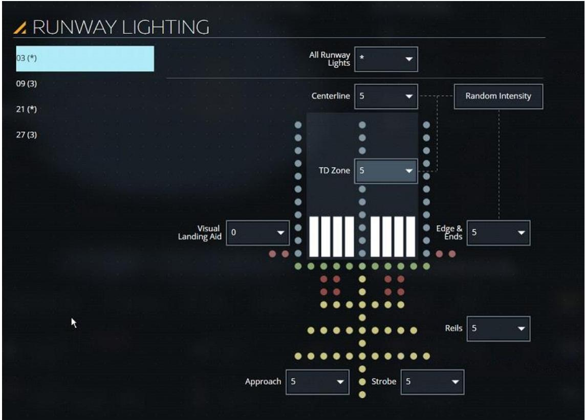
Figure 57 RUNWAY LIGHTING Sliding Panel (Typical)

## 9.2.2.4.4.1 Runway List

From the list of runways, tap to select the desired runway for which lighting is to be adjusted.

## 9.2.2.4.4.2 All Runway Lights

Tap this dropdown button to expand selection, then select the intensity level for all lighting categories of the active visual runway.

Horizon

Reils

• Centerline

Touchdown

• Runway

VLA

• Approach

Environment lighting

An \* indicates when all light intensities are not the same for the selected runway (Min = 0, Max = 5).

## 9.2.2.4.4.3 Centerline

Tap this dropdown button to expand selection, then select the centerline lighting intensity (Min = 0, Max = 5).

## 9.2.2.4.4.4 Random Intensity

From the Normal state, tap this toggle button to enable the runway lighting system to have random intensity lighting.

From the Activated state, tap this toggle button to disable the runway lighting system to have random intensity lighting.

This button affects the lighting of:

Edge and Ends

• Centerline, and

TD Zone

## 9.2.2.4.4.5 TD Zone

Tap this dropdown button to expand selection, then select the Touch Down (TD) zone lighting intensity (Min = 0, Max = 5).

## 9.2.2.4.4.6 Visual Landing Aid (VLA)

Tap this dropdown button to expand selection, then select the VLA lighting brightness intensity (Min = 0, Max = 5).

## 9.2.2.4.4.7 Edge & Ends

Tap this dropdown button to expand selection, then select the runway Edge and Ends lighting intensity (Min = 0, Max = 5).

## 9.2.2.4.4.8 Reils

Tap this dropdown button to expand selection, then select the Reils brightness intensity (Min = 0, Max = 5).

## 9.2.2.4.4.9 Approach

Tap this dropdown button to expand selection, then select the approach lighting intensity for the active reference runway (Min = 0, Max = 5).

## 9.2.2.4.4.10 Strobe

Tap this dropdown button to expand selection, then select the strobe lighting intensity (Min = 0, Max = 5).

## 9.2.2.4.4.11 All RW Default Lighting

Tap on this expandable button to display the RUNWAY DEFAULT LIGHTING sliding panel.

## 9.2.2.4.4.12 RUNWAY DEFAULT LIGHTING Sliding Panel

This sliding panel allows the instructor to choose the reference airport runway default lighting.

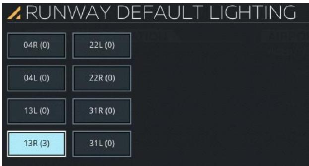
Figure 58 RUNWAY DEFAULT LIGHTING Sliding Panel

## 9.2.2.4.5 Localizer

From the Normal state, tap this toggle fail button to trigger a failure of the reference runway localizer transmitter.

From the Activated state, tap this toggle fail button to clear the failure and return to the Normal state.

## 9.2.2.4.6 Glideslope

From the Normal state, tap this toggle fail button to trigger a failure of the reference runway glideslope transmitter.

From the Activated state, tap this toggle fail button to clear the failure and return to the Normal state.

## 9.2.3 GROUND OPERATIONS Tab

The GROUND OPERATIONS tab allows the instructor to:

• Carry out various ground operations such as aircraft push back

• Change the runway condition by adding various amounts of water, snow, ice or sand

• Affect the aircraft braking action.

• Add traffic scenarios to the training session

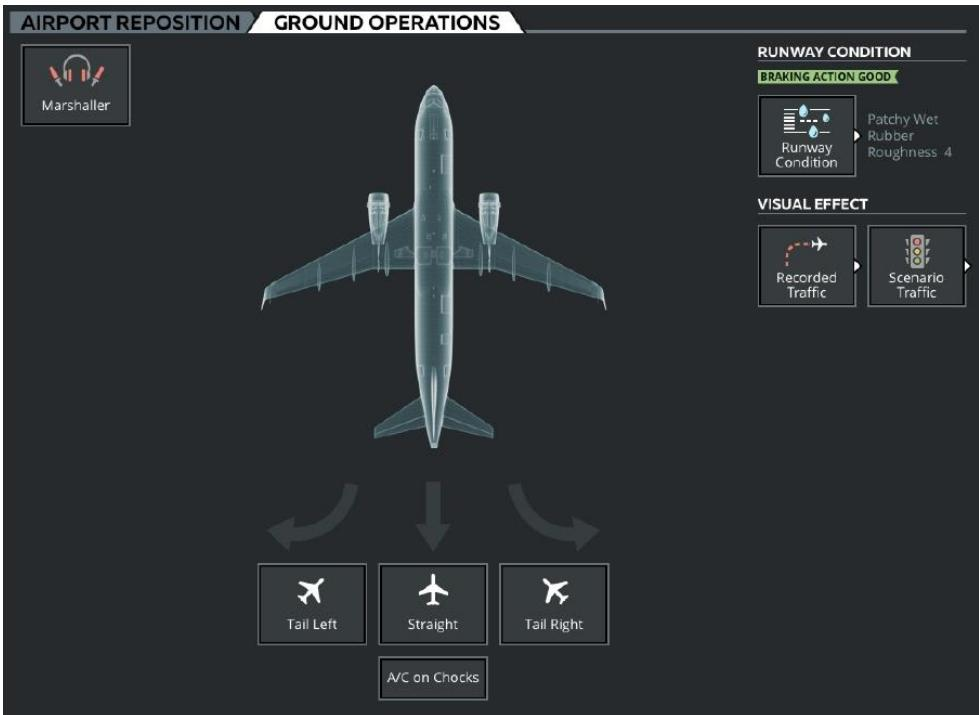
Figure 59 Ground Operations Tab

## 9.2.3.1 Ground Operations

The ground operations that can be performed include:

Marshaller

Aircraft Pushbacks

• A/C on Chocks

## 9.2.3.1.1 Marshaller

When the aircraft is within an appropriate position to the gate, the marshaller signals in the aircraft to the gate.

From the Normal state, tap this toggle button to display the marshaller into the visual scene.

From the Activated state, tap this toggle button to remove the marshaller into the visual scene.

This Marshaller button is disabled depending on certain conditions, for example:

When the aircraft is off the ground

• During an aircraft pushback

## 9.2.3.2 Aircraft Pushbacks

There are three types of push backs that can be carried out: Tail Left, Straight and Tail Right.

## 9.2.3.2.1 Tail Left

Tap this button to execute an aircraft push back followed by a tail left turn. The aircraft will move until it has reached its preprogrammed position. This button is disabled when the aircraft is moving.

## 9.2.3.2.2 Straight

Tap this button to execute a straight aircraft push back. The aircraft will move until it has reached its preprogrammed position. This button is disabled when the aircraft is moving.

## 9.2.3.2.3 Tail Right

Tap this button to execute an aircraft push back followed by a tail right turn. The aircraft will move until it has reached its preprogrammed position. This button is disabled when the aircraft is moving.

## 9.2.3.3 A/C on Chocks

From the Normal state, tap this toggle button to apply chocks to the aircraft wheels.
In this condition, the aircraft does not move.

From the Activated state, tap this toggle button to remove chocks from the aircraft wheels.

This button is disabled when the aircraft is moving.

The A/C On Jacks and the A/C On Chocks buttons are mutually exclusive.

## 9.2.3.4 RUNWAY CONDITION Section

This section includes a Runway Condition expandable button that allows the instructor to modify the runway surface by adding contaminants such water, snow, ice or sand.

## 9.2.3.4.1 Runway Condition

Tap this expandable button to display the RUNWAY CONDITION sliding panel.

The RUNWAY CONDITION sliding panel is described in paragraph 9.14.

## 9.2.3.5 VISUAL EFFECT Section

This section includes expandable buttons that allow the instructor to play recorded traffic scenarios. The number of buttons available depends on the IOS configuration.

## 9.2.3.5.1 Record Traffic

Tap this expandable button to display the RECORDED TRAFFIC sliding panel. This button is disabled if gates traffic or TCAS/random traffic is active.

## 9.2.3.5.2 RECORDED TRAFFIC Sliding Panel

The RECORDED TRAFFIC sliding panel lists a summary of all previously recorded traffic scenario effects that the instructor can add to the visual scene. The selected scenario that is played is added to the visual scene at the reference airport and active runway.

## 9.2.3.5.2.1 Play

Tap this toggle button next to a scenario to play the selected recorded traffic scenario.
Tap on the button again to pause the scenario.

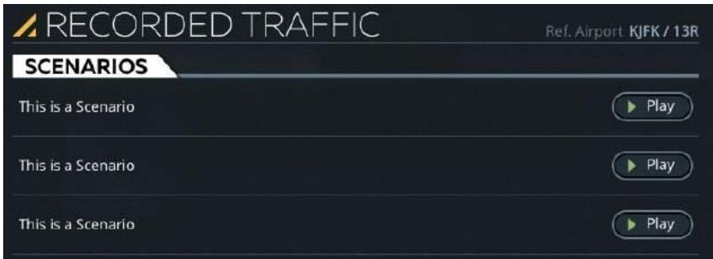
Figure 60 RECORDED TRAFFIC Sliding Panel

## 9.2.3.5.3 Scenario Traffic

Tap this expandable button to display the SCENARIO TRAFFIC sliding panel. This button is disabled if gates traffic or TCAS/random traffic is active.

## 9.2.3.5.4 SCENARIO TRAFFIC Sliding Panel

The SCENARIO TRAFFIC sliding panel allows the instructor to add traffic effects to the visual scene by playing pre-recorded traffic scenarios. The selected scenario that is played is added to the visual scene at the reference airport and active runway.

A FILTER tab allows the instructor to filter the available recorded scenario by various category.

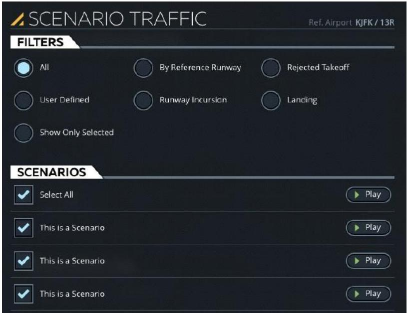
Figure 61 SCENARIO TRAFFIC Sliding Panel

## 9.2.4 FMS QUICKSET Tab

The FMS QUICKSET tab provides controls to save the current flight plan and load previously saved flight plans.

Figure 62 FMS QUICKSET Tab

## 9.2.4.1 FMS Save

Tap this button to activate the process of saving the selected FMS Memory flight plan.

## 9.2.4.2 FMS Recall

Tap this button to recall the selected FMS Memory flight plan.

## 9.2.4.3 FMS Memory

Tap this button to display the FMS MEMORY SAVE/RECALL sliding panel.

## 9.2.5 FMS MEMORY SAVE/RECALL Sliding Panel

The FMS MEMORY SAVE/RECALL Sliding Panel allows the instructor to save the current FMS flight plan or load a previously saved flight plan into the FMS memory.

This sliding panel provides all the controls to:

• Take a snapshot of the current FMS memory and save it on the simulator host computer.

• Recall a saved flight plan file from the simulation host computer and load it into the FMS memory.

Note: The process of Saving/Recalling flight plans can be applied to both Password Protected and Unprotected flight plans.

CAUTION: THE NDB IS UPDATED EVERY 28 DAYS. WHEN THIS HAPPENS, ALL FLIGHT PLANS CREATED WITH THE PREVIOUS NDB WILL NO LONGER BE AVAILABLE. THEREFORE, WHEN A NEW NDB IS INSTALLED, THE FLIGHT PLANS MUST BE RECREATED.

This sliding panels includes the following tabs:

MESSAGE

• PASSWORD PROTECTED

• UNPROTECTED

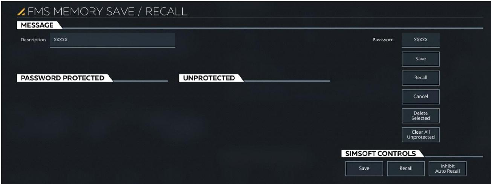
Figure 63 FMS Memory Save/Recall

## 9.2.5.1 MESSAGE Tab

This tab includes the basic controls to save and recall flight plans.

## 9.2.5.1.1 Description

Tap this input text field to display a keypad that will allow entry of a description of the flight plan to be saved.

## 9.2.5.1.2 Password

Tap this input text field to display a keypad that will allow entry of a valid password of up to 10 characters.

## 9.2.5.1.3 Save

Tap this button to activate the process of saving the selected FMS Memory flight plan.

## 9.2.5.1.4 Recall

Tap this button to recall the selected FMS Memory flight plan.

## 9.2.5.1.5 Cancel

Tap to cancel the current entry.

## 9.2.5.1.6 Delete Selected

Tap this button to delete the selected FMS Memory flight plan.

## 9.2.5.1.7 Clear all Unprotected

Tap to this button to clear all FMS Memory flight plans listed under the UNPROTECTED tab.

## 9.2.5.2 PASSWORD PROTECTED Tab

This tab lists all the password protected flight plan numbers that can be saved or recalled. This tab displays the FMC flight plan description saved in that flight plan number slot.

## 9.2.5.3 UNPROTECTED Tab

This tab lists all the unprotected flight plan numbers that can be saved or recalled. This tab displays the FMC flight plan description saved in that flight plan number slot.

## 9.2.5.4 Saving a Password Protected Flight Plan

To save a Password Protected Flight Plan:

1) Tap on the Password input text field and use keypad to enter a valid password.
2) From the PASSWORD PROTECTED Tab, tap on the desired flight plan NUMBER.
3) Tap on the SAVE button to save.
4) After a few seconds, a message will appear prompting the use to enter a description.
5) Press the DESCRIPTION input text field at the top of the page to enter the description or press CANCEL to keep the generic name.

## 9.2.5.5 Saving an Unprotected Flight Plan

To save an Unprotected Flight Plan:

1) From the UNPROTECTED Tab, tap on the desired flight plan NUMBER.
2) Tap on the SAVE button to save.
3) After a few seconds, a message will appear prompting the use to enter a description.
4) Press the DESCRIPTION input text field at the top of the page to enter the description or press CANCEL to keep the generic name.

## 9.2.5.6 Recalling a Flight Plan

To recall a Password Protected or Unprotected Flight Plan:

1) From either the PASSWORD PROTECTED Tab or the UNPROTECTED Tab, tap on the desired flight plan NUMBER to select.
2) Tap on the RECALL button to initialize the load procedure.

## 9.2.5.7 SIMSOFT CONTROLS Tab

This tab is aircraft specific and as such is not always available on the IOS configuration. But when available includes these controls.

## 9.2.5.7.1 Save

Tap this button to send a command to the FMS to save a copy of the entered flight plan in the FMS internal memory. Only one flight plan at a time can be saved in this manner. This flight plan is not saved in the simulation host computer.

## 9.2.5.7.2 Recall

Tap this button to recall the flight plan saved in the FMS memory.

## 9.2.5.7.3 Inhibit Auto Recall

Selecting Inhibit Automatic Recall, when active, a flight plan saved at a specific airport/runway will automatically be recalled after reposition to the same location.

## 9.2.6 Reposition Button

Tap this button to execute the selected reposition.

While the system is executing the reposition, it enters the Flight Freeze mode until the reposition is complete.

## 9.2.7 Discard Button

Tap this button to cancel the selected reposition. This also closes the sliding panel.

## 9.3 Time of the Day Keypad

The Time of the Day keypad displays the current time of day.

To change the time of day:

1) Use the keypad or the slider control to enter a new time of day.
2) Tap on the green checkmark to confirm your selection or the red X to cancel the entry.

The slider control can vary the Time of the Day from 0-23 hrs (i.e. dawn, day, dusk or night conditions) on the visual display.

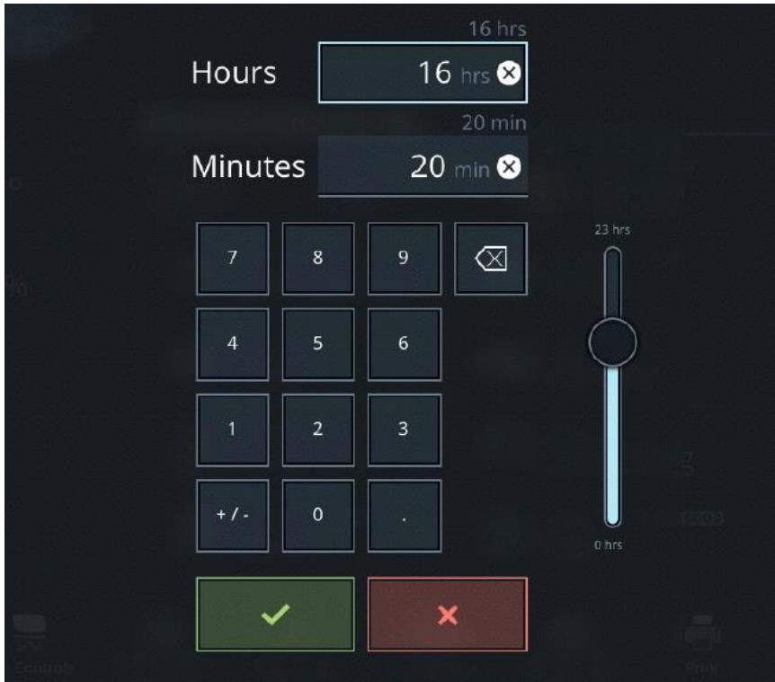
Figure 64 Time of the Day Keypad

## 9.4 TIME OF DAY Sliding Panel

The TIME OF DAY sliding panel allows the instructor to

Quickly alter the time of day (Dawn, Day, Dusk and night)

• Adjust the simulation time by a speed up factor (i.e. increase the simulation time)

o Varying between (one to 500) X the normal speed which is one second.

Enable the showing of the moon and sun in the simulation

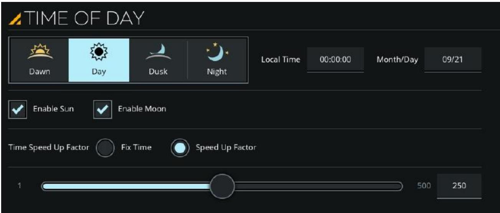
Figure 65 TIME OF DAY Sliding Panel

## 9.5 SURFACE WIND Sliding Panel

The SURFACE WIND sliding panel allows the instructor to introduce a runway wind condition into the simulation. This sliding panel provides all the necessary controls to manage the wind condition at the reference airport and runway.

This sliding panel includes two tabs:

• QUICK SELECTION

WIND COMPASS

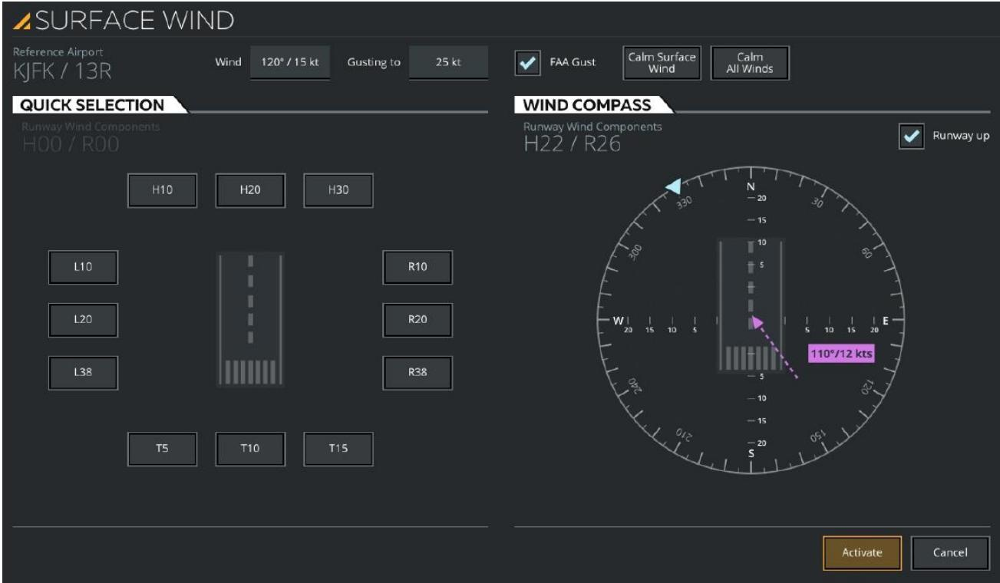
Figure 66 SURFACE WIND Sliding Panel

## 9.5.1 QUICK SELECTION Tab

The QUICK SELECTION tab allows the instructor to quickly select a runway surface head wind, tail wind or crosswind condition by simply selecting either one of the available pre-set buttons.

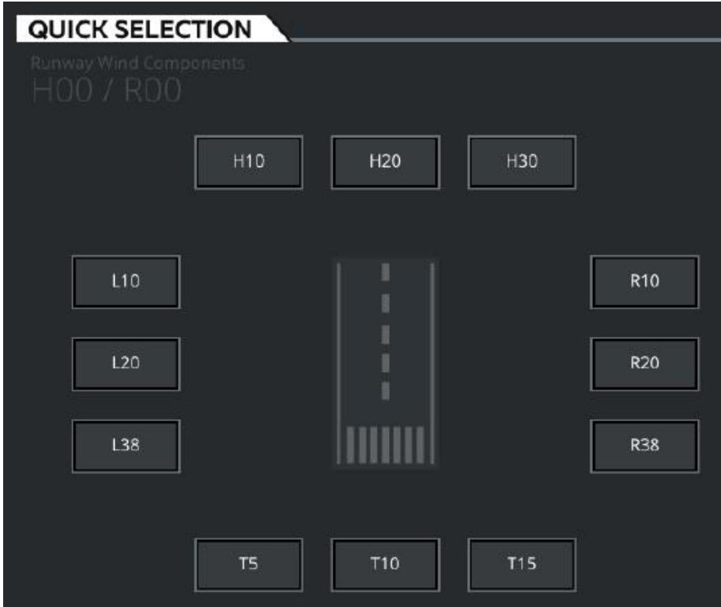
Figure 67 QUICK SELECTION Tab

## 9.5.1.1 H10

Tap this button to set a runway surface head wind of 10 knots or 5.14 m/s (displayed as 5). The entire wind profile will be offset by the change in the airfield wind.

## 9.5.1.2 H20

Tap this button to set a runway surface head wind of 20 knots or 10.29 m/s (displayed as 10). The entire wind profile will be offset by the change in the airfield wind.

## 9.5.1.3 H30

Tap this button to set a runway surface head wind of 30 knots or 15.43 m/s (displayed as 15). The entire wind profile will be offset by the change in the airfield wind.

## 9.5.1.4 T5

Tap this button to set a runway surface tail wind of 5 knots or 2.57 m/s (displayed as 3). The entire wind profile will be offset by the change in the airfield wind.

## 9.5.1.5 T10

Tap this button to set a runway surface tail wind of 10 knots or 5.14 m/s (displayed as 5). The entire wind profile will be offset by the change in the airfield wind.

## 9.5.1.6 T15

Tap this button to set a runway surface tail wind of 15 knots or 7.71 m/s (displayed as 8). The entire wind profile will be offset by the change in the airfield wind.

## 9.5.1.7 L10

Tap this button to set a runway surface left crosswind of 10 knots or 5.14 m/s (displayed as 5). The entire wind profile will be offset by the change in the airfield wind.

## 9.5.1.8 L20

Tap this button to set a runway surface left crosswind of 20 knots or 10.28 m/s (displayed as 10). The entire wind profile will be offset by the change in the airfield wind.

## 9.5.1.9 L38

Tap this button to set a runway surface left crosswind of 38 knots or 19.54 m/s (displayed as 20). The entire wind profile will be offset by the change in the airfield wind.

## 9.5.1.10 R10

Tap this button to set a runway surface right crosswind of 10 knots or 5.14 m/s (displayed as 58). The entire wind profile will be offset by the change in the airfield wind.

## 9.5.1.11 R20

Tap this button to set a runway surface right crosswind of 20 knots or 10.28 m/s (displayed as 10). The entire wind profile will be offset by the change in the airfield wind.

## 9.5.1.12 R38

Tap this button to set a runway surface right crosswind of 38 knots or 19.54 m/s (displayed as 20). The entire wind profile will be offset by the change in the airfield wind.

## 9.5.2 WIND COMPASS Tab

The WIND COMPASS tab features a wind compass indicator that provides a quick overall status of the runway wind condition.

This wind compass indicator consists of a runway and vectors with associated labels representing the current surface wind speed and direction.

The wind speed is represented by the length of the wind vector and the wind direction is represented by the direction of the vector.

The wind compass indicator is interactive as it allows the instructor to quickly adjust the wind direction by touching the vector arrow and moving it slowly on the wind compass.

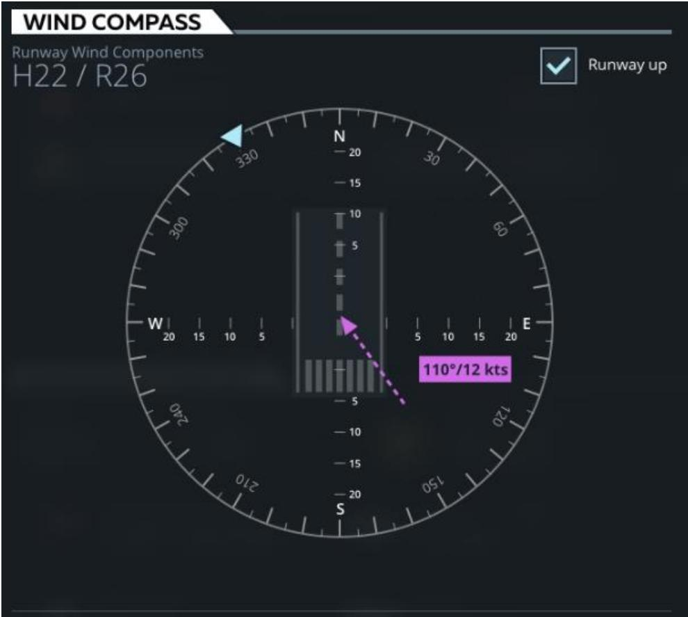
Figure 68 WIND COMPASS Tab

## 9.5.2.1 Runway Wind Components

This read-only text field displays the new runway wind component (Head/Tail or Crosswind) on the wind compass. The value is blank on zero.

## 9.5.2.2 Runway Up

Tap this checkbox to ensure that the runway is always pointing upwards on the screen.

## 9.5.2.3 FAA Gust Backing

Tap this checkbox to set the FAA gust active. When active:

• For a left x-wind, a backing (counter clockwise) gust will occur.

This button is disabled when a x-wind does not exist.

## 9.5.2.4 FAA Gust Veering

Tap this checkbox to set the FAA gust active. When active:

For a right x-wind, a veering (clockwise) gust will occur.

This button is disabled when a x-wind does not exist.

## 9.5.3 Reference Airport

This read-only text field displays the ICAO code of the reference airport and the number of the active reference runway.

## 9.5.4 Wind

This input text field displays the current wind direction and speed at the aircraft. Tap on this input text field to display a wind direction and speed keypad. Use the keypad to enter an airfield magnetic wind direction and wind speed.

The entire wind profile will be offset by the change in the airfield wind. The wind gust will be reset to zero when the wind is set to zero.

(Min = 1, Max = 360 deg) wind direction

(Min = 0, Max = Dynamic, kt or m/s) wind speed

## 9.5.5 Gusting to

This input text field displays the current wind gust value. Tap on this input text field to display a Gust Speed keypad. Use the keypad to enter an absolute wind gust value.

If the surface wind is 15 kt (7.5 m/s) and the absolute gust entered value is 25 kt (12.5 m/s), the instantaneous surface wind will randomly vary between 15 kt (7.5 m/s) and 25 kt (12.5 m/s).

If the surface wind is changed, the relative gust value, in this case 10 kt (5 m/s), will be maintained. Therefore, if the wind is changed to 20 kt (10 m/s), the absolute gust will be changed to 30 kt (15 m/s).

If the entered gust value equals the surface wind value, the number will not be displayed and will be replaced by the text 'No Gust'.

If the surface wind is set to calm conditions, the absolute gust value will be reset and the 'Gusting to' button will be disabled.

## 9.5.6 FAA Gust

Tap this checkbox to set the FAA gust active.

When active:

• For a left x-wind, a backing (counter clockwise) gust will occur.

For a right x-wind, a veering (clockwise) gust will occur.

This button is disabled when a x-wind does not exist.

## 9.5.7 Calm Surface Wind

From the Normal state, tap this action button to eliminate wind at the surface.

This action sets:

Surface wind speed to 0 knots

Surface wind direction to 0 degrees

Wind gust to 0 knots

## 9.5.8 Calm All Winds

Tap this button to reset the wind profile. This action will reset all winds at all altitudes to 0kts.

## 9.5.9 Activate

Tap this button to set the new wind selection as the current surface wind.

## 9.5.10 Cancel

Tap this button to cancel the wind direction selection.

## 9.6 Visibility Keypad

The Visibility keypad displays the current below cloud visibility.

To change the below cloud visibility:

1) Use the keypad or the slider control to change the below cloud visibility.
2) Tap on the green checkmark to confirm your selection or the red X to cancel the entry.

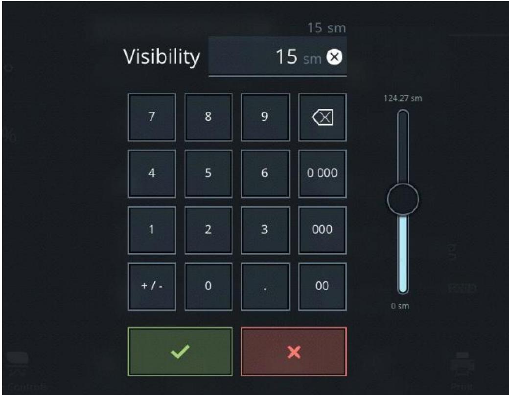
Figure 69 Visibility

## 9.7 VISIBILITY / RVR Sliding Panel

The VISIBILITY / RVR sliding panel allows the instructor to change visibility parameters at the reference airport. It consists of a Visibility input text field and a FOG section.

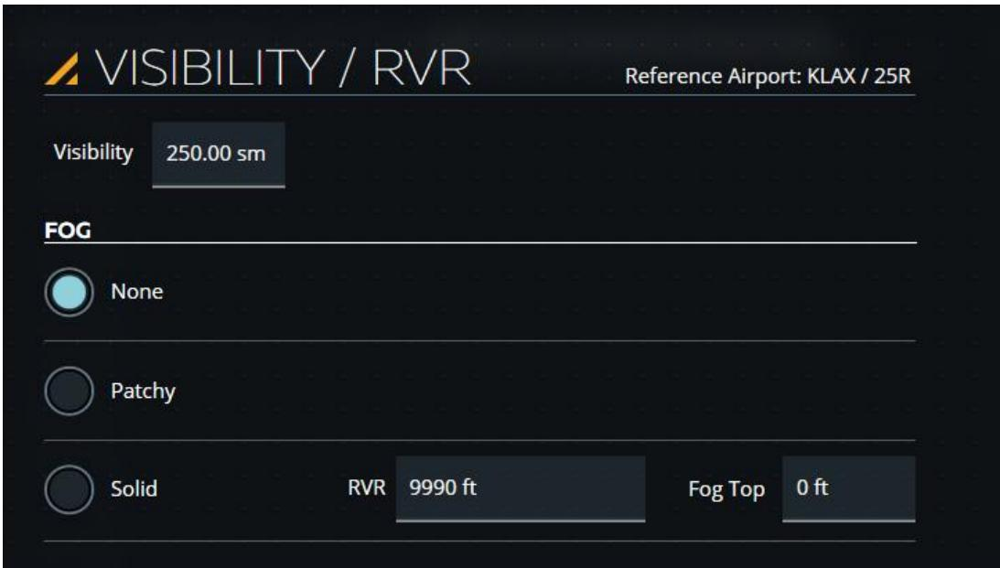
Figure 70 Visibility/RVR

## 9.7.1 Visibility

This input text field displays the current below cloud visibility. Tap on this input text field to display the Visibility keypad. Use the keypad to change the below cloud visibility.

## 9.7.2 FOG Tab

This tab includes fog radio buttons that are mutually exclusive.

## 9.7.2.1 None

Tap this button to remove the current fog condition.

## 9.7.2.2 Patchy

Tap this button to activate a patchy fog condition. During a patchy fog condition, default minimum and maximum Runway Visual Range (RVR) values are set.

## 9.7.2.3 Solid

Tap this button to activate a solid fog condition.

## 9.7.2.4 RVR Min/Max

Tap this input text field to enter a minimum/maximum RVR range in the selected unit (meters/feet). This input text field is only available during a patchy fog condition.

RVR MIN

$$
( \mathrm { M i n } = 0 , \mathrm { M a x } = \mathrm { R V R \ m a x } )
$$

RVR MAX

(Min = RVR min, Max = 3045 meters)

## 9.7.2.5 RVR

Tap this input text field to enter a Runway Visual Range (RVR) in the selected unit (meters/feet).

RVR applies within the fog layer only, whereas visibility is the prevailing visibility above the fog top.

For TROPOS visual, this button is only available when patchy fog is not active.

(Min = 0, Max = 3045 meters)

(Min = 0, Max = 9990 feet)

## 9.7.2.6 Fog Top

Tap this input text field to enter a fog top value above ground in geometric feet (Dynamic Min/Max).

## 9.8 PRECIPITATION Sliding Panel

The PRECIPITATION sliding panel allows the instructor to introduce various types of precipitation in the visual scene (reference airport).

This sliding panel features buttons that are mutually exclusive and allow the instructor to manually introduce various types of precipitation such as:

Rain

Snow

Hail

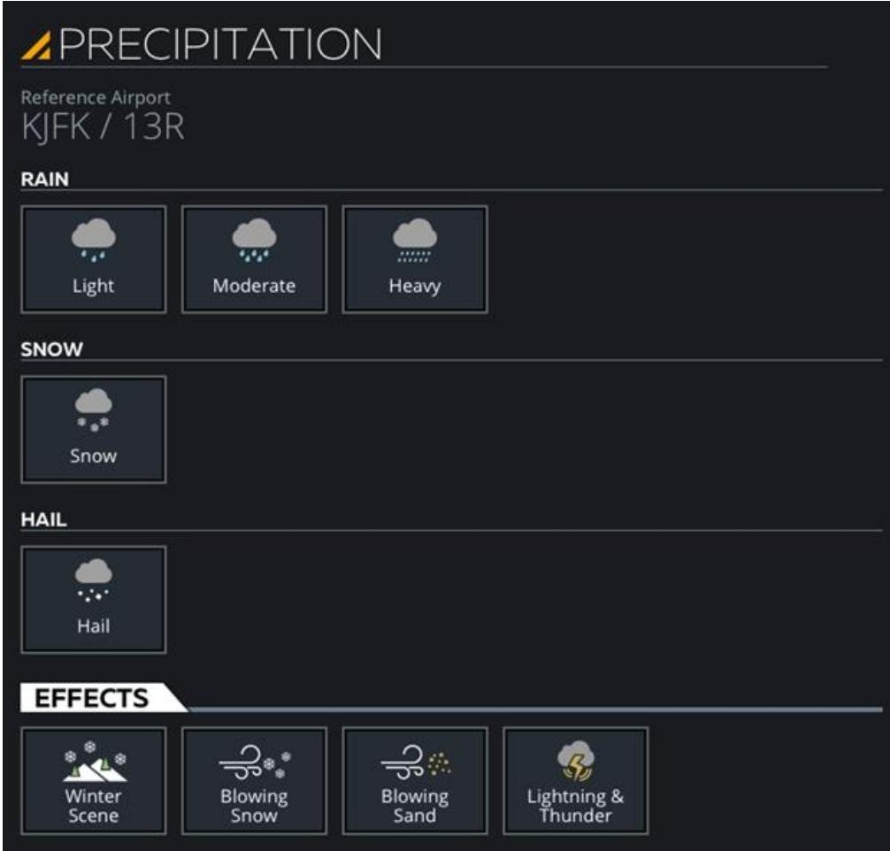
Figure 71 PRECIPITATION Sliding Panel

## 9.8.1 Light Rain

Tap this button to set the amount of rain to 33% (light rain setting).

When light rain is selected, visibility is set to 15 nautical miles unless restricted by a previously set below cloud visibility. In this setting, if no clouds were previously defined, clouds will automatically be inserted in the visual scene.

From the activated state, tap this button again to deselect this setting.

When light rain is deselected, visibility goes back to the pre-rain visibility.

This button is disabled when the temperature is below -5 degrees Celsius.

## 9.8.2 Moderate Rain

Tap this button to set the amount of rain to 66% (moderate rain setting).

When moderate rain is selected, visibility is set to 5 nautical miles unless restricted by a previously set below cloud visibility. In this setting, if no clouds were previously defined, clouds will automatically be inserted in the visual scene.

From the activated state, tap this button again to deselect this setting.

When moderate rain is deselected, visibility goes back to the pre-rain visibility.

This button is disabled when the temperature is below -5 degrees Celsius.

## 9.8.3 Heavy Rain

Tap this button to set the amount of rain to 100% (heavy rain setting).

When heavy rain is selected, visibility is set to 1 nautical miles unless restricted by a previously set below cloud visibility. In this setting, if no clouds were previously defined, clouds will automatically be inserted in the visual scene.

From the activated state, tap this button again to deselect this setting.

When heavy rain is deselected, visibility goes back to the pre-rain visibility.

This button is disabled when the temperature is below -5 degrees Celsius.

## 9.8.4 Snow

Tap this button to set a pre-defined amount of snow to the visual scene.

From the activated state, tap this button again to deselect this setting.

This button is disabled when the temperature is above 5 degrees Celsius.

## 9.8.5 Hail

Tap this button to set the amount of hail to 33% (light hail setting). In this setting, if no clouds were previously defined, clouds will automatically be inserted in the visual scene.

From the activated state, tap this button to remove hail from the simulation.

This button is disabled when the temperature is below -5 degrees Celsius.

## 9.8.6 EFFECT Tab

The EFFECT Tab provides additional precipitation settings.

## 9.8.6.1 Winter Scene

Tap this button to display a winter scene on the visual scene.

From the activated state, tap this button to remove the winter scene from the visual scene.

This button is disabled when the temperature is above 20 degrees Celsius or when a significant latitude/longitude change has occurred, until the visual is ready.

## 9.8.6.2 Blowing Snow

Tap this button to enable the blowing snow effect of on the visual scene.

When blowing snow is enabled, blowing snow will occur only when a winter scene is active and the wind is a non-zero value. When the blowing snow effect is active, the visibility is reduced. This button is disabled when a winter scene is not active.

From the activated state, tap this button to remove the blowing snow effect from the visual scene.

## 9.8.6.3 Blowing Sand

Tap this button to activate the blowing sand effect on the visual scene.

From the activated state, tap this button to deactivate the blowing snow effect.

This button:

Has no effect if the surface wind is set to zero.

• Is disabled when the temperature is below -5 degrees Celsius.

## 9.8.6.4 Lightning & Thunder

Tap this button to activate the lightning and thunder effect on the simulation.

From the activated state, tap this button to deactivate the lightning and thunder effect from the simulation.

## 9.9 CLOUDS Sliding Panel

The CLOUDS sliding panel allows the instructor to modify cloud and visibility parameters at the reference airport region. It consists of the same controls as the CLOUDS sliding panel in the CURRENT CONDITIONS Tab.

Refer to paragraph 7.2 for details.

Note: The reference airport code and runway number will be located at the top of the CLOUDS sliding panel.

## 9.10 Ref Temp Keypad

The Ref Temp keypad displays the current temperature at the refence airport.

To change the temperature:

1) Use the keypad or the slider control to change the temperature at the reference airport.
2) Tap on the green checkmark to confirm your selection or the red X to cancel the entry.

The entire temperature profile will be offset by the change in the ground temperature.
(Dynamic Min/Max).

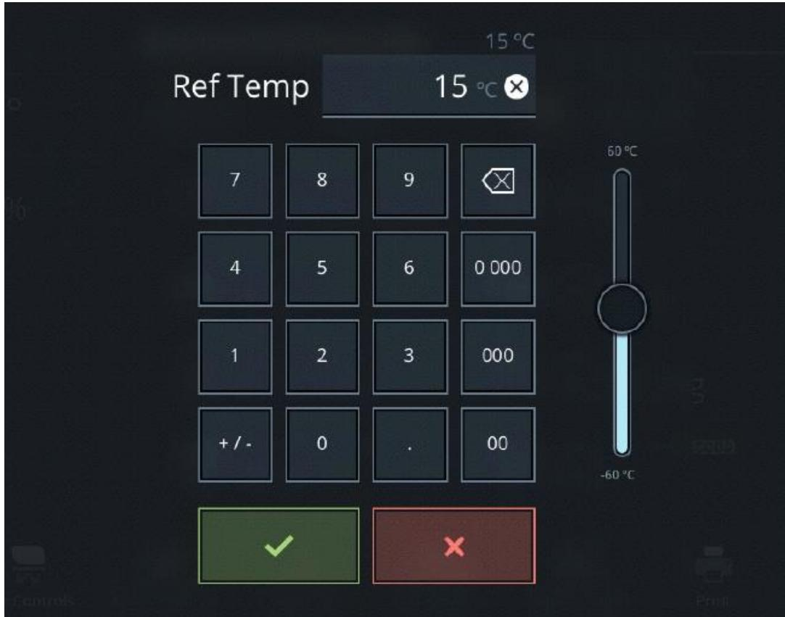
Figure 72 Ref Temp Keypad

## 9.11 ISA Dev Keypad

The ISA Dev keypad displays the current ISA temperature deviation at the airport.

To change the ISA temperature deviation:

1) Use the keypad to change the temperature deviation from ISA at the corresponding level in degrees Celsius. (Dynamic Min/Max).
2) Tap on the green checkmark to confirm your selection or the red X to cancel the entry.

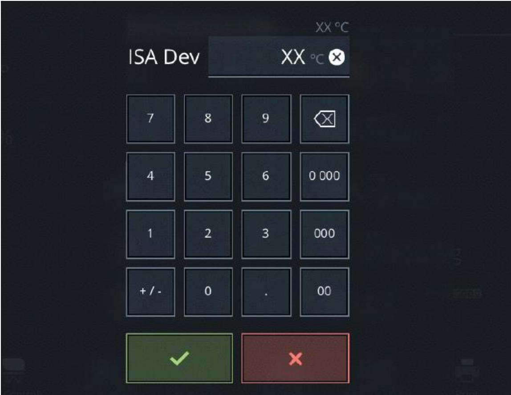
Figure 73 ISA Dev Keypad

## 9.12 QNH Keypad

The QNH keypad displays the current airport sea level barometric pressure.

To change the airport sea level barometric pressure:

1) Use the keypad or the slider control to enter a new barometric pressure in the selected unit (hectopascals/inches Hg).
2) Tap on the green checkmark to confirm your selection or the red X to cancel the entry.

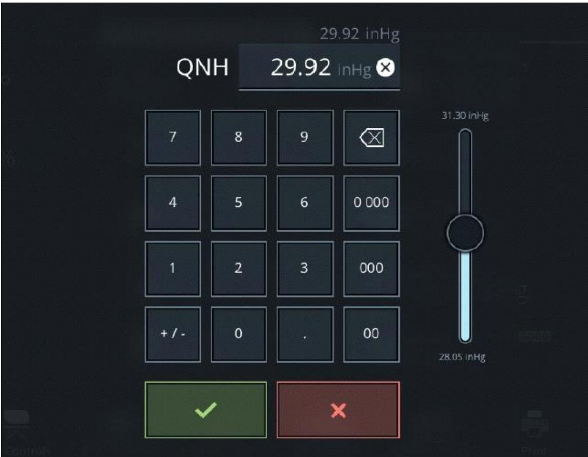
Figure 74 QNH Keypad

## 9.13 WINDSHEAR & MICROBURST Sliding Panel

The WINDSHEAR & MICROBURST sliding panel allows the instructor to introduce various landing and takeoff windshear and microburst profiles in the simulation.

This sliding panel includes three tabs:

MICROBURST

• PREDICTIVE WINDSHEAR

• NON-PREDICTIVE WINDSHEAR

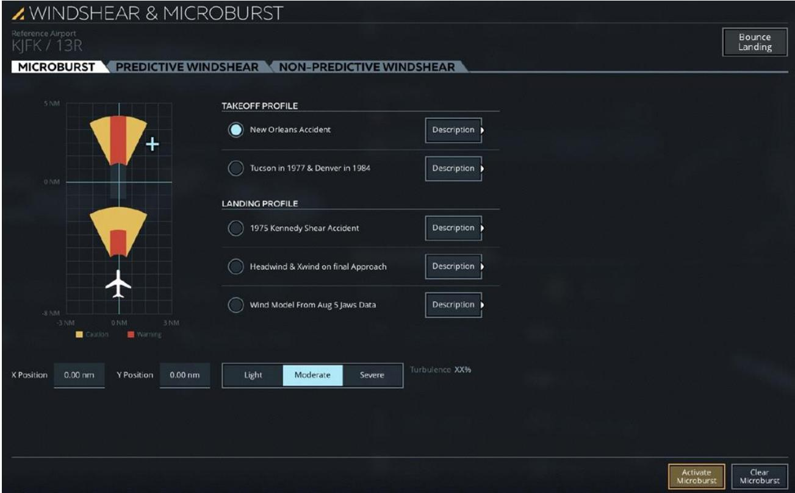
Figure 75 WINDSHEAR & MICROBURST Sliding Panel

## 9.13.1 MICROBURST Tab

The MICROBURST tab includes TAKEOFF PROFILES and LANDING PROFILES radio buttons that allow the instructor to choose only one microburst profile at time as these radio profile buttons are mutually exclusive.

This sliding panel also offers controls to adjust certain microburst parameters.

The selected microburst profile is shown on a map to visualize the microburst situation.

## 9.13.1.1 Microburst Map

The microburst map includes:

Cyan Cross Hairs: These represent the reference point of a group of microburst cells which can be moved by changing the values in the X-Y position input fields.

White Circle(s): These represent the microburst cells which are located at a fixed predefined distance from the reference point.

Offset Distances: The X-Y position input fields represent the offset distances of the reference point (cyan cross hairs).

By changing the offset distances, the user can move the reference point to the desired position.

This will also move the microburst cells (white circle(s)). These offsets will be kept in memory up until the microburst scenario is deselected.

## 9.13.1.2 TAKEOFF PROFILE Section

This section list all available takeoff microburst profiles which are mutually exclusive.

## 9.13.1.2.1 New Orleans Accident

Tap on this radio button to activate the New Orleans Accident microburst profile.

This profile simulates the shear encountered on takeoff in the New Orleans accident.

There is a single core centered headwind change when flying through the strongest portion of the microburst is 50kts.

## 9.13.1.2.2 Tucson in 1977 Denver in 1984

Tap on this radio button to activate the Tucson in 1977 Denver in 1984 microburst profile.

This profile emulates the winds seen in the Tucson accident of 1977 and again in Denver in 1984.

There are two cores for this profile:

• One located 3,700 ft beyond the runway threshold and 800 ft to the right of the centerline

• The other, located 3,700 ft beyond the threshold and 200 ft to the right of the centerline

The maximum headwind change when flying through the strongest portion of the microburst is 70 kts.

## 9.13.1.3 LANDING PROFILE Section

This section list all available landing microburst profiles which are mutually exclusive.

## 9.13.1.3.1 1975 Kennedy Shear Accident

Tap on this radio button to activate the 1975 Kennedy Shear Accident microburst profile.

This profile simulates the shear and downdraft experienced by an L1011 that aborted on approach shortly before the 1975 Kennedy shear accident.

There is a single core centered at 5,000 ft in front of the threshold and 400 ft to the right of the runway centerline.

The maximum wind change when flying through the strongest portion of the microburst is 50 kts.

## 9.13.1.3.2 Headwind X Wind on Final Approach

Tap on this radio button to activate the Headwind Xwind on Final Approach microburst profile.

This profile presents the pilot on late final approach with a challenging combination of headwind and crosswind shear.

There is a single core centered at 4,000 ft in front of the runway threshold and 1,800 ft to the right of the runway centerline.

The maximum wind change when flying through the strongest portion of the microburst is 25 kts.

## 9.13.1.3.3 Wind Model from Aug 5 Jaws Data

Tap on this radio button to activate the Wind Model from Aug 5 Jaws Data microburst profile.

This profile emulates the wind variations defined by the Joint Airport Weather Studies (JAWS) project 1983 report.

The JAWS project was set up in 1982 by the University of Chicago and the National Center for Atmospheric Research.

There are four cores in this profile that are positioned as follows:

1) 8,000 ft in front of threshold and 200 ft to the left of centerline.
2) 7,000 ft in front of threshold and 200 ft to the left of centerline.
3) 5,750 ft in front of threshold and 900 ft to the left of centerline.
4) 1,500 ft in front of threshold and 400 ft to the left of centerline.

## 9.13.1.4 Description Button

Tap on this Button to obtain a full description of each takeoff and landing microburst profile. It provides profile parameters such as:

Core Radius

• Core Height

• Max Velocity

Longitudinal distance to threshold

• Lateral distance from runway centerline

## 9.13.1.5 X Position

The X Position input text field displays the microburst X Position.

Tap the input text field to change the microburst X position relative to the touchdown point. (Min = -5, Max = 8 nautical miles).

## 9.13.1.6 Y Position

The Y Position input text field displays the microburst Y Position.

Tap the input text field to change the microburst Y position relative to the touchdown point. (Min = -3, Max = 3 nautical miles).

## 9.13.1.7 Intensity Buttons

The microburst intensity buttons are mutually exclusive.

## 9.13.1.7.1 Light

Tap this button to set the microburst intensity to light.

## 9.13.1.7.2 Moderate

Tap this button to set the microburst intensity to moderate.

## 9.13.1.7.3 Severe

Tap this button to set the microburst intensity to severe.

## 9.13.1.8 Turbulence

This read-only field displays the nominal intensity of the enabled turbulence.

## 9.13.1.9 Activate Microburst

Tap this button to activate the selected microburst profile. This button is disabled when a microburst profile is activated.

## 9.13.1.10 Clear Microburst

Tap this button to deactivate the active Microburst profile. This button is disabled when no microburst profile is activated.

## 9.13.2 PREDICTIVE WINDSHEAR Tab

The PREDICTIVE WINDSHEAR tab includes TAKEOFF PROFILES and LANDING PROFILES radio buttons that allow the instructor to choose only one windshear profile at time as radio profile buttons are mutually exclusive.

This sliding panel also offers controls to adjust certain windshear parameters.

The selected windshear profile is shown on a map to visualize the situation.

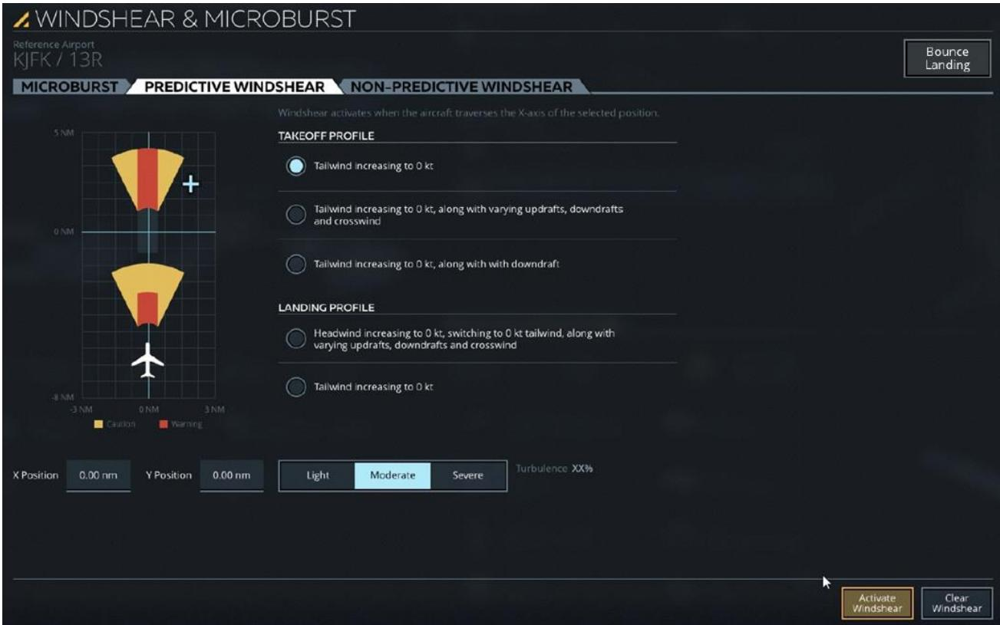
Figure 76 PREDICTIVE WINDSHEAR Tab

## 9.13.2.1 TAKEOFF PROFILE Section

This section lists all available predictive windshear takeoff profiles which are mutually exclusive.

## 9.13.2.1.1 Tailwind Increasing to XX kt

Tap this radio button to activate the predictive windshear profile described below:

Tailwind increasing to XX kts.

• Windshear position will be initialized at 3,000 feet from the runway threshold on takeoff.

## 9.13.2.1.2 Tailwind Increasing to XX kt, along with varying updrafts, downdrafts, and crosswind

Tap this radio button to activate the predictive windshear profile described below:

• Tailwind increasing to XX kts, along with varying updrafts, downdrafts, and crosswind.

• Windshear position will be initialized at 6000 feet from the runway threshold on takeoff.

## 9.13.2.1.3 Tailwind Increasing to XX kt, along with downdraft

Tap this radio button to activate the predictive windshear profile described below:

Tailwind increasing to XX kts, along with downdraft.

• Windshear position will be initialized at 6000 feet from the runway threshold on takeoff.

## 9.13.2.2 LANDING PROFILE Section

This section lists all available predictive windshear landing profiles which are mutually exclusive.

## 9.13.2.2.1 Headwind Increasing to XX kt, switching to XXX kts tailwind, along with varying updrafts, downdrafts and crosswind

Tap this radio button to activate the predictive windshear profile described below:

Headwind increasing to XX kts, switching to XXX kts tailwind, along with varying updrafts, downdrafts and crosswind.

• Windshear position will be initialized at 12000 feet, 2nm before the runway threshold on approach.

## 9.13.2.2.2 Tailwind Increasing to XX kt

Tap this radio button to activate the predictive windshear profile described below:

Tailwind increasing to XX kts.

• Windshear position will be initialized at 6000 feet before the runway threshold on approach.

## 9.13.2.3 X Position

The X Position input text field displays the windshear X Position.

Tap the input text field to change the fixed windshear X position relative to the touchdown point on the runway in nautical miles (Min = -8, Max = 5 nautical miles).

## 9.13.2.4 Y Position

The Y Position input text field displays the windshear Y Position.

Tap the input text field to change the fixed windshear Y position relative to the touchdown point on the runway in nautical miles (Min = -3, Max = 3 nautical miles).

## 9.13.2.5 Intensity Buttons

The predictive windshear intensity buttons are mutually exclusive.

## 9.13.2.5.1 Light

Tap this button to set the predictive windshear profile intensity to light.

## 9.13.2.5.2 Moderate

Tap this button to set the predictive windshear profile intensity to moderate.

## 9.13.2.5.3 Severe

Tap this button to set the predictive windshear profile intensity to severe.

## 9.13.2.6 Turbulence

This read-only field displays the nominal intensity of the enabled turbulence.

## 9.13.2.7 Activate Windshear

Tap this button to activate the selected windshear profile. This button is disabled when a windshear profile is activated.

## 9.13.2.8 Clear Windshear

Tap this button to deactivate the active windshear profile. This button is disabled when no windshear profile is activated.

## 9.13.3 NON-PREDICTIVE WINDSHEAR Tab

The NON-PREDICTIVE WINDSHEAR tab includes TAKEOFF PROFILES and LANDING PROFILES radio buttons that allow the instructor to choose only one NP windshear profile at time as radio profile buttons are mutually exclusive.

This sliding panel also offers controls to adjust certain NP windshear parameters.

Takeoff scenarios are tuned at MTOW. Landing scenarios are tuned at MLW.

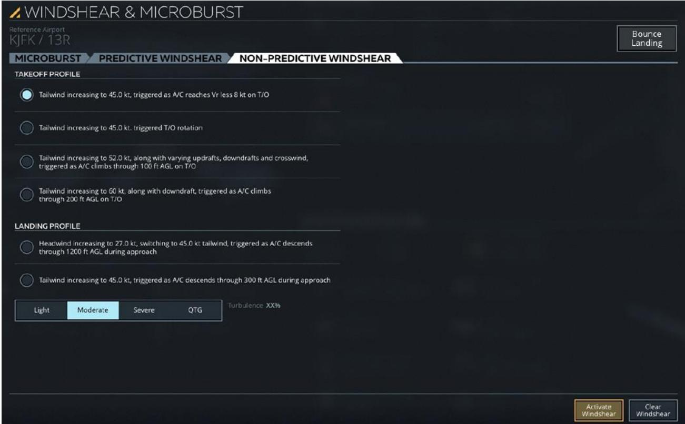
Figure 77 NON-PREDICTIVE WINDSHEAR Tab

## 9.13.3.1 TAKEOFF PROFILE Section

This section list all available Non-Predictive (NP) windshear takeoff profiles which are mutually exclusive.

## 9.13.3.2 Tailwind Increasing to XX kt, triggered as A/C reaches Vr less X kts on T/O

Tap this radio button to activate the NP windshear profile described below:

FAA Windshear Training Aid reference wind model #1.

• Tailwind increasing to XX kt, triggered as A/C reaches Vr less X kts on T/O.

If a takeoff profile is tagged as being a QTG Windshear, then selecting that profile enables the QTG Intensity button.

The QTG Intensity button causes the simulator environment (A/C gross weight, fuel weight, CG, temperature, pressure, cg, windshear intensity) to be set as per the associated QTG Windshear takeoff case.

## 9.13.3.3 Tailwind Increasing to XX kt, triggered T/O rotation

Tap this radio button to activate the NP windshear profile described below:

FAA Windshear Training Aid reference wind model #1

• Tailwind increasing to XX kt, triggered during T/O rotation.

If a takeoff profile is tagged as being a QTG Windshear, then selecting that profile enables the QTG Intensity button.

The QTG Intensity button causes the simulator environment (A/C gross weight, fuel weight, CG, temperature, pressure, CG, windshear intensity) to be set as per the associated QTG Windshear takeoff case.

## 9.13.3.4 Tailwind Increasing to XX kt, along with varying updrafts, downdrafts, and crosswind, triggered as A/C climbs through 100 ft AGL on T/O

Tap this radio button to activate the NP windshear profile described below:

FAA Windshear Training Aid reference wind model #3

Tailwind increasing to XX kt, along with varying updrafts, downdrafts, and crosswind, triggered as A/C climbs through 100 ft AGL on T/O.

If a takeoff profile is tagged as being a QTG Windshear, then selecting that profile enables the QTG Intensity button.

The QTG Intensity button causes the simulator environment (A/C gross weight, fuel weight, CG, temperature, pressure, CG, windshear intensity) to be set as per the associated QTG Windshear takeoff case.

## 9.13.3.5 Tailwind Increasing to XX kt, along with downdraft, triggered as A/C climbs through 200 ft AGL on T/O

Tap this radio button to activate the NP windshear profile described below:

FAA Windshear Training Aid reference wind model #2

• Tailwind increasing to XX kt, along with downdraft, triggered as A/C climbs through 200 ft AGL on T/O.

If a takeoff profile is tagged as being a QTG Windshear, then selecting that profile enables the QTG Intensity button.

The QTG Intensity button causes the simulator environment (A/C gross weight, fuel weight, CG, temperature, pressure, CG, windshear intensity) to be set as per the associated QTG Windshear takeoff case.

## 9.13.3.6 LANDING PROFILE Section

This section list all available NP windshear landing profiles which are mutually exclusive.

## 9.13.3.7 Headwind Increasing to XX kt, switching to XXX kt tailwind, triggered as A/C descends through 1200 ft AGL during approach

Tap this radio button to activate the NP windshear profile described below:

FAA Windshear Training Aid reference wind model #4

• Headwind increasing to XX kt, switching to XXX kt tailwind, triggered as A/C descends through 1200 ft AGL during approach.

If a landing profile is tagged as being a QTG Windshear, then selecting that profile enables the QTG Intensity button.

The QTG Intensity button causes the simulator environment (A/C gross weight, fuel weight, CG, temperature, pressure, CG, windshear intensity) to be set as per the associated QTG Windshear landing case.

## 9.13.3.8 Tailwind increasing to XX kt, triggered as A/C descends through 300 ft AGL during approach

Tap this radio button to activate the non-predictive windshear profile described below:

FAA Windshear Training Aid reference wind model #1

• Tailwind increasing to XX kt, triggered as A/C descends through 300 ft AGL during approach.

If a landing profile is tagged as being a QTG Windshear, then selecting that profile enables the QTG Intensity button.

The QTG Intensity button causes the simulator environment (A/C gross weight, fuel weight, CG, temperature, pressure, CG, windshear intensity) to be set as per the associated QTG Windshear landing case.

## 9.13.3.9 Intensity Buttons

The non-predictive windshear intensity buttons are mutually exclusive.

## 9.13.3.9.1 Light

Tap this button to set the non-predictive windshear profile intensity to light.

## 9.13.3.9.2 Moderate

Tap this button to set the non-predictive windshear profile intensity to moderate.

## 9.13.3.9.3 Severe

Tap this button to set the non-predictive windshear profile intensity to severe.

## 9.13.3.9.4 QTG

Tap this button to indicate that the QTG wind shear will be used when the selected windshear is activated. This button is only available when a QTG windshear is selected.

## 9.13.3.9.5 QTG Flag

A green QTG flag next to a windshear profile indicates that this profile was used for the QTG tests.

## 9.13.3.10 Turbulence

This read-only field displays the nominal intensity of the enabled turbulence.

## 9.13.3.11 Activate NP Windshear

Tap this button to activate the selected non-predictive windshear profile. This button is disabled when a windshear profile is activated.

## 9.13.3.12 Clear Windshear

Tap this button to deactivate the active non-predictive windshear profile. This button is disabled when no windshear profile is activated.

## 9.13.4 Bounce Landing

Bounce landing generates a strong vertical wind that pushes the aircraft downwards in such a way that the Landing Gear compression increases higher than normal causing the aircraft to bounce during the Landing Gear expansion.

As the aircraft is about to land, tap this button to trigger the bounce landing effect. This toggle button remains illuminated during the effect and automatically turns off if the:

Height above the ground is above 50 ft

Ground speed is less than 10 kts

• Aircraft is repositioning

The reason why the aircraft would go above 50 ft is that it is trying to do a go-around after the bounced landing. The go-around is the recommended procedure after a bounced landing.

## 9.14 RUNWAY CONDITION Sliding Panel

The RUNWAY CONDITIONS sliding panel allows the instructor to affect the braking action of the aircraft by modifying runway conditions. Runway conditions are modified by:

Adding contaminants to the runway surface

Changing the runway roughness

Runway contamination and roughness can be incorporated into the Automatic Terminal information Service (ATIS) message.

This sliding panel includes the following tabs:

CONTAMINATION

ROUGHNESS

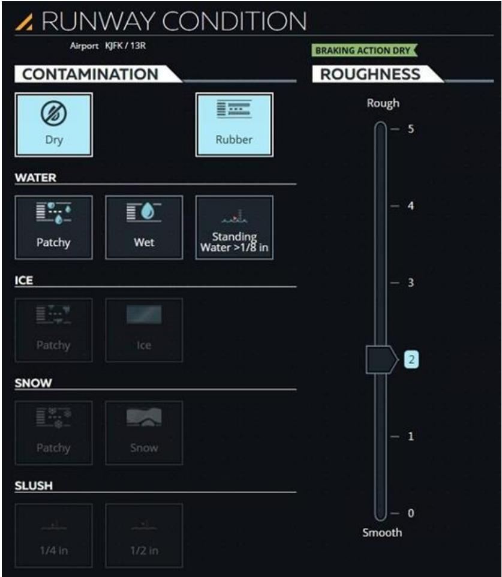
Figure 78 RUNWAY CONDITION Sliding Panel

Page 154

## 9.14.1 CONTAMINATION Tab

This tab features mutually exclusive buttons that allow the instructor to modify the runway surface.

## 9.14.1.1 Dry

Tap this button to set dry runway conditions. On a dry runway, normal touchdown zone rubber residue from landing aircraft will change the coefficient of friction where the rubber is evident.

This may be further affected if runway contaminants are selected. This button is disabled when a wet runway is forced due to rain on the runway.

## 9.14.1.2 Rubber

Tap this button to set rubber on runway. Rubber on runway is independent of the runway conditions (ice, snow slush and sand). There will only be a friction effect if selected in combination with Wet runway.

Note: Rubber can also come in the form of a checkbox.

## 9.14.1.3 WATER – Patchy

Tap this button to add patchy wet conditions on the runway.

This button is disabled when:

The temperature is below -5 degrees Celsius.

• A wet runway is forced due to rain on the runway.

## 9.14.1.4 WATER – Wet

Tap this button to add wet conditions on the runway.

This button is disabled when the temperature is below -5 degrees Celsius.

## 9.14.1.5 WATER – Standing Water > 1/8 in (3 mm)

Tap this button to add 1/8 inch (3 mm) of water on the runway.

This button is disabled when the temperature is below -5 degrees Celsius.

## 9.14.1.6 ICE - Patchy

Tap this button to add patchy ice conditions on the runway. This button is disabled when:

The temperature is above 5 degrees Celsius.

• A wet runway is forced due to rain on the runway.

## 9.14.1.7 ICE

Tap this button to add a predefined amount of ice on the runway.

This button is disabled when:

The temperature is above 5 degrees Celsius.

• A wet runway is forced due to rain on the runway.

## 9.14.1.8 SNOW - Patchy

Tap this button to add patchy snow conditions on the runway.

The patchy snow effect is for visual purposes only.

This button is disabled when a wet runway is forced due to rain on the runway.

## 9.14.1.9 SNOW

Tap this button to add a pre-defined amount of snow on the runway.

This button is disabled when:

The temperature is above 5 degrees Celsius.

• A wet runway is forced due to rain on the runway.

## 9.14.1.10 SLUSH – ¼ in (6mm)

Tap this button to add 1/4 inch (6 mm) of slush on the runway.

This button is disabled when:

• The temperature is lower than -5 degrees Celsius or above 5 degrees Celsius.

• A wet runway is forced due to rain on the runway.

## 9.14.1.11 SLUSH – ½ in (13 mm)

Tap this button to add 1/2 inch (13 mm) of slush on the runway.

This button is disabled when:

• The temperature is lower than -5 degrees Celsius or above 5 degrees Celsius.

• A wet runway is forced due to rain on the runway.

## 9.14.2 ROUGHNESS Tab

This tab includes a slider control to adjust the runway roughness between 1 to 5.
(1 = Smooth and 5 = Rough).

REFERENCE AIRPORT Tab

13 Oct 2017

Page 156

## 10. INSTRUCTOR STATION Sliding Panel

The INSTRUCTOR STATION sliding panel allows the instructor to:

Set the Unit of Measure (UOM) of various parameters

Change the IOS workspace configuration

End the IOS session

To access the INSTRUCTOR STATION sliding panel, tap on the Expand button located at the right side of the Control Board.

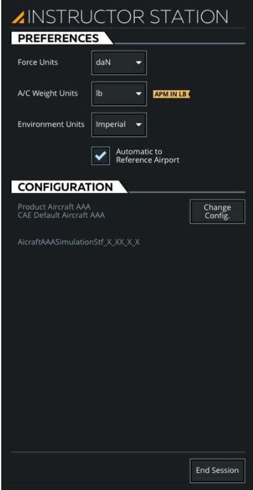
Figure 79 INSTRUCTOR STATION Sliding Panel

Panel

INSTRUCTOR STATION Sliding

13 Oct 2017

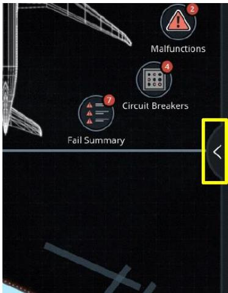
Figure 80 Control Board Expand Button

## 10.1 PREFERENCES Tab

The PREFERENCES Tab includes dropdown buttons that allow the instructor to set the unit of measure of:

Force units

• Aircraft weight

Environment units

## 10.1.1 Force Units

Tap this dropdown button to expand selection, then tap to set the Force Units to either:

Lbf Sets the force units to lbf

daN Sets the force units to daN

## 10.1.2 A/C Weight Units

Tap this dropdown button to expand selection, then tap to set the aircraft weight Unit of Measure to either:

Kg Sets the aircraft weight units to kilograms (kg).

(In the case of liquid volume, liters will be used).

lb Sets the aircraft weight units to pounds (lb).

(In the case of liquid volume, gal, qt and pt will be used).

Panel

13 Oct 2017

Page 158

## 10.1.3 Environment Units

Tap this dropdown button to expand selection, then tap to set the Environment Units to Metric or Imperial.

## 10.1.3.1 Metric

Metric sets the environment units as defined below:

QFE - hPa/mb

QNH - hPa/mb

• Temperature - deg C

RVR - m

• Visibility - km

• Wind - kt

• Runway Contamination Depth - mm

Cloud Height - ft

## 10.1.3.2 Imperial

Imperial sets the environment units as defined below:

• QFE - inHg

QNH - inHg

• Temperature - deg C

RVR - ft

Visibility - sm

Wind - kt

• Runway Contamination Depth - in

Cloud Height - ft

## 10.1.4 Automatic to Reference Airport

Tap this checkbox to set the unit of measure parameters to match those of the selected reference airport.

## 10.2 CONFIGURATION Tab

The CONFIGURATION tab allows the instructor to view parameters of the current IOS configuration and change the current IOS to another configuration.

Panel

## 10.2.1 Change Configuration Button

Tap this button to display the CONFIGURATIONS page which allows the instructor to:

• View all the IOS configurations

• Load a specific IOS configuration by tapping on the associated Load button.

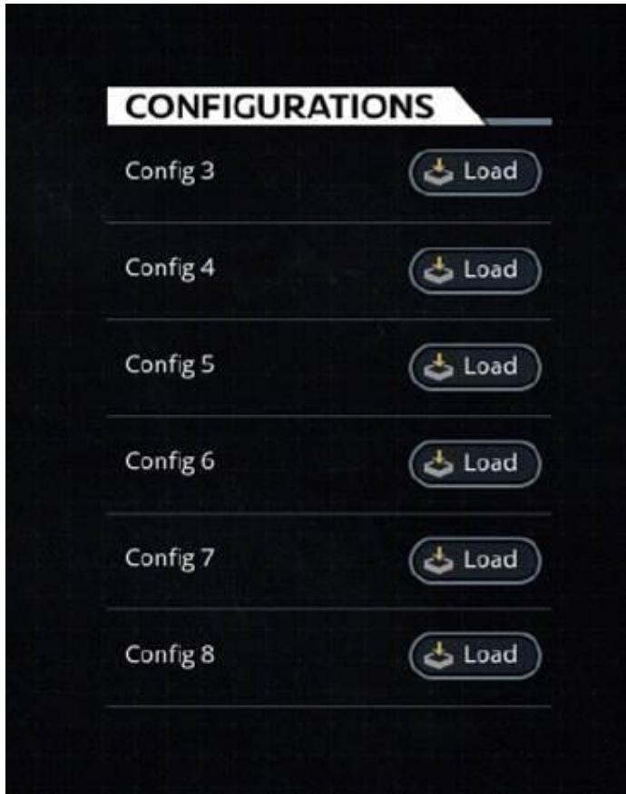
Figure 81 IOS CONFIGURATIONS Selection Page

## 10.3 End Session

Tap this button to:

End the current session

Return the IOS Main Page

Select another Configuration by tapping the Change button.

Panel

13 Oct 2017

Page 160

Figure 82 IOS Main Page

## 11. Control Board Footer

The Control Board footer is designed to provide quick access to common functions regardless of the panel or sliding panel currently displayed.

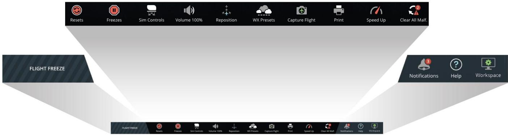
Figure 83 Footer

## 11.1 FLIGHT FREEZE

FLIGHT FREEZE is a toggle type button that allows the instructor to activate/deactivate the flight freeze mode.

Tap this button to activate the flight freeze mode. When Flight Freeze is activated, it freezes:

All flight parameters such as:

o Pitch

o Bank

o Heading

o Airspeed

Altitude and position

• Motion system

o Except for washout as predicted by the flight conditions at the moment freeze was activated.

A flight freeze also decreases the sound level.

Note: During flight freeze, most simulated aircraft systems remain unaffected and continue to follow crew actions and malfunction insertions except for the effects of frozen altitude and position parameters.

It is important to understand that when flight freeze is activated, tapping the FLIGHT FREEZE toggle button to de-activate the flight freeze mode will not cause violent control or motion movements:

Regardless of whether the autopilot is activated or not and,

Independent of the control positions at the time of unfreeze.

During a reposition, the FLIGHT FREEZE button is disabled until the reposition or flight trim is completed. A message Reposition in Progress is displayed in the button.

Making changes to parameters such as: temperature, pressure, wind and cloud altitude ramping while flight freeze is activated will only take effect once flight freeze is deactivated.

## 11.2 Resets

The Resets button allows the instructor to perform the following resets:

Environment Reset

ISA & Winds Reset

Systems Reset

Total Reset

Session Reset

• More…

Tap the Resets button to display the Resets roll up menu and then tap on the desired reset to activate it.

Figure 84 Resets Roll up Menu (Typical)

## 11.2.1 Environment

Tap the Environment button to reset the environment as follows:

• Dry runway

Rubber on runway

• Runway roughness 2

• Visibility 40 nm

• RVR 9900 ft

• No clouds

• No fog

• No rain

• No hail

• No falling snow

• No winter scene

• No sand

• No lightning

• No thunder

• No storm clouds

• No icing

• Time of day speed up factor reset

Tapping this button causes it to illuminate for two seconds.

This button is disabled when all above conditions are met.

Note: When any of these conditions are not met, the message Non STD Environment will appear in the warning window. With respect to CAVOK condition the message will be triggered when conditions are below those of CAVOK definition.

## 11.2.2 ISA & Winds

Tap the ISA & Winds button to set the atmosphere to the following ISA standard conditions and winds:

• Sea Level Baro Press 1013.2 mb

• Intermediate Altitude 18 000 ft

• Upper Level Altitude 36 089 ft

• Temp Lapse Rate -1.98 deg C/1000ft

• Sea Level Temp 15 deg C

• Intermediate Temp -21.0 deg C (at 18000 ft)

• Upper Level Temp -56.5 deg C (at 36089 ft)

• Airfield Wind 360/0 deg mag/kt

• Intermediate Wind 360/0 deg mag/kt

• Upper Level Wind 360/0 deg mag/kt

• No Gust

Base Turbulence

• No Windshear

• No Microburst

Tapping this button causes it to illuminate for two seconds.

This button is disabled when all above conditions are met.

## 11.2.3 Systems

Tap the Systems button to reset all the systems under the Reset Systems branch.

Note: The number and type of resettable systems varies with IOS configuration.

Tapping this button also resets temperatures to normal operating values unless:

• A malfunction is active

• A specific system is intentionally excluded

Tapping this button causes it to illuminate for two seconds.

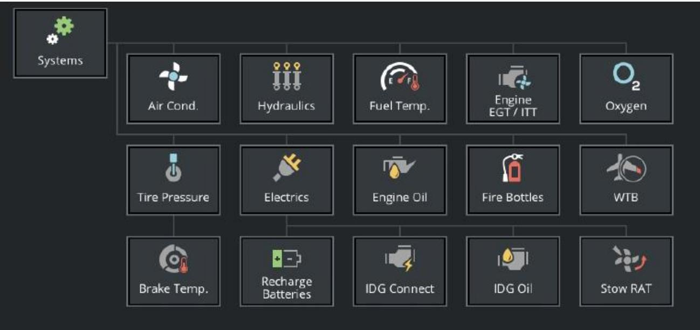
Figure 85 Systems Reset

## 11.2.4 Total

Tap this button to execute a total reset that will reset the following parameters:

Crash Reset (if Crashed) On

Clear Malfunctions On

Clear Failed Stations On

Engine Exceedance On

Fuel Used Indicator On

Tapping the Reset button also automatically performs a Systems Reset.

Tapping this button causes it to illuminate for two seconds.

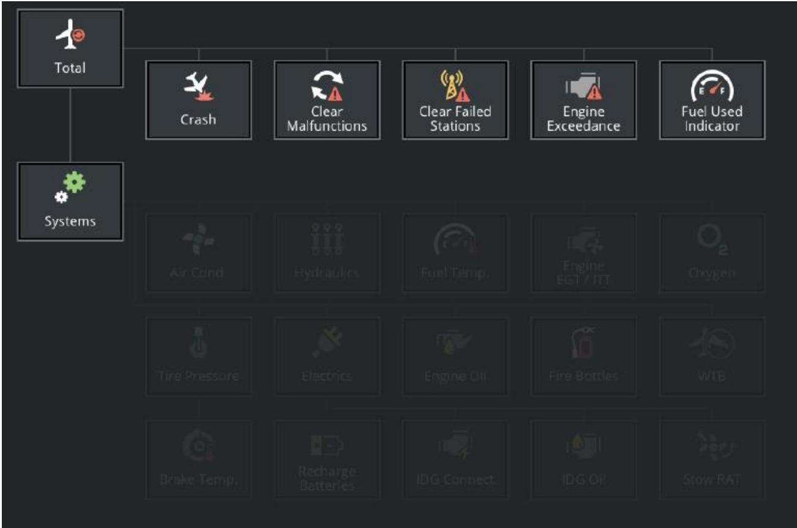
Figure 86 Total Reset

## 11.2.5 Session

Tap this button to execute a session reset. Upon tapping this button, a Reset Session popup menu appears to confirm the Session reset operation.

A session reset performs the following:

End Lesson

Crash Inhibit

• Brake Temp Reset Inhibit not active

• RAAS Inhibit not active (optional)

Environment Reset

• Standard Atmosphere and Winds

• Turbulence enable buttons to default settings

• Surface friction button to default setting

End Debrief Recording

• No TCAS Traffic

• No GATES

• No Ground Traffic

• Time of Day Set to Day

• Track erase for map and plots

Sound 100%

• Clears all flight situation captures

• Clears all snapshots (snapshot/setup option)

Tapping the Session button also automatically performs a Total reset (which includes a Systems Reset).

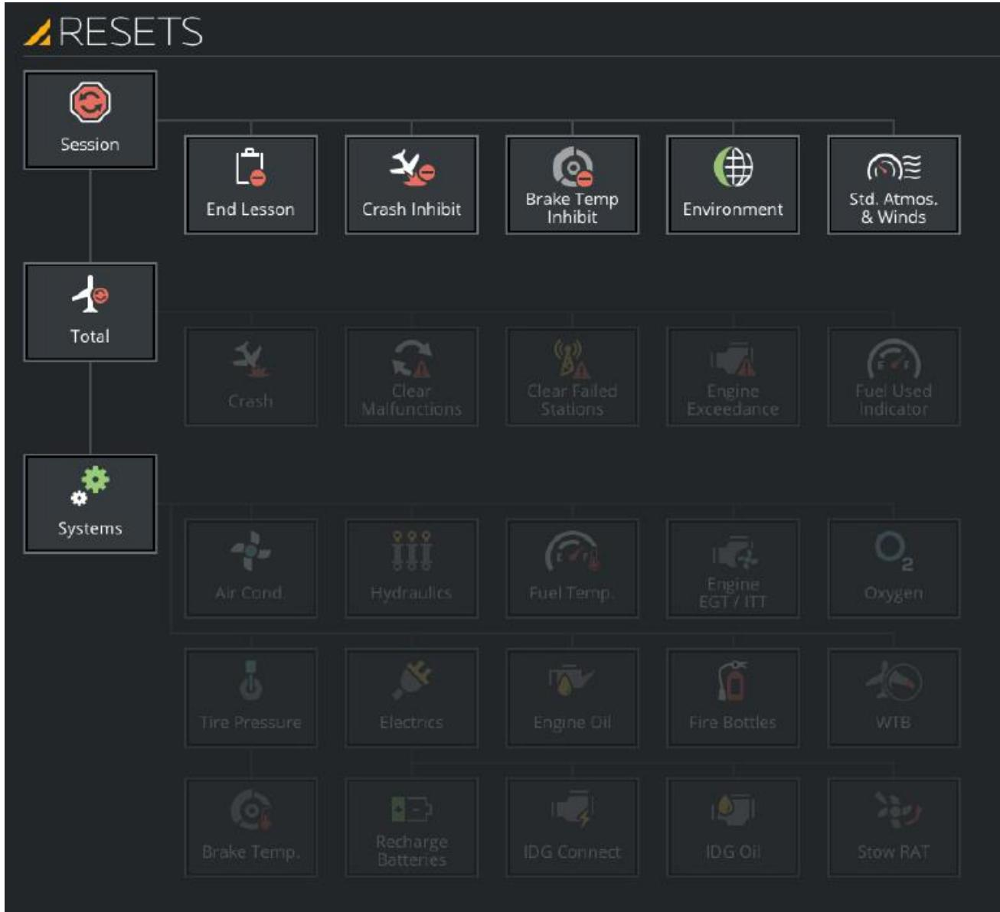
Figure 87 Session Reset

## 11.2.6 More…

Tap the More… button to display the RESETS sliding panel.

## 11.2.6.1 RESETS Sliding Panel

The RESETS Sliding Panel allows the instructor to perform:

Session Reset

Total Reset

Systems Reset

Individual System Reset

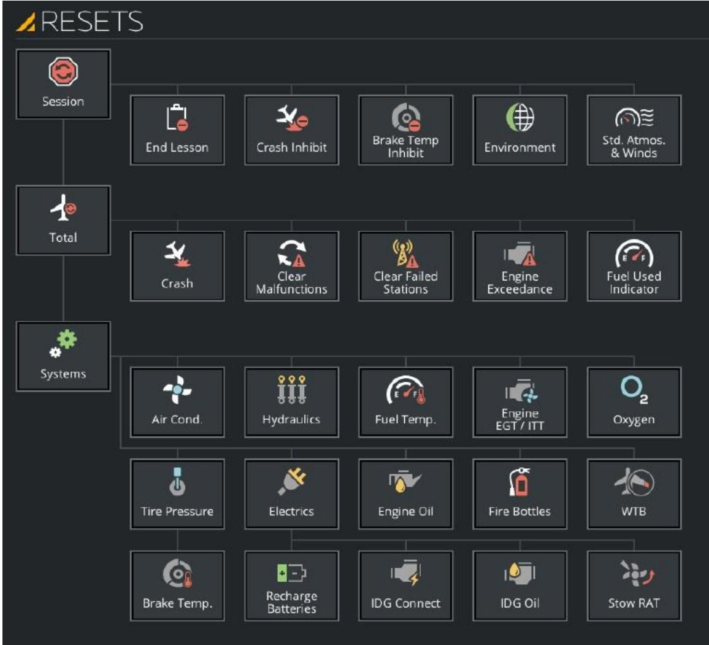
Figure 88 RESETS Sliding Panel

## 11.2.6.1.1 End Lesson

Tap this button to end the current in progress lesson plan. This causes the master index panel to be displayed. This button is disabled when there is no active lesson plan.

## 11.2.6.1.2 Crash Inhibit

Tap this button to prevent a crash from occurring when crash limits are exceeded.
This means that the simulation will continue through a crash.

When this button is not selected, in the event of crash situation, the simulation will freeze, except for:

• Advisory crashes or exceedance advisories

o Where only the Crash/Advisory/Exceedance panel appears, but the simulation does not freeze

The following parameters are monitored to detect an aircraft crash condition:

Excessive rate of descent at touchdown

Wing strike on ground (advisory)

Tail strike (advisory)

• Landing gear not down and locked at touchdown (advisory)

Excessive side force on ground

Excessive speed

Excessive G force

Excessive Mach

Ground contact off runway (advisory)

Midair collision

Terrain/Obstacle impact

Structural impact off runway

• Excessive speed (> 75 kt) off runway

Excessive flight acceleration in air (exceedance)

• Excessive jerk (rate of change of acceleration) in air (exceedance)

Unstable flight acceleration in air (exceedance)

Excessive flight acceleration on ground (exceedance)

• Excessive jerk (rate of change of acceleration) on ground (exceedance)

Unstable flight acceleration on ground (exceedance)

Excessive engine thrust during pushback

• Excessive engine thrust or brakes applied during pushback (option)

This button is disabled if the aircraft has already crashed.

The Crash Inhibit will inhibit crash detection of all crashes with the exception of Excessive Rate of Descent at Touchdown and Excessive Side Force on Ground.

The Excessive Rate of Descent at Touchdown and Excessive Side Force on Ground cannot be inhibited because it is there to prevent excessive motion jerks and large hits that could injure personnel during training.

When Crash Inhibit is activated, the Excessive Rate of Descent at Touchdown trigger threshold is increased to allow harder landings while still maintaining the protection as described above.

## 11.2.6.1.3 Brake Temp Reset Inhibit

Tap this button to inhibit the resetting of the brake and tire temperature whenever a reposition is performed.

## 11.2.6.1.4 Environment

Refer to paragraph 11.2.1.

## 11.2.6.1.5 Standard Atmos & Winds

Refer to paragraph 11.2.2.

## 11.2.6.1.6Crash

In all instances below for advisory crashes and exceedance advisories, the following statements apply:

Crash Reset button does not appear.

• Crash/Advisory/Exceedance page is cleared automatically after 30 seconds.

In all instances below for regular crashes, the following statements apply, EXCEPT where indicated otherwise:

• Flight Freeze button is dark until a Crash Reset or reposition is performed.

• Crash Reset clears the Crash/Advisory/Exceedance page and performs a takeoff reposition.

Tap this button to reset the simulator as follows:

Excessive rate of descent at touchdown

• Wing strike on ground (advisory)

• Tail strike (advisory)

• Landing gear not down and locked at touchdown (advisory)

Excessive side force on ground

Excessive speed:

o Clears the Crash/Advisory/Exceedance panel and,

o Releases Flight Freeze

o Crash condition will not be monitored for a period of 30 seconds after a Crash Reset.

Excessive G force:

o Clears the Crash/Advisory/Exceedance panel and,

o Releases Flight Freeze

o Crash condition will not be monitored for a period of 30 seconds after a Crash Reset

Excessive Mach:

o Clears the Crash/Advisory/Exceedance panel and,

o Releases Flight Freeze

o Crash condition will not be monitored for a period of 30 seconds after a Crash Reset

Ground contact off runway (advisory)

Midair collision:

o Clears the Crash/Advisory/Exceedance panel and,

o Releases Flight Freeze

o Crash condition will not be monitored for a period of 30 seconds after a Crash Reset

Terrain/Obstacle impact

Structural impact off runway

Excessive speed (> 75 kt) off runway

Excessive flight acceleration in air (exceedance)

• Excessive jerk (rate of change of acceleration) in air (exceedance)

Unstable flight acceleration in air (exceedance)

Excessive flight acceleration on ground (exceedance)

• Excessive jerk (rate of change of acceleration) on ground (exceedance)

Unstable flight acceleration on ground (exceedance)

Excessive engine thrust during pushback

• Excessive engine thrust or brakes applied during pushback (option)

This button is disabled if the aircraft has not crashed. When selected, the button remains active for 2 seconds.

## 11.2.6.1.7 Clear Malfunctions

Tap this button to clear all active and armed malfunctions.

This button is disabled if there are no active or armed malfunctions.

Tapping this button causes it to illuminate for two seconds.

## 11.2.6.1.8 Clear Failed Stations

Tap this button to clear all stations that were failed by the instructor.

This button is disabled when there are no failed stations.

Tapping this button causes it to illuminate for two seconds.

## 11.2.6.1.9 Engine Exceedance

Tap this button to clear the Engine.

Displays exceedances red box (N1, N2, and EGT) by moving the exceedances into the next DEU flight leg.

This is achieved by setting the airspeed over 80 knots for 2 seconds.

This button is disabled if engine exceedance has not occurred.

Tapping this button causes it to illuminate for two seconds.

## 11.2.6.1.10 Fuel Used Indicator

Tap this button to reset the Fuel Used indicator. Tapping this button causes it to illuminate for two seconds.

## 11.2.6.1.11 Air Conditioning

Tap this button to reset the air conditioning temperature to normal.

This button is disabled when the air conditioning temperature is normal.

Tapping this button causes it to illuminate for two seconds.

## 11.2.6.1.12 Hydraulics

Tap this button to reset hydraulic fluid quantities and hydraulic oil temperature to normal operating values.

This button is disabled when hydraulic fluid quantities and hydraulic oil temperature are at normal operating values.

Tapping this button causes it to illuminate for two seconds.

## 11.2.6.1.13 Fuel Temp.

Tap this button to reset the fuel temperature to ambient temperature.

This button is disabled when the fuel temperature is at ambient temperature.

Tapping this button causes it to illuminate for two seconds.

## 11.2.6.1.14 Engine EGT/ITT

Tap this button to reset the Engine Exhaust Gas Temperature (EGT) or Interstage Turbine Temperature (ITT), as applicable, to normal operating values.

This button is disabled when the Engine EGT or ITT is at a steady state.

Tapping this button causes it to illuminate for two seconds.

## 11.2.6.1.15 Oxygen

Tap this button to refill the oxygen bottles.

This button is disabled if the oxygen bottles are full.

Tapping this button causes it to illuminate for two seconds.

## 11.2.6.1.16 Tire Pressure

Tap this button to reset the tire pressure to normal and the brake temperature to the ambient temperature.

This button is disabled when tire pressure is within the normal operating range and the brake temperature is at ambient temperature.

Tapping this button causes it to illuminate for two seconds.

## 11.2.6.1.17 Brake Temp

Tap this button to reset the brake temperature to the ambient temperature.

This button is disabled when the brake temperature is at ambient temperature.

Tapping this button causes it to illuminate for two seconds.

## 11.2.6.1.18 Electrics

Tap this button to reset the following elements to normal:

Recharge Batteries

IDG Connect

IDG Oil

Stow RAT

This button is disabled when all above items are reset to normal.

Tapping this button causes it to illuminate for two seconds.

## 11.2.6.1.19 Recharge Batteries

Tap this button to recharge batteries.

This button is disabled when all batteries are charged.

Tapping this button causes it to illuminate for two seconds.

## 11.2.6.1.20 IDG Connect

Tap this button to reset the disconnected IDGs. This button is disabled when the IDG is connected. Tapping this button causes it to illuminate for two seconds.

## 11.2.6.1.21 IDG Oil

Tap this button to reset the IDG oil quantity and temperature to normal operating values. This button is disabled when the IDG oil quantity and temperature are normal. Tapping this button causes it to illuminate for two seconds.

## 11.2.6.1.22 Stow RAT

Tap this button to stow the Ram Air Turbine (RAT). This button is disabled when the RAT is stowed. Tapping this button causes it to illuminate for two seconds.

## 11.2.6.1.23 Engine Oil

Tap this button to reset the engine oil quantities and engine oil temperature to normal operating values.

This button is disabled when the engine oil tank quantities and engine oil temperature are within normal operating values.

Tapping this button causes it to illuminate for two seconds.

## 11.2.6.1.24 Fire Bottles

Tap this button to refill all fire extinguishing bottles.

This button is disabled if the fire extinguishing bottles are filled.

Tapping this button causes it to illuminate for two seconds.

## 11.2.6.1.25 WTB

Tap this button to reset the Wing Tip brakes (WTB) to normal.

This button is disabled if the WTB are normal.

Tapping this button causes it to illuminate for two seconds.

## 11.3 Freezes

The Freezes button allows the instructor to perform the following freezes:

Total

Position

Fuel

Tap the Freezes button to display the Freezes roll up menu and then tap on the desired freeze to activate.

Active freezes are shown in red.

Figure 89 Freezes Roll up Menu

## 11.3.1 Total Freeze

Tap this toggle button to activate/deactivate total freeze.

When total freeze is activated, it freezes:

All flight parameters such as:

o Pitch

o Bank

o Heading

o Airspeed

Altitude and position

Flight controls:

o Regardless of whether the autopilot is activated or not (control loading is not frozen)

• Motion system

o Except for washout as predicted by the flight conditions at the time freeze was activated

All aircraft systems:

o Crew selections are no longer reflected in changing indications except where a selector directly drives an indicator, for example frequency selectors

During total freeze:

The communication system continues to function

The sound level decreases

It is important to understand that when total freeze is activated, tapping the Total Freeze toggle button to de-activate the total freeze mode will not cause violent control or motion movements:

Regardless of whether the autopilot is activated or not,

Independent of the control positions at the time of unfreeze

## 11.3.2 Position Freeze

Tap this toggle button to freeze/unfreeze the aircraft at the current geographical position.

During freeze, the aircraft flies normally.

During a reposition, the freeze button is disabled until the reposition or flight trim is completed.

## 11.3.3 Fuel Freeze

Tap this toggle button to activate/deactivate fuel freeze.

When Fuel Freeze is activated:

All aircraft instruments continue to indicate normally.

o Except the fuel quantity indicators, as these remain inactive because no fuel is consumed by the aircraft during Fuel Freeze.

• All other aircraft systems remain unaffected except for the effects of fuel freeze.

Refuel remains possible.

During reposition, the freeze button is disabled until the reposition or flight trim is completed.

## 11.3.4 More…

Tap the More… button to display the FREEZES sliding panel.

## 11.3.4.1 FREEZES Sliding Panel

The FREEZES sliding panel allows the instructor to perform

Total freeze

Flight freeze

Altitude freeze

• Position freeze

Heading freeze

Fuel freeze

Attitude freeze

• Airspeed freeze

Link FLT FRZ to a specific button in the cockpit

Note: The Link Flight Freeze (FLT FRZ) button depending on the IOS configuration can be linked to the Flight Deck Door or any other cockpit button.

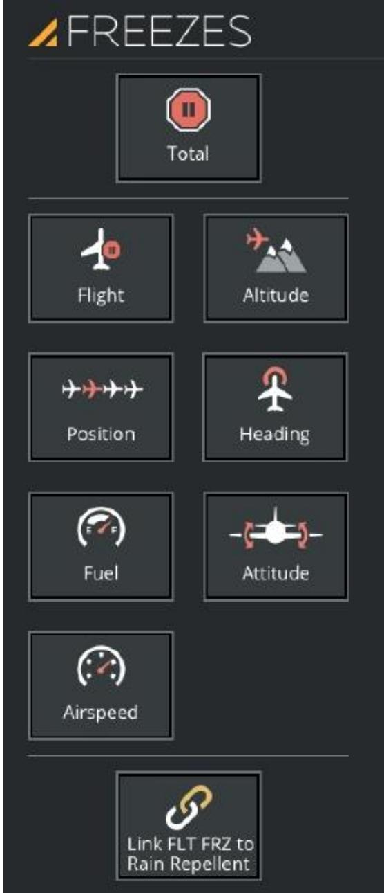
Figure 90 FREEZES Sliding Panel

## 11.3.4.2 Total

Refer to paragraph 11.3.1 Total Freeze.

## 11.3.4.3 Flight

Refer to paragraph 11.1 FLIGHT FREEZE.

## 11.3.4.4 Altitude

Tap this toggle button to activate/deactivate aircraft altitude freeze.

When Altitude is activated, no other parameters are affected except altitude.

During reposition, the freeze button is disabled until the reposition or flight trim is completed.

## 11.3.4.5 Position

Refer to paragraph 11.3.2 Position Freeze.

## 11.3.4.6 Heading

Tap this toggle button to activate/deactivate aircraft heading freeze.

When heading freeze is activated, no other parameters are affected except heading.

During a reposition, the freeze button is disabled until the reposition or flight trim is completed.

## 11.3.4.7 Fuel

Refer to paragraph 11.3.3 Fuel Freeze.

## 11.3.4.8 Attitude

Tap this toggle button to activate/deactivate aircraft attitude freeze.

When attitude freeze is activated, no other parameters are affected except aircraft attitude.

During a reposition, the freeze button is disabled until the reposition or flight trim is completed.

## 11.3.4.9 Airspeed

Tap this toggle button to activate/deactivate aircraft airspeed freeze.

When aircraft airspeed freeze is activated, no other parameters are affected except aircraft airspeed.

During a reposition, the freeze button is disabled until the reposition or flight trim is completed.

## 11.3.4.10 Link FLT FRZ to Rain Repellent

Tap this button to allow the Rain Repellent button in the cockpit to be used as a flight freeze control.

## 11.4 Sim Controls

The Sim Controls button allows the instructor to control and monitor the status of various simulator systems such as:

Visual

Motion

Control Loading

Prime Smoke

• Ceiling Lights

Tap the Sim Controls button to display the Sim Controls roll up menu and view the status of various systems.

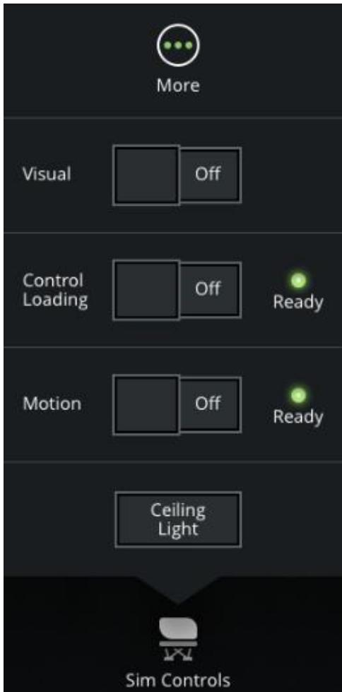
Figure 91 Sim Controls Roll up Menu

## 11.4.1 Visual

Tap this button to activate/deactivate the visual system. This button has two status:

Visual system On

• Visual system Off

## 11.4.2 Motion

Tap this button to start the process of activating or deactivating the motion system. This button has two status:

Motion system On

Motion system Off

A Motion system status light indicator has the following statuses:

<table><tr><td> Status</td><td>Color</td><td>Response</td></tr><tr><td>Failed</td><td>Red</td><td>Selection ignored</td></tr><tr><td>Not ready</td><td>White</td><td>Selection ignored</td></tr><tr><td>Ready</td><td>Blue</td><td>Changes to starting</td></tr><tr><td>On</td><td>Green</td><td>Changes to stopping</td></tr><tr><td>Starting</td><td>Flashing green</td><td>Changes to stopping</td></tr><tr><td>Stopping</td><td>Flashing blue</td><td>Selection ignored</td></tr></table>

This button is disabled if the motion system is not running.

## 11.4.3 Control Loading

Tap this button to start the process of activating or deactivating the Control Loading system. This button has two status:

Control Loading system On

Control Loading system Off

A Control Loading system status light indicator has the following statuses:

<table><tr><td> Status</td><td>Color</td><td>Response</td></tr><tr><td>Failed</td><td>Red</td><td>Selection ignored</td></tr><tr><td>Not ready</td><td>White</td><td>Selection ignored</td></tr><tr><td>Ready</td><td>Blue</td><td>Changes to starting</td></tr><tr><td>On</td><td>Green</td><td>Changes to stopping</td></tr><tr><td>Starting</td><td>Flashing green</td><td>Changes to stopping</td></tr><tr><td>Stopping</td><td>Flashing blue</td><td>Selection ignored</td></tr></table>

## 11.4.4 Prime Smoke

This button start the process of activating or deactivating the Smoke Generator system. Once the Smoke generator system is primed, a smoke malfunction can be triggered.

This button has two status:

Smoke Generator system On

Smoke Generator system Off

From the Normal state, tap this button to prime the Smoke Generator system, while the system is priming a light indicator flashes green and when the system is ready the light indicator illuminates steady.

## 11.4.5 Ceiling Lights

Tap this button to illuminate/extinguish the flight compartment ceiling lights. This button has two status:

• Ceiling lights On

• Ceiling lights Off

## 11.4.6 More…

Tap the More… button to display the SIMULATOR CONTROLS sliding panel.

## 11.4.6.1 SIMULATOR CONTROLS Sliding Panel

The SIMULATOR CONTROLS sliding panel provides additional simulator controls. It includes the following tabs:

• MOTION & CONTROL LOADING

MESSAGE LOG

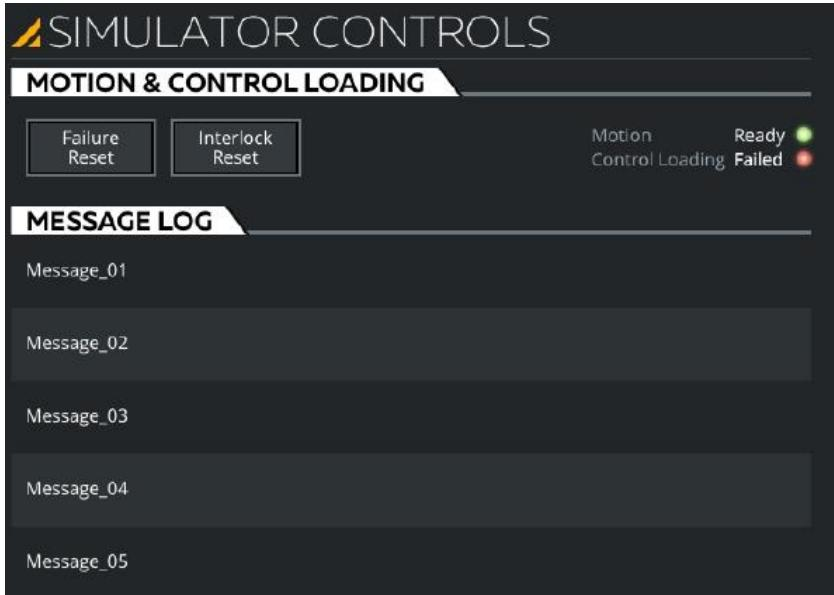
Figure 92 SIMULATOR CONTROLS Sliding Panel

## 11.4.6.1.1 MOTION & CONTROL LOADING Tab

This tab includes light indicators providing a status of the Motion and Control Loading systems as described in paragraphs 11.4.2 and 11.4.3 and Reset buttons.

## 11.4.6.1.1.1 Failure Reset

Tap this button to attempt resetting all Motion and Control Loading systems warning and failure messages. Tapping this button causes it to illuminate for two seconds.

## 11.4.6.1.1.2 Interlock Reset

Tap this button to attempt resetting all Motion and Control Loading systems interlock messages. Interlock messages represent the status of safety devices that prevent the activation of motion and control loading systems. Such safety devices installed at strategic locations on the simulator such as Visual Access Doors and Cockpit Door will trigger the interlock messages when the device sensors are not in the required state. When selected, the button remains active for two seconds.

## 11.4.6.1.2 MESSAGE LOG Tab

This tab displays a limited set of Motion and Control Loading error, warning and specifically, interlock messages, which are useful to the instructor.

## 11.5 Volume

The Volume button allows the instructor to control the volume of the simulation sound.

Adjusting the volume level can be changed instantly in either one of two ways:

Input text field

Slider Control

To adjust the volume:

1) Tap on the input text field, this will display a keypad.
2) Use the keypad to manually enter a specific value. Or,
3) Use the slider control to adjust the volume between a minimum value.

A Mute button mutes the simulation sound.

Figure 93 Volume Roll up Menu

## 11.6 Reposition

The Reposition button allows the instructor to reposition the aircraft to a preset position with respect to the reference runway.

To reposition the aircraft to an alternate preset position:

1) Tap this button to display the Reposition roll up menu.
2) Tap on the desired preset position.
3) Tap the Reposition button to activate the repositioning of the aircraft.

All Preset positions are defined in the AIRPORT REPOSITION Tab in the AIRPORT REPOSITION sliding panel in paragraph 9.2. Tapping the More… button displays the AIRPORT REPOSITION sliding panel.

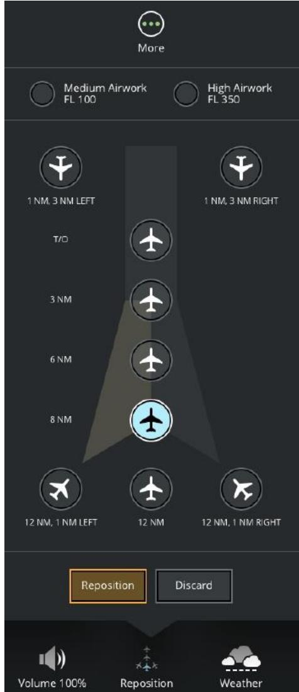
Figure 94 Reposition Roll up Menu

## 11.7 Weather Presets

The WX Presets button allows the instructor to change the cloud and visibility conditions at the reference airport according to EASA / FAA standards (as applicable).

To change the cloud and visibility conditions:

1) Tap this button to display the WX Preset roll up menu
2) Tap on the desired WX preset button

All WX Presets are defined in the Weather Presets Section of the CLOUDS sliding panel paragraph 7.2.4

Note: The name of this roll up menu located under the icon varies with the current WX preset selection.

Tapping the More… button displays the Advanced – Weather Region page.

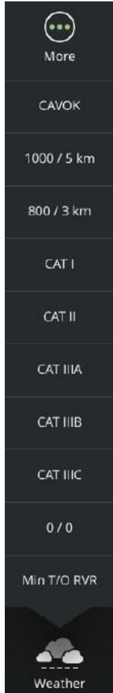
Figure 95 WX Presets Roll up Menu

## 11.8 Capture Flight

The Capture Flight button allows the instructor to create a flight capture into the indicated capture slot.

The button is disabled if a capture, recall, reposition, or slew is active or if the aircraft is moving on ground with a speed in excess of the VR speed.

## 11.9 Print

The Print button allows the instructor to:

Print the current page being displayed on screen

• View printing options

To view additional print options:

Tap the Print button to display the roll up menu

• Tap More… to display the PRINT OPTIONS panel.

Figure 96 Print Roll Up Menu

## 11.9.1 More…

Tap the More… button to display the PRINT OPTIONS sliding panel.

## 11.9.1.1 PRINT OPTIONS Sliding Panel

The PRINT OPTIONS sliding panel consists of checkboxes to select the page to be printed.

Tap on the screen checkbox to select the screen to be printed, then tap on the Print button to print.

## 11.9.1.1.1 Inverted Mode

The Inverted Mode checkbox determines two print modes:

Checked Black and white printing mode

Unchecked Color printing mode

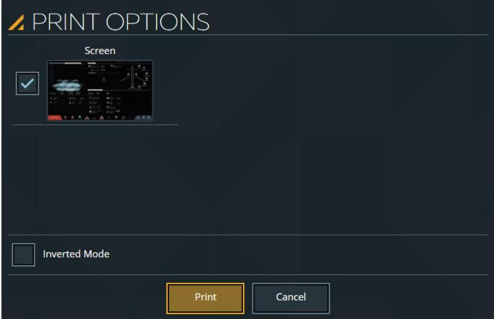
Figure 97 PRINT OPTIONS Sliding Panel

## 11.10 Speed Up

The Speed Up button allows the instructor to accelerate or slowdown the simulation time. To do so,

• Tap on the Speed Up button to display the Speed Up menu, and then

Tap on the desired Speed Up factor.

Figure 98 Speed Up Roll Up Menu

## 11.11 Clear All Malf.

The Clear All Malfunction button allows the instructor to clear all armed or active malfunctions. These are indicated by a red badge overlaid onto the Clear All Malf button.

To clear all malfunctions:

Tap on this button.

• A CLEAR ALL MALFUNCTIONS confirmation popup is displayed.

Tap Confirm to clear or Cancel to retain malfunctions.

This button is disabled if no malfunction is armed or active. When selected, the button remains active for 2 seconds.

## 11.12 Notifications

The Notifications button allows the instructor to view the notifications of events as they occur during the simulation. Each notification message displayed on screen has a color-coded icon depending on the severity of the message.

When a new event occurs, the associated notification message is displayed for five seconds. As additional notifications are occurring during the simulation period, these are stacked on top of each other.

Notifications that are no longer relevant are automatically removed from the listing.

A red badge on the Notifications button shows the number of active messages. Tap on the button to display the list of active notifications.

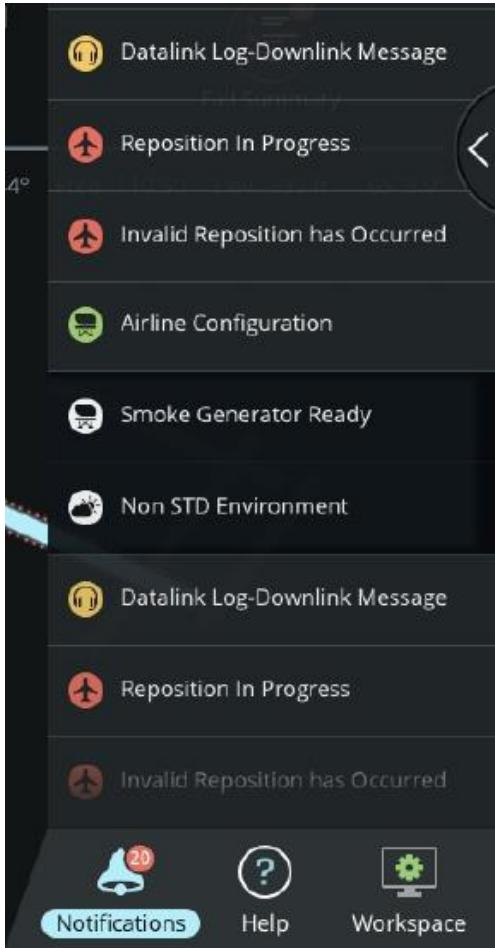
Figure 99 Notifications

## 11.13 Help Rollup Menu

The Help rollup menu allows the instructor to:

• Display or hide the help associated to the active sliding panel.

• Create a zip file that can be sent to CAE personnel for assistance.

Figure 100 Help Rollup Menu

## 11.13.1 Help

Tapping the Help button displays the help for the active or selected panel or sliding panel. Available help is displayed in the form of bubbles with numbers on the workspace.

To view the help associated to the numbered bubble:

• Tap on the bubble on the Help workspace

• This will automatically display the available help for the numbered bubble on the left side of the screen.

If no selection is made within 2-3 seconds after help mode is activated, a popup describing the functionality of the current panel appears.

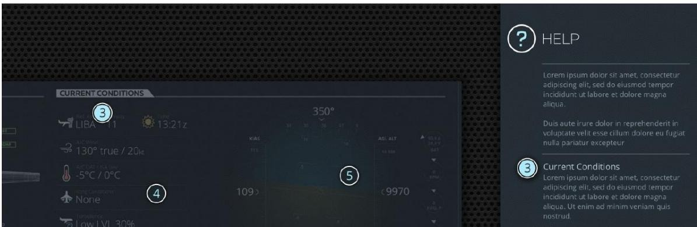
Figure 101 HELP Panel

## 11.13.2 Send Feedback

Send Feedback is a function that allows the instructor to create a help zip file on the Op Server that can then be sent to CAE personnel for analysis and/or assistance.

Tapping on Send Feedback:

Creates a help zip file that contains:

o Print screen images of the IOS display screens.

o Log files

Displays the Send Us Feedback pop up.

Provides basic image editing tools.

o Allowing the instructor to annotate each image.

## 11.13.2.1 Send Us Feedback Pop Up

This pop up as shown in Figure 102 contains input text fields allowing the instructor to enter a brief Subject name, detailed message of the problem and the name of the person creating the help zip file.

Note: The name of the Subject should be brief as the text entered in this field will serve as the prefix of the help zip file name.

## 11.13.2.1.1 Keyboard Icon

Tap the keyboard icon to display/hide the pop up keyboard.

## 11.13.2.1.2 Annotate Screenshots

Tap this button to display the basic image editing tools that will allow the instructor to annotate the selected screenshot image.

The basic image editing tools include a pencil tool, an erase tool as well as a set of pencil tool colors.

To add a markup on the image, the instructor selects the pencil tool and use his finger to touch the screen and make his markups.

## 11.13.2.1.3 Send

Tap the Send button to initiate the process of creating the help zip file. During the file creation process, a Feedback popup as shown in Figure 103 is displayed informing the user that prints screens and log files are being collected.

Once the help zip file is completed, a Thanks for you feed back popup as shown in Figure 104 appears allowing the instructor to view the file and its content.

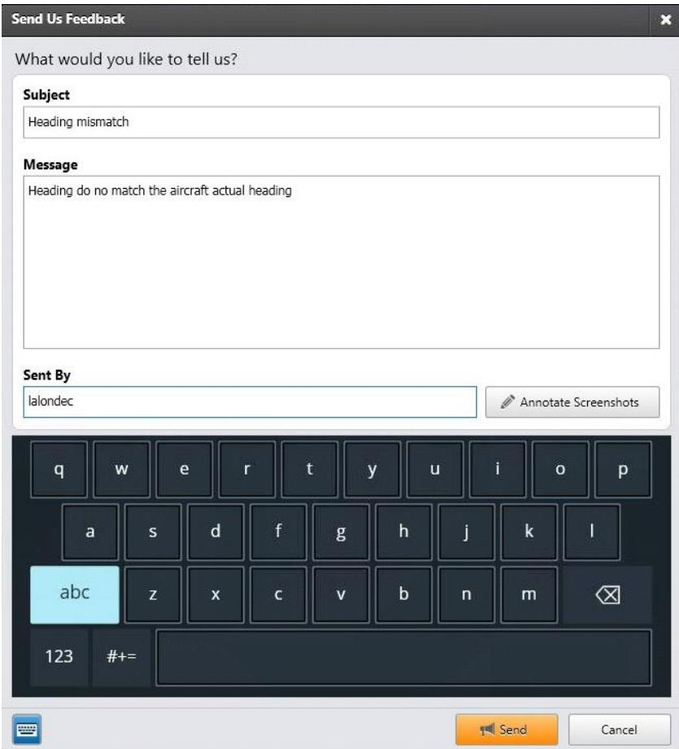
Figure 102 Send Us Feedback Pop Up

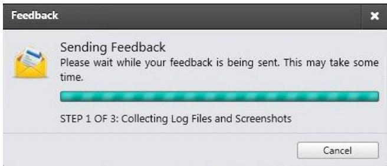
Figure 103 Sending Feedback Pop Up

Figure 104 Viewing the Feedback Data File

## 11.13.2.2 Help Zip File Content

The content of a help zip file created with Send Feedback includes IOS print screens, log files and configuration layout files.

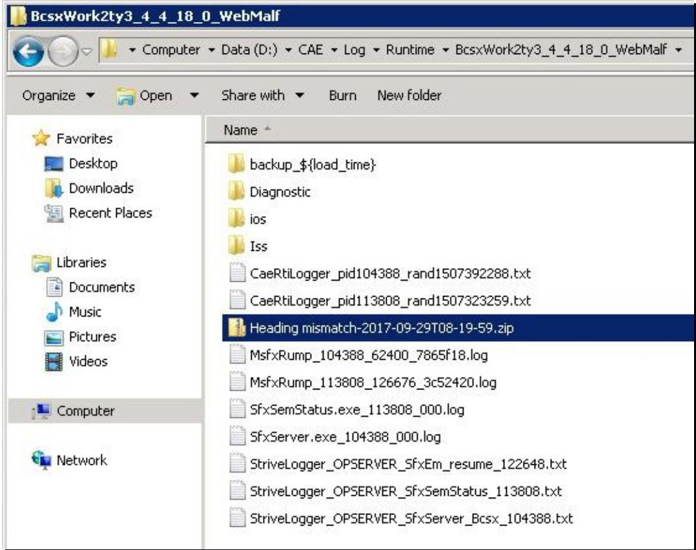
Figure 105 Help Zip File

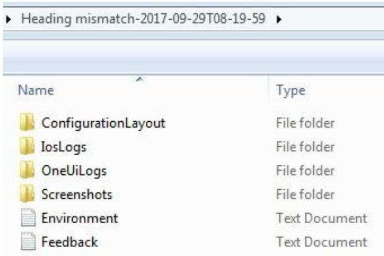
Figure 106 Help Zip File Content Example

## 11.14 Workspace

The Workspace button allows the instructor to choose which application workspace will be displayed on the current monitor.

To display a specific workspace:

1) Tap on the Control Board footer Workspace button. This displays the Workspace roll up menu.
2) Tap on the desired button to select. Some of the main workspaces can include:

o Control Board

o Map

o Lesson Plan

The Workspace roll up menu includes additional buttons such as:

Maintenance, to toggle to the Maintenance mode and,

• Close Workspace Manager

Figure 107 Workspace Roll Up Menu

## 11.14.1 Maintenance

Tap on the Maintenance button to display the Maintenance pages on the current monitor.

## 11.14.2 Instr. Repeaters

Tap on the Instr. Repeaters button to display the Instrument Repeater workspace on the current monitor.

## 11.14.3 Lesson Profile

Tap on the Lesson Profile button to display the Lesson Plan Profile workspace on the current monitor.

## 11.14.4 Map

Tap on the Map button to display the Map workspace on the current monitor.

## 11.14.5 Control Board

Tap on the Control Board button to display the Control Board workspace on the current monitor.

## 11.14.6 Advanced

Tap the Advanced button to display an advanced tool bar on the left side of the current monitor.

This tool bar allows the instructor to quickly access some parameters usually found on the Control board such as Aircraft, Position, Environment parameters, but it also provides access to additional pages such as Intruders and Communication.

## 12. Maintenance Pages

The Maintenance pages are intended to maintenance personnel only to allow them to carry out various simulator maintenance tasks.

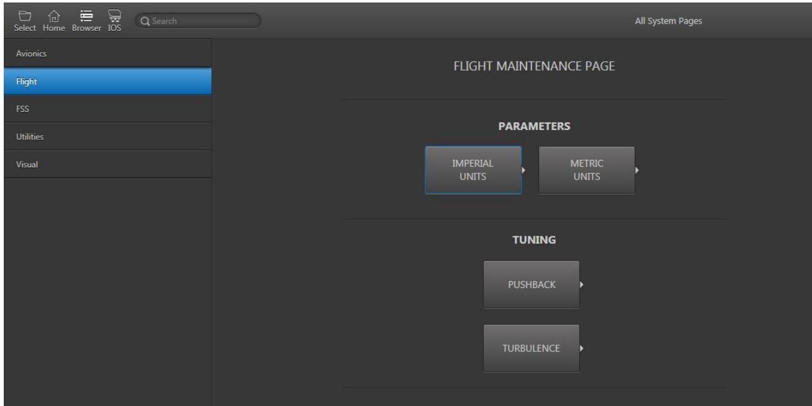
Figure 108 Maintenance Pages

## 13. INSTRUMENT REPEATER Workspace

The INSTRUMENT REPEATER workspace allows the instructor to select an instrument in the cockpit to be displayed on the current monitor.

Note: Depending on the IOS configuration, this workspace can be programmed to view and repeat several cockpit instruments.

The INSTRUMENT REPEATER workspace features:

• A Map Header (identical to the Map workspace header)

• A Main Section

• A Map Footer (identical to the Control board footer)

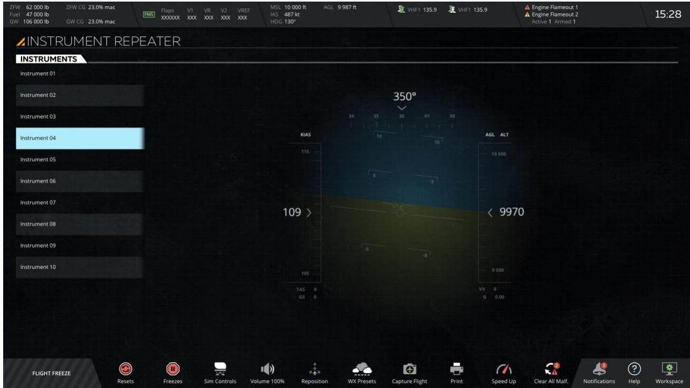
Figure 109 INSTRUMENT REPEATER Workspace

## 13.1 Main Section

The main section of the Instrument Repeater workspace consists of:

An INSTRUMENTS Tab

• An Instrument view mode section

## 13.1.1 INSTRUMENTS Tab

This tab lists all the available instruments from the cockpit that can be displayed on the instrument view mode.

## 13.1.2 Instrument View Mode Section

This section of the Instrument Repeater workspace displays the instrument selected in the INSTRUMENTS Tab.

## 14. Lesson Plan Profile Workspace

The Lesson Plan Profile workspace provides a graphical representation of all the training elements included in the selected lesson. The training elements such as training phases and associated steps are presented over a flight profile (amber line) that is defined in the CAE Slick web-based lesson plan editor.

Unlike the LESSON PLAN Tab in the Control Board, that shows the lesson training phases and steps in two scrollable sections, the Lesson Plan Profile workspace provides an alternate mean to show the same lesson elements.

The Lesson Plan Profile workspace allows instructor to see at a quick glance most, if not all the training elements included in the lesson plan. This of course is driven by the size of the lesson.

The Lesson Plan Profile workspace features:

• A Map Header (identical to the Map workspace header)

• A Main Section which is divided in two view modes:

o Canvas

o List

• A Map Footer (identical to the Control board footer)
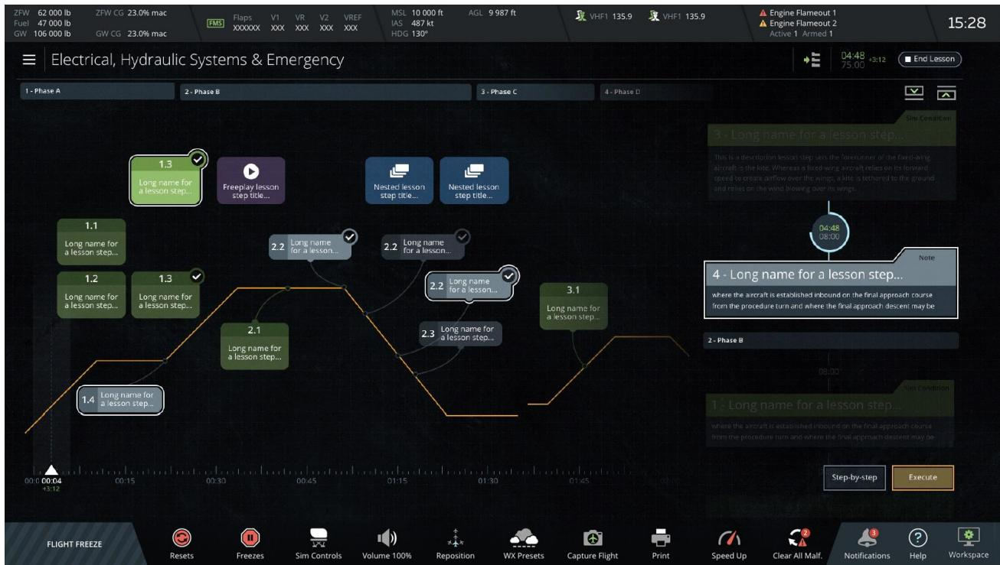
Figure 110 Lesson Plan Profile Workspace

13 Oct 2017

Page 207

## 14.1 Main Section

The main section of the Lesson Plan Profile workspace consists of:

• A Canvas view mode

• A List view mode

• A Time section

• A Time line

• Buttons

## 14.1.1 Canvas View Mode

The Canvas view mode shows all the training phases of the lesson plan along with all the steps associated to each training phase.

This view mode is scrollable from left to right and vice versa to allow the viewing of all lesson plan elements over the flight profile.

To view the details of a lesson step:

Tap on the desired step, this:

o Highlights the step item

o Causes a checkmark to appear

o Displays the list view mode which shows the step details

At this point, tapping on the lesson step again would execute the step (i.e. Tap once to select, tap again to execute).

## 14.1.2 Lesson Elements

Note, Sim Condition and Malfunction elements in a lesson plan each:

• Have a step sequence number that indicates to which training phase they belong.

• Are color coded.

The color code of these elements is:

NOTE

SIM

MALF

13 Oct 2017

The color of lesson plan steps shown in the Canvas view mode is identical to those shown in the Control Board LESSON PLAN tab.

Freeplay and Nested lesson steps do not have a step sequence number as these can be triggered at any time in the lesson plan.

## 14.1.3 Runtime Statuses

Runtime statuses in the Canvas mode are:

Step not selected

Step selected

Step executing instructions

Step is completed

## 14.1.4 Time Line

The time line provides an indication of the total time of the lesson.

## 14.1.5 List View Mode

The List view mode is a vertical scrollable section that allows the instructor to see the same lesson elements found on the canvas. The List view mode operates just like the LESSON PLAN Tab in the Control Board.

## 14.1.6 Time Section

The Time section shows the lesson plan total estimated time and the elapse time. It also provides an indication that shows whether the execution of the lesson is ahead of time or running behind.

\+ indicates ahead of time

\- indicates running behind

## 14.1.7 Buttons

The main section of the Lesson Plan Profile workspace includes the following buttons.

## 14.1.7.1 Lesson List

Tap the Lesson List icon to display all available lessons.

## 14.1.7.2 List View Mode Show/Hide

The List view mode can be shown or hidden on the Lesson Plan Profile workspace.

Tap this toggle icon to hide the List view mode.

Tap this toggle icon to show the List view mode.

## 14.1.7.3 List View Mode Expand/Collapse

The level of information that is shown for each step is controlled by two buttons:

Tap this button to expand the List view mode and increase the information level of detail shown for each step.

Tap this button to retract the List view mode and decrease the information level of detail shown for each step.

## 14.1.7.4 End Lesson

The End Lesson button is displayed when a lesson is running.

When a lesson is running, tap this button to end the current lesson and return to the Lesson Plan selection screen.

## 14.1.7.5 Step-by-Step

Tap this button to run the lesson steps in a step-by-step fashion.

For each step to be issued, requires a confirmation from the instructor which is done by tapping the Execute button.

## 14.1.7.6 Execute

Tap this button to execute the selected lesson step.

## 15. Map Workspace

The Map workspace provides a 2D/3D representation of the virtual space which is intended to enhance situational awareness.

To display the Map Workspace:

1) Tap on the Control Board footer Workspace button.

o This displays a Workspace rollup menu

2) From the available workspaces displayed, tap on Map to select.

The Map workspace features a:

• Map Header

• Main Section

Right Toolbar

• Map Footer

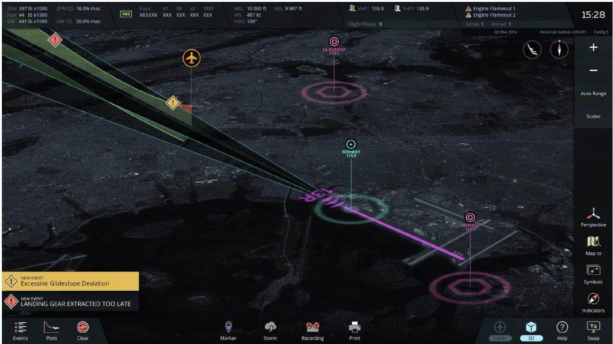
Figure 111 Map Workspace

## 15.1 Map Header

The Map header features a series of tabs that groups various type of information relating to the aircraft. Information such as:

Weight & Balance

Performance Data

• Altitude, Heading, IAS

Communications

• Armed and Active Malfunctions

• Current Time

• Lesson and exercise information

Figure 112 Map Header

Figure 113 Weight & Balance

Figure 114 Performance Data

Figure 115 Altitude, Heading and IAS

Figure 116 Communications

Figure 117 Malfunctions

## 15.2 Main Section

The Main section of the Map workspace is a 2D/3D representation of the virtual space. This section shows the aircraft position, flight path and environment components such as:

Other active entities

• Navaids

• Airports

• Weather elements such as storms

Figure 118 Main Section

## 15.2.1 Icons

There are two main icons on the main section:

Wind barb indicating the wind direction at the aircraft.

• Compass showing the Compass

o Tapping on the compass icon toggles north up/heading up.

Figure 119 Main Section Icons

## 15.2.2 Radial Menus

There are several types of radial menus used on the main section. These are accessible by tapping on the main section of the map.

## 15.2.2.1 Cursor Radial Menu

The Cursor Radial menu allows the instructor to:

• Place a spider web around the cursor location.

Reposition the aircraft to a specific location on the map.

Add a storm to a specific location on the map.

Add an entity to a specific location on the map.

To display the Cursor Radial Menu at a specific location on the map:

1) Tap the desired location on the map section.
2) This places the cursor at the tapped location.
3) The Cursor Radial menu buttons are displayed.

Figure 120 Cursor Radial Menu

## 15.2.2.2 Aircraft Radial Menu

The Aircraft Radial menu allows the instructor to place a spider web around the aircraft.

To display the Aircraft Radial menu:

1) On the main section of the map, tap on the aircraft.
2) Then tap on the Attach Spiderweb button to display a spider web around the aircraft.

Figure 121 Aircraft Radial Menu

## 15.2.2.3 Navaid Radial Menu

The Navaid Radial menu allows the instructor to:

Reposition the aircraft above the navaid while keeping its altitude and heading and display fail navaid station. For navaids having multiple components such as VOR-DME, it is possible to fail only one system.

• Reset a failed station

o The Fail Station button is changed to Reset Station when the failure is active. The navaid icon on the map indicates the station status failed or operational.

To display a Navaid Radial menu, on the main section of the map, tap on the Navaid icon.

Figure 122 Navaid Radial Menu

## 15.2.2.4 Airport Radial Menu

The Airport Radial menu allows the instructor to place a spider web around the airport.

## 15.2.2.5 Storm Radial Menu

The Storm Radial menu allows the instructor to:

Activate a storm

• Delete an active storm

Edit/change the storm parameters or properties

• Add a storm to the hook position

## 15.3 Right Tool Bar

The right tool bar controls the information displayed on the Main section of the map.
The right tool bar includes the following features.

Figure 123 Right Tool Bar

## 15.3.1 Zoom +/-

Tap the + or - buttons to zoom in and out on the map.

## 15.3.2 Auto Range

Tap this button to ensure the aircraft and reference runway are always both visible on the map.

## 15.3.3 Scales

Tap this button to display the available map scales ranging from 5nm to 350nm. Scales allows the user to change the map range in nautical miles. The range represents the range across the x-axis of the display in nautical miles.

Figure 124 Scales

## 15.3.4 Perspective

Tap this button to set the map in 3D mode.

Perspective also offers:

Various aircraft perspectives, and

• Two dials with a cursor to change the aircraft perspective

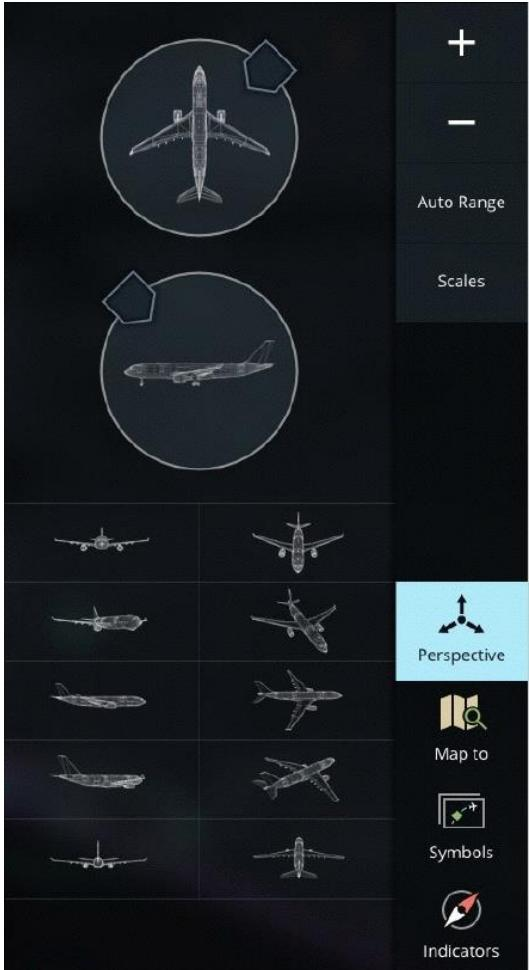
Figure 125 Perspective

## 15.3.5 Map to

Tap the Map to button to center the map to the selected element (airport, aircraft and storm).

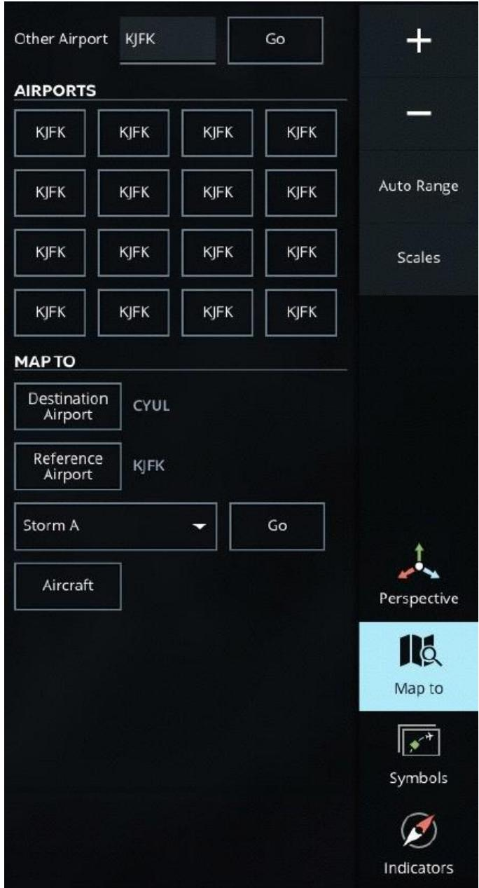
Figure 126 Map to

## 15.3.6 Symbols

Symbols allows instructor to declutter the map by choosing to hide certain symbols from the scene. The Symbols panel features a list of all airports, navaids, storms and players each associated with T and eye visibility icons.

Tap the T visibility icon next to an item to display or hide the text associated to this item.

Tap the eye visibility icon next to an item to display or hide this item from the map.

Symbols can include:

• Airports

Navaids

• Storms

Players – Intruders

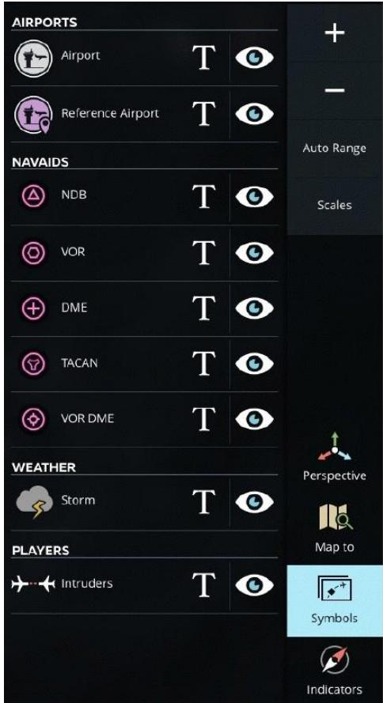
Figure 127 Symbols

## 15.3.7 Indicators

Indicators allows instructor to declutter the map by choosing to hide certain indicators and tools from the scene. The Indicators panel features a list of all indicators and tools along with an eye visibility icon.

Tap the eye visibility icon next to an item to display or hide this item from the map.

Indicators and tools can include:

Spider web

FMS route

• Timeline

Track

Compass

Scale

Wind barb

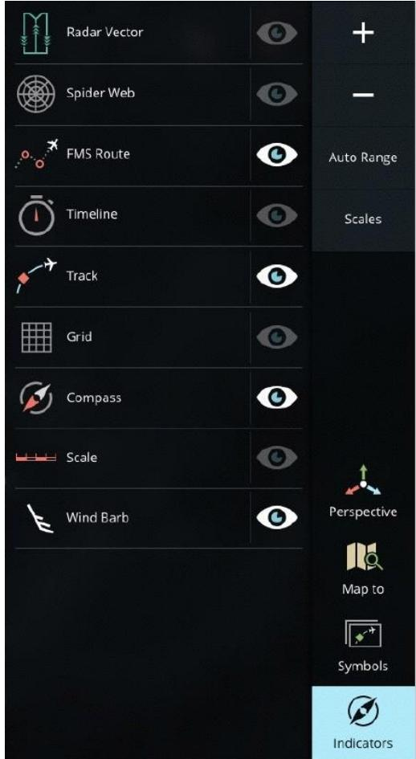
Figure 128 Indicators

## 15.4 Map Footer

The Map footer includes controls that are grouped in three sections:

Left Side Footer

Middle Footer

Right Footer

## 15.4.1 Left Side Footer

The left side footer provides supplemental information about the student’s performance such as graphs. It includes the following toggle and roll up menus:

Events

• Plots

Clear

Figure 129 Left Side Footer

## 15.4.1.1 Events

The Events toggle menu displays/hides the exceedances and abnormal conditions messages identified by the system.

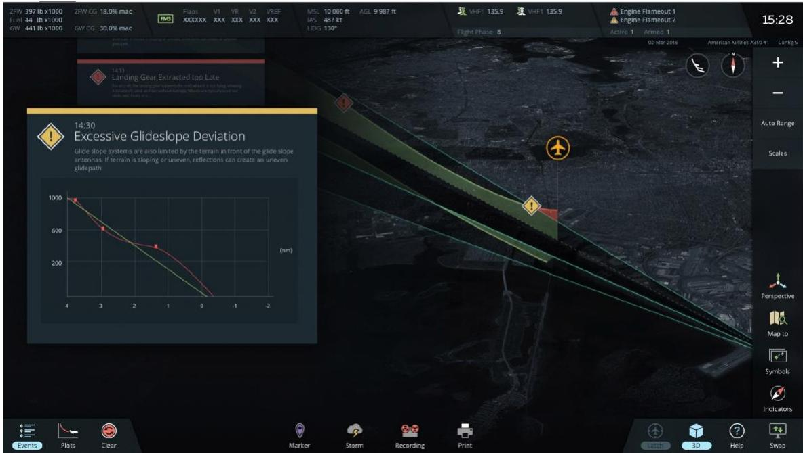
Figure 130 Left Events Toggle Menu

Map Workspace

13 Oct 2017

Page 222

## 15.4.1.2 Plots

The Plots roll up menu displays the following plots:

Precision Approach

• Non-Precision Approach

Takeoff

Tail Clearance

• Runway

Each of the above approach and takeoff, upon selection shows their associated graphs on the map.

Figure 131 Left Plots Toggle Menu

## 15.4.1.2.1 Precision Approach

The Precision Approach graphs allow the instructor to evaluate and assess the performance of the flight crew by monitoring the actual position of the aircraft on three Precision Approach graphs:

Glide Path Deviation

• Localizer Deviation

Speed Deviation

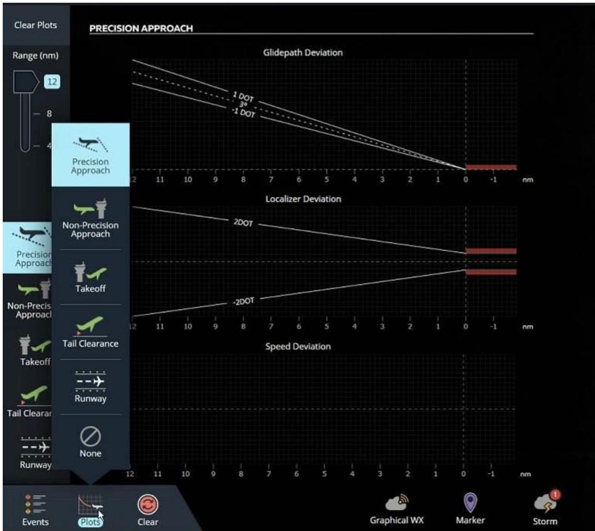
Figure 132 Precision Approach Graphs (Typical)

## 15.4.1.2.2 Non-Precision Approach

The Non-Precision Approach graphs allow the instructor to evaluate and assess the performance of the flight crew by monitoring the actual position of the aircraft on three Non-Precision Approach graphs:

Height Above Terrain (HAT) vs Distance to Touchdown

• Center Line Deviation

Speed Deviation

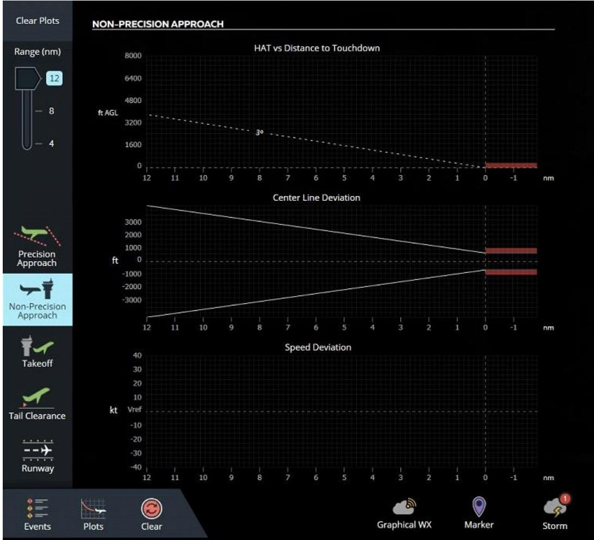
Figure 133 Non-Precision Approach Graphs (Typical)

## 15.4.1.2.3 Takeoff

The Takeoff graphs allow the instructor to evaluate and assess the performance of the flight crew by monitoring the actual position of the aircraft on three Takeoff graphs:

Height Above Terrain (HAT) vs Distance to Takeoff

Center Line Deviation

Speed Deviation

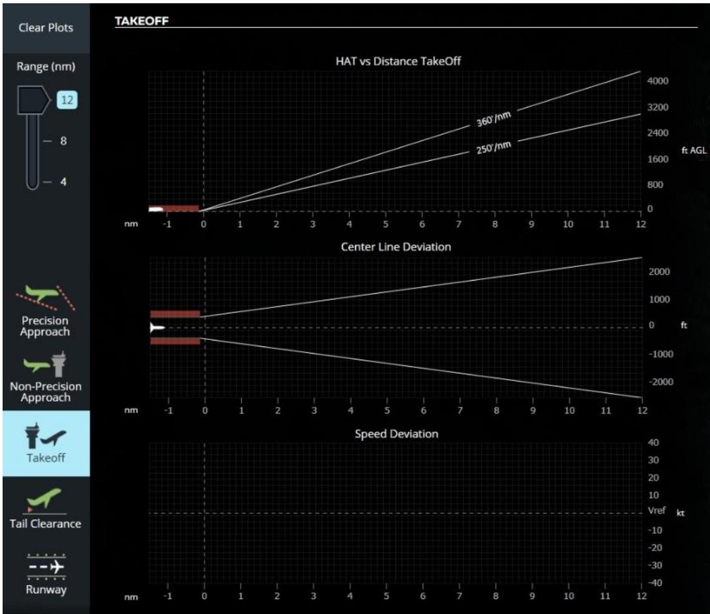
Figure 134 Takeoff Graphs (Typical)

## 15.4.1.2.4 Tail Clearance

The Tail Clearance graphs allow the instructor to evaluate and assess the tail clearance to avoid a tail strike by monitoring five graphs:

• Airspeed

Radar Altitude

Tail Clearance (inches)

Pitch Attitude

Pitch Rate

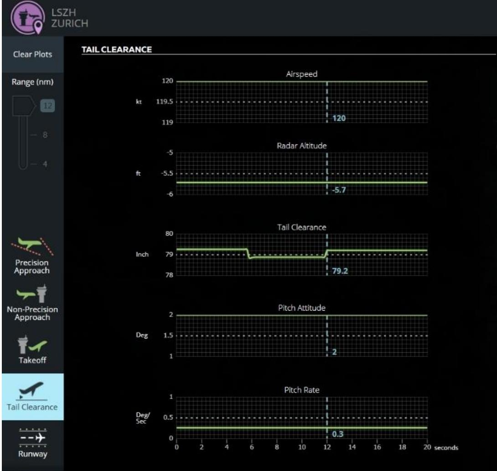
Figure 135 Tail Clearance Graphs (Typical)

## 15.4.1.2.5 Runway

The Runway graph allows the instructor to evaluate and assess the performance of the flight crew by monitoring the actual position of the aircraft on the runway.

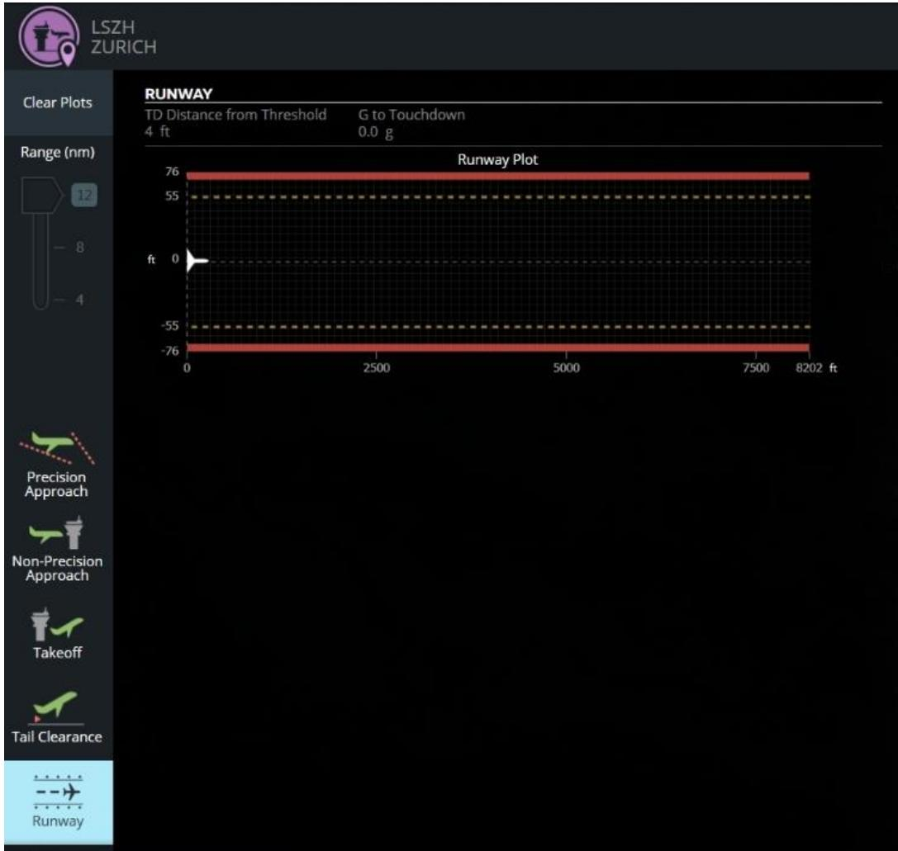
Figure 136 Runway Graph (Typical)

## 15.4.1.2.6 Clear Plots

Tap the Clear Plots button clears the plots on display.

## 15.4.1.2.7 Range (nm)

The Range (nm) slider allows the adjust the scale of the graphs.

Map Workspace 13 Oct 2017 Page 228

## 15.4.1.3 Clear

The Clear roll up menu clears items on the virtual environment. Elements that can be cleared include:

Timeline

• Storm

Event list

Track

Figure 137 Left Clear Toggle Menu

## 15.4.2 Middle Footer

The Middle footer allows the user to add event markers, add and edit storms to the simulation, record a training session as well as print the current page or additional pages. It includes the following buttons:

Marker

• Storm

• Recording

Print

Figure 138 Middle Footer

## 15.4.2.1 Marker

Tap the Marker button to display the Marker roll up menu. This roll up menu features various types of colored markers that can be used to mark an event on the flight path of the aircraft and in the training session video recording (for IOS equipped with a Brief/Debrief System).

These markers are intended to help the instructor find specific segments of the training session.

Figure 139 Marker Roll up Menu

## 15.4.2.2 Storm

Tap the Storm button to display the STORM PROPERTIES sliding panel.

## 15.4.2.3 STORM PROPERTIES Sliding Panel

The STORM PROPERTIES Sliding Panel allows the instructor to:

• Add several types of storms on the map environment

Rotate the selected storm

Add various effects to the selected storm

This sliding panel includes the following sections:

List of storms

TYPE

• ROTATION & EFFECTS

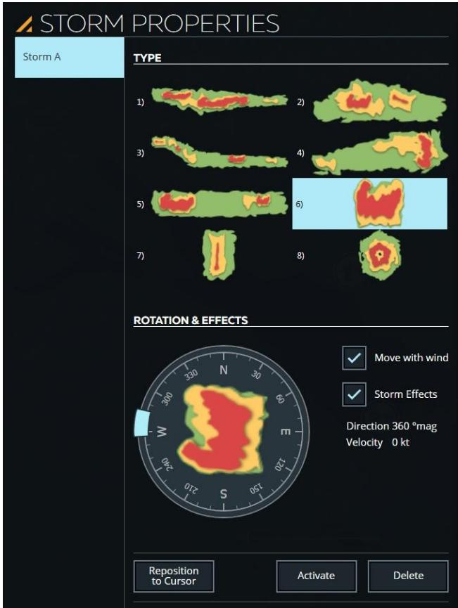
Figure 140 STORM PROPERTIES Sliding Panel

## 15.4.2.3.1 Adding a Storm

Adding a storm can be done in either one of two ways, through the:

Cursor Radial menu

## Or,

Storm button on the map middle footer

To add a storm from the Cursor Radial menu:

1) Tap on the desired location on the map.
2) From the Cursor Radial menu, tap on the Add Storm icon (see Figure 120). This displays the STORM PROPERTIES sliding panel.
3) From the TYPE section, tap to select the desired storm. This places the selected storm at the cursor location on the map.
4) Edit the storm properties.
5) Tap on the Activate button to activate the storm at the cursor location.
6) A red ACTIVE flag next to the selected storm indicates that the storm is active in the simulation.
7) A red badge overlaid onto the map middle footer Storm button indicates the activated storms.

## To add a storm from the Storm button:

1) Tap the Storm button on the map middle footer. This displays the STORM PROPERTIES sliding panel.
2) From the TYPE section, tap to select the desired storm. This places the selected storm approximately 20 nautical miles in front of the aircraft.
3) Edit the storm properties.
4) Tap on the Activate button to activate the storm.
5) A red ACTIVE flag next to the selected storm indicates that the storm is active in the simulation.
6) A red badge overlaid onto the map middle footer Storm button indicates the activated storms.

## 15.4.2.3.2 List of Storms

This section includes a list of storms active or not in the simulation. An active storm is indicated by a red ACTIVE flag.

Once selected, the user can then modify the storm properties.

## 15.4.2.3.3 TYPE Section

This section displays all available storms that can be inserted into the simulation. When a storm is selected, it is highlighted in light blue and shown in light gray on the map environment but it is not activated in the simulation just yet.

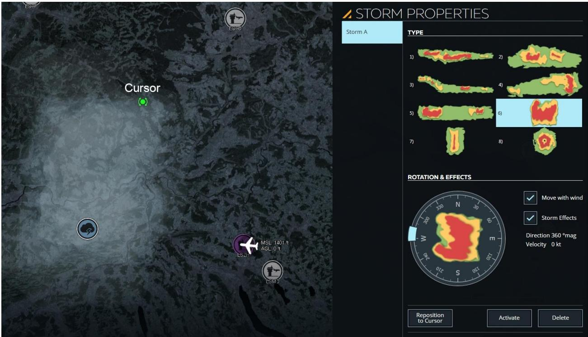
Figure 141 STORM PROPERTIES –Storm Selected

## 15.4.2.3.4 ROTATION EFFECTS Section

This section is displayed as soon as a storm type is selected. Once a storm is selected, this section offers the controls necessary to edit the storm.

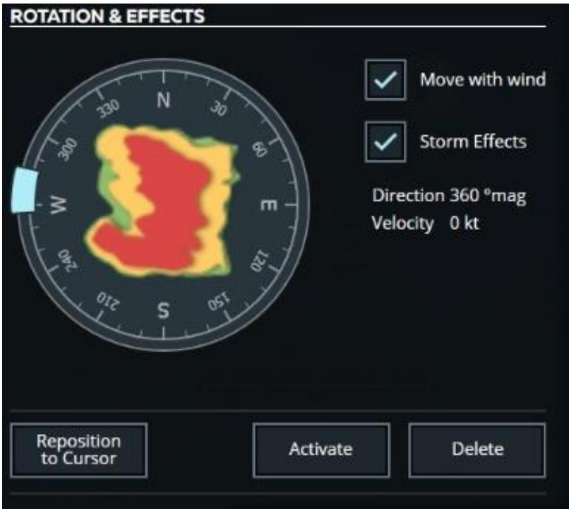
Figure 142 STORM PROPERTIES –ROTATION & EFFECTS

## 15.4.2.3.5 Storm Rotation Graph

The Storm Rotation Graph is an interactive graph that features a light blue cursor that allows the instructor to rotate the storm between 0-360 degrees. Touch and hold the cursor and move it around the dial to rotate storm.

## 15.4.2.3.6 Reposition to Cursor

Tap this button to reposition the center of the selected storm to the cursor location on the map.

## 15.4.2.3.7 Move with wind

Tap this checkbox to move the selected storm in accordance with the wind environment parameters.

## 15.4.2.3.8 Storm Effects

Tap this checkbox to activate lightning on the visual scene. This effect is shown within the physical boundaries of the storm.

Map Workspace 13 Oct 2017 Page 234

## 15.4.2.3.9 Activate

Tap this button to activate the selected storm. When active, the selected storm shown in light gray on the map changes to color.

## 15.4.2.3.10 Delete

Tap this button to remove the selected storm from the map.

## 15.4.2.4 Recording

The Recording button is a toggle Start/Stop type button that controls the video recording of a training session. This button is only available on IOS equipped with a Brief/Debrief System.

During a training session video recording, event markers available from the Map footer can be added to identify special events in the session and ultimately facilitate the review of the recorded training session.

Such video recording can be used to evaluate Crew Resource Management (CRM) during the training session.

The Recording button has the following status:

Ready to record / Press to start recording

Recording / Press to stop recording

## 15.4.2.5 Print

The Print button functions just like the Print button on the Control Board footer.
Refer to paragraph 11.9.

## 15.4.3 Right Side Footer

The right-side footer includes the following buttons:

Figure 143 Right Side Footer

## 15.4.3.1 Latch

The Latch button allows the instructor to:

• Latch the map to the ownship

o The ownship will remain centered in the map.

## 15.4.3.2 2D/3D

The 2D/3D toggle button switches the display mode on the main section between 2D to 3D and vice versa.

## 15.4.3.3 Help

The Help button functions just like the Help button on the Control Board footer.
Refer to paragraph 11.13.

## 15.4.3.4 Workspace

The Workspace button functions just like the Workspace button on the Control Board footer. Refer to paragraph 11.14.

## 16. Advanced

The Advanced toolbar features quick access buttons allowing the instructor to:

• Modify Aircraft, Position and Environment parameters.

Perform various types of freeze and resets.

Trigger failures.

• Access additional pages not accessible from the Control Board pages such as:

o Intruders

o Comms - ATIS

o Comms – ATC

o Upset Recovery Scenarios and Events (UPRT)

o Recording - FSC/Recall

Tapping each of these button, displays a set of sub buttons providing access to associated pages.

Figure 144 Advanced Tool Bar

## 16.1 Aircraft

The Aircraft button allows the instructor to alter Weight & Balance parameters, interact with various aircraft doors and carry out certain ground service tasks.

The Aircraft sub-pages accessible from Advanced offer the same controls as the Weight & Balance and Services & Doors sliding panels accessible from the Control Board and described in paragraphs 8.10 and 8.11.

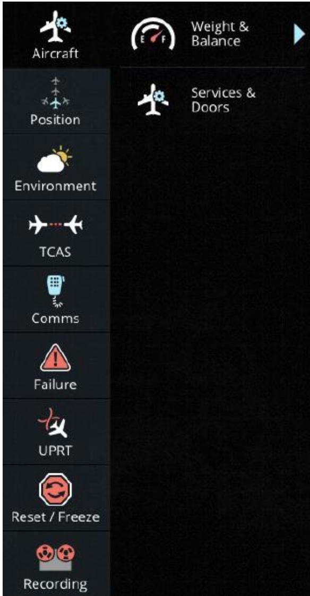

Figure 145 Advanced - Aircraft

## 16.2 Position

The Position button allows the instructor to change reference airport/runway, reposition and slew the aircraft.

The Position sub-pages accessible from Advanced offer the same controls as the Airport & Reposition and Slew sliding panels accessible from the Control Board and described in paragraphs 7.3 and 9.2.

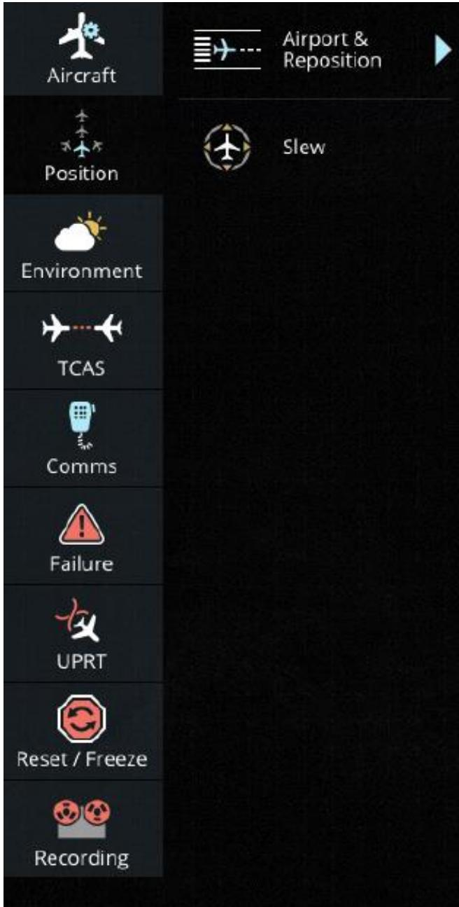
Figure 146 Advanced - Position

## 16.3 Environment

Environment includes several sub-buttons to alter various environmental parameters for a specific airport or En Route region.

In Environment, the instructor can:

Alter the weather and time of day of a region

Introduce microbursts and windshears

Apply ice conditions on the aircraft

Change the runway lighting

Introduce visual effects at the airport

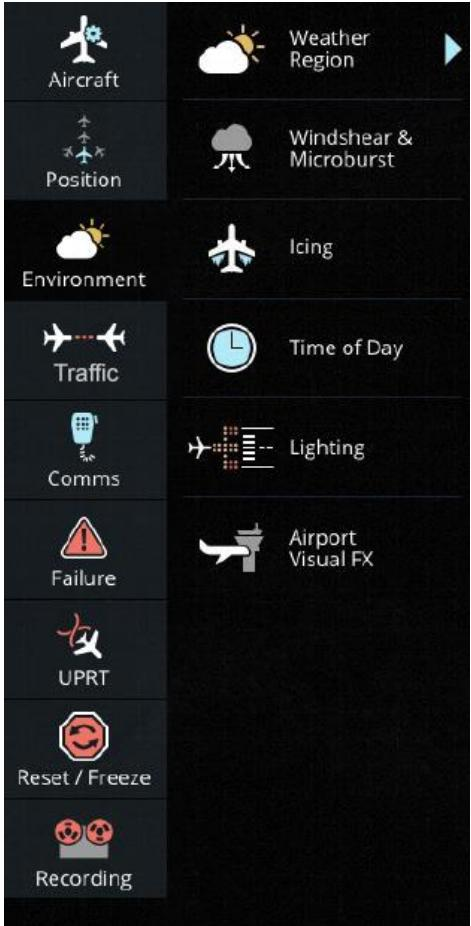
Figure 147 Advanced - Environment

## 16.3.1 WEATHER REGION

WEATHER REGION provides all necessary controls to alter environmental conditions for up to five different airports and en route weather conditions.

For a specific region, the instructor can alter the current region parameters listed below:

Winds, temperature and pressure

Clouds and visibility conditions

Precipitation

• Runway conditions

Turbulence

WEATHER REGION offers the possibility of:

• Saving the current region weather parameters into a Scenario

• Recalling previously saved region weather scenarios

• Adding a Region

• Deleting Scenarios

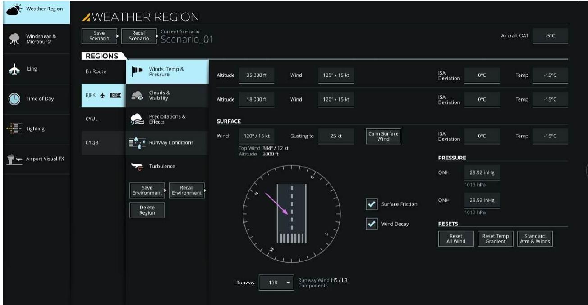
Figure 148 Advanced – Weather Region (Typical)

## 16.3.1.1 Multiple Weather Airport Conditions

There are two different modes that determine when multiple weather airport conditions will be copied to the ambient weather conditions.

## 16.3.1.1.1 First Mode

The first mode uses distance to airport. The specific airport conditions are copied into ambient weather conditions when the aircraft is within 50 NM from that airport.

If en route conditions are defined, then they will be copied into ambient weather conditions when the aircraft is flying outside the 50 NM radius of any of the 5 defined airports.

Therefore, if any airport for which no weather conditions are defined, becomes the reference airport, the en route weather conditions will apply to the ambient weather conditions at that airport.

## 16.3.1.1.2 Second Mode

The second mode uses the reference airport that is specified in the AIRPORT & REPOSITION Sliding Panel.

When the reference airport matches a multiple weather airport, the specific airport conditions are copied into ambient weather conditions.

If en route conditions are defined, then they will be copied into ambient weather conditions when the reference airport on the reposition page does not match a multiple weather airport.

## 16.3.1.2 Adding a Region

Tap on the WEATHER REGION page and follow the onscreen instructions to add a region.

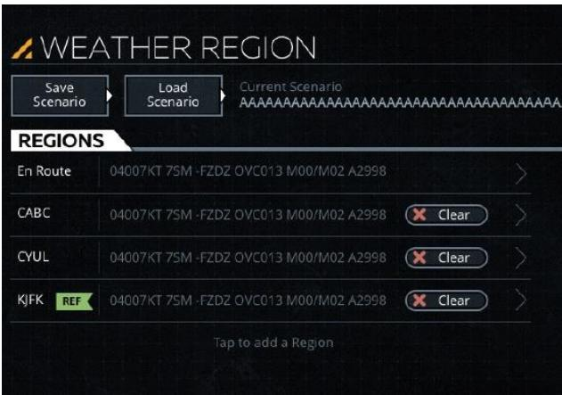
Figure 149 Advanced – Adding a Region

## 16.3.1.3 Saving/Recalling Weather Scenario

WEATHER REGION allows the instructor to save the current weather conditions for a specific region as well as recall an existing pre-defined/pre-saved weather scenario.

The Save Scenario functionality only saves weather parameters, it does not save nor include an active storm, microburst, predictive windshear, non-predictive windshear or icing conditions. Similarly, the Recall Scenario functionality only recalls weather parameters from a specific scenario.

In either case, the status of an active storm, microburst, predictive windshear, non-predictive windshear or icing conditions remains unaffected by the Save/Recall Scenario functionality.

During a Save Scenario, the following weather parameters are saved:

Sea level temperature

Intermediate and tropopause temperatures

Altimeter setting (QNH)

Surface, intermediate and tropopause winds

When a saved weather scenario is recalled from a different location with different terrain elevation, the surface temperature and pressure (QFE) are recomputed from the retained data to maintain the same profile from sea level to intermediate altitude.

The same surface wind and intermediate wind still apply at the new location as defined at the location where the weather was saved.

## 16.3.1.3.1 Save Scenario

Tap this button to display the SAVE SCENARIO popup.

Then, enter the name of the airport/En Route weather scenario and then tap on Save or Cancel (as applicable).

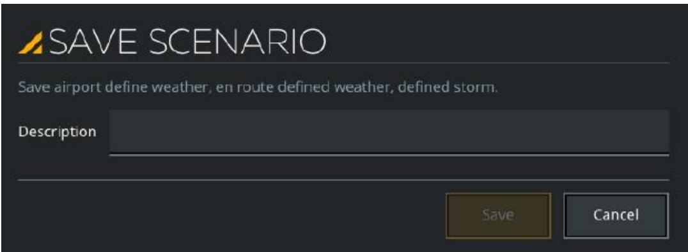
Figure 150 Weather Region – Save Scenario

## 16.3.1.3.2 Recall Scenario

Tap this button to display the RECALL SCENARIO popup.

## 16.3.1.3.3 Recall Scenario Popup

This popup lists all the saved scenarios either by date or alphabetically. It allows the instructor to save (under a new name), load or delete a selected weather scenario.

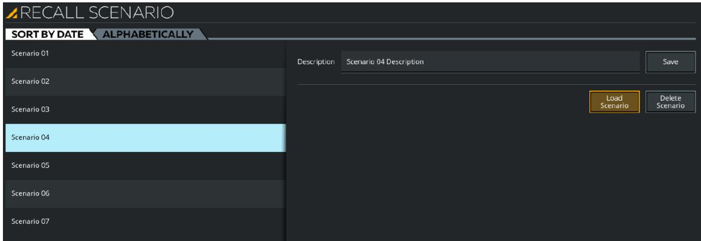
Figure 151 Weather Region – Recall Scenario

## 16.3.2 Windshear & Microburst

Tapping on the Windshear & Microburst button opens the WINDSHEAR & MICROBURST sliding panel. The Windshear and microburst functionality is identical to that found and described in the REFERENCE AIRPORT Tab (see paragraph 9.13).

## 16.3.3 Icing

Tapping on the Icing button opens the ICING sliding panel. The icing functionality is identical to that found and described in the CURRENT CONDITIONS Tab (see paragraph 7.4).

## 16.3.4 Time of Day

Tapping on the Time of Day button opens the TIME OF DAY page allowing for general time of day change (Dawn, Day, Dusk Night change). The Time of Day functionality is identical to that found and described in the REFERENCE AIRPORT Tab (see paragraph 9.4).

## 16.3.5 Lighting

Tapping on the Lighting button opens the LIGHTING page. This page contains the same lighting controls as those found in the AIRPORT REPOSITION Tab – Advanced lighting plus the following three additional buttons.

Advanced

13 Oct 2017

Page 244

## 16.3.5.1 Stop Bar

From the Normal state, tap this toggle button to illuminate the Stop Bar lights.
From the Activated state, tap this toggle button to extinguish the Stop Bar lights.

## 16.3.5.2 Taxi

Tap this dropdown button to expand selection, then select the taxi lights intensity.
(Min = 0, Max = 5).

## 16.3.5.3 City

Tap this dropdown button to expand selection, then select the city lights intensity.
(Min = 0, Max = 5).

## 16.3.6 Airport Visual FX Page

The AIRPORT VISUAL FX Page allows the instructor to:

• Modify runway conditions and lighting

Modify airport lights

Add pre-recorded traffic effects to the visual scene

This page includes four tabs:

RUNWAY CONDITIONS

• VISUAL CONTROL

• AIRPORT LIGHTS

RUNWAY DEFAULT LIGHTING

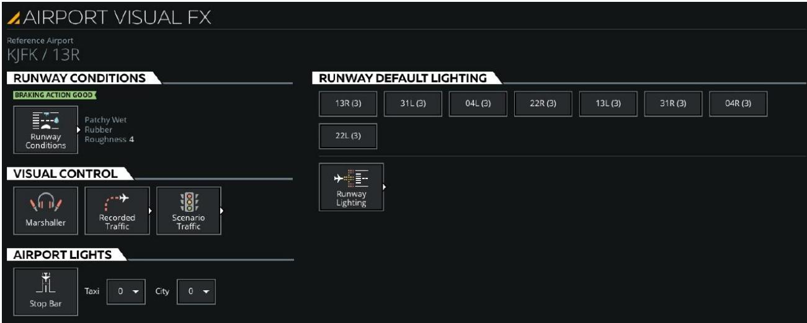
Figure 152 AIRPORT VISUAL FX

Advanced 13 Oct 2017 Page 245

## 16.3.6.1 RUNWAY CONDITIONS Tab

This tab includes read-only text fields that display the current runway conditions and a Runway Conditions expandable button that upon tapping opens the RUNWAY CONDITIONS sliding panel.

## 16.3.6.2 VISUAL CONTROL Tab

This tab includes the following buttons.

## 16.3.6.2.1 Marshaller

When the aircraft is within an appropriate position to the gate, the marshaller signals in the aircraft to the gate.

From the Normal state, tap this toggle button to display the marshaller into the visual scene.

From the Activated state, tap this toggle button to remove the marshaller into the visual scene.

This Marshaller button is disabled depending on certain conditions, for example:

When the aircraft is off the ground

• During an aircraft pushback

## 16.3.6.2.2 Recorded Traffic

Tap this expandable button to display the RECORDED TRAFFIC sliding panel which allows the instructor to add recorded traffic scenario effects to the visual scene.

## 16.3.6.2.3 Scenario Traffic

Tap this expandable button to display the SCENARIO TRAFFIC sliding panel which allows the instructor to add recorded traffic scenario effects to the visual scene.

## 16.3.6.3 AIRPORT LIGHTS Tab

This tab includes buttons to control airport lights.

## 16.3.6.3.1 Stop Bar

From the Normal state, tap this toggle button to illuminate the Stop Bar lights.
From the Activated state, tap this toggle button to extinguish the Stop Bar lights.

## 16.3.6.3.2 Taxi

Tap this dropdown button to expand selection, then select the taxi lights intensity.
(Min = 0, Max = 5).

Advanced 13 Oct 2017 Page 246

## 16.3.6.3.3 City

Tap this dropdown button to expand selection, then select the city lights intensity. $( \mathrm { M i n } = 0 , \mathrm { M a x } = 5 )$

## 16.3.6.4 RUNWAY DEFAULT LIGHTING Tab

This tab includes buttons to control the default lighting at the selected reference airport runway.

## 16.3.6.4.1 Runway Lighting

Tap this expandable button to display the RUNWAY LIGHTING sliding panel.

## 16.4 Intruders

The Intruders button displays an INTRUDERS page allowing the instructor to setup traffic scenarios by inserting intruders around the aircraft airspace.

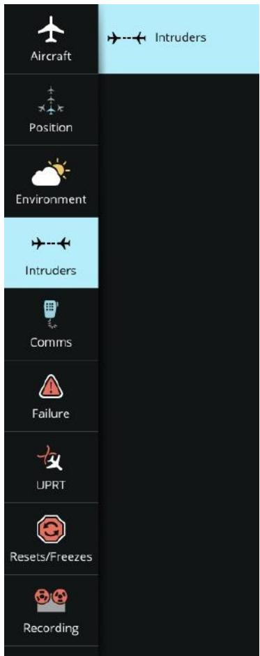
Figure 153 Advanced - Intruders

## 16.4.1 INTRUDERS Page

The INTRUDERS page allows the instructor to setup traffic scenarios by inserting intruders around the ownship’s (aircraft) airspace. This page includes the following subpages:

TCAS

Random Traffic

Approach Traffic

ITP

Through this page the instructor can train the flight crew in responding to several types of in-flight traffic scenarios.

Advanced

13 Oct 2017

Page 248

## 16.4.1.1 TCAS

The TCAS page includes the necessary controls to customize the presence of an intruder into the training session. It includes the following sections:

INTRUDER POSITION

INTRUDER VERTICAL PATH

SCENARIO

• INTRUDER TRANSPONDER EQUIPMENT

• OWNSHIP CAPACITY LIMITATION

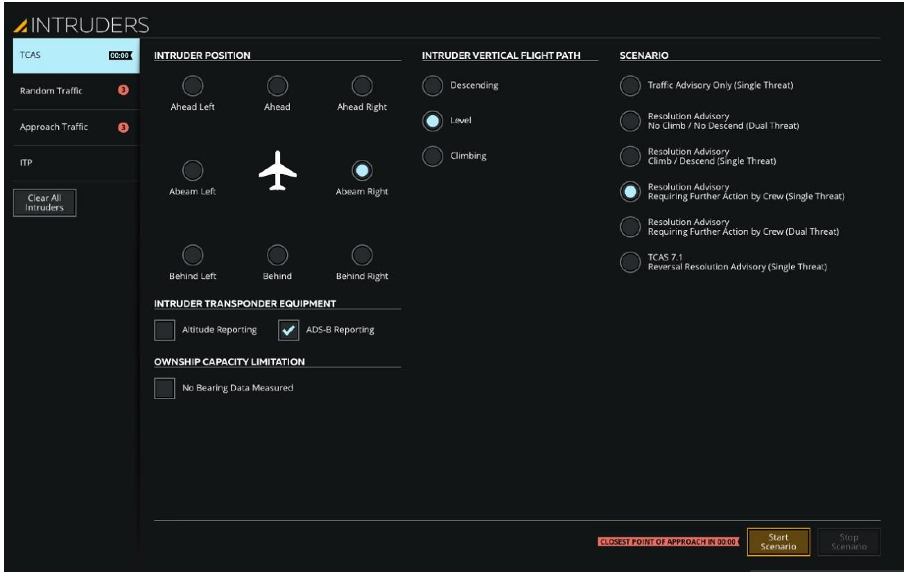
Figure 154 TCAS Page

## 16.4.1.1.1 INTRUDER POSITION Section

This section includes mutually exclusive radio buttons allowing the instructor to set the relative direction of the approaching intruder aircraft in relation to the ownship.

Settings can either be:

Ahead Left Bearing = -45 degree

Ahead Bearing = 0 degree

• Ahead Right Bearing = +45 degree

Abeam Left Bearing = -90 degree

• Abeam Right Bearing = +90 degree

Behind Left Bearing = -135 degree

Behind Bearing = 180 degree

Behind Right Bearing = +135 degree

## 16.4.1.1.2 INTRUDER VERTICAL FLIGHT PATH Section

This section includes mutually exclusive radio buttons allowing the instructor to set the vertical flight path of the intruder aircraft in relation to the ownship.

Settings can either be:

Descending

Tap to position the intruder aircraft above the ownship which then starts to descend towards the ownship.

Level vel

Tap to position the intruder aircraft at the same level as the ownship aircraft which then starts to move towards the ownship.

Climbing

Tap to position the intruder aircraft below the ownship which then starts to climb towards the ownship.

## 16.4.1.1.3 SCENARIO Section

This section includes radio buttons that allow the instructor to select either one of these scenarios:

Traffic Advisory Only (Single Threat)

Resolution Advisory (Dual Threat) No climb/No descend

Resolution Advisory (Single Threat) Climb/Descend

Resolution Advisory (Single Threat) Climb/Descend then Increase Climb/Descent

Advanced

13 Oct 2017

Page 250

• Resolution Advisory (Dual Threat) Climb/Descent then Level Off

• Reversal Resolution Advisory (Single Threat) Perform Above FL210

## WARNING:

OWN A/C must be in stable flight for TCAS scenario training. The DESCEND DESCEND vertical guidance is inhibited:

under 1000 ft AGL when descending

under 1200 ft AGL when climbing

## 16.4.1.1.3.1 Traffic Advisory Only (Single Threat)

Scenario specifics:

TCAS will only generate a Traffic Advisory (TA).

• Number of intruders specified in this scenario is 1.

Own aircraft V/S recommended max limit +/-1000 fpm.

In this scenario, the intruder approaches from the direction selected in the Horizontal Position pane and will follow that same trajectory until the time of collision is approximately 100 sec before the closest point of approach.

Then, the vertical path of the intruder is computed to achieve a relative altitude that will have the intruder pass inside the TA altitude limit but outside the RA altitude limit.

This maneuver will be completed 10 seconds before entering into the RA range envelope.

## 16.4.1.1.3.2 Resolution Advisory (Dual Threat) No climb/No descend

Scenario specifics:

• TCAS will generate an RA requiring no specific action by the crew.

• Number of intruders specified in this scenario is 2.

Own aircraft V/S recommended max limit +/-200 fpm.

In this scenario, one of the two intruders will approach from the direction selected on the Horizontal Position pane while the other intruder will be positioned at a relative bearing that can vary from 15 to 45 degrees from the bearing of the first intruder.

The intruders remain at the same altitude until the time of collision is approximately 100 seconds before closest point of approach. The vertical path of intruders remains symmetric with respect to own aircraft.

Advanced 13 Oct 2017 Page 251

The first maneuver of intruders is computed to allow them to always respect a relative altitude of 100 to 150 feet inside the RA altitude envelope. As soon as one of the two intruders meets both TA conditions (i.e. altitude and range), the audio message “TRAFFIC TRAFFIC” is heard.

The intruders should stabilize at an altitude inside the RA altitude envelope and maintain a level flight until the end of the scenario. During this scenario, TCAS will give preventive advisory like “MONITOR VERTICAL SPEED” when the first intruder satisfies both RA conditions (i.e. altitude and range). No corrective advisory should be heard until the “CLEAR OF CONFLICT” message is issued and no crew action is required for this scenario.

## 16.4.1.1.3.3 Resolution Advisory (Single Threat) Climb/Descend

Scenario specifics:

• TCAS generates an RA requiring the crew to climb or descend to avoid conflict.

Number of intruders specified in this scenario is 1.

Own aircraft V/S recommended max limit +/-1000 fpm.

In this scenario, the intruder starts from the direction selected on the Horizontal Position pane and remains at the same altitude until the time of collision is approximately 100 sec before the closest point of approach.

The first maneuver of the intruder is computed to allow the intruder to reach a relative altitude within the RA altitude envelope (which is approximately 100 ft inside the envelope) and 10 seconds before the intruder enters into the RA range envelope. During this maneuver, the audio message “TRAFFIC, TRAFFIC” should be heard initially when the intruder satisfies both TA conditions (i.e. altitude and range).

In the next 15 seconds, the vertical path of the intruder is computed to target an altitude of 100 feet above (or below) the own aircraft altitude at the closest point of approach.

During this phase, a corrective advisory message should be issued to avoid the intruder. The crew must follow the corrective advisory rapidly and smoothly without overshooting the target. The intruder will continue his descent (or climb) at a rate between 1500 and 2000 feet/minute until 5 seconds after the closest point of approach and stabilize at this altitude. No other corrective advisory message will be announced until the “CLEAR OF CONFLICT” message.

Advanced 13 Oct 2017 Page 252

## 16.4.1.1.3.4 Resolution Advisory (Single Threat) Climb/Descend then Increase Climb/Descent

Scenario specifics:

• TCAS generates an RA requiring the crew to climb or descend to avoid conflict.

• Number of intruders specified in this scenario is 1.

Own aircraft V/S recommended max limit +/-1000 fpm.

In this scenario, the crew is required to increase climb/descend to clear the conflict, due to the maneuver by the threat.

The intruder starts from the direction selected on the Horizontal Position pane and remains at the same altitude until the time of collision is approximately 100 sec before the closest point of approach.

The first maneuver of the intruder is computed to allow the intruder to reach a relative altitude within the RA altitude envelope (which is approximately 100 ft inside the envelope) and 10 seconds before the intruder enters into the RA range envelope. During this maneuver, the audio message “TRAFFIC, TRAFFIC” should be heard initially when the intruder satisfies both TA conditions (i.e. altitude and range).

During the next 15 seconds, the intruder vertical path is computed to target an altitude 100 feet above (or below) the own aircraft altitude at the closest point of approach.

During this next phase, a corrective advisory message should be issued to avoid the intruder. The crew must follow the corrective advisory rapidly and smoothly without overshooting the target. The intruder will continue his descent (or climb) at a rate between 2000 and 2500 feet/minute until 5 seconds after the closest point of approach and stabilize at this altitude.

A second corrective advisory message should be issued to avoid the intruder. The crew must follow the new corrective advisory rapidly and smoothly without overshooting the target. No other corrective advisory message will be announced until the “CLEAR OF CONFLICT” message.

## 16.4.1.1.3.5 Resolution Advisory (Dual Threat) Climb/Descent then Level Off

Scenario specifics:

• TCAS generates an RA requiring the crew to climb or descend to avoid conflict.

• Number of intruders specified in this scenario is 2.

Own aircraft V/S recommended max limit +/-1000 fpm.

During the maneuver, the crew is required to do a second maneuver to clear the conflict, due to the maneuver by the second threat.

Two intruders will be asymmetrically positioned (in horizontal and vertical planes) with respect to own aircraft. Only one of the two intruders will start from the direction selected on the Horizontal Position pane while the other intruder will be positioned at a relative bearing which varies from 15 to 45 degrees from the bearing of the first intruder.

Each intruder remains at the same altitude until the time of collision is approximately 100 seconds before the closest point of approach. One of the intruders will pass above and the other intruder will pass below the own aircraft during the scenario.

The maneuver of the first intruder is computed to allow the intruder to reach a relative altitude inside the RA altitude envelope (about 100-150 feet inside) and 10 seconds before the intruder enters into the RA range envelope. During this maneuver the audio message “TRAFFIC TRAFFIC” should be heard when the intruder meets both TA conditions (altitude and range).

During the next 15 seconds, the intruder vertical path is computed to target an altitude 100 feet above (or below) the own aircraft altitude at the closest point of approach. During this next phase, a corrective advisory message should be issued to avoid this intruder and will command the crew to fly the aircraft in the direction of the second intruder.

The crew must follow the corrective advisory rapidly and smoothly without overshooting the target. The first intruder stabilizes at this altitude and the second intruder, who was not previously a resolution advisory, becomes a resolution advisory.

A second corrective advisory message, “LEVEL OFF, LEVEL OFF”, should be issued to avoid the second intruder. The crew must follow the corrective advisory rapidly and smoothly without overshooting the target. No other corrective advisory message will be announced until the “Clear of conflict”.

Advanced 13 Oct 2017 Page 254

## 16.4.1.1.3.6 Reversal Resolution Advisory (Single Threat) Perform Above FL210

Scenario Specifics:

• TCAS generates an RA requiring the crew to climb or descent to avoid conflict.

• Number of intruders specified in this scenario is 1.

Own aircraft V/S recommended max limit +/-1000 fpm.

In this scenario, the crew is required to perform a reversal climb/descent maneuver following the initial RA/maneuver in order to clear the conflict due to a maneuver done by the intruder.

The scenario starts with the intruder approaching from the location selected in the Horizontal Position pane and at the same level as the own aircraft.

The path of the intruder is continuously re-computed to mirror that of the own aircraft until the first resolution advisory is issued by the own aircraft.

As the TCAS detects that the intruder does not dis-engage (in other words, it is still approaching the own a/c at the same level), the own a/c will issue a second RA (this is the reversal RA).

As the own a/c tries to maneuver to avoid conflict after the reversal RA, the intruder dis-engages (i.e, stops mirroring the actions of the own a/c) and follows its own trajectory at that point.

For example at FL150, during the scenario:

• TCAS will issue a TA advisory "TRAFFIC TRAFFIC" approximately at 45 sec, at which time the intruder meets the TA range test and TA altitude test.

Subsequently, TCAS will issue a RA advisory "CLIMB CLIMB" or "DESCEND DESCEND" at approximately 30 sec, at which time it meets the RA range test ant RA altitude test.

• TCAS will issue a RA reverse advisory such as “DESCEND, DESCEND NOW" or "CLIMB, CLIMB NOW" at approximately 20 sec before the CPA. The success of this scenario requires that the flight crew’s response to resolution advisory is rapid and smooth.

Note: It should be noted that while the acceleration response to the initial RA is approximately 0.25g, the acceleration response to the reversal RA is approximately 0.35g.

Advanced 13 Oct 2017 Page 255

## 16.4.1.1.4 INTRUDER TRANSPONDER EQUIPMENT Section

This section includes checkboxes allowing the instructor to set the interrogation mode of the intruder transponder(s).

## 16.4.1.1.4.1 Altitude Reporting

The Altitude Reporting check box has two statuses:

Checked This sets the transponder mode of intruders in Mode C/S which causes the transponder of intruders to transmit their altitude. In this mode, TCAS will issue Traffic Advisory and Resolution Advisory if any.

Unchecked This sets the transponder mode of intruders in Mode A which causes the transponder of intruders to not transmit their altitude.

On the TCAS display, the intruder symbol will be shown without any altitude tag. Therefore, no Resolution Advisory is issued by TCAS.

## 16.4.1.1.4.2 ADS-B Reporting

The ADS-B Reporting check box has two statuses:

This allows the transponder of intruders to transmit their ADS-B information such as position, speed and direction of flight (latitude, longitude, vertical speed etc). When ADS-B is checked, ADS-B is being reported.

Unchecked This does not allow the transponder of intruders to transmit their ADS-B information. When ADS-B is unchecked, ADS-B is not being reported.

## 16.4.1.1.5 OWNSHIP CAPACITY LIMITATION

This section includes a checkbox allowing or inhibiting bearing measurement from the TCAS antennas.

## 16.4.1.1.5.1 No Bearing Data Measured

The No Bearing Data Measured check box has two statuses:

Checked This inhibits the bearing measurement from the TCAS antennas.

Unchecked This allows the bearing measurement from the TCAS antennas.

Advanced 13 Oct 2017 Page 256

## 16.4.1.1.6 Start Scenario

Tap to activate the intruder scenario.

## 16.4.1.1.7 Stop Scenario

Tap to stop the intruder scenario.

## 16.4.1.2 Random Traffic

The Random Traffic page includes the necessary controls to:

Insert any number of intruders

Select the Altitude Separation Model

• Select the transponder settings of intruders and ownship capacity limitation

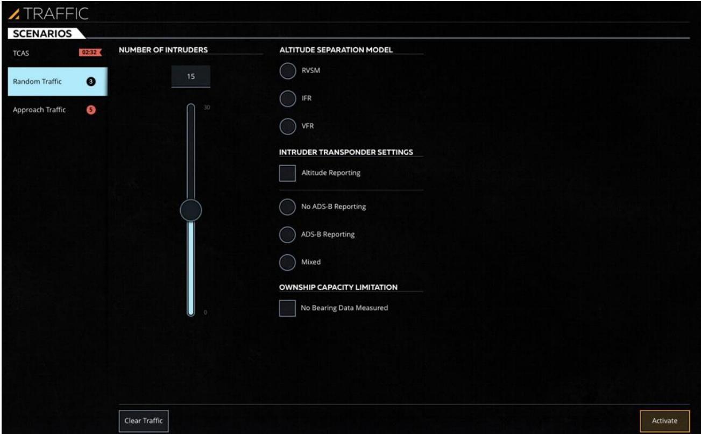
Figure 155 Random Traffic Page

## 16.4.1.2.1 NUMBER OF INTRUDERS Section

This section includes the controls to set the number of intruders by:

Moving the slider to the desired number

• Touching the input text field and entering the number of intruders using the keypad

## 16.4.1.2.2 ALTITUDE SEPARATION MODEL Section

This section includes radio buttons allowing the instructor to select either one of these models:

RVSM – enRoute Vertical Separation Minima

IFR – Instrument Flight Rules

VRR – Visual Flight Rules

The selected number of intruders will be placed on the selected model.

## 16.4.1.2.3 INTRUDER TRANSPONDER SETTINGS Section

This section includes the controls allowing the instructor to set the type of Altitude Reporting and ADS-B Reporting of the intruder’s transponder.

Altitude Reporting

Refer to paragraph 16.4.1.1.4.1 for details.

No ADS-B Reporting

This setting does not allow the transponder of intruders to transmit their ADS-B information. When No ADS-B Reporting is checked, ADS-B information is not being reported.

ADS-B Reporting

This setting allows the transponder of intruders to transmit their ADS-B information such as position, speed and direction of flight (latitude, longitude, vertical speed etc.). When ADS-B Reporting is checked, ADS-B information is being reported.

Mixed

This setting sets a certain number of intruders with ADS-B reporting and others with No ADS-B reporting.

## 16.4.1.2.4 OWNSHIP CAPACITY LIMITATION Section

This section includes a checkbox allowing or inhibiting bearing measurement from the TCAS antennas. Refer to paragraph 16.4.1.1.5 for details.

Advanced

13 Oct 2017

Page 258

## 16.4.1.2.5 Clear Random Traffic

Tap this button to clear all random traffic.

## 16.4.1.3 Approach Traffic

The Approach Traffic page allows the instructor to:

Insert 1 to 3 intruders

Select the Altitude Separation Model

• Select the transponder settings of intruders and ownship capacity limitation

Through this page the instructor can introduce intruders in the training scenario in order to evaluate and train the flight crew to respond to inflight traffic scenarios in the approach phase of flight.

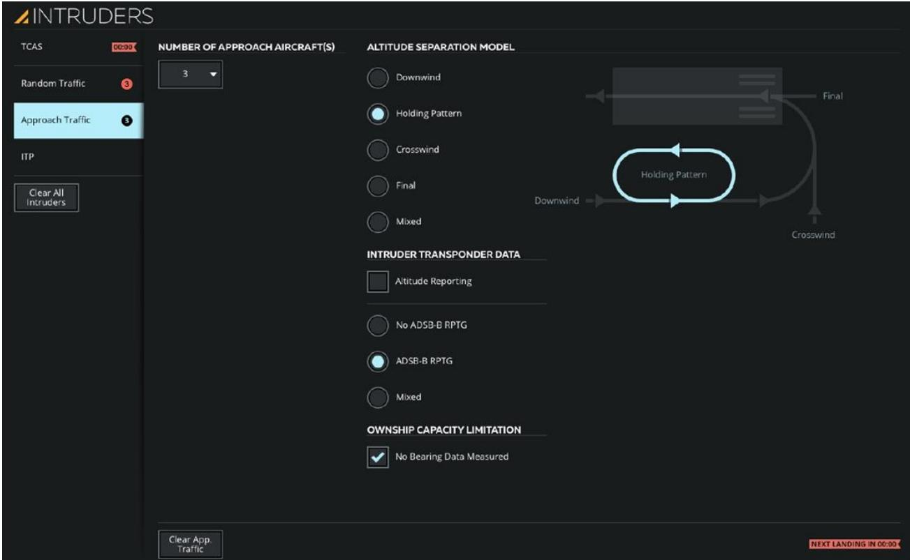
Figure 156 Approach Traffic Page

## 16.4.1.3.1 NUMBER OF INTRUDERS Section

This section includes a dropdown button allowing the instructor to set the number of intruders. Tap the button to expand selection, then tap to select the number of intruders.

## 16.4.1.3.2 ALTITUDE SEPARATION MODEL Section

This section includes radio buttons allowing the instructor to select either one of these models:

• Downwind

Holding Pattern

• Crosswind

Final

Mixed

The selected number of intruders will be placed on the selected model.

## 16.4.1.3.3 INTRUDER TRANSPONDER SETTINGS

This section allows the instructor to set the type of Altitude Reporting and ADS-B Reporting of the intruder’s transponder.

Altitude Reporting functions as described in paragraph 16.4.1.1.4.1.

Setting of the ADS-B Reporting parameter consists of selecting either one of the three ADS-B radio buttons:

No ADS-B Reporting

Displays status and selection does not allow the transponder of intruders to transmit their ADS-B information. When No ADS-B Reporting is checked, ADS-B information is not being reported.

## ADS-B Reporting

Displays status and selection allows the transponder of intruders to transmit their ADS-B information such as position, speed and direction of flight (latitude, longitude, vertical speed etc…). When ADS-B Reporting is checked, ADS-B information is being reported.

## Mixed

Displays status and selection will set certain numbers of intruders with ADS-B reporting and others with No ADS-B reporting.

## 16.4.1.3.4 OWNSHIP CAPACITY LIMITATION

This section includes a checkbox allowing or inhibiting bearing measurement from the TCAS antennas. Refer to paragraph 16.4.1.1.5 for details.

## 16.4.1.3.5 Clear App. Traffic

Tap this button to clear all approach traffic.

## 16.4.1.4 In-Trail Procedure (ITP)

The ITP page allows the instructor to:

View a list of predefined ITP scenarios

Create, Edit and Delete ITP scenarios

• Activate ITP scenarios into the training scenario

This page includes the following tabs:

PRE-DEFINED SCENARIOS

• QUICK SCENARIO

Through this page the instructor can activate various types of ITP scenarios with multiple intruders positioned at various locations around the ownship’s airspace, in order to evaluate and train the flight crew on how to respond to such situations.

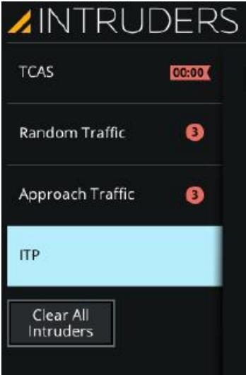
Figure 157 ITP

## 16.4.1.4.1 PRE-DEFINED SCENARIOS Tab

This tab includes the necessary controls to allow the instructor to:

Manage a list of pre-defined ITP scenarios

Create a new ITP scenario

Edit and delete an ITP scenario

## 16.4.1.4.1.1 SCENARIOS Section

This section provides a listing of available ITP scenarios. Typically, CAE offers 12 scenarios. The name of each scenario is self-explanatory.

## 16.4.1.4.1.2 ITP ASSESSMENT Section

Given the selected ITP scenario, this section allows the instructor to evaluate whether the ITP opportunity is possible (or not) at the Desired Flight Level (FL), prior to activating the selected scenario into the training session.

The instructor selects an ITP scenario, enters the desired Flight Level and observes the message in the ITP Assessment section to decide whether or not to activate the scenario.

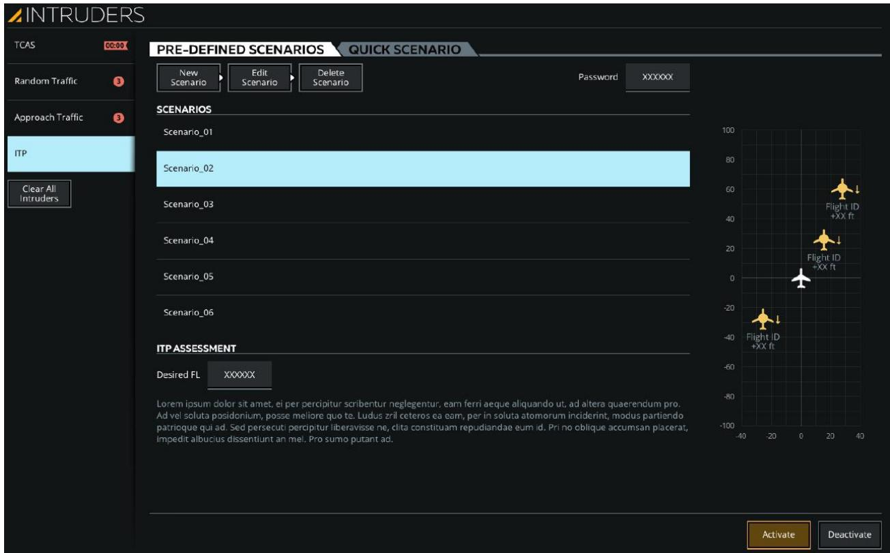
Figure 158 ITP Page

## 16.4.1.4.1.1 ITP Map

The Map provides a preview of the selected ITP scenario. It shows all intruders included in the selected scenario in relation to the ownship (aircraft). For each intruder, the map provides an aircraft symbol, Flight ID and relative altitude.

## 16.4.1.4.1.2 New Scenario

Tap the New Scenario button to display the NEW SCENARIO page.

## 16.4.1.4.1.3 Edit Scenario

Tap the Edit Scenario button to display the EDIT SCENARIO page.

## 16.4.1.4.1.4 Delete Scenario

Tap the Delete Scenario button to remove the selected scenario from the SCENARIOS list. Prior to permanently deleting the selected scenario, a confirmation popup is displayed.

DELETE SELECTED SCENARIO

Confirm

Cancel

Figure 159 Delete Scenario Popup

## 16.4.1.4.1.5 NEW SCENARIO Page

This page includes the controls to allow an instructor to define the parameters of several intruders for a given scenario. Tapping on an Intruder expandable button displays the EDIT INTRUDER page of the selected intruder.

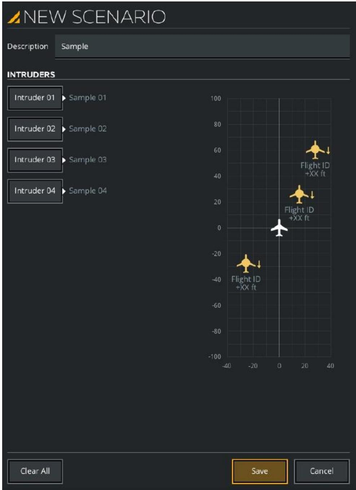

Figure 160 NEW SCENARIO Pages

Advanced 13 Oct 2017 Page 264

## 16.4.1.4.1.6 EDIT INTRUDER Page

This page displays all the parameters that can be modified or set in order to define an intruder in relation to the ownship.

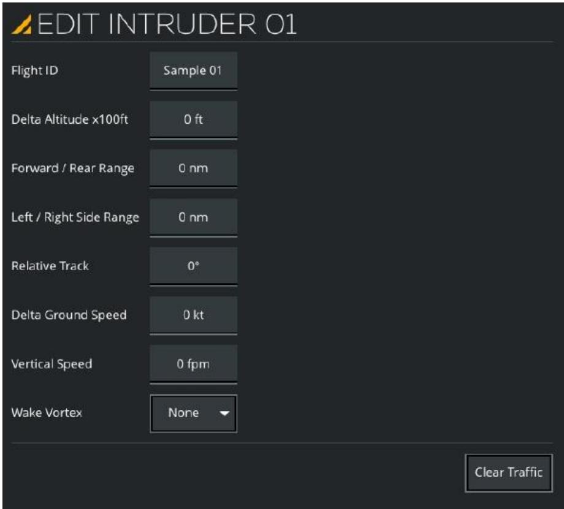
Figure 161 EDIT INTRUDER Page

## 16.4.1.4.1.7 EDIT SCENARIO page

This page includes the controls to allow an instructor to modify the parameters of several intruders for a given scenario. Tapping on an Intruder expandable button displays the EDIT INTRUDER page of the selected intruder.

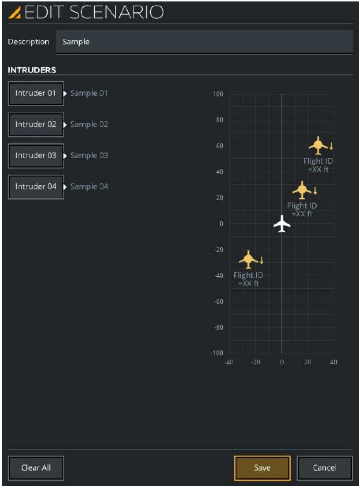
Figure 162 EDIT SCENARIO Page

Advanced 13 Oct 2017 Page 266

## 16.4.1.4.2 QUICK SCENARIO Tab

This tab includes the necessary controls to allow the instructor to quickly setup an ITP scenario.

## 16.4.1.4.2.1 INTRUDERS Section

This section provides a listing of available intruders that can be customized.

## 16.4.1.4.2.2 ITP ASSESSMENT Section

Given the ITP scenario comprising several intruders, this section allows the instructor to evaluate whether the ITP opportunity is possible (or not) at the Desired Flight Level (FL), prior to activating this selected scenario into the training session.

The instructor customizes the parameters of each intruder, enters the desired Flight Level and observes the message in the ITP Assessment section to decide whether or not to activate the scenario.

## 16.4.1.4.2.3 ITP Map

The Map provides a preview of the ITP scenario being created. It shows all intruders included in the scenario in relation to the ownship (aircraft). For each intruder, the map provides an aircraft symbol, Flight ID and relative altitude.

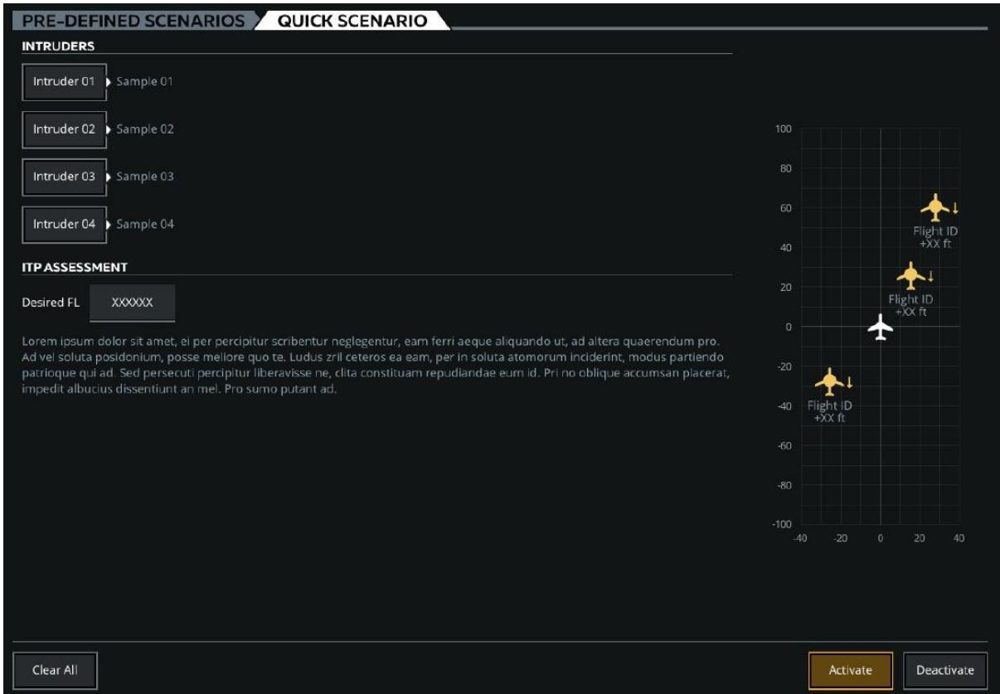
Figure 163 QUICK SCENARIO Tab

## 16.4.1.5 Number of Intruders Indication

A red badge 3 indicates the number of intruders.

## 16.4.1.6 Clear All Intruders

Tap this button to clear all intruders in the training scenario.

## 16.5 Comms

The Comms button provides access to the COMMUNICATIONS and DATALINK pages allowing the instructor to change any audio monitor, instructor transmit, crew transmit or calls controls as well as set various types of datalink parameters.

The Comms button also allows the instructor to modify and set:

Automatic Terminal Information Service messages

Air Traffic Controller messages

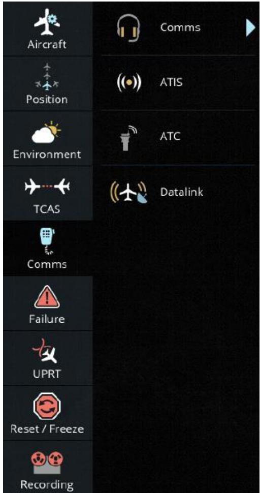
Figure 164 Advanced - Comms

## 16.5.1 ATIS

The ATIS page allows the instructor to monitor the current ATIS voice message that is available at the Reference Airport and any of the Airport/En Route Environment airports (or simply Environment Airports) which are defined.

The selected reference airport ICAO code appears just below the AIRPORT tab. A green REF flag next to the ICAO airport code indicates that this is the reference airport.

There two modes for the ATIS Messages: Automatic and Manual.

The default mode under normal conditions is Automatic. In this mode the ATIS messages for the Reference Airport and the Environment Airports are automatically updated to reflect the current weather on the Environment page and the Airport/En Route Environment page. Whenever a weather change is entered by the instructor in these pages, the ATIS message for that airport is immediately updated to reflect this change.

In Automatic mode, the ATIS voice message cannot be overridden and therefore all the weather input buttons on the ATIS page are disabled or grayed out. However, all the text next to these disabled or grayed out buttons is displayed in white, since the values reflect the actual ATIS message. The order of the buttons and weather readouts matches the ATIS message format for the selected airport. The format type, FAA or ICAO, is displayed in the sub-title.

There are two buttons on the ATIS page that are never disabled or grayed out: Approach and Remarks. This is so because these are not associated with the weather on the Environment page for the airports. The user can, at any time:

Tap on either button

• Make another selection

Tap on the Update Broadcast button

o The current ATIS message will be updated to reflect the selections.

The Manual mode allows the instructor to override the ATIS message at a airport. The Manual mode is enabled by tapping on the Manual button. Doing so enables all the weather input buttons on the ATIS page. At this point the instructor can then make new selections and Update Broadcast to activate the new messages.

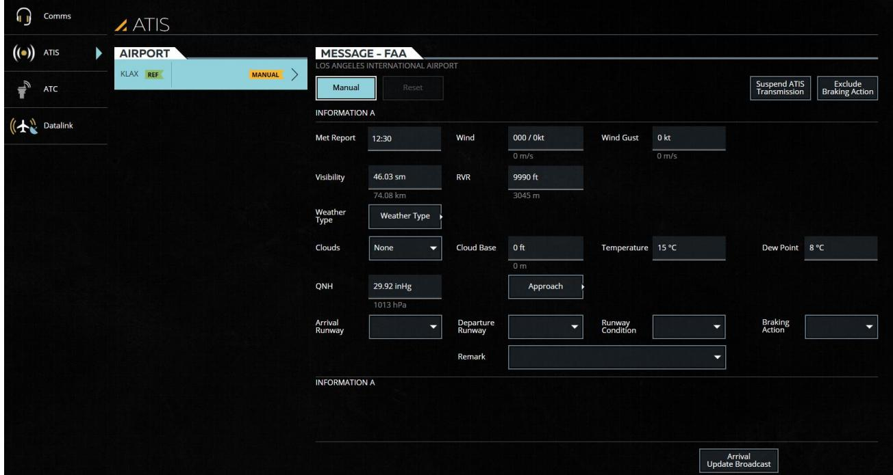
Figure 165 ATIS Page

## 16.5.1.1 AIRPORT Tab

The AIRPORT Tab displays the selected airport ICAO code. A green REF flag indicates the reference airport.

## 16.5.1.2 Manual

Display status and selection enables the ATIS message manual mode which allows the instructor to modify some of the ATIS parameters. When the ATIS Manual mode is selected, an amber MANUAL flag is displayed next to the selected airport.

In manual mode all the INFORMATION parameters are available for modification.

When manual mode is disabled all INFORMATION parameters are disabled or grayed out.

## 16.5.1.3 Reset

Selecting Reset causes the modified parameters on the page to be updated to reflect the current ATIS message.

## 16.5.1.4 Suspend ATIS Transmission

Displays status and selection disables ATIS transmission.

Advanced 13 Oct 2017 Page 270

## 16.5.1.5 Exclude Braking Action

Displays status and selection disables enunciation of the Braking action.

## 16.5.1.6 Met Report

Displays GMT report time and allows time modification for the ATIS message without affecting simulator actual time.

## 16.5.1.7 Wind

Displays status and selection allows input of the ATIS message wind direction in knots and wind speed in the selected unit (knots/min per sec). Wind Calm is broadcast for zero wind speed.

## 16.5.1.8 Wind Gust

Displays the ATIS wind gust in meters per second, different from the actual simulator value.

## 16.5.1.9 Visibility

Displays status and selection allows input of ATIS message visibility in the selected unit (kilometers/statute miles), different from the actual simulator value. Units in the broadcast ATIS message reflect the region from where the message originates.

## 16.5.1.10 RVR

Displays status and selection allows input of the ATIS message Runway Visual Range (RVR) in the selected unit (meters/feet). Units in the broadcast ATIS message reflect the region from where the message originates.

## 16.5.1.11 Weather Type

Displays current ATIS message special weather condition and selection displays the Weather Type page.

## 16.5.1.12 Clouds

Displays current ATIS message cloud type and selection displays a list of cloud types.

## 16.5.1.13 Cloud Base

Displays status and selection allows input of cloud base in the selected unit (metric/imperial) for ATIS message broadcast in the ATIS message.

$$
( \mathrm { M i n } = 0 , \mathrm { M a x } = 4 0 0 0 0 \mathrm { f t } )
$$

$$
( \mathrm { M i n } = 0 , \mathrm { M a x } = 1 2 1 9 2 \mathrm { m } )
$$

## 16.5.1.14 Temperature

Displays status and selection allows input of the ATIS message ground temperature in the selected unit (Celsius/Fahrenheit). (Dynamic Min/Max)

## 16.5.1.15 Dew Point

Displays status and selection allows input of the ATIS message dew point temperature in the selected unit (Celsius/Fahrenheit). The dew point maximum will be the temperature and the dew point itself will be modified to the temperature if the temperature is ever set less than the dew point. (Dynamic Min/Max)

## 16.5.1.16 QNH

Displays the ATIS environment pressure in the selected unit (hectopascals/inches Hg) and allows input of barometric pressure different from the actual simulator sea level barometric pressure. Units in the broadcast ATIS message reflect the region from where the message originates.

## 16.5.1.17 Approach

Displays current ATIS message approach type and selection displays the Approach type page allowing the instructor to change the Approach type message.

## 16.5.1.18 Arrival Runway

Displays current ATIS message arrival runway and selection displays a list of additional runway selection.

## 16.5.1.19 Departure Runway

Displays current ATIS message departure runway and selection displays a list of additional runway selection.

## 16.5.1.20 Runway Condition

Displays the runway conditions for the ATIS message and selection displays a list of additional runway conditions.

## 16.5.1.21 Braking Action

Displays the braking action conditions for the ATIS message and selection displays a list of additional braking actions conditions.

## 16.5.1.22 Remark

Displays the current reference airport ATIS remarks and selection displays a list of additional remarks.

## 16.5.1.23 Update Broadcast

Displays status and selection updates the ATIS message to the latest environment information which has been set by the instructor. The button is enabled while any of the ATIS message parameters on the page are being changed. When selected, the button remains active for 2 seconds.

Advanced 13 Oct 2017 Page 272

## 16.5.2 ATC

The Air Traffic Controller (ATC) page includes two main tabs: ATC UNIT and MESSAGE.

The ATC UNIT tab includes a set of six pages to simulate ATC and background R/T chatter messages. ATC messages are classified in six different categories depending on the type of radio station provided:

Clearance Delivery

Ground Control

Tower

Departure

• Control

• Approach

Each of the above ATC Message pages contains generic messages for the specific types of radio station.

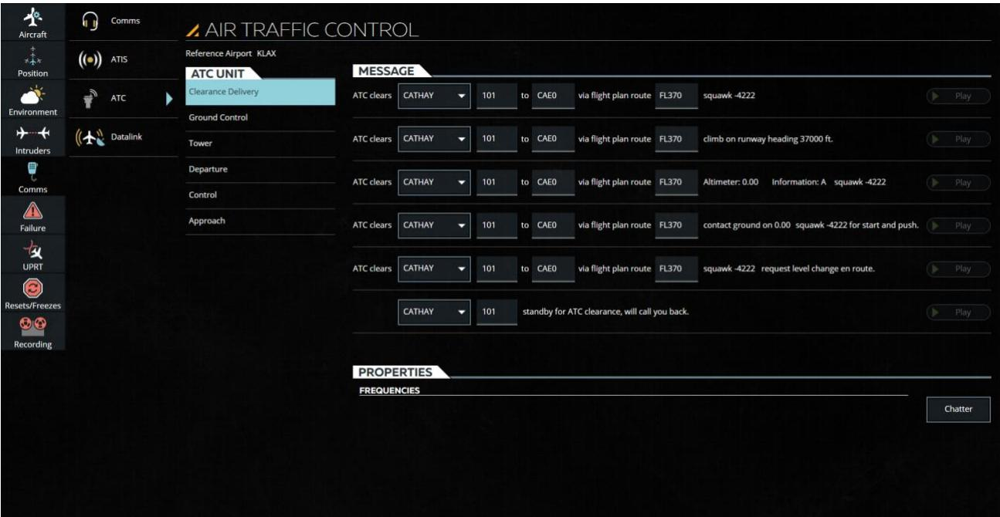
Figure 166 ATC Page

## 16.5.2.1 Clearance Delivery

The Clearance Delivery page displays the types of clearance delivery messages that can be customized and played.

## 16.5.2.1.1 ATC Clears

Displays the name of the air carrier and selection displays a dropdown menu allowing for the selection of the name of various airline carriers to be spoken in the messages.

## 16.5.2.1.2 Flight Number

Displays the current air carrier flight number and selection displays a keyboard that allows input of a new air carrier flight number.

## 16.5.2.1.3 Destination Airport

Displays status and selection displays a keyboard that allows input of the destination airport name. This button is only available on the Clearance Delivery Message page.

## 16.5.2.1.4 Flight Level

Displays status and selection displays a keyboard that allows input of the Flight Level for ATC clearance. (Min = 0, Max = Dynamic Max).

## 16.5.2.1.5 Play

The Play button plays the respective message.

## 16.5.2.1.6 Frequencies

Displays the active communication frequency for the selected type of ATC message type.

## 16.5.2.1.7 Chatter

Displays status and selection activates/deactivates R/T chatter depending on the type of ATC page where the function is selected. The chatter message is audible to the crew provided that a receiver is tuned to the proper station at the required frequency and is within range.

## 16.5.2.2 Ground Control

The Ground Control page displays the types of ground control messages that can be customized and played.

## 16.5.2.2.1 Air Carrier Dropdown Menu

Displays the name of the air carrier and selection displays a dropdown menu allowing for the selection of the name of various airline carriers to be spoken in the messages.

Advanced 13 Oct 2017 Page 274

## 16.5.2.2.2 Flight Number

Displays the current air carrier flight number and selection displays a keyboard that allows input of a new air carrier flight number.

## 16.5.2.2.3 Taxi Route

Displays status and selection allows input of the taxi route for the ATC message Contact.

## 16.5.2.2.4 Contact

Displays the current hand-off controller for the next designated radio contact and selection displays a dropdown menu which provides controls for selecting the next controller which will be given in the ATC messages.

## 16.5.2.2.5 Contact - Next Frequency

Displays status and selection allows input of the frequency for the next controller. (Min = 118.0, Max = 136.97)

## 16.5.2.3 Tower

The Tower page displays the types of Tower messages that can be customized and played.

## 16.5.2.4 Departure

The Departure page displays the types of Departure messages that can be customized and played.

## 16.5.2.5 Control

The Control page displays the types of Control messages that can be customized and played.

## 16.5.2.6 Approach

The Approach page displays the types of Approach messages that can be customized and played.

## 16.6 Failure

The Failure button provides access to pages that will allow the instructor to:

Trigger malfunctions

• Trip/pop circuit breakers

Trigger a radio station failure

Obtain an overall status of:

o Armed and active malfunctions

o Popped/tripped circuit breakers

o Failed radio stations

The Malfunctions, Circuit Breakers and Fail Summary sub-pages accessible from Advanced offer the same controls as the Malfunctions, Circuit Breakers and Fail Summary sliding panels accessible from the Control Board and described in paragraphs 8.12, 8.13 and 8.14.

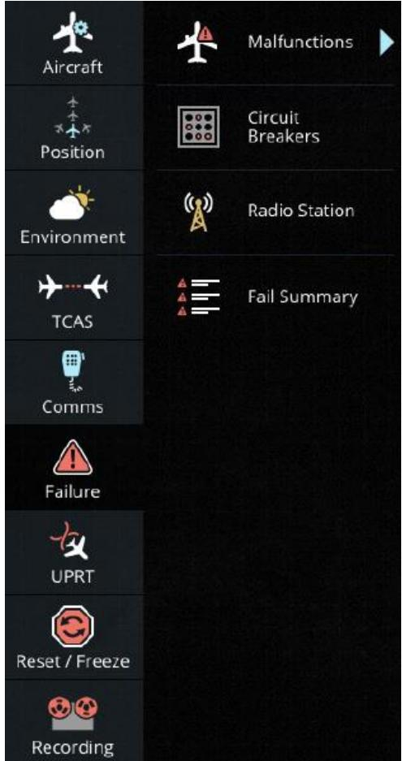
Figure 167 Advanced – Failure

## 16.6.1 RADIO STATIONS Page

The RADIO STATION page provides the necessary controls to allow the instructor to browse through the navigation database of ground radio stations available around the selected area, in order to then:

• Fail/Reset navigation components of the selected ground radio station

Reposition to the selected radio station

• Range/bearing from the aircraft to the selected radio station and the IDENT/COMMS type of the station

This page shall provide a list of all radio stations in either one of three ways:

By Station Name

• By IDENT

BY Terminal Area (TMA)

Each listing provides:

Station name and type

• IDENT of, in the case of a COMMS station the comms type

Station frequency

Runway number

Status

## 16.6.1.1 Reset

Tap this button to reset the selected failed radio station.

## 16.6.1.2 Fail

Tap this button to fail the selected ratio station.

## 16.6.1.3 Cleared Failed Station

Tap this button to reset all radio stations failed by the instructor.

## 16.6.1.4 Reposition to Station

Tap this button to activate the reposition function to the selected station. This button is disabled when a significant latitude/longitude change has occurred, until the visual is ready.

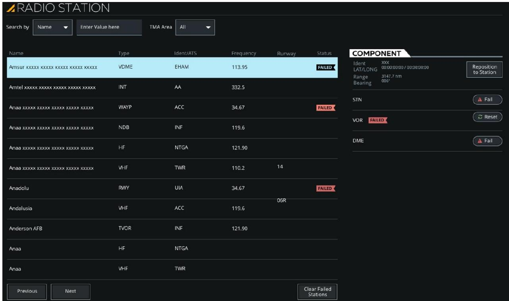
Figure 168 Advanced – RADIO STATION Page

## 16.7 UPRT

The Upset Prevention and Recovery Training (UPRT) button provides access to the UPSET RECOVERY page which allows the instructor to trigger a Maneuver Based Training (MBT) exercise or a Scenario Based Training (SBT) exercise.

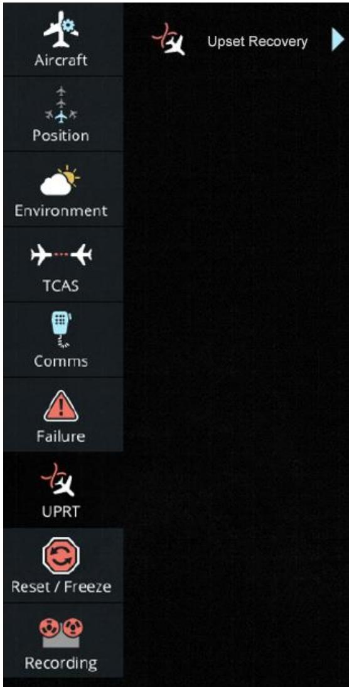
Figure 169 Advanced – UPRT Button

## 16.7.1 UPSET RECOVERY Page

The UPSET RECOVERY Page provides all the necessary controls for the instructor to:

Trigger an upset condition scenario on the aircraft

• Monitor flight controls and flight data during the upset condition scenario

Record the upset condition scenario

Review the upset condition scenario recording

• Select a portion of the upset condition scenario recording during playback

• Execute a repositioning through the SLEW sliding panel and record

This page includes two main tabs:

• DATA SUMMARY

CONTROLS

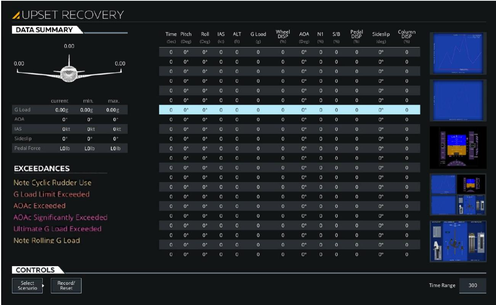
Figure 170 UPSET RECOVERY Page

Advanced

13 Oct 2017

Page 280

## 16.7.1.1 DATA SUMMARY Tab

The DATA SUMMARY tab displays the running flight data as it evolves during the UPRT scenario, it provides a summary of the most significant UPRT data parameters.

This tab consists of the following sections:

Critical Parameters Listing

Thumbnails

Thumbnail View Pane

Exceedance

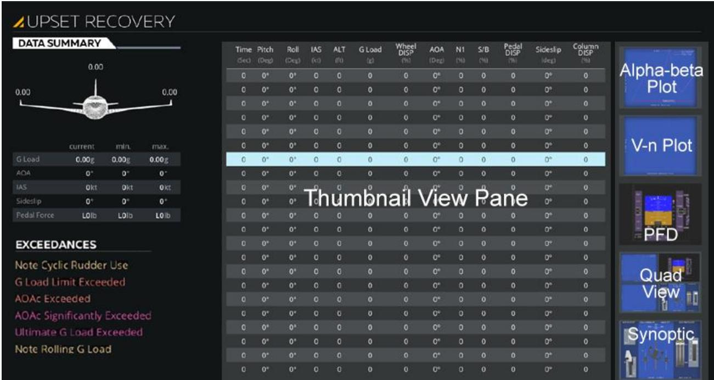

Figure 171 DATA SUMMARY TAB

## 16.7.1.1.1 Critical Parameter Listing

This section displays information on the following five critical parameters:

G Load

AOA

IAS

Sideslip

Pedal Force

For each critical parameter listed, three columns of data are provided:

Current

Minimum

Maximum

During a scenario recording, the value in each column is continuously updated in real-time.

In review mode, only the value in the Current column is updated to reflect the current moment of time during playback. The value in the Minimum and Maximum columns do not vary during playback, but represent the limits that were achieved during the record mode.

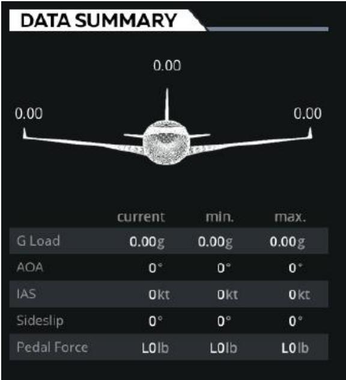
Figure 172 Critical Parameters

## 16.7.1.1.2 Thumbnails

Thumbnails found in the DATA SUMMARY tab represent the main tools that will aid the instructor evaluate the exercise performance. These thumbnails represent pages that upon tapping will be viewed in the Thumbnail View Pane.

Thumbnails include:

Alpha Beta Plot Page

• V-n Plot Page

• Primary Flight Display (PFD) page

Synoptic Page

Time History

Quad View

<table><tr><td></td><td></td><td></td><td></td><td></td><td></td><td></td><td></td><td></td><td></td><td></td><td></td><td rowspan=2 colspan=1>0</td><td rowspan=2 colspan=2>0    0</td><td rowspan=2 colspan=2>0°      0</td><td></td></tr><tr><td rowspan=2 colspan=2>0</td><td rowspan=2 colspan=2>0</td><td rowspan=2 colspan=2>0</td><td rowspan=2 colspan=2>0</td><td rowspan=2 colspan=4>0    0     0    0°</td><td></td></tr><tr><td rowspan=2 colspan=1>0</td><td rowspan=2 colspan=2>0    0</td><td rowspan=2 colspan=2>0°      0</td><td></td></tr><tr><td rowspan=2 colspan=2>0</td><td rowspan=2 colspan=2>0°</td><td rowspan=2 colspan=2>0°</td><td rowspan=2 colspan=2>0</td><td rowspan=2 colspan=4>0    0      0    0</td><td></td></tr><tr><td rowspan=2 colspan=1>0</td><td rowspan=2 colspan=2>0    0</td><td rowspan=2 colspan=2>0*      0</td><td></td></tr><tr><td rowspan=2 colspan=2>0</td><td rowspan=2 colspan=2>0*</td><td rowspan=2 colspan=2>0</td><td rowspan=2 colspan=2>0</td><td rowspan=2 colspan=4>0    0      0    0</td><td></td></tr><tr><td rowspan=2 colspan=1>0"</td><td rowspan=2 colspan=1>□</td><td rowspan=2 colspan=2>0    0</td><td rowspan=2 colspan=2>0"      0</td><td></td></tr><tr><td rowspan=2 colspan=2>0</td><td rowspan=2 colspan=2>0"</td><td rowspan=2 colspan=2>0</td><td rowspan=2 colspan=2>0</td><td rowspan=2 colspan=2>0    0      0</td><td></td><td></td></tr><tr><td></td><td rowspan=2 colspan=1>0</td><td rowspan=2 colspan=1>0</td><td rowspan=2 colspan=2>0    0</td><td rowspan=2 colspan=2>0      0</td><td></td></tr><tr><td rowspan=2 colspan=2>0</td><td rowspan=2 colspan=2>0</td><td rowspan=2 colspan=2>0</td><td rowspan=2 colspan=2>0</td><td rowspan=2 colspan=2>0    0      0</td><td></td><td></td></tr><tr><td></td><td></td><td rowspan=2 colspan=1>0</td><td rowspan=2 colspan=2>0    0</td><td rowspan=2 colspan=2>0      0</td><td></td></tr><tr><td rowspan=2 colspan=2>0</td><td rowspan=2 colspan=2>0</td><td rowspan=2 colspan=2>0</td><td rowspan=2 colspan=2>0</td><td rowspan=2 colspan=4>0    0     0    0</td><td></td></tr><tr><td rowspan=2 colspan=1>0</td><td rowspan=2 colspan=2>0     0</td><td rowspan=2 colspan=2>0      0</td><td></td></tr><tr><td rowspan=2 colspan=2>0</td><td rowspan=2 colspan=2>0</td><td></td><td rowspan=2 colspan=2>0</td><td rowspan=2 colspan=5>0  0    0      0    0</td><td></td></tr><tr><td></td><td rowspan=2 colspan=1>0</td><td rowspan=2 colspan=2>0     0</td><td rowspan=2 colspan=2>0°      0</td><td rowspan=2 colspan=1></td></tr><tr><td rowspan=2 colspan=2>0</td><td></td><td rowspan=2 colspan=2>0</td><td rowspan=2 colspan=2>0</td><td rowspan=2 colspan=1>0</td><td rowspan=2 colspan=4>0     0      0     0°</td></tr><tr><td></td><td rowspan=3 colspan=1>□</td><td rowspan=3 colspan=2>0</td><td rowspan=3 colspan=2>0°      0</td><td></td></tr><tr><td></td><td rowspan=3 colspan=2>0</td><td rowspan=3 colspan=2>0</td><td rowspan=3 colspan=2>0*</td><td rowspan=3 colspan=1></td><td rowspan=3 colspan=4>0。P</td><td></td></tr><tr><td></td><td></td></tr><tr><td></td><td rowspan=2 colspan=1>W</td><td rowspan=2 colspan=2>Rane</td><td rowspan=2 colspan=2>0°      0</td><td></td></tr><tr><td></td><td rowspan=2 colspan=2>0</td><td rowspan=2 colspan=2>0*</td><td rowspan=2 colspan=2>0</td><td rowspan=2 colspan=1>Th</td><td rowspan=2 colspan=4>umbnaiVie</td><td></td></tr><tr><td></td><td rowspan=2 colspan=1>0</td><td rowspan=2 colspan=1>0</td><td rowspan=2 colspan=2>0     0</td><td rowspan=2 colspan=2>0°      0</td><td></td></tr><tr><td></td><td rowspan=1 colspan=2>0</td><td rowspan=1 colspan=2>0°</td><td rowspan=1 colspan=2>0"</td><td rowspan=1 colspan=1>0</td><td rowspan=1 colspan=2>0     0      0</td><td></td><td></td></tr><tr><td></td><td></td><td></td><td></td><td></td><td></td><td></td><td></td><td></td><td></td><td rowspan=2 colspan=1></td><td rowspan=2 colspan=1>0*</td><td rowspan=2 colspan=1>□</td><td rowspan=2 colspan=2>0    0</td><td rowspan=2 colspan=2>0°      0</td><td></td></tr><tr><td></td><td rowspan=2 colspan=2>0</td><td rowspan=2 colspan=2>0</td><td rowspan=2 colspan=2>0</td><td rowspan=2 colspan=1>0</td><td rowspan=2 colspan=2>0    0      0</td><td></td></tr><tr><td></td><td rowspan=2 colspan=1></td><td rowspan=2 colspan=1>0°</td><td rowspan=2 colspan=1>0</td><td rowspan=2 colspan=1>0</td><td rowspan=2 colspan=1>0</td><td rowspan=2 colspan=2>0</td><td rowspan=2 colspan=1>0</td></tr><tr><td></td><td rowspan=2 colspan=2>0</td><td rowspan=2 colspan=2>0</td><td rowspan=2 colspan=2>0</td><td rowspan=2 colspan=1>0</td><td rowspan=2 colspan=2>0    0      0</td></tr><tr><td></td><td></td><td rowspan=2 colspan=1>0e</td><td rowspan=2 colspan=1>D</td><td rowspan=2 colspan=2>0    0</td><td rowspan=2 colspan=2>0</td><td rowspan=2 colspan=1>0</td></tr><tr><td></td><td rowspan=1 colspan=2>0</td><td rowspan=1 colspan=2>0</td><td rowspan=1 colspan=2>0</td><td rowspan=1 colspan=4>0  0     0      0</td></tr><tr><td></td><td></td><td></td><td></td><td></td><td></td><td></td><td rowspan=2 colspan=4>0  0     0      0</td><td rowspan=2 colspan=1>0</td><td rowspan=2 colspan=1>0</td><td rowspan=2 colspan=2>0    0</td><td rowspan=2 colspan=2>0</td><td></td></tr><tr><td></td><td rowspan=2 colspan=2>0</td><td rowspan=2 colspan=2>0</td><td rowspan=2 colspan=2>0</td><td></td></tr><tr><td></td><td></td><td></td><td></td><td></td><td rowspan=2 colspan=1>0”</td><td rowspan=2 colspan=1>0</td><td rowspan=2 colspan=1>0</td><td rowspan=2 colspan=1>0</td><td rowspan=2 colspan=2>0</td><td></td></tr><tr><td></td><td rowspan=1 colspan=2>0</td><td rowspan=1 colspan=2>0</td><td rowspan=1 colspan=2>0</td><td rowspan=1 colspan=4>0   0    0      0</td><td></td></tr><tr><td></td><td></td><td></td><td></td><td></td><td></td><td></td><td rowspan=2 colspan=5>0   0     0      0     0"</td><td rowspan=2 colspan=1>0</td><td rowspan=2 colspan=2>0     0</td><td rowspan=2 colspan=2>0</td><td></td></tr><tr><td></td><td rowspan=1 colspan=2>0</td><td rowspan=1 colspan=2>0</td><td rowspan=1 colspan=2>0</td><td></td></tr><tr><td></td><td></td><td></td><td></td><td></td><td></td><td></td><td rowspan=2 colspan=5>0   0    0      0    0°</td><td rowspan=2 colspan=1>0</td><td rowspan=2 colspan=2>0    0</td><td rowspan=2 colspan=2>0°</td><td></td></tr><tr><td></td><td rowspan=1 colspan=2>0</td><td rowspan=1 colspan=2>0</td><td rowspan=1 colspan=2>0°</td><td></td></tr><tr><td></td><td></td><td></td><td></td><td></td><td></td><td></td><td rowspan=2 colspan=5>0  0    0     0    0°</td><td rowspan=2 colspan=1>0</td><td rowspan=2 colspan=2>0    0</td><td rowspan=2 colspan=2>0°</td></tr><tr><td></td><td rowspan=1 colspan=2>0</td><td rowspan=1 colspan=2>0</td><td rowspan=1 colspan=2>0</td></tr><tr><td></td><td></td><td></td><td></td><td></td><td></td><td></td><td rowspan=2 colspan=5>0  0    0     0    0</td><td rowspan=2 colspan=1>0</td><td rowspan=2 colspan=2>0    0</td><td rowspan=2 colspan=2>0</td></tr><tr><td></td><td rowspan=1 colspan=2>0</td><td rowspan=1 colspan=2>0</td><td rowspan=1 colspan=2>0°</td></tr><tr><td></td><td></td><td></td><td></td><td></td><td></td><td></td><td></td><td></td><td rowspan=2 colspan=3>0      0    0</td><td rowspan=2 colspan=1>0</td><td rowspan=2 colspan=1>0</td><td rowspan=2 colspan=1>0</td><td rowspan=2 colspan=1>0"</td></tr><tr><td></td><td rowspan=1 colspan=2>0</td><td rowspan=1 colspan=2>0*</td><td rowspan=1 colspan=2>0</td><td rowspan=1 colspan=2>0  0</td></tr><tr><td></td><td rowspan=2 colspan=2>0</td><td rowspan=2 colspan=2>0*</td><td rowspan=2 colspan=2>0</td><td rowspan=2 colspan=5>0  0    0     0    0°</td><td rowspan=2 colspan=1>0</td></tr><tr><td></td><td rowspan=1 colspan=5></td></tr></table>

Figure 173 Thumbnails and View Pane

## 16.7.1.1.3 Alpha Beta Plot Page

The Alpha-Beta Plot page plots the Angle Of Attack (AOA) on the Y-axis versus sideslip on the X-axis.

As provided by the aerodynamic model supplier, there can be up to three envelopes indicating the level of confidence in the simulator response with respect to the aircraft.

Typically, the curves would be derived as follows:

High Confidence: Flight Test Data

Moderate Confidence: Wind Tunnel and/or Analytical Data

Low Confidence: Model Extrapolation

Typically, two sets of envelopes are defined, one for flaps UP and another for flaps OUT. The current flap setting is displayed at the top of the page.

The plot also includes four horizontal lines associated with the aircraft stall angle:

Zero lift

Stall warning

Critical angle of attack (AOAc)

• Acute stall

The lines are colored green, green, amber and red respectively, indicating increasing Advisory Levels of concern. These colored lines are used to define the advisory level coloring rules for the points plotted on the Alpha-Beta and V-n Plot pages as well as the value readouts for AOA.

## 16.7.1.1.4 V-n Plot Page

The V-n Plot page plots G load on the Y-axis versus Indicated Airspeed (IAS) on the X-axis. In this graph, three colored envelopes indicate the increasing level of concerns which are defined as: Green, Amber and Red.

## 16.7.1.1.5 Primary Flight Display (PFD)

The PFD page replicates a subset of the cockpit PFD that the instructor can view when conducting a review of the UPRT exercise.

The PFD display is intended to be a generic PFD graphic used to indicate approximately 15 PFD type parameters which have been deemed useful for UPRT training. In no way is the intent to replicate the actual PFD of the aircraft being simulated.

Advanced 13 Oct 2017 Page 284

## 16.7.1.1.6 Synoptic Page

The Synoptic page replicates the main cockpit controls that the instructor can view when conducting a review of the UPRT exercise.

This page features:

Status readouts at the top and bottom of the page

• Synoptic graphics for various controls

Some of which include actual readouts

The synoptic graphic illustrations are only meant to be representative of the controls for the aircraft being simulated to the extent that is required for UPRT training and not actual repeats on these controls.

## 16.7.1.1.7 Quad View

The Quad View provides a simultaneous view of the Alpha Beta Plot, V-n Plot, PFD and Synoptic pages.

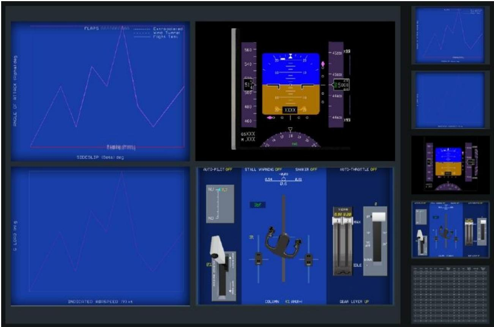
Figure 174 Quad View

## 16.7.1.1.8 Time History

The Time History page is a tabular display in time of the most relevant parameters relating to the selected UPRT scenario. The parameter set represents a collection of the most significant parameters relevant when conducting a UPRT exercise.

This page can be used together with

During a recording, as the instructor is monitoring the plots pages and cockpit repeaters in real-time, he/she can also monitor the Time History page as the recorded tabular data appears.

<table><tr><td rowspan=1 colspan=7>TimePitch rollIAsALTGload  Wheel AOAN1 s/b  Pedal  sideslip ColumnDISPDISPDISP(sec)(deg)(Deg) (kt) (ft)    (g)     (%)   (Deg) (%)  (%)   (%6}    (deg)     (%)</td></tr><tr><td rowspan=1 colspan=2>0  0°</td><td rowspan=1 colspan=1>0°</td><td rowspan=1 colspan=4>0   0     0      0    0°  0  0     0      0      0</td></tr><tr><td rowspan=1 colspan=2>。0°</td><td rowspan=1 colspan=1>0°</td><td rowspan=1 colspan=4>0    0      0    0°        0     0     0      0</td></tr><tr><td rowspan=1 colspan=2>。 0°</td><td rowspan=1 colspan=1>0°</td><td rowspan=1 colspan=1>0</td><td rowspan=1 colspan=2>0     0      0     0°  □</td><td rowspan=1 colspan=1>0     0      0°       0</td></tr><tr><td rowspan=1 colspan=2>0 0°</td><td rowspan=1 colspan=1>0°</td><td rowspan=1 colspan=1>0</td><td rowspan=1 colspan=2>0    0      0    0°</td><td rowspan=1 colspan=1>0    0      0°      0</td></tr><tr><td rowspan=1 colspan=2>。0°</td><td rowspan=1 colspan=1>0°</td><td rowspan=1 colspan=1>0</td><td rowspan=1 colspan=2>0    0      0     0°</td><td rowspan=1 colspan=1>0     0     0      0</td></tr><tr><td rowspan=1 colspan=2>00°</td><td rowspan=1 colspan=1>0°</td><td rowspan=1 colspan=1>0</td><td rowspan=1 colspan=1>0     0      0     0°</td><td rowspan=1 colspan=1>。</td><td rowspan=1 colspan=1>0     0      0°      0</td></tr><tr><td rowspan=1 colspan=2>。0°</td><td rowspan=1 colspan=1>0°</td><td rowspan=1 colspan=1>0</td><td rowspan=1 colspan=1>0     0      0     0°</td><td rowspan=1 colspan=1>0</td><td rowspan=1 colspan=1>0     0      0°      0</td></tr><tr><td rowspan=1 colspan=2>。0°</td><td rowspan=1 colspan=1>0°</td><td rowspan=1 colspan=1>0</td><td rowspan=1 colspan=1>0     0      0    0°</td><td rowspan=1 colspan=1>。</td><td rowspan=1 colspan=1>0     0      0°      0</td></tr><tr><td rowspan=1 colspan=2>0  0°</td><td rowspan=1 colspan=1>0°</td><td rowspan=1 colspan=1>0</td><td rowspan=1 colspan=1>0     0      0    0°</td><td rowspan=1 colspan=1>0</td><td rowspan=1 colspan=1>0    0     0      0</td></tr><tr><td rowspan=1 colspan=2>0  0。°</td><td rowspan=1 colspan=1>0。°</td><td rowspan=1 colspan=1>0</td><td rowspan=1 colspan=1>0     0       0    0°</td><td rowspan=1 colspan=1>0</td><td rowspan=1 colspan=1>0     0     0      0</td></tr><tr><td rowspan=1 colspan=2>0  0°</td><td rowspan=1 colspan=1>0°</td><td rowspan=1 colspan=1>0</td><td rowspan=1 colspan=1>0     0       0     0°</td><td rowspan=1 colspan=1>0</td><td rowspan=1 colspan=1>0     0      0°       0</td></tr><tr><td rowspan=1 colspan=2>。0°</td><td rowspan=1 colspan=1>0°</td><td rowspan=1 colspan=1>。</td><td rowspan=1 colspan=1>0    0      0</td><td rowspan=1 colspan=1>。</td><td rowspan=1 colspan=1>0    0     0°      0</td></tr><tr><td rowspan=1 colspan=2>00°</td><td rowspan=1 colspan=1>0°</td><td rowspan=1 colspan=1>0</td><td rowspan=1 colspan=1>0     0      0    0°</td><td rowspan=1 colspan=1></td><td rowspan=1 colspan=1>0     0     0°       0</td></tr><tr><td rowspan=1 colspan=2>0 0°</td><td rowspan=1 colspan=1>0°</td><td rowspan=1 colspan=1>0</td><td rowspan=1 colspan=1>0    0      0    0°</td><td rowspan=1 colspan=1>。</td><td rowspan=1 colspan=1>0     0     0       0</td></tr><tr><td rowspan=1 colspan=2>0  0°</td><td rowspan=1 colspan=1>0°</td><td rowspan=1 colspan=1>0</td><td rowspan=1 colspan=1>0     0      0     0°</td><td rowspan=1 colspan=1>0</td><td rowspan=1 colspan=1>0     0      0°       0</td></tr><tr><td rowspan=1 colspan=2>0  0°</td><td rowspan=1 colspan=1>0°</td><td rowspan=1 colspan=1>0</td><td rowspan=1 colspan=1>0     0      0     0°</td><td rowspan=1 colspan=1>0</td><td rowspan=1 colspan=1>0     0      0°      0</td></tr><tr><td rowspan=1 colspan=2>0  0°</td><td rowspan=1 colspan=1>0°</td><td rowspan=1 colspan=1>0</td><td rowspan=1 colspan=1>0     0      0    0°</td><td rowspan=1 colspan=1>0</td><td rowspan=1 colspan=1>0    0     0°      0</td></tr><tr><td rowspan=1 colspan=2>0 0°</td><td rowspan=1 colspan=1>0</td><td rowspan=1 colspan=1>0</td><td rowspan=1 colspan=1>0     0      0    0°</td><td rowspan=1 colspan=1>0</td><td rowspan=1 colspan=1>0     0      0      0</td></tr><tr><td rowspan=1 colspan=2>0  0。°</td><td rowspan=1 colspan=1>0。°</td><td rowspan=1 colspan=1>0</td><td rowspan=1 colspan=1>0     0       0     0°</td><td rowspan=1 colspan=1>0</td><td rowspan=1 colspan=1>0     0      0      0</td></tr><tr><td rowspan=1 colspan=2>0 0°</td><td rowspan=1 colspan=1>0°</td><td rowspan=1 colspan=1>0</td><td rowspan=1 colspan=1>0     0      0    0°</td><td rowspan=1 colspan=1>。</td><td rowspan=1 colspan=1>0     0     0°      0</td></tr><tr><td rowspan=1 colspan=2>0  0°</td><td rowspan=1 colspan=1>0°</td><td rowspan=1 colspan=1>0</td><td rowspan=1 colspan=1>0     0       0     0°</td><td rowspan=1 colspan=1>□</td><td rowspan=1 colspan=1>0     0      0°       0</td></tr><tr><td rowspan=1 colspan=1>0</td><td rowspan=1 colspan=1>0°</td><td rowspan=1 colspan=1>0°</td><td rowspan=1 colspan=1>0</td><td rowspan=1 colspan=1>0     0       0     0°</td><td rowspan=1 colspan=1>0</td><td rowspan=1 colspan=1>0     0      0o       0</td></tr><tr><td rowspan=1 colspan=1></td><td rowspan=1 colspan=1></td><td rowspan=1 colspan=1></td><td rowspan=1 colspan=1></td><td></td><td rowspan=1 colspan=1></td><td></td></tr></table>

Figure 175 Time History

## 16.7.1.1.9 Exceedance Section

This section lists advisory level messages that correspond to the exceedances that occurred during the record phase.

The color messages correspond to the advisory level color rules as dictated and found in the Alpha-Beta and V-n Plot pages and appear in order of severity.

These messages can then be used for debriefing the student according to the severity order.

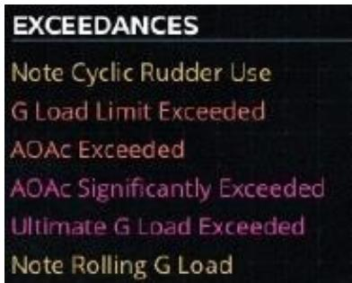
Figure 176 Exceedances

## 16.7.1.2 CONTROLS Tab

This tab includes the necessary controls to:

• Display the UPRT SCENARIOS page

o To select Maneuver Based Training (MBT) or Scenario Based Training (SBT) exercises

Record the selected upset condition scenario

• Determine the number of dots (data points) that will be plotted on the graphs

• Insert markers on the recording

Play back the recording for in-cockpit debriefing

## 16.7.1.2.1 Select Scenario

Tap on this expandable button to display the UPRT SCENARIOS page.

## 16.7.1.2.2 Record/Reset

Tap the Record/Reset button to enter the recording mode. In this mode, the selected upset scenario is being recorded.

Once the recording mode is initiated, it can be stopped manually by tapping on the Stop button or automatically after the maximum record time expires, which is five minutes or 300 seconds. The maximum length of a scenario is five minutes or 300 seconds.

During a scenario recording, the instructor can insert markers in the recording. Some of the markers include:

Start

G Load

Stall

• Nose High

• Nose Low

• Rolling G

Other

End

These are intended to facilitate in-cockpit debriefing with the flight crew.

Figure 178 Recording Markers

## 16.7.1.2.3 Time Range

Tap input text field to specify the maximum number of dots (data points) that will be plotted on the graphs during the length of the recording.

Time Range basically allows the instructor to specify the maximum number of dots, that will be displayed on the plot graphs based on elapsed time. This can served as a mean to de-clutter the plots.

Advanced 13 Oct 2017 Page 288

## 16.7.1.2.4 Review Mode

Review mode allows the instructor to playback the entire scenario recording or a portion of the scenario recording as defined by the Start and End markers added to the recording timeline by the instructor.

During the recording phase, all 300 seconds of data are stored and are available for playback in review mode. A Flight Freeze or Total Freeze pauses the record mode.

During recording, the instructor can prepare for the review mode by focusing on a phase of the recording exercise. This is accomplished by inserting Start and End markers at the moments in time for which the instructor wishes to review with the flight crew.

Figure 179 Review Mode

## 16.7.1.2.5 Optional

The CONTROLS Tab can feature optional markers.

Figure 180 Optional Markers

## 16.7.2 UPRT SCENARIOS Page

This page provides all the necessary controls to allow the instructor to initiate a Maneuver Based Training (MBT) or Scenario Based Training (SBT) exercise than can last up to five minutes or 300 seconds.

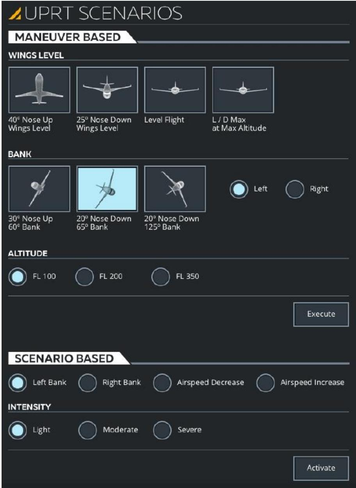
Figure 181 UPRT SCENARIOS Page

## 16.7.2.1 MANEUVER BASED

This tab includes the maneuver based upset scenarios that can be triggered by the instructor. These are grouped into the following section:

WINGS LEVEL

BANK

• ALTITUDE

Maneuver based scenarios act as just like a repositioning and when Flight Freeze is ON, the aircraft is set into the selected maneuver based scenario until Flight Freeze is released.

## 16.7.2.1.1 WINGS LEVEL

This section consists of scenario buttons that are mutually exclusive and upon tapping will reposition the aircraft to either one of these scenarios:

$4 0 ^ { \circ }$ Nose Up, Wing Level

$2 5 ^ { \circ }$ Nose Down, Wing Level

• Level Flight

• L/D Max at Max Altitude

## 16.7.2.1.2 BANK

This section consists of scenario buttons that are mutually exclusive and upon tapping will reposition the aircraft to either one of these scenarios:

$3 0 ^ { \circ }$ Nose Up, 60° Bank

$2 0 ^ { \circ }$ Nose Down, $6 5 ^ { \circ }$ Bank

$2 0 ^ { \circ }$ Nose Down, $1 2 5 ^ { \circ }$ Bank

The mutually exclusive Left and Right radio buttons control the bank manoeuver to the left or to the right.

## 16.7.2.1.3 ALTITUDE

This section consists of altitude radio buttons that are mutually exclusive and upon tapping will set the MBT exercise to the selected altitude.

Tapping the FL 100 button sets the MBT exercise altitude to FL100.

Tapping the FL 200 button sets the MBT exercise altitude to FL200.

Tapping the FL 350 button sets the MBT exercise altitude to FL350.

## 16.7.2.1.4 Execute

Tap this button to activate the selected MBT UPRT profile.

## 16.7.2.2 SCENARIO BASED

This tab includes the scenario based upset scenarios that can be triggered by the instructor. These consists of radio buttons that are mutually exclusive and are paired as:

Left Bank – Right Bank

Airspeed Decrease – Airspeed Increase

These types of scenarios act as just like a gust of wind that will gradually set the aircraft in the selected upset condition.

## 16.7.2.2.1 INTENSITY

This section allows the instructor to set the intensity of the selected scenario to either Light, Moderate or Severe.

## 16.7.2.2.2 Activate

Tap this button to activate the selected Scenario Based scenario.

## 16.8 Resets/Freezes

The Reset/Freeze button displays RESET & FREEZES page that includes the same Reset and Freeze selection as found on the Control Board workspace footer.

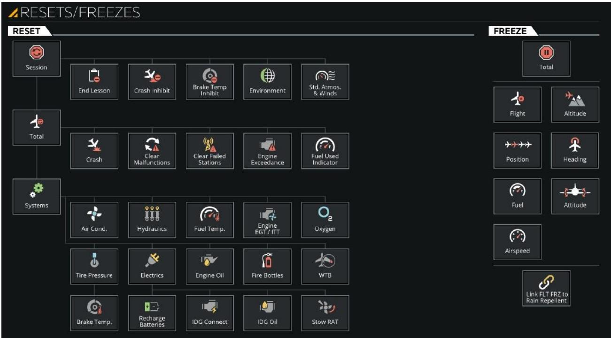
Figure 182 Advance - Resets/Freezes

Advanced 13 Oct 2017 Page 292

## 16.9 Recording

The Recording button allows the instructor to capture various flight situations, and later store them permanently and/or recall them.

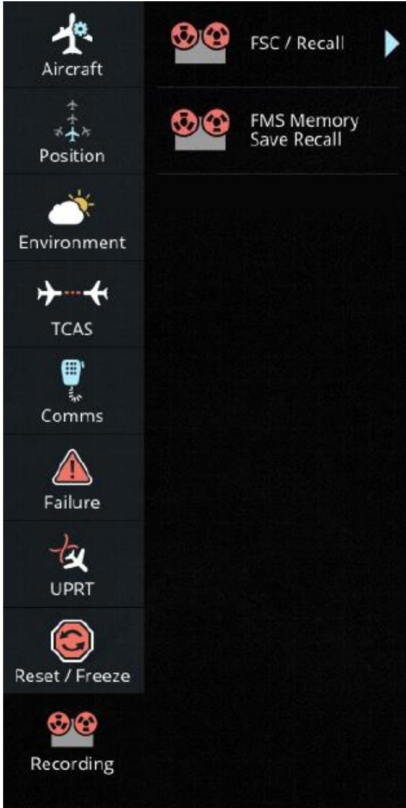
Figure 183 Advance - Recording

## 16.9.1 FSC/Recall

The Flight Situation Capture/Recall page allows the instructor to record up to 10 different flight situations of pre-defined parameters during training and restored them later.

The recall functionality shall be performed in a manner similar to regular aircraft repositions. For recalls to in-air situations, the recall is performed by trimming the aircraft, as is normal for in air repositions. The simulator may not be recalled to exactly the same state as at capture, but it will be in a similar condition.

For the flight controls, which are not backdriven, as defined in the IOS System Requirements Specification, a Controls Not In Agreement (CNIA) page will appear to indicate where the control should be positioned. When the freeze is removed, the pilot will be able to continue the training session from the point at which the capture was taken.

When Flight Freeze is removed, the pilot shall be able to continue the training session.

Table 2 Parameters Recalled

<table><tr><td rowspan=2 colspan=1>Parameter</td><td rowspan=1 colspan=2> Standard FSCR Recall</td></tr><tr><td rowspan=1 colspan=1>On-Ground</td><td rowspan=1 colspan=1>In-Air</td></tr><tr><td></td><td></td><td></td></tr><tr><td rowspan=1 colspan=1> Cockpit Configuration</td><td></td><td></td></tr><tr><td rowspan=1 colspan=1>Landing Gear Lever</td><td rowspan=1 colspan=2> CNIA: as per capture</td></tr><tr><td rowspan=1 colspan=1>Flap Lever</td><td rowspan=1 colspan=2> CNIA: as per capture</td></tr><tr><td rowspan=1 colspan=1>Parking Brake lever</td><td rowspan=1 colspan=2> CNIA: as per capture</td></tr><tr><td rowspan=1 colspan=1>Master fuel control switches</td><td rowspan=1 colspan=2> CNIA: as per capture</td></tr><tr><td rowspan=1 colspan=1> Speed brake lever</td><td rowspan=1 colspan=2>CNIA: Closed, Armed, Detent, Extended</td></tr><tr><td rowspan=1 colspan=1>Throttle levers</td><td rowspan=1 colspan=1>For aircraft with motorized levers:as per captureNo motorized levers use CNIA: within two degrees of capture</td><td rowspan=1 colspan=1>For aircraft with motorized levers:as per thrust trim positionNo motorized levers use CNIA:within two degrees of capture</td></tr><tr><td rowspan=1 colspan=1> Aircraft Configuration</td><td></td><td></td></tr><tr><td rowspan=1 colspan=1>A/C Gross weight</td><td rowspan=1 colspan=2>As per capture</td></tr><tr><td rowspan=1 colspan=1> A/C Center of gravity</td><td rowspan=1 colspan=2> As per capture</td></tr><tr><td rowspan=1 colspan=1>Total Fuel</td><td rowspan=1 colspan=2>As per capture</td></tr><tr><td rowspan=1 colspan=1> Engine Flame Status</td><td rowspan=1 colspan=2> As per capture</td></tr><tr><td rowspan=1 colspan=1> Speed brake surfaces</td><td rowspan=1 colspan=2> As per capture</td></tr><tr><td rowspan=1 colspan=1>Doors position</td><td rowspan=1 colspan=2>As per capture</td></tr><tr><td rowspan=1 colspan=1>Landing gear deflections</td><td rowspan=1 colspan=1>Down position</td><td rowspan=1 colspan=1>As per capture</td></tr><tr><td rowspan=1 colspan=1>Flaps surfaces</td><td rowspan=1 colspan=1>As per lever position</td><td rowspan=1 colspan=1>As per capture</td></tr><tr><td rowspan=1 colspan=1> Slat surfaces (where applicable)</td><td rowspan=1 colspan=1>As per lever position</td><td rowspan=1 colspan=1>As per capture</td></tr><tr><td rowspan=1 colspan=1> Stabilizer position</td><td rowspan=1 colspan=1>As per capture</td><td rowspan=1 colspan=1>Computed as per currentconditions</td></tr><tr><td rowspan=1 colspan=1>Flight Condition</td><td></td><td></td></tr><tr><td rowspan=1 colspan=1>Heading</td><td rowspan=1 colspan=2> As per capture</td></tr><tr><td rowspan=1 colspan=1> A/C Longitude</td><td rowspan=1 colspan=2>As per capture</td></tr></table>

Advanced

13 Oct 2017

Page 294

<table><tr><td rowspan=2 colspan=1>Parameter</td><td rowspan=1 colspan=2>Standard FSCR Recall</td></tr><tr><td rowspan=1 colspan=1>On-Ground</td><td rowspan=1 colspan=1>In-Air</td></tr><tr><td rowspan=1 colspan=1> A/C Latitude</td><td rowspan=1 colspan=2>As per capture</td></tr><tr><td rowspan=1 colspan=1>Ground speed</td><td rowspan=1 colspan=1>As per capture</td><td rowspan=1 colspan=1>Computed as per currentconditions</td></tr><tr><td rowspan=1 colspan=1>Calibrated Airspeed</td><td rowspan=1 colspan=1>Computed as per current conditions</td><td rowspan=1 colspan=1> As per capture</td></tr><tr><td rowspan=1 colspan=1>Altitude ASL</td><td rowspan=1 colspan=1>Computed as per current conditions</td><td rowspan=1 colspan=1> As per capture</td></tr><tr><td rowspan=1 colspan=1>Rate of climb / descent</td><td rowspan=1 colspan=1>Computed as per current conditions</td><td rowspan=1 colspan=1> As per capture</td></tr><tr><td rowspan=1 colspan=1> Rate of change of bodyvelocities</td><td rowspan=1 colspan=1>Computed as per current conditions</td><td rowspan=1 colspan=1>As per capture</td></tr><tr><td rowspan=1 colspan=1> Pitch, Roll, Yaw Rates</td><td rowspan=1 colspan=1>Computed as per current conditions</td><td rowspan=1 colspan=1>As per capture</td></tr><tr><td rowspan=1 colspan=1>Accelerations</td><td rowspan=1 colspan=1>Computed as per current conditions</td><td rowspan=1 colspan=1>As per capture</td></tr><tr><td rowspan=1 colspan=1>Bank angle</td><td rowspan=1 colspan=1>Computed as per current conditions</td><td rowspan=1 colspan=1> Similar to value at capture (notexact due to trimming)</td></tr><tr><td rowspan=1 colspan=1>Environment</td><td></td><td></td></tr><tr><td rowspan=1 colspan=1>Ambient Conditions</td><td rowspan=1 colspan=2> As per capture</td></tr><tr><td rowspan=1 colspan=1>Airport/En Route Environment</td><td rowspan=1 colspan=2>As per capture</td></tr><tr><td rowspan=1 colspan=1>Storms</td><td rowspan=1 colspan=2> As per capture</td></tr><tr><td rowspan=1 colspan=1>Runway conditions</td><td rowspan=1 colspan=2> As per capture</td></tr><tr><td rowspan=1 colspan=1>Reference Airport/Runway</td><td rowspan=1 colspan=2> As per capture</td></tr><tr><td rowspan=1 colspan=1>Ground elevation</td><td rowspan=1 colspan=2>As per capture</td></tr><tr><td rowspan=1 colspan=1>Miscellaneous</td><td></td><td></td></tr><tr><td rowspan=1 colspan=1>Ground power</td><td rowspan=1 colspan=2>Not modified</td></tr><tr><td rowspan=1 colspan=1>Ground air</td><td rowspan=1 colspan=2>Not modified</td></tr><tr><td rowspan=1 colspan=1>A/C on Jacks</td><td rowspan=1 colspan=2>Not modified</td></tr><tr><td rowspan=1 colspan=1>A/C on Chocks</td><td rowspan=1 colspan=2>Not modified</td></tr><tr><td rowspan=1 colspan=1> FMS Flight Plan</td><td rowspan=1 colspan=2>As per capture within FMS/FMGEC Iimitations</td></tr></table>

## 16.9.1.1 Copy to Stored Captures

Displays the Flight Situation Transfer page, used to transfer a temporary capture into permanent stored capture. The button is disabled or grayed out if a capture, recall, reposition, or slew is active.

## 16.9.1.2 Clear All Captures

Selection displays the Clear All Captures popup menu requiring confirmation.

## 16.9.2 FMS Memory Save/Recall

Displays status and selection activates the process that saves/recalls the selected FMS Memory flight plan.
